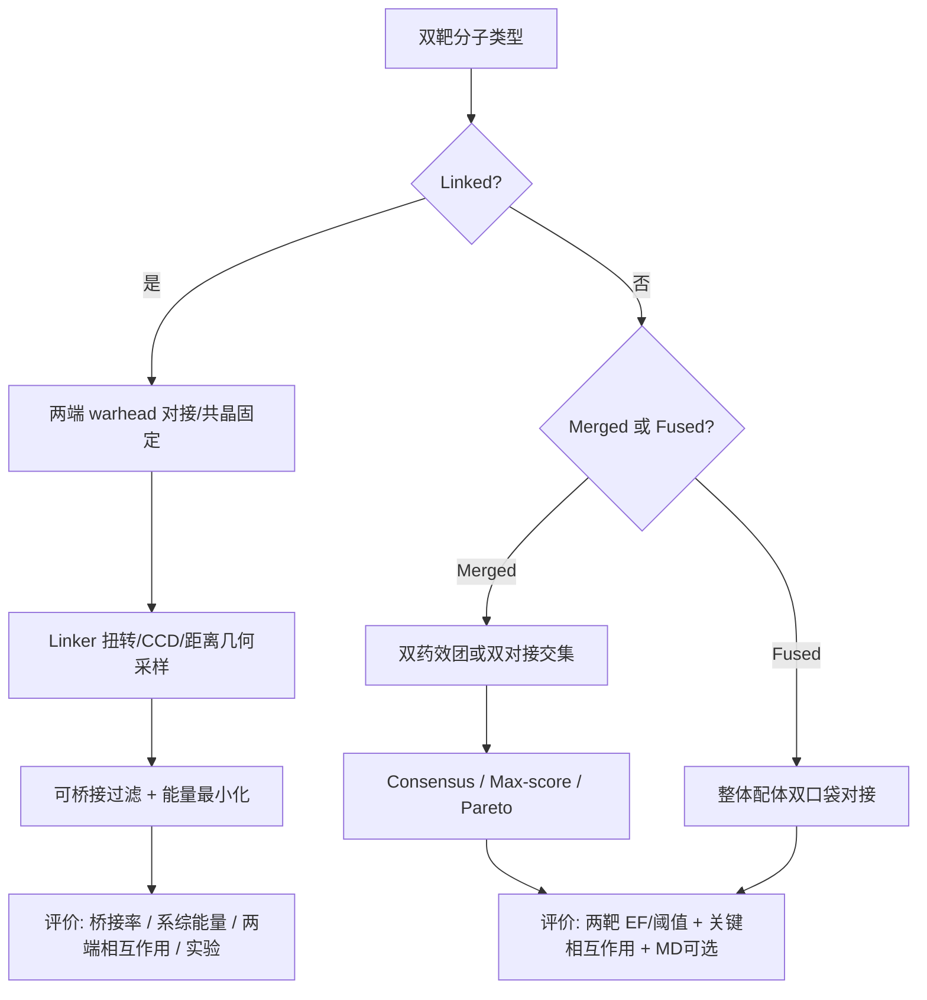

# 双靶 / 多靶小分子抑制剂的分子对接方法与评价体系调研

> 调研流程：按 **PaperSpine**（`paper-spine-research`）构建研究档案与 SOTA 缺口图；按 **ACS Writer v2.3**（`explorer` 文献探索 + `analyst` 方法评价）做检索式、纳入标准与证据综合。  
> 检索渠道：PubMed / EuropePMC / ACS 期刊（JCIM、J Med Chem）/ arXiv / PMC 全文。  
> 日期：2026-07-19

---

## 0. 执行摘要（Verdict）

双靶/多靶小分子**没有统一的“双靶对接引擎”**，主流仍是把两个（或多个）单靶对接结果用**共识打分 / 交集筛选 / 多目标优化**组合起来。真正“专用算法”主要出现在三类场景：

1. **Merged / 单骨架双活性分子**：双口袋独立对接 + consensus / pharmacophore 交集（最常见）。
2. **Linked / 连接型双配体（含 PROTAC、bivalent）**：先分别对接两个 warhead，再对 linker 做构象/几何闭合采样（TwistDock、PRosettaC、CCD linker closure 等）。
3. **生成式双靶设计**：DualDiff / FuseDiff / LigBuilder V3 等——把“同时满足两个口袋”直接写进生成或 de novo 目标函数，并用双靶专用评估指标（Max Vina、Dual High Affinity、双姿态 RMSD 等）。

对接“好坏”评价需分四层：**姿态（docking power）→ 筛选富集（screening power）→ 亲和排序（ranking/scoring）→ 双靶兼容性（dual-target compatibility）**。单靶 RMSD≤2 Å 或单口袋打分高，**不足以**证明双靶分子合理。

---

## 1. 研究问题与检索设计（ACS Explorer）

### 1.1 研究问题（FINER）

| 问题 | 类型 |
|------|------|
| Q1：双靶/多靶抑制剂一般用哪些对接策略？ | 描述型 |
| Q2：如何评价对接质量？单靶指标能否迁移到双靶？ | 评价型 |
| Q3：linked / fused / merged 三类分子在对接评估上是否有系统比较？ | 比较型 |
| Q4：是否存在专门的双靶对接/评估算法？ | 探索型 |

### 1.2 核心检索式（布尔）

```
概念A（分子类型）:
  "dual-target" OR "dual inhibitor" OR multitarget OR polypharmacology
  OR "designed multiple ligands" OR "framework combination"
  OR linked OR fused OR merged OR bivalent OR PROTAC

概念B（计算方法）:
  docking OR "virtual screening" OR "structure-based"
  OR "consensus scoring" OR "de novo" OR diffusion

概念C（评价）:
  RMSD OR enrichment OR EF OR AUC OR "scoring power"
  OR "dual high affinity" OR "Max Vina"
```

**数据库**：PubMed、EuropePMC、ACS JCIM/J Med Chem、arXiv、PMC。  
**纳入**：同行评审或 arXiv 预印本中明确涉及双靶对接/评估/专用算法。  
**排除**：仅做单靶对接但声称“可能双靶”、无计算方法细节的纯合成文章。

---

## 2. 双靶分子的三种形成方式（化学分类）

经典框架来自 Morphy & Rankovic 的 **designed multiple ligands / framework combination**（J Med Chem 2005–2006）：

| 类型 | 英文 | 结构特征 | 对接含义 |
|------|------|----------|----------|
| **连接型** | Linked | 两个药效团经 linker 相连 | 常需分别对接两端 + linker 几何/构象采样；分子量与柔性显著增大 |
| **融合型** | Fused | 两个药效团短距离拼接、共享少量原子 | 可按单个刚性/半刚性配体对接两个口袋；仍偏大 |
| **合并型** | Merged | 高度重叠的公共骨架同时满足两个口袋 | 最接近“一个小分子、两个靶点”；适合双 pharmacophore / 双对接交集筛选 |

Morphy（2006, *J Med Chem*）指出：**framework combination（尤其 linked）往往使分子变大、成药性变差**；而从筛选命中再优化的 merged 策略通常更药似。2024 年 *J Med Chem* 对 dual-target-directed ligands（DTDL）的系统数据挖掘也支持：多数成功双靶分子更接近 **merged / 共同核心优化**，而非简单拼接两条单靶抑制剂。

---

## 3. 一般对接方法：从单靶到双靶

### 3.1 主流工作流（行业默认）

```
[靶点1结构] --dock--> 打分/姿态集合 S1
[靶点2结构] --dock--> 打分/姿态集合 S2
              |
              v
     共识/交集/帕累托筛选
              |
              v
     (可选) MD / MM-GBSA / 药效团 / ADMET
```

**常用对接引擎（本身多为单靶）**：AutoDock / Vina、GOLD、Glide、Surflex、DOCK、CDOCKER、MOE Dock、GNINA、DiffDock 等。  
**双靶化不在引擎内部，而在后处理与筛选逻辑。**

### 3.2 按分子类型的对接策略

#### A. Merged / 单分子同时抑制两靶（最常见）

1. **双独立对接 + 阈值过滤**  
   对库化合物分别对接靶 A、靶 B，保留两边均优于阈值（或均优于已知对照）的分子。  
   - 例：Zhou et al., *JCIM* 2013 — CDK2–GSK3B、EGFR–Src、Lck–Src、Lck–VEGFR2 四组激酶对；对接能识别单靶抑制剂，但对双靶抑制剂 **假阳性高、富集有限**，需与其他 VS 方法联用。

2. **共识打分 / 排名融合（Consensus）**  
   - 同一靶：多程序/多打分函数融合（rank-by-rank、rank-by-vote、指数共识 ECR、Z-score 平均、ML consensus）。  
   - 跨靶：先各自融合，再对两靶排名做算术/几何平均等（Perez-Castillo et al., 2017，A2AAR/MAO-B 双靶）。  
   - Jorgensen 组（*J Med Chem* 2019）：百万级库对 A2AAR + MAO-B 用 DOCK3.6 对接，**consensus score** 选候选，实验确认多个双靶配体。

3. **双药效团 / 共同药效团筛选后再对接**  
   分别建靶 A、靶 B 的结构药效团，取能同时映射两者的分子，再对接验证。  
   - 例：CDK4/6–芳香化酶双抑制剂 VS（*Molecules* 2023）；PARP1–BRD4 合并药效团 + MOE 对接（*JCIM* 2024，明确主张 **优先 merged 而非 linking**）。

4. **Ensemble docking / 柔性**  
   多晶体结构聚类选代表构象（Zhou 2013）、受体系综、对接后再 MD（Sivakumar 2020 综述）。

#### B. Linked（linker 连接两个抑制剂片段）

典型流程（与 PROTAC / bivalent 高度同源）：

1. **Warhead-first**：两端药效团分别对接（或用共晶姿态固定）。  
2. **Linker 采样**：扭转角扫描、距离几何、CCD loop-closure、遗传算法等，过滤无法桥接的构象。  
3. **整体能量最小化 / 再打分**。

**专用/半专用工具与工作流：**

| 方法 | 适用 | 要点 |
|------|------|------|
| **TwistDock** (2019) | 同蛋白双结构域 bivalent（如 XIAP BIR2/BIR3–Smac mimetics） | 单靶对接 + **linker 单键扭转**采样构象系综，评价 linker |
| **LigBuilder V3** (2020) | 多靶 de novo + fragment linking | **ensemble linking**：两端片段独立生长再寻找可连接路径；支持 framework combination |
| **PRosettaC / PROTACable 类** | PROTAC 三元复合物 | 蛋白–蛋白对接 + linker 构象；ligand-first 或 protein-first |
| **CCD linker closure** | PROTAC PPI 能量景观 | 移动一端后用 CCD 重定位 warhead，拒绝不可桥接位移 |

要点：**linked 分子的“对接好坏”很大程度是 linker 能否在合理构象下同时满足两端几何与能量，而不是单一 Vina score。**

#### C. Fused（短拼接 / 部分共享原子）

- 化学上介于 linked 与 merged 之间。  
- 计算方法上通常仍按 **单个配体对两个口袋分别对接**；若融合后仍保留清晰的双药效团分区，可对分区做约束对接或药效团对齐。  
- 文献中 fused 系列更多用常规 CDOCKER/Glide 等做 **双口袋结合模式可视化 + 实验 IC50**，较少有 fused-vs-linked 的对接算法头对头基准。

---

## 4. 如何评价分子对接的好坏？

### 4.1 单靶标准（CASF 体系，可迁移为双靶的“组件指标”）

| 能力 | 含义 | 常用指标 | 经验阈值/解读 |
|------|------|----------|----------------|
| **Docking power** | 能否找回近天然姿态 | 对称性校正 RMSD；Top-1/Top-n 成功率 | **RMSD ≤ 2 Å** 常判为成功姿态 |
| **Screening power** | 能否从库中富集活性分子 | EF@1%/EF@x%、ROC-AUC、BEDROC | EF 越高、早期富集越好 |
| **Ranking power** | 同靶配体相对活性排序 | Spearman / Kendall | 相关越高越好 |
| **Scoring power** | 绝对亲和力预测 | Pearson R、RMSE | 多数经典打分函数此项偏弱 |

**协议验证最低要求（实践共识）：**

1. **自对接（self-docking）**：共晶配体重对接 RMSD。  
2. **交叉对接（cross-docking）**：不同晶体结构间鲁棒性。  
3. **回顾性 VS**：已知活性 + decoy（DUD-E / LIT-PCBA 等）看富集。  
4. **视觉/相互作用检查**：关键氢键、疏水匹配、应变能、clash。  
5. **可选**：短 MD / MM-PB(GB)SA 做姿态稳定性与能量再排序。

> 警示：仅自对接 RMSD 好 **不能**外推到虚拟筛选或双靶场景（2026 *JCAMD* 对接可重复性综述强调需 cross-docking + enrichment）。

### 4.2 双靶 / 多靶专用或扩展评价指标

| 指标 / 做法 | 含义 | 出处/场景 |
|-------------|------|-----------|
| **Consensus score / 融合排名** | 两靶（及多打分）综合排序 | Jorgensen 2019；Perez-Castillo 2017 |
| **双阈值通过率** | 同时优于两靶对照或阈值 | 多数应用型双靶 VS |
| **Max Vina Dock** | 取两靶 Vina 中较差一侧（更苛刻） | DualDiff（NeurIPS 2024） |
| **P1 / P2 Vina Dock** | 分别报告两靶再对接亲和 | DualDiff / FuseDiff |
| **Dual High Affinity** | 两靶均优于参考配体的分子比例 | DualDiff / FuseDiff |
| **双姿态 RMSD** | 生成/对接的两口袋姿态与参考或彼此一致性 | DualDiff 评估协议 |
| **Pareto / 多目标** | 在亲和 A、亲和 B、QED、SA 间折中 | 生成式与多目标优化文献 |
| **Linker 可桥接率 / 有效构象占比** | linked / PROTAC 几何可行性 | TwistDock、CCD 类流程 |
| **实验正交验证** | 两靶生化 IC50/Kd、细胞表型、选择性面板 | 最终金标准 |

**关键结论（Zhou 2013）：**  
对接对“找单靶抑制剂”可用，但对“找真双靶抑制剂”易高假阳性；**必须**与药效团、机器学习、实验验证等联用。

---

## 5. 是否有人按 linked / fused / merged 做对接评估比较？

### 5.1 有系统比较的层面（化学/成药性，而非对接引擎 benchmark）

- **Morphy 2006**：framework combination vs screening 起点对理化性质的影响——linked/fused 往往更大、更不药似。  
- **2024 *J Med Chem* Systematic Investigation of DTDLs**：大规模挖掘双靶配体相对单靶配体集合的相似性与设计路径；多数落在 merged / 共同核心优化象限。  
- **2024 PARP1–BRD4（*JCIM*）**：明确对比设计哲学——**linking 两药效团抬高 logP/分子量**，改为 **merged 公共药效团 + 对接优先**，并实验得到双靶活性分子。

### 5.2 对接算法层面的“三类头对头”

公开文献中 **几乎没有** 同一基准集上系统报告：

> “同一双靶对 × linked vs fused vs merged × 多种对接协议” 的标准 benchmark。

更多是：

- 某一化学系列内部用同一对接程序解释 SAR；  
- 或生成模型（DualDiff）在 **merged 型单配体双口袋姿态** 上设 benchmark；  
- linked 则用 TwistDock / PROTAC 流程单独评价。

**缺口（PaperSpine SOTA gap）：** 缺少跨化学类型、跨靶点对的公开双靶对接评估基准（类似 CASF，但针对 dual-target）。

---

## 6. 专门的双靶对接 / 设计 / 评估算法

### 6.1 结构对接与构象工作流（偏“对接”）

| 名称 | 类型 | 能力边界 |
|------|------|----------|
| **TwistDock** | Bivalent / linked 构象系综 | 评价同靶双位点 + linker，非通用异构双靶 VS |
| **LigBuilder V3** | 多靶 de novo + ensemble linking | 可设计双功能抑制剂；含 linking / growing / 优化 |
| **Consensus dual-target VS 协议** | 方法学（非单一软件名） | 双对接 + 打分融合；可复现于任意引擎 |
| **PROTAC 三元建模套件** | Linked 特殊情形 | PRosettaC、PROTACable 等 |

### 6.2 生成式 / 学习型双靶算法（偏“设计 + 用对接评估”）

| 名称 | 要点 | 评估方式 |
|------|------|----------|
| **DualDiff / CompDiff** (NeurIPS 2024) | 单靶扩散模型重编程；双口袋对齐（center / RMSD-anchor / score-anchor） | P1/P2 Vina、Max Vina、Dual High Aff.、双姿态 RMSD、QED/SA |
| **FuseDiff** (2026 arXiv) | 端到端联合扩散，一次生成 **一分子 + 两口袋姿态**；Dual-target Local Context Fusion | 提出对接前双姿态质量基准 + 对接后 Vina |
| **LigBuilder V3** | 规则/生长式 de novo 多靶 | 结合相互作用与多靶约束 |
| **后续生成工作** | MolSculptor、LaMGen、MT-ConBiFormer-GPT 等 | 多靶亲和/选择性生成（2025–2026） |

这些算法的共同点：**把“同时满足两个口袋”写入目标或生成过程**，再用（再）对接分数作为评估——它们是“双靶设计算法”，不完全是传统意义上的“双靶对接采样器”。

### 6.3 仍普遍使用、但非双靶专用的增强手段

- 共识对接综述（2023 *Molecules*/PMC）：多程序降低靶点依赖方差。  
- ML 共识打分（Ericksen et al., *JCIM* 2017）、Docking Score ML（2024）等提升 VS，可嵌入双靶流水线。  
- 对接 + MD 联用综述（2020 *Drug Dev Res*）强调从静态打分走向识别动力学。

---

## 7. 实践建议：按分子类型选对接与评价方案



**推荐最低评价包（研究级）：**

1. 每靶：自对接 RMSD + 已知活性集回顾性富集（若有）。  
2. 双靶：同时通过两靶阈值；报告较差一侧分数（类 Max Vina 思想）。  
3. Linked：额外报告有效 linker 构象比例与应变。  
4. 最终：两靶实验活性 + 选择性/脱靶风险。

---

## 8. SOTA 缺口图（PaperSpine）

| 候选贡献点 | SOTA 已有 | 真实缺口 | 主张强度 |
|------------|-----------|----------|----------|
| 通用双靶对接采样器 | 几乎都是单靶引擎 + 后处理 | 缺少像 DiffDock 那样原生输出“双姿态兼容配体”的广泛验证工具（FuseDiff 刚起步） | 中 |
| Linked vs Merged 对接基准 | 化学分类清晰；对接基准缺失 | 无公开标准集比较三类分子的对接协议表现 | 高 |
| 双靶评分函数 | Consensus / Max Vina / Dual High Aff. | 缺类似 CASF 的双靶 scoring power 标准 | 高 |
| 异构靶对（如 NLRP3–JNK） | 激酶–激酶、GPCR–MAO 等案例多 | 口袋差异大时 merged 更难，linked 成药性差——需案例特异协议 | 中 |

---

## 9. 关键文献清单（精选）

### 设计分类与成药性

1. Morphy R, Rankovic Z. *The physicochemical challenges of designing multiple ligands.* **J Med Chem.** 2006. doi:10.1021/jm0603015  
2. Proschak E et al. *Systematic Investigation of Dual-Target-Directed Ligands.* **J Med Chem.** 2024. doi:10.1021/acs.jmedchem.4c00838  

### 双靶对接 / VS 方法学

3. Zhou S et al. *Feasibility of Using Molecular Docking-Based Virtual Screening for Searching Dual Target Kinase Inhibitors.* **JCIM.** 2013. doi:10.1021/ci400065e  
4. Jaiteh M et al. *Docking Screens for Dual Inhibitors of Disparate Drug Targets for Parkinson’s Disease.* **J Med Chem.** 2019. PMC6716773  
5. Perez-Castillo Y et al. *Fusing Docking Scoring Functions Improves VS for PD Dual Target Ligands.* 2017. PMC5725543  
6. Sivakumar KC et al. *Multitarget design by linking docking and MD.* **Drug Dev Res.** 2020. doi:10.1002/ddr.21673  
7. Ferreira LG et al. *Molecular Modeling Techniques Applied to Multitarget Drugs.* **Curr Top Med Chem.** 2022. doi:10.2174/1568026621666211129140958  

### Linked / Bivalent / de novo 专用

8. Bai L et al. *TwistDock for bivalent Smac mimetics.* **Drug Des Devel Ther.** 2019. doi:10.2147/DDDT.S194276  
9. Yuan Y, Pei J, Lai L. *LigBuilder V3: Multi-Target de novo Drug Design.* **Front Chem.** 2020. doi:10.3389/fchem.2020.00142  

### Merged 设计 + 对接案例

10. *Combining Data-Driven and Structure-Based Approaches in Designing Dual PARP1-BRD4 Inhibitors.* **JCIM.** 2024. doi:10.1021/acs.jcim.4c01421  

### 评价基准与共识打分

11. Li Y et al. *CASF* 系列（scoring/ranking/docking/screening power）  
12. Ericksen SS et al. *ML Consensus Scoring Improves SBVS.* **JCIM.** 2017. doi:10.1021/acs.jcim.7b00153  
13. Consensus docking survey. PMC9821981  

### 生成式双靶（专用算法前沿）

14. DualDiff / CompDiff. *Reprogramming Pretrained Target-Specific Diffusion Models for Dual-Target Drug Design.* **NeurIPS.** 2024. arXiv:2410.20688  
15. FuseDiff. *Symmetry-Preserving Joint Diffusion for Dual-Target SBDD.* arXiv:2603.05567  

---

## 10. 对当前项目的直接启示

若目标是 **NLRP3–JNK 类异构双靶** 或类似组合：

1. **优先评估 merged 可行性**：口袋 overlap / 共同药效团是否存在；若差异过大，linked 计算上可行但成药性风险高（Morphy）。  
2. **对接协议**：两靶分别校准（自对接 + 已知抑制剂富集）→ consensus / Max-score 筛 → 可选短 MD。  
3. **不要**仅用单靶高打分宣称双靶。  
4. 若走 linker 路线：采用 warhead-fixed + linker 采样（TwistDock 思路），单独报告桥接与应变指标。  
5. 前沿可跟踪 DualDiff/FuseDiff 类生成，但生产筛选仍以经典双对接 + 实验闭环为主。

---

## 附录 A. Skills 调用说明

| Skill | 仓库 | 本调研中的用途 |
|-------|------|----------------|
| **PaperSpine** | [WUBING2023/PaperSpine](https://github.com/WUBING2023/PaperSpine) | research 阶段：问题结构化、SOTA gap、证据分层 |
| **ACS Writer v2**（ACS Codex 学术写作技能） | [Caosmart1979/acs-writer-v2](https://github.com/Caosmart1979/acs-writer-v2) | explorer：检索式/纳入排除；analyst：方法学评价框架 |

> 说明：当前 Cursor Cloud 环境未预装上述 skill 的 MCP；已本地克隆其 `SKILL.md` 工作流并按其协议执行文献调研与综合。

## 附录 B. 来源索引（节选）

| Source ID | 类型 | 标题/主题 | 渠道 |
|-----------|------|-----------|------|
| S01 | 方法学 | Zhou 2013 dual kinase docking VS | EuropePMC / JCIM |
| S02 | 综述 | Morphy 2006 multiple ligands physicochemical | EuropePMC / J Med Chem |
| S03 | 工具 | LigBuilder V3 | PMC / Front Chem |
| S04 | 工具 | TwistDock | PMC |
| S05 | 案例 | Dual A2AAR/MAO-B docking screen | PMC |
| S06 | 案例 | Consensus score fusion dual PD ligands | PMC |
| S07 | 前沿 | DualDiff NeurIPS 2024 | arXiv |
| S08 | 前沿 | FuseDiff 2026 | arXiv |
| S09 | 基准 | CASF docking/screening power | 文献综述 |
| S10 | 数据挖掘 | DTDL systematic investigation 2024 | J Med Chem |
| S11 | 设计 | PARP1–BRD4 merged pharmacophore 2024 | JCIM |
