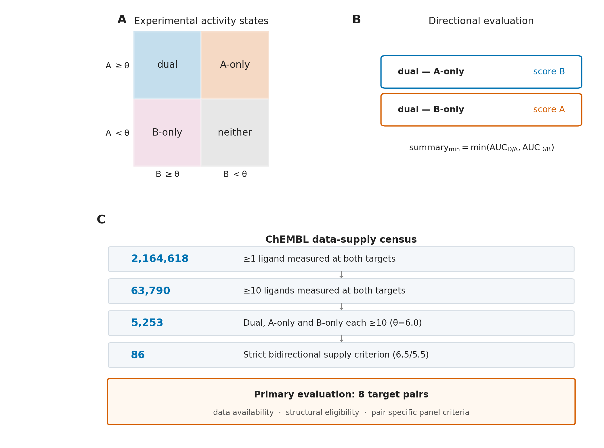
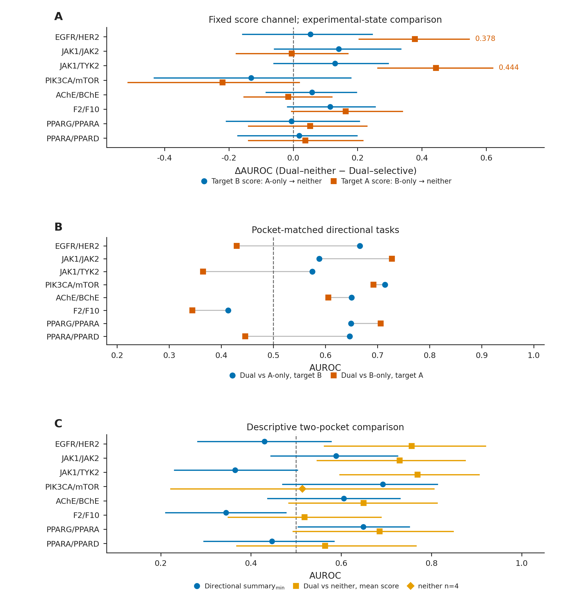
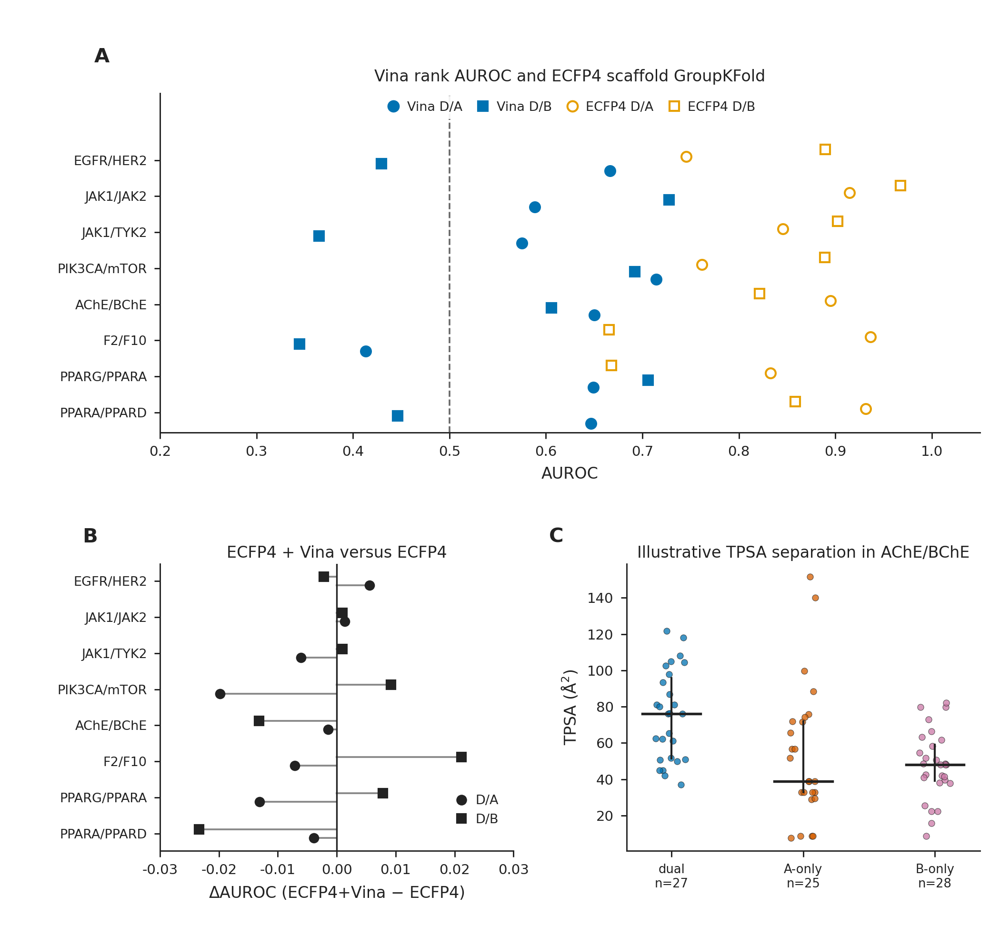
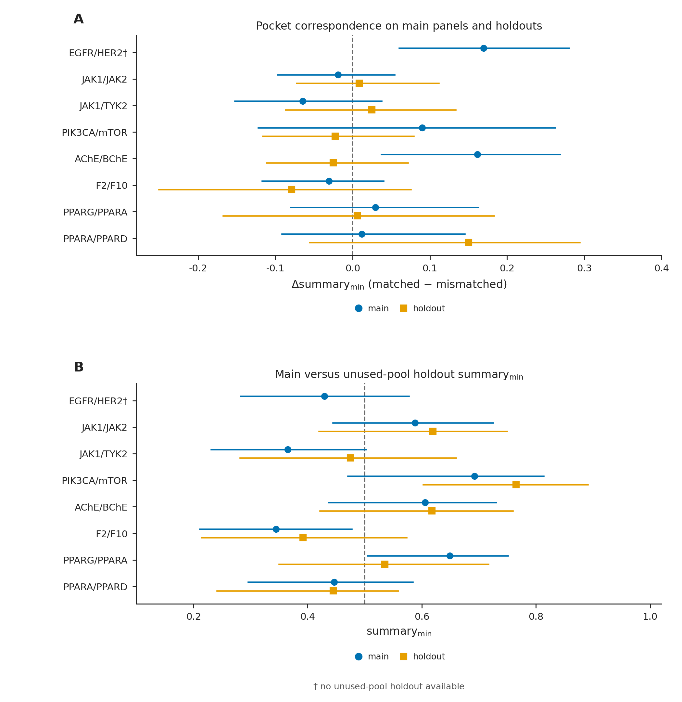
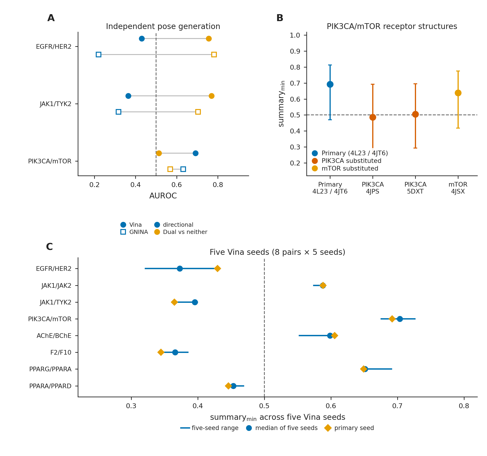
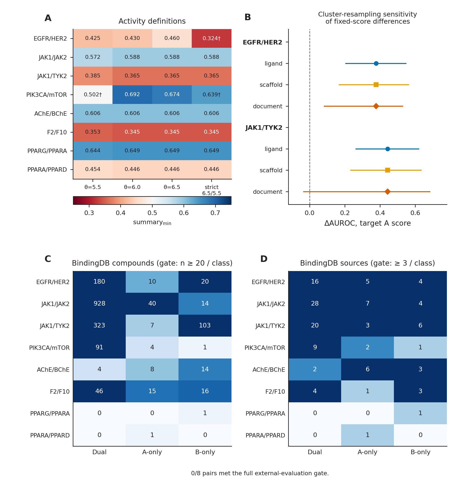

# Results（中文工作稿 · JCIM Articles）

## 3. 结果

### 3.1 双端实验数据供给与四状态评价集构建

ChEMBL 中能够支持四状态评价的双端测量数据随样本要求提高而迅速减少。在所有至少存在双端测量的靶对中，2,164,618 对至少有 1 个双端测量配体，63,790 对具有不少于 10 个双端测量配体。若再要求在 \(\theta=6.0\) 下 dual、A-only 和 B-only 均不少于 10 个，仅剩 5,253 对；采用严格 6.5/5.5 双向选择性供给标准后，减至 86 对。这一数据供给变化见 Figure 1C。

上述普查用于描述能够支持双方向评价的数据供给情况。按照 2.3 节的评价面板与结构准入条件，最终主要评价包括 EGFR/HER2、JAK1/JAK2、JAK1/TYK2、PIK3CA/mTOR、AChE/BChE、F2/F10、PPARG/PPARA 和 PPARA/PPARD（Table 1）。各靶对的候选池规则、配额和骨架上限按样本供给规模与结构可行性分别设定（Table 1）。EGFR/HER2 与 PIK3CA/mTOR 的面板候选池采用 \(\theta=6.0\)，其余六对采用严格 6.5/5.5 规则。四状态分类要求同一配体在两个靶点上均具有实验测量，双端实验测量覆盖和双向选择性样本数量共同限制了严格四状态评价集的规模。

**Figure 1.** 四状态双靶评价与数据供给。(A) 按阈值 \(\theta\) 定义的四种实验状态；(B) 两个方向性评价任务：dual vs A-only 使用靶点 B 评分，dual vs B-only 使用靶点 A 评分；(C) ChEMBL 数据供给由 2,164,618 对减至 86 对，主要评价保留八个靶对。

### 3.2 实验状态定义与方向性对接评价

固定相同评分通道后，改变实验状态比较所产生的 AUROC 差异在不同靶对和评价方向之间并不一致。其中 EGFR/HER2 和 JAK1/TYK2 出现了较明显的差异。EGFR/HER2 使用靶点 A（EGFR）评分时，dual–B-only 比较的 AUROC 为 0.430，将对照类别替换为双端低活性的 neither 后升至 0.808，差值 0.378 [0.205, 0.547]；另一方向上的差异较小。JAK1/TYK2 使用靶点 A（JAK1）评分时，两项比较的差值为 0.444 [0.263, 0.620]。其余靶对和评价方向的差异总体较小或不确定，多数配体水平 95% 置信区间包含 0（Figure 2A；Table S4）。骨架簇和文献簇重采样见 3.5 节。

在统一 \(\theta=6.0\) 标签下，八个靶对方向性判别的较弱方向描述性汇总指标 \(\mathrm{summary}_{\min}\) 介于 0.345 至 0.692。主分析中，PPARG/PPARA 的 \(\mathrm{summary}_{\min}\) 区间完全高于 0.5（0.649 [0.504, 0.751]），F2/F10 完全低于 0.5（0.345 [0.211, 0.477]），其余六对包含 0.5（Figure 2B；Table 2）。

**Table 2.** 八个主评价靶对上的口袋匹配方向 AUROC（Vina，统一 \(\theta=6.0\)）。表中类别样本量为 n_scored（dual / A-only / B-only）。物化描述符基线见 Table S5。

| 靶对 | n_scored (dual / A-only / B-only) | Dual vs A-only（口袋 B） | Dual vs B-only（口袋 A） | summary_min [95% CI] |
|------|---------------------------:|-------------------------:|-------------------------:|----------------------|
| EGFR/HER2 | 28 / 38 / 32 | 0.666 | 0.430 | 0.430 [0.282, 0.578] |
| JAK1/JAK2 | 32 / 32 / 32 | 0.588 | 0.728 | 0.588 [0.444, 0.725] |
| JAK1/TYK2 | 31 / 32 / 32 | 0.575 | 0.365 | 0.365 [0.231, 0.503] |
| PIK3CA/mTOR | 18 / 14 / 12 | 0.714 | 0.692 | 0.692 [0.470, 0.813] |
| AChE/BChE | 27 / 25 / 28 | 0.650 | 0.606 | 0.606 [0.437, 0.730] |
| F2/F10 | 31 / 32 / 32 | 0.413 | 0.345 | 0.345 [0.211, 0.477] |
| PPARG/PPARA | 32 / 31 / 32 | 0.649 | 0.706 | 0.649 [0.504, 0.751] |
| PPARA/PPARD | 32 / 32 / 32 | 0.646 | 0.446 | 0.446 [0.296, 0.584] |

采用双口袋平均评分作描述性比较时，EGFR/HER2 和 JAK1/TYK2 的 dual–neither 比较 AUROC 分别达到 0.756 [0.562, 0.920] 和 0.770 [0.597, 0.906]，而其方向性 \(\mathrm{summary}_{\min}\) 分别为 0.430 和 0.365（Figure 2C；Table 3）。该比较同时改变了评分聚合形式和对照定义，对照组成的单独影响以固定评分通道分析为准。

**Figure 2.** 对接表现取决于实验状态比较。(A) 固定评分通道后更换对照类别的 \(\Delta\)AUROC，误差棒为配体水平 bootstrap 95% 置信区间；(B) 两个方向性 AUROC；(C) 方向性 \(\mathrm{summary}_{\min}\) 与 dual–neither 比较。菱形标出 PIK3CA/mTOR 的 neither n = 4。面板 C 不是固定评分通道比较。

**Table 3.** 同一套 Vina 对接分数在方向性与 dual–neither 比较设定下的 AUROC（统一 \(\theta=6.0\)）。dual–neither 比较采用双口袋平均评分 \(S_{\mathrm{mean}}\)。PIK3CA/mTOR 的 neither 样本量（n = 4）较少。Dual versus all non-duals 见 Table S4。

| 靶对 | directional summary_min [95% CI] | Dual vs neither (vina_mean) | n_neither |
|------|--------------------------------:|------------------------------:|----------:|
| EGFR/HER2 | 0.430 [0.282, 0.578] | 0.756 [0.562, 0.920] | 12 |
| JAK1/JAK2 | 0.588 [0.444, 0.725] | 0.730 [0.547, 0.875] | 14 |
| JAK1/TYK2 | 0.365 [0.231, 0.503] | 0.770 [0.597, 0.906] | 14 |
| PIK3CA/mTOR | 0.692 [0.470, 0.813] | 0.514 [0.222, 0.806] | 4 |
| AChE/BChE | 0.606 [0.437, 0.730] | 0.649 [0.484, 0.812] | 15 |
| F2/F10 | 0.345 [0.211, 0.477] | 0.519 [0.350, 0.688] | 12 |
| PPARG/PPARA | 0.649 [0.504, 0.751] | 0.685 [0.493, 0.848] | 14 |
| PPARA/PPARD | 0.446 [0.296, 0.584] | 0.565 [0.368, 0.766] | 14 |

EGFR/HER2 评价集共包含 110 个配体，其中 28 个为 dual。按双口袋平均评分排序时，Top-10 中包含 1 个 dual、5 个 A-only 和 4 个 B-only，没有 neither 配体，分母为全部 110 个配体（Figure S1A；Table S13）。较高的 dual–neither 比较 AUROC 并未对应较少的高排名单靶选择性配体。按 dual 的中位 \(S_{\mathrm{worst}}\) 进行联合过滤时，分析集合为 Dual+A-only+B-only（n = 98），排除 neither；保留 14 个 dual，同时保留 9 个 A-only 和 24 个 B-only，dual precision 为 0.298（Figure S1B；Table S13）。

### 3.3 配体化学基线与方向性判别

部分靶对中，配体自身的物理化学特征即可对 dual 和单靶选择性配体产生一定区分。AChE/BChE 仅使用 TPSA 时，dual–A-only 比较和 dual–B-only 比较的 AUROC 分别为 0.733 和 0.801（Figure 3C；Table S5）。单一物化性质的判别能力在不同靶对之间差异明显，PIK3CA/mTOR 中最佳单一描述符（重原子数）的 \(\mathrm{summary}_{\min}\) 为 0.463（Table S5）。在八个靶对中，Vina 与最佳单一描述符之间的差异方向和幅度因靶对而异，Vina 并未在各靶对上一致优于单一物化描述符；八对中六对差值的 95% 置信区间包含 0，F2/F10 与 JAK1/TYK2 不包含 0（Table S5）。Vina \(\mathrm{summary}_{\min}\) 区间与最佳描述符点估计见 Figure S2。

在 Bemis–Murcko 骨架分组交叉验证下，不使用受体结构的 ECFP4 分子指纹在多个方向上获得与对接相当甚至更高的 AUROC（Figure 3A）。将对应方向的对接评分加入 ECFP4 逻辑回归模型后，16 个方向的 AUROC 最大绝对变化为 0.023（Figure 3B；Table S5）。在当前评价集和交叉验证设置下，未观察到加入对接评分后跨方向一致的 AUROC 提升。

**Figure 3.** 配体化学作为竞争解释。(A) 原始分数排序的 Vina AUROC 与骨架分组交叉验证下 ECFP4 折外预测 AUROC；蓝为 Vina，橙为 ECFP4；(B) 在相同划分下将对应方向 Vina 评分加入 ECFP4 后的 AUROC 变化，连线连接同一方向的两个点，不是置信区间；(C) AChE/BChE 的 TPSA 分布。

### 3.4 口袋对应性与计算敏感性

为考察方向性判别是否与实验活性差异所在的靶点口袋相对应，对应口袋与非对应口袋的 \(\mathrm{summary}_{\min}\) 差值见 Figure 4A 与 Tables S6 and S7。主评价集中仅 EGFR/HER2（0.170 [0.060, 0.280]）和 AChE/BChE（0.161 [0.037, 0.269]）两对的差值区间排除 0；其余六对的 95% 置信区间均包含 0。七个内部留出集中，对应与非对应口袋的差值区间均包含 0，尚未获得对应口袋具有稳定优势的证据（差值介于 −0.079 至 +0.150；Figure 4A；Table S7）。EGFR/HER2 因剩余候选不足，未构建同等内部留出集。

**Figure 4.** 对应口袋与非对应口袋评分对照。(A) 主评价集与留出集的 matched−mismatched \(\Delta\mathrm{summary}_{\min}\)，点与横线为估计值和配体水平 bootstrap 95% 置信区间；(B) 主评价集与留出集的 \(\mathrm{summary}_{\min}\)。\(\dagger\) 表示 EGFR/HER2 无未使用池留出集。底部图例区分主评价集与留出集。

采用 GNINA 1.3.2 独立生成姿态和评分后，EGFR/HER2 的 dual–neither 比较 AUROC 为 0.783 [0.610, 0.922]，n_neither = 11；方向性较弱臂 dual–B-only 比较为 0.220 [0.109, 0.343]（n_dual = 28，n_B = 32）。该区间属于 dual–B-only、靶点 A 评分，不是对 \(\mathrm{summary}_{\min}\) 逐次取最小值所得的区间（Figure 5A；Table S9）。JAK1/TYK2 同样呈现该模式，dual–neither 比较为 0.705，方向性 \(\mathrm{summary}_{\min}\) 为 0.317 [0.183, 0.463]。在独立姿态生成流程下，类似差异仍可观察到。

在 PIK3CA/mTOR 中，将 PIK3CA 受体由 4L23 替换为 4JPS 后，\(\mathrm{summary}_{\min}\) 从 0.692 [0.470, 0.813] 降至 0.486 [0.259, 0.692]；替换为 5DXT 后为 0.505 [0.292, 0.696]；将 mTOR 4JT6 替换为 4JSX 后为 0.639 [0.418, 0.776]（Figure 5B；Table S8）。

五个固定 Vina 随机种子产生的数值波动相对有限。Figure 5C 展示各靶对 \(\mathrm{summary}_{\min}\) 的五种子范围。EGFR/HER2 的设定差距在五个 Vina 种子上均为正（Table S9）。新增五对在固定成员交集上的波动与完整病例接近。该交集分析只覆盖这五对，不外推为八对都已完成固定成员比较。PPARG/PPARA 在种子 20260811、20260812 和 20260814 上较弱方向由 dual–A-only 换成 dual–B-only，因此这些种子上的 \(\mathrm{summary}_{\min}\) 变化同时包含方向切换（Table S9e）。固定成员上的随机种子变化较小，不能据此推断对实验标签或数据来源稳健。

PPARG/PPARA 在主要 Vina 评价中是唯一 \(\mathrm{summary}_{\min}\) 置信区间完全高于 0.5 的靶对（0.649 [0.504, 0.751]），但同姿态 RTMScore 重评分降至 0.369 [0.233, 0.475]，GNINA CNN 重评分降至 0.500，未使用池留出集降至 0.535 [0.350, 0.717]（Table S7；Table S9）。

PIK3CA/mTOR 的面板规模和 exhaustiveness 敏感性结果见 Figure S3。PM48 为主评价集（配额 n = 48，exhaustiveness = 16）；PM110 为同一靶对的更大协议敏感性面板。

共晶重对接用全部保存姿态中的最低重原子 RMSD 判断搜索能否回到近天然构象。在各自最终认可的重原子 RMSD 下，14 个主受体槽位的最低保存姿态仍低于 2.0 Å。这只说明搜索能够产生近天然姿态，不说明第一姿态已被正确排序。EGFR 3POZ 的第一姿态为 9.505 Å，最低保存姿态为 0.760 Å。新增八个受体中，JAK2、PPARG 和 PPARA 的第一姿态也未回到 2 Å 以内；PPARA 6LXA 前三姿态最低为 7.848 Å（Figure S4；Table S2c）。原有六个受体未纳入该新增化学对应复核。坐标匈牙利匹配保留在 Table S2b，作为历史对照。

**Figure 5.** 计算实现敏感性。(A) 独立 GNINA 与 Vina：实心为 Vina，空心为 GNINA；蓝为方向性 \(\mathrm{summary}_{\min}\)，橙为 dual–neither；灰线连接同一引擎的两项任务，不是置信区间。图例置于绘图区外。(B) PIK3CA/mTOR 受体替换，误差棒为配体水平 bootstrap 95% 置信区间。(C) 八个靶对在五个 Vina 随机种子上的 \(\mathrm{summary}_{\min}\) 范围、中位数与生产种子；该面板不展示设定差距。

### 3.5 方向性评价的标签与样本组成敏感性

从严格 6.5/5.5 候选池构建的评价集，在多个阈值下保留了相同的主要类别组成，因此相应 AUROC 变化较小。EGFR/HER2 和 PIK3CA/mTOR 的类别组成随阈值变化更明显，其方向性估计也发生变化（Figure 6A；Table S3）。将重复活性记录由最大值改为中位数、以及按人源单蛋白字段规则自动重标，仅覆盖 EGFR/HER2、AChE/BChE 与 PIK3CA/mTOR 三个靶对；在该范围内，两项检查未改变相应方向性结果（Table S3）。该项自动重标不是逐篇阅读原文。

在排除主评价集分子后，基于剩余候选分子构建的未使用池留出集显示，结果存在一定的样本组成依赖：AChE/BChE、PIK3CA/mTOR 与 JAK1/JAK2 与主评价接近；JAK1/TYK2 有所上升；F2/F10 与 PPARA/PPARD 仍处于较低水平；PPARG/PPARA 则由 0.649 降至 0.535 [0.350, 0.717]（Figure 4B；Table S7）。EGFR/HER2 无同等留出集。固定评分通道差值的簇重采样中，EGFR/HER2 骨架簇区间为 [0.168, 0.562]、文献簇区间为 [0.083, 0.529]，均排除 0；JAK1/TYK2 骨架簇区间为 [0.234, 0.633]，排除 0，文献簇区间为 [−0.034, 0.682]，包含 0（Figure 6B；Table S10）。

### 3.6 外部评价数据的可用性

BindingDB[16] 与 PubChem 按相同四状态规则清点八个靶对的数据供给（Table S11a）。随后对 BindingDB 按 \(\theta=6.0\) 标签及独立性过滤规则排除共享来源、重复结构和高相似分子，并按外部评价准入条件筛选（Table S11b）。经过独立性过滤后，没有靶对同时满足 dual、A-only 和 B-only 每类至少 20 个分子且至少来自 3 个独立来源的准入条件，因此未进行外部对接（Figure 6C,D；Table S11）。在以 2018 年为截止点的内部时间切分中，JAK1/TYK2 和 JAK1/JAK2 满足两个方向的样本量要求，其余六个靶对未达到报告门槛。该分析基于已构建的评价面板，用于考察结果对文献时间分布的敏感性，不构成独立外部验证（Table S12）。未使用池留出集与年份切分都只是内部敏感性，不作为外部验证。在本研究采用的数据来源、独立性过滤规则和样本准入门槛下，未获得可同时独立评价两个选择性方向的外部数据集。

**Figure 6.** 证据边界。(A) 活性阈值；(B) 配体、骨架簇和文献簇重采样下，靶点 A 评分的 dual–neither 与 dual–B-only 差值；(C) BindingDB 过滤后各类分子数，颜色饱和于每类 n = 20；(D) BindingDB 过滤后独立来源数，颜色饱和于每类 3 个来源。\(\dagger\) 表示该类 n < 10。
