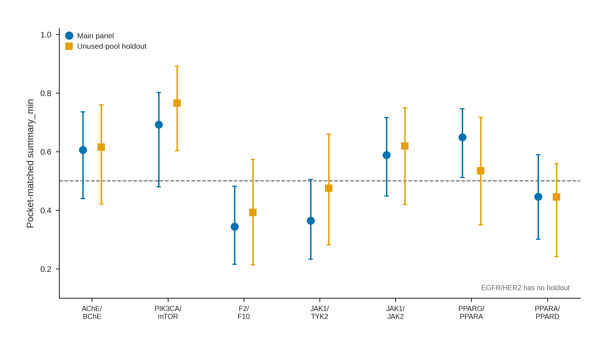
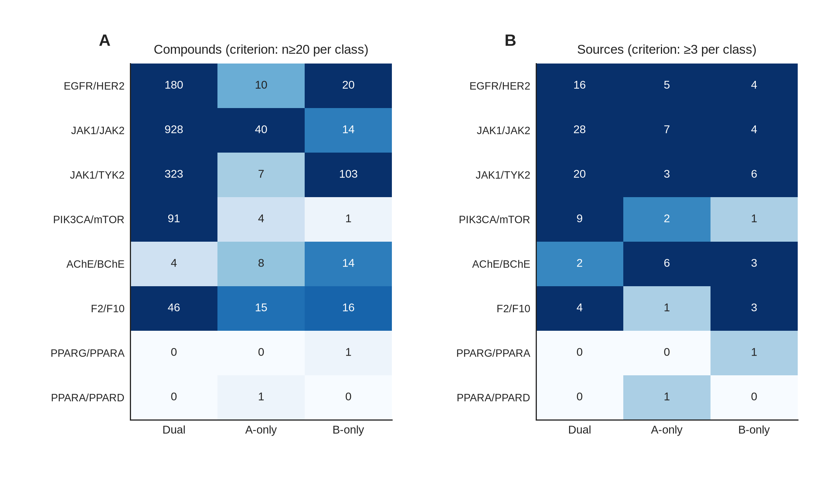
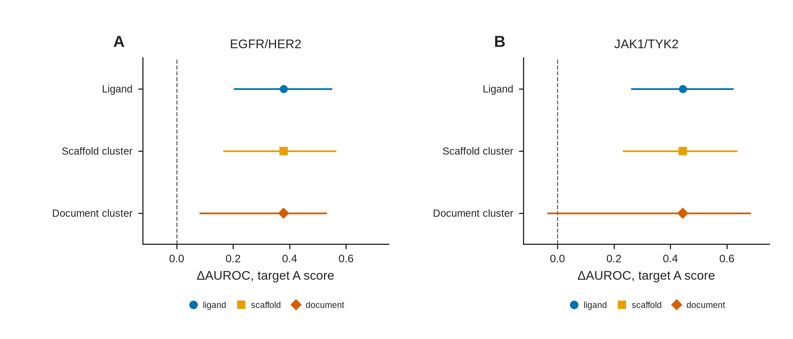

# Supporting Information

本文件对应正文 `MANUSCRIPT_JCIM_ZH.md`。Supporting Tables 按 Table S1–S13 排列；Supporting Figures 按正文首次引用顺序编号为 Figure S1–S8。

正文主表不在 SI 重复：Table 1 评价集组成与对接条件；Table 2 方向性主结果；Table 3 dual–neither 对照比较。

---

## Supporting Tables

---

## Table S1. 软件版本、随机种子与对接参数

| 项目 | 取值 |
|------|------|
| 生产对接 Python / RDKit / Meeko | 本机冻结环境；RDKit 2026.3.1；Meeko 0.7.1 |
| 零对接复分析 | Python 3.12.13；RDKit 2026.3.5；NumPy 2.5.2；pandas 3.0.5；SciPy 1.18.1；scikit-learn 1.9.0（`requirements-analysis.txt`） |
| AutoDock Vina | 1.2.7；默认 `vina` 打分；n_modes = 9；energy_range = 3 kcal mol⁻¹ |
| GNINA | 1.3.2；CPU `--no_gpu` |
| RTMScore | `rtmscore_model1` |
| 配体准备 | 去盐（最大有机片段）→ AddHs → ETKDGv3（seed 20260727）→ MMFF 最多 200 步 → Meeko PDBQT |
| 面板抽样 / holdout 种子 | 20260729 / 20260731 |
| Vina 生产种子 | 20260727；五种子敏感性另加 20260811–20260814 |
| exhaustiveness | PIK3CA/mTOR = 16；其余主面板与 holdout = 8 |
| Bootstrap | B = 2000；配体层非分层百分位区间；SHA-256 稳定子种子 |
| 对接盒子 | 共晶配体 AABB 外扩 5 Å，边长下限 20 Å |
| 共晶 QC 门槛 | best-of-9 重原子 RMSD < 2.0 Å（证明搜索覆盖，不证明 top-1 排序） |

两端均有有效分数的配体进入方向性 AUROC；n_scored 可低于 n_panel（Table 1）。失败集中于大或柔性配体，不作为沉默缺失处理。源：`ENV_PIN.md`；`docking_failure_census_v1.csv`。

---

## Table S2. 主受体对接盒子与共晶重对接 RMSD

八个靶对使用 14 个 PDB 槽位（JAK1 的 6N7A 与 PPARA 的 6LXA 被两对共用）。PIK3CA/mTOR 因 4JT6 在 E = 8 时未过门槛而采用 E = 16。EGFR 3POZ 为重建 QC（原始九姿态生产文件未找回）。9V8H 为 PPARγ LBD–BRL–PG08-NL 三元复合物，对接保留肽链。表中分辨率由主文 Table 1 移入。Figure S4 只画这 14 个主受体的 top-1 与 best-of-9 RMSD。表中 top-3 列为 mode 1–3 的最小值：有逐姿态 RMSD 时直接计算；若最佳保存姿态落在 mode 1–3，则 top-3 等于 best-of-9。PPARA 6LXA 的最佳保存姿态为 mode 5，因此没有统一定义的 top-3，也不进入 Figure S4。

**S2a. 对接盒子（Å）与分辨率**

| 蛋白 | PDB | 共晶配体 | 分辨率 (Å) | center (x, y, z) | size (x, y, z) |
|------|-----|----------|-----------:|------------------|----------------|
| PIK3CA | 4L23 | X6K | 2.50 | 32.443, 45.431, 42.139 | 20.000, 20.000, 20.000 |
| mTOR | 4JT6 | X6K | 3.60 | 51.949, 0.065, −47.707 | 20.332, 20.000, 20.000 |
| AChE | 4EY7 | E20 | 2.35 | −13.988, −43.906, 27.108 | 23.341, 20.000, 20.355 |
| BChE | 4BDS | THA | 2.10 | 133.076, 116.113, 41.335 | 20.000, 20.000, 20.000 |
| EGFR | 3POZ | 03P | 1.50 | 18.680, 32.127, 11.865 | 22.189, 20.000, 22.836 |
| HER2 | 3RCD | 03P | 3.21 | 12.463, 3.371, 27.619 | 23.222, 23.155, 20.000 |
| F2 | 4UDW | N6L | 1.16 | 129.739, −14.402, 164.946 | 20.600, 20.000, 20.000 |
| F10 | 2JKH | BI7 | 1.25 | −3.643, 10.770, 22.771 | 20.000, 20.000, 21.118 |
| JAK1 | 6N7A | KEV | 1.33 | 5.911, −24.317, 21.495 | 20.000, 20.597, 20.000 |
| TYK2 | 3LXP | IZA | 1.65 | −4.498, 25.578, −31.064 | 20.000, 20.000, 20.000 |
| JAK2 | 8BXH | C87 | 1.30 | −12.589, 14.594, 21.263 | 24.069, 20.000, 20.000 |
| PPARG | 9V8H | BRL | 1.39 | −5.454, −5.373, −23.591 | 20.000, 20.140, 20.000 |
| PPARA | 6LXA | EPA | 1.23 | 11.998, 5.742, −7.443 | 20.000, 20.200, 23.432 |
| PPARD | 5U3Q | 7UJ | 1.50 | 40.599, 0.533, 135.353 | 20.223, 20.000, 21.346 |

**S2b. 共晶重对接（生产 exhaustiveness）**

| 蛋白 | PDB | E | top-1 RMSD (Å) | top-3 (Å) | best-of-9 (Å) | 门槛 |
|------|-----|--:|---------------:|----------:|--------------:|------|
| PIK3CA | 4L23 | 16 | 0.624 | 0.624 | 0.624 | 通过 |
| mTOR | 4JT6 | 16 | 7.118 | 0.445 | 0.445 | 通过（E = 8 时 best-of-9 = 5.003，未过） |
| AChE | 4EY7 | 8 | 0.339 | 0.339 | 0.339 | 通过 |
| BChE | 4BDS | 8 | 4.794 | 0.386 | 0.386 | 通过 |
| EGFR | 3POZ | 8 | 9.505 | 6.227 | 0.760 | 搜索覆盖通过；top-1/top-3 未过 |
| HER2 | 3RCD | 8 | 1.855 | 1.394 | 1.394 | 通过 |
| F2 | 4UDW | 8 | 0.382 | 0.382 | 0.382 | 通过 |
| F10 | 2JKH | 8 | 0.658 | 0.658 | 0.658 | 通过 |
| JAK1 | 6N7A | 8 | 0.459 | 0.459 | 0.459 | 通过 |
| TYK2 | 3LXP | 8 | 0.197 | 0.197 | 0.197 | 通过 |
| JAK2 | 8BXH | 8 | 4.064 | 0.807 | 0.807 | 通过 |
| PPARG | 9V8H | 8 | 6.493 | 1.459 | 1.459 | 通过 |
| PPARA | 6LXA | 8 | 7.508 | — | 1.098 | 通过 |
| PPARD | 5U3Q | 8 | 1.452 | 1.452 | 1.452 | 通过 |

PPARA 6LXA 的 top-3 从缺，因为最佳保存姿态为 mode 5。

---

## Table S3. 活性阈值与 pChEMBL 聚合敏感性

同一套冻结 Vina 分数上重标。主分析固定 θ = 6.0（Table 2）。当单侧选择性样本明显减少时，区间变宽。

| 靶对 | 标签规则 | n (D / A / B) | summary_min | 95% CI |
|------|----------|--------------:|------------:|--------|
| EGFR/HER2 | θ = 5.5 | 69 / 22 / 10 | 0.425 | [0.242, 0.626] |
| EGFR/HER2 | θ = 6.0 | 28 / 38 / 32 | 0.430 | [0.282, 0.578] |
| EGFR/HER2 | θ = 6.5 | 26 / 29 / 29 | 0.460 | [0.304, 0.609] |
| EGFR/HER2 | 严格 6.5/5.5 | 26 / 17 / 7 | 0.324 | [0.138, 0.525] |
| AChE/BChE | θ = 5.5 / 6.0 / 6.5 / 严格 | 27 / 25 / 28 | 0.606 | 区间均含 0.5 |
| PIK3CA/mTOR | θ = 5.5 | 33 / 9 / 5 | 0.502 | [0.257, 0.625] |
| PIK3CA/mTOR | θ = 6.0 | 18 / 14 / 12 | 0.692 | [0.470, 0.813] |
| PIK3CA/mTOR | θ = 6.5 | 17 / 15 / 12 | 0.674 | [0.438, 0.797] |
| PIK3CA/mTOR | 严格 6.5/5.5 | 17 / 7 / 4 | 0.639 | [0.317, 0.792] |
| F2/F10 | θ = 5.5 | 33 / 31 / 31 | 0.353 | [0.216, 0.483] |
| F2/F10 | θ = 6.0 / 6.5 / 严格 | 31 / 32 / 32 | 0.345 | [0.211, 0.477] |
| JAK1/TYK2 | θ = 5.5 | 32 / 31 / 33 | 0.385 | [0.254, 0.526] |
| JAK1/TYK2 | θ = 6.0 / 6.5 / 严格 | 31 / 32 / 32 | 0.365 | [0.231, 0.503] |
| JAK1/JAK2 | θ = 5.5 | 34 / 30 / 32 | 0.572 | [0.419, 0.711] |
| JAK1/JAK2 | θ = 6.0 / 6.5 / 严格 | 32 / 32 / 32 | 0.588 | [0.444, 0.725] |
| PPARG/PPARA | θ = 5.5 | 33 / 30 / 32 | 0.644 | [0.498, 0.751] |
| PPARG/PPARA | θ = 6.0 / 6.5 / 严格 | 32 / 31 / 32 | 0.649 | [0.504, 0.751] |
| PPARA/PPARD | θ = 5.5 | 34 / 33 / 30 | 0.454 | [0.307, 0.594] |
| PPARA/PPARD | θ = 6.0 / 6.5 / 严格 | 32 / 32 / 32 | 0.446 | [0.296, 0.584] |

**pChEMBL 最大对中位数（2026-08-26 API 快照；不替换 Table 2）：** EGFR/HER2 标签一致率 93.6%，`summary_min` 由冻结 0.430 变为 API-max 0.417、median 0.424；AChE/BChE 一致率 98.9%，median 使 `summary_min` 变为 0.629（Δ = +0.023）；PIK3CA/mTOR 一致率 100%，`summary_min` 不变。源：`unified_threshold_sensitivity_v2.csv`；`threshold_grid_v1.csv`；`assay_max_vs_median_agreement_v1.csv`。

**高置信人源单蛋白视图（同日 API 快照；不替换 Table 2）：** 具有该快照的已打分配体中 253/253 与四状态类别一致，方向性 AUROC 不变。该视图覆盖 EGFR/HER2、AChE/BChE 与 PIK3CA/mTOR。源：`high_confidence_summary_v1.csv`。

---

## Table S4. 固定评分通道后仅改变负类

保持所用靶点评分不变，dual 共用重采样，选择性负类与 neither 各自独立重采样。Δ = AUROC(dual vs neither) − AUROC(dual vs 对应选择性类)。正值表示 neither 负类下表观判别更高。PIK3CA/mTOR 的 neither n = 4，效能不足。

| 靶对 | 评分通道 | dual vs 选择性 | dual vs neither | Δ | 95% CI | neither 效能不足 |
|------|----------|---------------:|----------------:|--:|--------|:----------------:|
| EGFR/HER2 | 口袋 A（vs B-only） | 0.430 | 0.808 | 0.378 | [0.205, 0.547] | 否 |
| EGFR/HER2 | 口袋 B（vs A-only） | 0.666 | 0.720 | 0.054 | [−0.157, 0.246] | 否 |
| AChE/BChE | 口袋 A | 0.606 | 0.590 | −0.016 | [−0.154, 0.120] | 否 |
| AChE/BChE | 口袋 B | 0.650 | 0.709 | 0.058 | [−0.085, 0.196] | 否 |
| PIK3CA/mTOR | 口袋 A | 0.692 | 0.472 | −0.220 | [−0.514, 0.019] | 是 |
| PIK3CA/mTOR | 口袋 B | 0.714 | 0.583 | −0.131 | [−0.433, 0.179] | 是 |
| F2/F10 | 口袋 A | 0.345 | 0.508 | 0.163 | [−0.005, 0.339] | 否 |
| F2/F10 | 口袋 B | 0.413 | 0.528 | 0.115 | [−0.018, 0.254] | 否 |
| JAK1/TYK2 | 口袋 A | 0.365 | 0.809 | 0.444 | [0.263, 0.620] | 否 |
| JAK1/TYK2 | 口袋 B | 0.575 | 0.705 | 0.130 | [−0.060, 0.295] | 否 |
| JAK1/JAK2 | 口袋 A | 0.728 | 0.723 | −0.004 | [−0.177, 0.170] | 否 |
| JAK1/JAK2 | 口袋 B | 0.588 | 0.730 | 0.142 | [−0.058, 0.334] | 否 |
| PPARG/PPARA | 口袋 A | 0.706 | 0.759 | 0.053 | [−0.139, 0.228] | 否 |
| PPARG/PPARA | 口袋 B | 0.649 | 0.644 | −0.005 | [−0.208, 0.205] | 否 |
| PPARA/PPARD | 口袋 A | 0.446 | 0.484 | 0.038 | [−0.139, 0.216] | 否 |
| PPARA/PPARD | 口袋 B | 0.646 | 0.665 | 0.019 | [−0.172, 0.198] | 否 |

**Dual versus all non-duals（双口袋平均评分；描述性参考，不进入正文 Table 3）：**

| 靶对 | Dual vs all non-duals [95% CI] |
|------|-------------------------------:|
| EGFR/HER2 | 0.551 [0.443, 0.666] |
| JAK1/JAK2 | 0.668 [0.561, 0.770] |
| JAK1/TYK2 | 0.527 [0.411, 0.638] |
| PIK3CA/mTOR | 0.674 [0.515, 0.817] |
| AChE/BChE | 0.579 [0.442, 0.716] |
| F2/F10 | 0.405 [0.273, 0.534] |
| PPARG/PPARA | 0.675 [0.571, 0.780] |
| PPARA/PPARD | 0.522 [0.406, 0.640] |

固定通道 \(\Delta\) 的簇重采样见上行续段。EGFR/HER2 口袋 A 的 \(\Delta=0.378\) 在文献簇与骨架簇下均排除 0。JAK1/TYK2 口袋 A 的 \(\Delta=0.444\) 在骨架簇下排除 0，文献簇下包含 0。双口袋平均评分的 Dual-versus-neither 见正文 Table 3，不能单独代表负类效应。

---

## Table S5. 配体化学基线：ECFP4 与加入 docking 后的增量

Bemis–Murcko 骨架 `GroupKFold` 逻辑回归 out-of-fold AUROC。docking 列是同一划分下仅用对应方向对接分数的 logistic AUROC，**不等于** Table 2 的原始分数排序 AUROC。Δ = (ECFP4+docking) − ECFP4。八个靶对、16 个方向上 |Δ| 最大为 0.023。上述主结果为未做特征缩放的逻辑回归。

| 靶对 | 方向 | ECFP4 | ECFP4+docking | Δ | Vina 排序 AUROC（Table 2） |
|------|------|------:|--------------:|--:|--------------------------:|
| EGFR/HER2 | D vs A | 0.745 | 0.751 | +0.006 | 0.666 |
| EGFR/HER2 | D vs B | 0.890 | 0.887 | −0.002 | 0.430 |
| AChE/BChE | D vs A | 0.895 | 0.893 | −0.002 | 0.650 |
| AChE/BChE | D vs B | 0.821 | 0.808 | −0.013 | 0.606 |
| PIK3CA/mTOR | D vs A | 0.762 | 0.742 | −0.020 | 0.714 |
| PIK3CA/mTOR | D vs B | 0.889 | 0.898 | +0.009 | 0.692 |
| F2/F10 | D vs A | 0.937 | 0.929 | −0.007 | 0.413 |
| F2/F10 | D vs B | 0.665 | 0.687 | +0.021 | 0.345 |
| JAK1/TYK2 | D vs A | 0.846 | 0.840 | −0.006 | 0.575 |
| JAK1/TYK2 | D vs B | 0.902 | 0.903 | +0.001 | 0.365 |
| JAK1/JAK2 | D vs A | 0.915 | 0.916 | +0.001 | 0.588 |
| JAK1/JAK2 | D vs B | 0.968 | 0.969 | +0.001 | 0.728 |
| PPARG/PPARA | D vs A | 0.833 | 0.820 | −0.013 | 0.649 |
| PPARG/PPARA | D vs B | 0.668 | 0.676 | +0.008 | 0.706 |
| PPARA/PPARD | D vs A | 0.932 | 0.928 | −0.004 | 0.646 |
| PPARA/PPARD | D vs B | 0.858 | 0.835 | −0.023 | 0.446 |

四种单一物化描述符的 `summary_min` 如下；EGFR/HER2 的 TPSA 由 0.4275 记为 0.428。AChE/BChE 的 TPSA 方向 AUROC 为 0.733 / 0.801。

| 靶对 | heavy | MW | cLogP | TPSA |
|------|------:|---:|------:|-----:|
| EGFR/HER2 | 0.369 | 0.416 | 0.482 | 0.428 |
| JAK1/JAK2 | 0.578 | 0.565 | 0.480 | 0.570 |
| JAK1/TYK2 | 0.369 | 0.389 | 0.580 | 0.425 |
| PIK3CA/mTOR | 0.463 | 0.448 | 0.310 | 0.260 |
| AChE/BChE | 0.582 | 0.579 | 0.467 | 0.733 |
| F2/F10 | 0.432 | 0.482 | 0.515 | 0.345 |
| PPARG/PPARA | 0.507 | 0.478 | 0.485 | 0.627 |
| PPARA/PPARD | 0.490 | 0.436 | 0.564 | 0.351 |

**特征缩放敏感性。** 在相同 GroupKFold 划分下，于各训练折拟合 `StandardScaler`。16 个方向上 |Δ| 最大为 0.008（PIK3CA/mTOR D vs A）。缩放结果不替换未缩放的主结果 0.023。源：`ecfp4_docking_scaler_sensitivity_v1.csv`。

---

## Table S6. 对应口袋与非对应口袋的配对差值

Δ = matched `summary_min` − mismatched `summary_min`。正值表示正确口袋更高。主评价集仅 EGFR/HER2 与 AChE/BChE 的 95% CI 排除 0；七个可评 holdout 的 CI 均包含 0。

| 靶对 | 集合 | Δ | 95% CI | CI 排除 0 |
|------|------|--:|--------|:---------:|
| EGFR/HER2 | 主评价 | 0.170 | [0.060, 0.280] | 是 |
| AChE/BChE | 主评价 | 0.161 | [0.037, 0.269] | 是 |
| PIK3CA/mTOR | 主评价 | 0.090 | [−0.122, 0.263] | 否 |
| F2/F10 | 主评价 | −0.031 | [−0.117, 0.040] | 否 |
| JAK1/TYK2 | 主评价 | −0.065 | [−0.152, 0.038] | 否 |
| JAK1/JAK2 | 主评价 | −0.019 | [−0.097, 0.054] | 否 |
| PPARG/PPARA | 主评价 | 0.030 | [−0.081, 0.163] | 否 |
| PPARA/PPARD | 主评价 | 0.012 | [−0.092, 0.145] | 否 |
| AChE/BChE | holdout | −0.025 | [−0.112, 0.071] | 否 |
| PIK3CA/mTOR | holdout | −0.023 | [−0.117, 0.079] | 否 |
| F2/F10 | holdout | −0.079 | [−0.251, 0.075] | 否 |
| JAK1/TYK2 | holdout | 0.025 | [−0.087, 0.133] | 否 |
| JAK1/JAK2 | holdout | 0.008 | [−0.073, 0.111] | 否 |
| PPARG/PPARA | holdout | 0.006 | [−0.168, 0.183] | 否 |
| PPARA/PPARD | holdout | 0.150 | [−0.056, 0.294] | 否 |

源：`wrong_pocket_paired_delta_bootstrap_v1.csv`（`set=main_panel` / `unused_pool_holdout`）；`wrong_pocket_by_channel_v1.csv`。

---

## Table S7. 未使用池留出集（unused-pool holdout）

配体来自同一 ChEMBL 批次，排除主面板成员后按冻结配额抽样。EGFR/HER2 剩余候选不足，未构建同等 holdout。JAK1/JAK2 实抽 20 / 20 / 18。留出集为方向性样本（dual / A-only / B-only），不含 neither。

| 靶对 | 主评价 summary_min [95% CI] | holdout n (D / A / B) | holdout summary_min [95% CI] |
|------|----------------------------:|----------------------:|------------------------------|
| AChE/BChE | 0.606 [0.437, 0.730] | 20 / 20 / 20 | 0.618 [0.422, 0.759] |
| PIK3CA/mTOR | 0.692 [0.470, 0.813] | 20 / 20 / 20 | 0.765 [0.603, 0.891] |
| F2/F10 | 0.345 [0.211, 0.477] | 19 / 20 / 20 | 0.392 [0.214, 0.573] |
| JAK1/TYK2 | 0.365 [0.231, 0.503] | 20 / 20 / 20 | 0.475 [0.282, 0.660] |
| JAK1/JAK2 | 0.588 [0.444, 0.725] | 20 / 20 / 18 | 0.619 [0.420, 0.749] |
| PPARG/PPARA | 0.649 [0.504, 0.751] | 20 / 19 / 20 | 0.535 [0.350, 0.717] |
| PPARA/PPARD | 0.446 [0.296, 0.584] | 20 / 20 / 20 | 0.445 [0.241, 0.559] |

源：`holdout_pocket_matched_v1.csv`；`table2_comparable_by_channel_v1.csv`（`holdout_vina_20260727`）。该分析是内部成员敏感性，不是外部验证。

---

## Table S8. PIK3CA/mTOR 受体晶体替换

单口袋设计：替换一端时另一端保持冻结主面板分数。仅该靶对完成预先声明的替代晶体对接。

| 替换 | 被替换口袋 | D vs A | D vs B | summary_min [95% CI] |
|------|------------|-------:|-------:|----------------------|
| 主面板 4L23 / 4JT6 | — | 0.714 | 0.692 | 0.692 [0.470, 0.813] |
| PIK3CA → 4JPS | A | 0.714 | 0.486 | 0.486 [0.259, 0.692] |
| PIK3CA → 5DXT | A | 0.714 | 0.505 | 0.505 [0.292, 0.696] |
| mTOR → 4JSX | B | 0.639 | 0.692 | 0.639 [0.418, 0.776] |

源：`pocket_matched_PM48_alt4JPS_v1.csv`、`..._alt5DXT_v1.csv`、`..._alt4JSX_v1.csv`。

---

## Table S9. 独立 GNINA、替代重评分与五种子 Vina

独立 GNINA 为重新搜索姿态，不是对 Vina 姿态重打分；范围仅 EGFR/HER2、PIK3CA/mTOR、JAK1/TYK2。RTMScore / GNINA CNN 为同一套 Vina 姿态的 best-of-9 重打分。五种子不替换 Table 2。独立 GNINA 并未对每个配体都返回双端评分（EGFR/HER2 缺 EH120_109；PIK3CA/mTOR 缺 PM48_19；JAK1/TYK2 缺 1 个 dual 和 3 个 B-only）。EGFR/HER2 的 dual–neither 因此使用 n_neither = 11，而主要 Vina dual–neither 比较为 12。

**S9a. 独立 GNINA pose generation**

| 靶对 | 引擎 | n_dual / n_A / n_B / n_neither | summary_min [95% CI] | Dual vs neither |
|------|------|------|----------------------|----------------:|
| EGFR/HER2 | Vina 主分析 | 28 / 38 / 32 / 12 | 0.430 [0.282, 0.578] | 0.756 [0.562, 0.920] |
| EGFR/HER2 | GNINA 独立 | 28 / 38 / 32 / 11 | 0.220 [0.109, 0.343] | 0.783 [0.610, 0.922] |
| PIK3CA/mTOR | Vina 主分析 | 18 / 14 / 12 / 4 | 0.692 [0.470, 0.813] | 0.514 [0.222, 0.806] |
| PIK3CA/mTOR | GNINA 独立 | 18 / 13 / 12 / 4 | 0.633 | 0.569 [0.222, 0.889] |
| JAK1/TYK2 | Vina 主分析 | 31 / 32 / 32 / 14 | 0.365 [0.231, 0.503] | 0.770 [0.597, 0.906] |
| JAK1/TYK2 | GNINA 独立 | 30 / 32 / 29 / 14 | 0.317 [0.183, 0.463] | 0.705 |

**S9b. PPARG/PPARA 同姿态重评分（说明主面板优势不稳定）**

| 通道 | summary_min [95% CI] | Dual vs neither |
|------|----------------------|----------------:|
| Vina 主分析 | 0.649 [0.504, 0.751] | 0.685 [0.493, 0.848] |
| RTMScore best-of-9 | 0.369 [0.233, 0.475] | 0.817 |
| GNINA CNN affinity | 0.500 [0.356, 0.623] | 0.884 |
| unused-pool holdout | 0.535 [0.350, 0.717] | — |

**S9c. 五种子 Vina `summary_min` 范围（生产种子 20260727 + 20260811–20260814）**

| 靶对 | 主种子 | 五种子中位数 | 范围 |
|------|-------:|------------:|------|
| EGFR/HER2 | 0.430 | 0.373 | 0.321–0.430 |
| AChE/BChE | 0.606 | 0.599 | 0.553–0.606 |
| PIK3CA/mTOR | 0.692 | 0.704 | 0.676–0.726 |
| F2/F10 | 0.345 | 0.366 | 0.345–0.385 |
| JAK1/TYK2 | 0.365 | 0.396 | 0.365–0.399 |
| JAK1/JAK2 | 0.588 | 0.588 | 0.574–0.592 |
| PPARG/PPARA | 0.649 | 0.651 | 0.649–0.691 |
| PPARA/PPARD | 0.446 | 0.454 | 0.446–0.469 |

F2/F10、JAK1/TYK2、JAK1/JAK2、PPARG/PPARA 和 PPARA/PPARD 的五种子范围均未跨过 0.5。备选种子按完整病例计：AChE/BChE 生产种子 n_complete 为 95（27 / 25 / 28），其余四种子为 89–90（最低 25 / 22 / 27）。部分五对种子上 JAK1/TYK2 的 n_dual 为 32 而非 31，PPARG/PPARA 的 n_A 为 32 而非 31。上述 n 变化不构成第二套 Table 2。源：`independent_dock_formulation_v1.csv`；`table2_comparable_by_channel_v1.csv`；`multiseed_auroc_aggregate_v2.csv`；`multiseed_auroc_by_seed_v2.csv`；`fiveseed_summary_min_aggregate_v1.csv`。

---

## Table S10. 文献簇不确定度与样本量情景模拟

文献簇 bootstrap 只在具有完整 `document_id` 的评价集上报告，不替代 Table 2 的配体层区间。PIK3CA/mTOR Dual versus B-only 在文献阻断交叉验证中不能稳定估计。

| 靶对 | 对比 | 配体层点估计 | 文献簇 95% CI | 文献组数 |
|------|------|------------:|---------------|---------:|
| EGFR/HER2 | D vs A | 0.666 | [0.464, 0.795] | 28 |
| EGFR/HER2 | D vs B | 0.430 | [0.321, 0.617] | 23 |
| AChE/BChE | D vs A | 0.650 | [0.497, 0.809] | 39 |
| AChE/BChE | D vs B | 0.606 | [0.429, 0.753] | 41 |
| PIK3CA/mTOR | D vs A | 0.714 | [0.400, 0.886] | 8 |
| PIK3CA/mTOR | D vs B | 0.692 | [0.000, 0.818] | 9 |

**固定通道 \(\Delta\) 的簇重采样：** 见 Table S4 续段；源 `equal_score_cluster_bootstrap_v1.csv`。该分析不替代 Table S4 配体水平区间。

**样本量情景（独立于 Table 2）。** 该模拟按设计保持观察得的 dual / A-only / B-only 类别样本量，并使用类别内重采样；这不是 Table 2 所用的合并、非分层配体层 bootstrap。在这些类别样本量下，若两臂真实 AUROC 均为 0.70，模拟 `summary_min` 的 95% CI 排除 0.5 的概率为 0.219–0.621；若真实 AUROC 为 0.60，该概率为 0.025–0.065。源：`document_cluster_bootstrap_v1.csv`；`detectable_effect_simulation_v1.csv`。CI 包含 0.5 表示当前估计不够精确，其解释见正文讨论，不在本表中等同于“与随机等价”。

---

## Table S11. BindingDB / PubChem 供给清点与外部对接准入（零靶对通过）

BindingDB 与 PubChem 按与主评价相同的四状态规则清点八个靶对的双向供给。进入外部对接另要求去掉与主评价共享的文献来源、结构重复和 ECFP4 Tanimoto \(\geq 0.70\) 的分子，并满足 dual / A-only / B-only 各 n ≥ 20 且每类至少 3 个来源。按该准入，没有任何靶对被包装为外部评价集或进入外部对接。

**S11a. BindingDB 等式定量记录的严格 6.5/5.5 供给计数（零对接）**

| 靶对 | 双端测量 | 严格 dual / A-only / B-only |
|------|--------:|----------------------------:|
| PIK3CA/mTOR | 2739 | 1579 / 76 / 96 |
| AChE/BChE | 2711 | 698 / 181 / 92 |
| EGFR/HER2 | 2269 | 1336 / 34 / 31 |
| F2/F10 | 1985 | 376 / 129 / 314 |
| JAK1/TYK2 | 4184 | 2455 / 95 / 165 |
| JAK1/JAK2 | 9761 | 7134 / 131 / 54 |
| PPARG/PPARA | 2026 | 413 / 84 / 95 |
| PPARA/PPARD | 1155 | 253 / 71 / 103 |

**S11b. 独立来源过滤后剩余计数（外部对接准入）**

| 靶对 | 过滤后 dual / A-only / B-only | 来源数 (D / A / B) | 门槛 |
|------|------------------------------:|-------------------:|------|
| EGFR/HER2 | 180 / 10 / 20 | 16 / 5 / 4 | 未通过（A-only n = 10 < 20） |
| AChE/BChE | 4 / 8 / 14 | 2 / 6 / 3 | 未通过 |
| PIK3CA/mTOR | 91 / 4 / 1 | 9 / 2 / 1 | 未通过 |
| F2/F10 | 46 / 15 / 16 | 4 / 1 / 3 | 未通过（A/B n = 15/16；A-only 仅 1 个来源） |
| JAK1/TYK2 | 323 / 7 / 103 | 20 / 3 / 6 | 未通过（A-only n = 7） |
| JAK1/JAK2 | 928 / 40 / 14 | 28 / 7 / 4 | 未通过（B-only n = 14） |
| PPARG/PPARA | 0 / 0 / 1 | 0 / 0 / 1 | 未通过 |
| PPARA/PPARD | 0 / 1 / 0 | 0 / 1 / 0 | 未通过 |

源：`crossdb_strict_supply_v1.csv`（S11a；BindingDB `equal_only`）；`external_slice_summary_v1.csv`（S11b）。S11a 只清点供给，不作为外部验证。S11b 对八个靶对使用同一独立来源过滤：去掉共享文献、结构重复和 ECFP4 Tanimoto ≥ 0.70 的分子后再卡门檻。没有任何靶对达到 primary 外部对接准入，也没有一对被包装或对接。

---

## Table S12. 文献年份切分（主截止年 2018）

测试集定义为 earliest `document.year` ≥ 2018。仅当 dual、A-only、B-only 均 n ≥ 10 时报告方向 AUROC。已报告年份切分计数的靶对在 2018 测试集上均未同时达到该门槛，因此未形成可同时评价两个方向的时间独立测试集。

| 靶对 | 2018 测试集 n (D / A / B / neither) | 门槛 |
|------|------------------------------------:|------|
| EGFR/HER2 | 6 / 3 / 14 / 2 | 仅描述计数 |
| AChE/BChE | 8 / 5 / 15 / 6 | 仅描述计数 |
| PIK3CA/mTOR | 2 / 0 / 1 / 0 | 不可评价 |

源：`time_split_class_counts_v1.csv`。2015 / 2020 为预先指定的敏感性截止年，同样未包装为外部验证。

---

## Table S13. EGFR/HER2 排序操作点（探索性）

混合库为评价集全部 110 个配体。Top-10 按 `vina_mean`。AND 式过滤在 Dual+A-only+B-only（n = 98）上以 dual 的 `vina_worst` 中位数为阈值。

| 规则 | dual | A-only | B-only | neither | precision | 选择性占比 |
|------|-----:|-------:|-------:|--------:|----------:|----------:|
| Top-10（vina_mean） | 1 | 5 | 4 | 0 | 0.100 | 0.900 |
| AND 过滤（dual 中位 vina_worst） | 14 | 9 | 24 | — | 0.298 | 0.702 |

该表描述当前排序下假阳性主要来自单靶选择性配体，不是新的筛选方法。

---

## Supporting Figures

补充图按正文首次引用顺序编号。Figure S7 与 Figure 6C,D 为同一 BindingDB 矩阵的独立版；Figure S8 与 Figure 6B 为同一簇重采样结果的独立版，正文不再另行引用。

### Figure S1. EGFR/HER2 Top-10 与 AND 过滤类别组成

**Figure S1.** EGFR/HER2 操作点：按平均 Vina 评分排序的 Top-10 类别组成，以及通过 dual 中位最差靶点评分阈值的化合物类别组成。分母不同，属探索性分析（Table S13）。

### Figure S2. 口袋匹配 summary_min 森林图

**Figure S2.** 八个主评价靶对的 Vina 区间与最佳单一描述符参考。

### Figure S3. PIK3CA/mTOR 的协议敏感性

**Figure S3.** (A) PM48 与 PM110 面板的 Vina \(\mathrm{summary}_{\min}\)。(B) exhaustiveness 16 与 8。均为描述性点估计。

### Figure S4. 14 个主受体的共晶重对接 RMSD

**Figure S4.** 各主受体共晶配体重对接的重原子 RMSD。圆点为 top-1，菱形为 best-of-9。虚线为 2 Å。EGFR 3POZ 的 top-1 为 9.505 Å，在图中标为超轴。数值与 Table S2 一致。

### Figure S5. 未使用池留出集与主评价集

**Figure S5.** 七个可构建留出集靶对的口袋匹配 \(\mathrm{summary}_{\min}\)。EGFR/HER2 无留出集。对应与非对应口袋差值见 Figure 4A 与 Table S7。

### Figure S6. 可检测效应情景模拟

**Figure S6.** 在观察得的类别样本量下，配体水平 95% 置信区间排除 0.5 的模拟概率。仅三个靶对可计算。该图是功效取向的诊断，不是观察对接性能的估计。

### Figure S7. BindingDB 独立过滤后的分子数与来源数

**Figure S7.** 独立性过滤后 BindingDB 各类分子数与来源数。与 Figure 6C,D 为同一矩阵。过滤后没有任何靶对满足外部评价准入。

### Figure S8. 固定评分差值的簇重采样

**Figure S8.** EGFR/HER2 与 JAK1/TYK2 在配体、骨架簇和文献簇重采样下，靶点 A 评分的 dual–neither 与 dual–B-only 差值。与 Figure 6B 为同一估计。

---

## Data provenance

表中数值来自冻结 CSV；完整清单、脚本与 SHA-256 记录见仓库 `REVISION_CHECKSUM_MANIFEST_v1.csv`。逐配体长表、探索性切片与已退出体系不在本 SI 排版。
