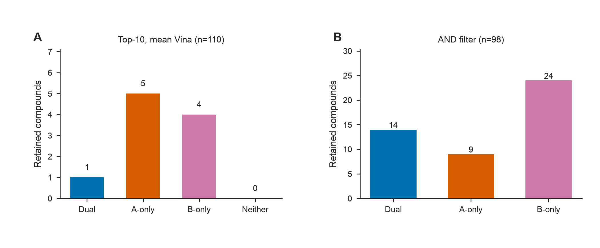
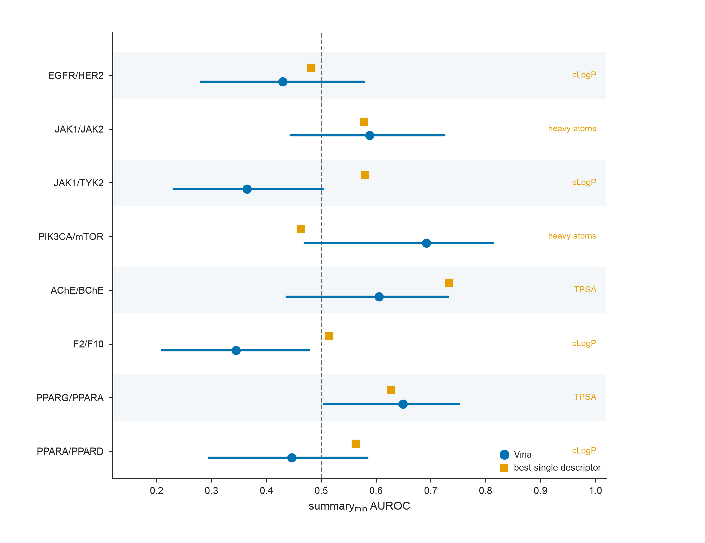
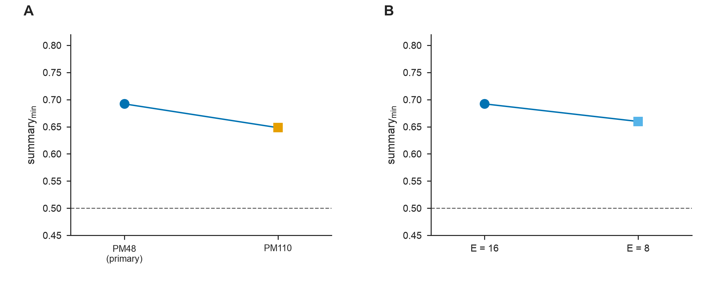
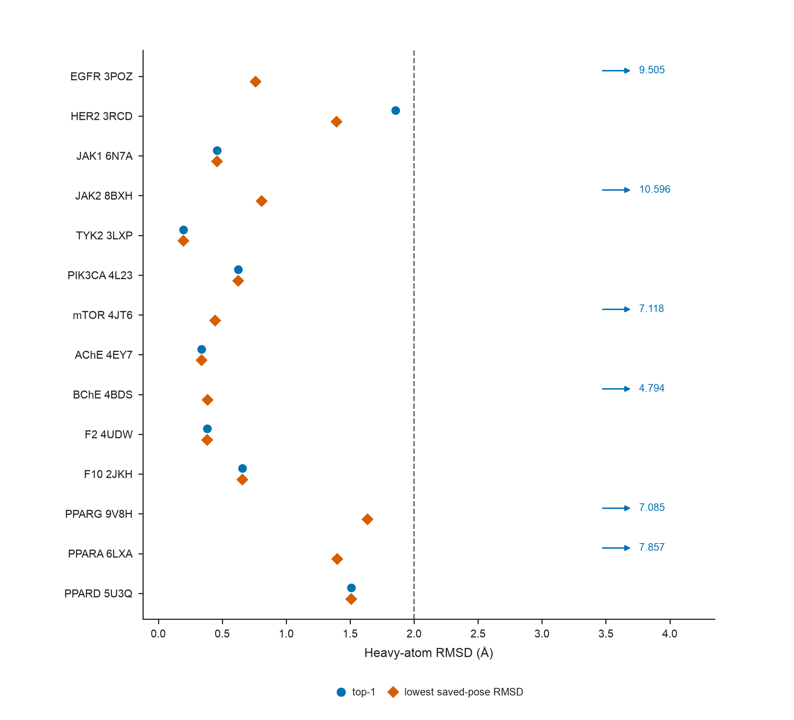
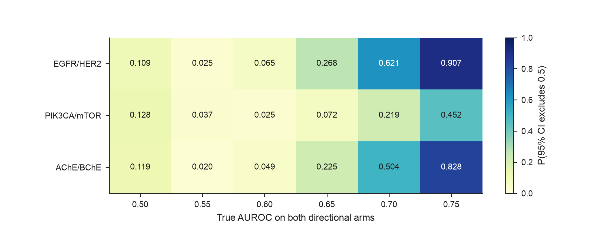

# Supporting Information

本文件对应正文 `MANUSCRIPT_JCIM_ZH.md`。Supporting Tables 按 Table S1–S13 排列；Supporting Figures 按正文首次引用顺序编号为 Figure S1–S5。与主图重复的 holdout、BindingDB 矩阵和簇重采样图保留在仓库 `figures/jcim_article/`，不在投稿 SI 重复排版。

正文主表不在 SI 重复：Table 1 评价集组成与对接条件；Table 2 方向性主结果；Table 3 dual–neither 对照比较。

---

## Supporting Tables

---

## Table S1. 软件版本、随机种子与对接参数

| 项目 | 取值 |
|------|------|
| 生产对接 Python / RDKit / Meeko | 本机冻结环境；RDKit 2026.3.1；Meeko 0.7.1 |
| 零对接复分析 | Python 3.12.13；RDKit 2026.3.5；NumPy 2.5.2；pandas 3.0.5；SciPy 1.18.1；scikit-learn 1.9.0（`requirements-analysis.txt`） |
| AutoDock Vina | 1.2.7；默认 `vina` 打分；n_modes = 9；energy_range = 3 kcal mol⁻¹ |
| GNINA | 1.3.2；CPU `--no_gpu` |
| RTMScore | `rtmscore_model1` |
| 配体准备 | 去盐（最大有机片段）→ AddHs → ETKDGv3（seed 20260727）→ MMFF 最多 200 步 → Meeko PDBQT |
| 面板抽样 / holdout 种子 | 20260729 / 20260731 |
| Vina 生产种子 | 20260727；五种子敏感性另加 20260811–20260814 |
| exhaustiveness | PIK3CA/mTOR = 16；其余主面板与 holdout = 8 |
| Bootstrap | B = 2000。Table 2 的 \(\mathrm{summary}_{\min}\) 为配体层非分层百分位区间；dual–neither 与 Dual vs all non-duals 为两类分层百分位区间；对应/非对应口袋差值为配对 bootstrap |
| 对接盒子 | 共晶配体 AABB 外扩 5 Å，边长下限 20 Å |
| 共晶 QC 门槛 | 全部保存姿态中的最低重原子 RMSD < 2.0 Å（证明搜索覆盖，不证明 top-1 排序） |

两端均有有效分数的配体进入方向性 AUROC；n_scored 可低于 n_panel（Table 1）。主评价集中 AChE/BChE 有 5/100 个配体至少一端失败；EGFR/HER2 与 PIK3CA/mTOR 两端均成功。失败集中于大或柔性配体，不作为沉默缺失处理。源：`ENV_PIN.md`；`docking_failure_census_v1.csv`。

---

## Table S2. 主受体对接盒子与共晶重对接 RMSD

八个靶对使用 14 个主受体结构（JAK1 的 6N7A 与 PPARA 的 6LXA 被两对共用）。PIK3CA/mTOR 因 4JT6 在 E = 8 时未过门槛而采用 E = 16。9V8H 为 PPARγ LBD–BRL–PG08-NL 三元复合物，对接保留肽链。表中分辨率由主文 Table 1 移入。Table S2b 为全部 14 个主受体的化学对应重原子 RMSD（RDKit CalcRMS）。姿态来源、映射细节和历史坐标匹配对照见 S2c。Figure S4 使用 Table S2b。AChE 4EY7 与 TYK2 3LXP 实际保存 8 个姿态。

**S2a. 对接盒子（Å）与分辨率**

| 蛋白 | PDB | 共晶配体 | 分辨率 (Å) | center (x, y, z) | size (x, y, z) |
|------|-----|----------|-----------:|------------------|----------------|
| PIK3CA | 4L23 | X6K | 2.50 | 32.443, 45.431, 42.139 | 20.000, 20.000, 20.000 |
| mTOR | 4JT6 | X6K | 3.60 | 51.949, 0.065, −47.707 | 20.332, 20.000, 20.000 |
| AChE | 4EY7 | E20 | 2.35 | −13.988, −43.906, 27.108 | 23.341, 20.000, 20.355 |
| BChE | 4BDS | THA | 2.10 | 133.076, 116.113, 41.335 | 20.000, 20.000, 20.000 |
| EGFR | 3POZ | 03P | 1.50 | 18.680, 32.127, 11.865 | 22.189, 20.000, 22.836 |
| HER2 | 3RCD | 03P | 3.21 | 12.463, 3.371, 27.619 | 23.222, 23.155, 20.000 |
| F2 | 4UDW | N6L | 1.16 | 129.739, −14.402, 164.946 | 20.600, 20.000, 20.000 |
| F10 | 2JKH | BI7 | 1.25 | −3.643, 10.770, 22.771 | 20.000, 20.000, 21.118 |
| JAK1 | 6N7A | KEV | 1.33 | 5.911, −24.317, 21.495 | 20.000, 20.597, 20.000 |
| TYK2 | 3LXP | IZA | 1.65 | −4.498, 25.578, −31.064 | 20.000, 20.000, 20.000 |
| JAK2 | 8BXH | C87 | 1.30 | −12.589, 14.594, 21.263 | 24.069, 20.000, 20.000 |
| PPARG | 9V8H | BRL | 1.39 | −5.454, −5.373, −23.591 | 20.000, 20.140, 20.000 |
| PPARA | 6LXA | EPA | 1.23 | 11.998, 5.742, −7.443 | 20.000, 20.200, 23.432 |
| PPARD | 5U3Q | 7UJ | 1.50 | 40.599, 0.533, 135.353 | 20.223, 20.000, 21.346 |

**S2b. 共晶重对接（化学对应 CalcRMS；生产 exhaustiveness）**

全部 14 个主受体均按化学对应关系报告重原子 RMSD，不重对接。近天然判断以本表为准。

| 蛋白 | PDB | E | top-1 RMSD (Å) | top-3 (Å) | 全部保存姿态最低 RMSD (Å) | 门槛 |
|------|-----|--:|---------------:|----------:|--------------:|------|
| PIK3CA | 4L23 | 16 | 0.624 | 0.624 | 0.624 | 通过 |
| mTOR | 4JT6 | 16 | 7.118 | 0.445 | 0.445 | 通过（E = 8 时最低保存姿态 RMSD = 5.003，未过） |
| AChE | 4EY7 | 8 | 0.339 | 0.339 | 0.339 | 通过 |
| BChE | 4BDS | 8 | 4.794 | 0.386 | 0.386 | 通过 |
| EGFR | 3POZ | 8 | 9.505 | 6.227 | 0.760 | 搜索覆盖通过；top-1/top-3 未过 |
| HER2 | 3RCD | 8 | 1.855 | 1.394 | 1.394 | 通过 |
| F2 | 4UDW | 8 | 0.382 | 0.382 | 0.382 | 通过 |
| F10 | 2JKH | 8 | 0.658 | 0.658 | 0.658 | 通过 |
| JAK1 | 6N7A | 8 | 0.459 | 0.459 | 0.459 | 通过 |
| TYK2 | 3LXP | 8 | 0.196 | 0.196 | 0.196 | 通过 |
| JAK2 | 8BXH | 8 | 10.596 | 0.807 | 0.807 | 通过 |
| PPARG | 9V8H | 8 | 7.085 | 1.636 | 1.636 | 通过 |
| PPARA | 6LXA | 8 | 7.857 | 7.848 | 1.401 | 通过 |
| PPARD | 5U3Q | 8 | 1.510 | 1.510 | 1.510 | 通过 |

AChE 4EY7 与 TYK2 3LXP 保存 8 个姿态，其最低 RMSD 不是统一的 best-of-9。JAK2、PPARG、PPARA 的第一姿态未回到 2 Å 以内。源：`primary_cognate_rmsd_calcrrms_v1.csv`。

**S2c. 计算方法、姿态来源与历史对照**

主表一律为 RDKit CalcRMS（考虑对称、不做蛋白叠合）。不同批次只是姿态来源和原子映射实现不同，不是两套近天然标准。

| 蛋白 | PDB | 主表来源 | 姿态是否在 git | 映射 |
|------|-----|----------|:--------------:|------|
| PIK3CA | 4L23 | `pm48_01_rmsd_E16.csv` | 否 | 历史生产 QC：Meeko SMILES 序号 + 自同构最小 CalcRMS |
| mTOR | 4JT6 | `pm48_01_rmsd_E16.csv` | 否 | 同上 |
| AChE | 4EY7 | `cognate_rank_rmsd_reaudit_v1.csv` | 是 | Meeko 拓扑重建 |
| BChE | 4BDS | `cognate_rank_rmsd_reaudit_v1.csv` | 是 | 元素约束坐标映射到参考 SDF |
| EGFR | 3POZ | `cognate_rank_rmsd_reaudit_v1.csv` | 是 | 元素约束坐标映射；姿态为后来重建的 QC，不是已找回的原始生产输出 |
| HER2 | 3RCD | `cognate_rank_rmsd_reaudit_v1.csv` | 是 | 同上 |
| F2–PPARD（8 个） | 见表 | `layer3_cognate_rmsd_calcrrms_v1.csv` | 是 | Meeko 拓扑或 CCD SMILES（2JKH/BI7）后 CalcRMS |

下列坐标匈牙利匹配仅作历史对照，不用于近天然判断。PPARA 6LXA 在该历史表中未记录前三姿态 RMSD。JAK2 / PPARG / PPARA 的匈牙利 top-1 分别为 4.064 / 6.493 / 7.508 Å，低于 Table S2b 的化学对应值。

| 蛋白 | PDB | Hungarian top-1 (Å) | Hungarian 全部保存姿态最低 (Å) |
|------|-----|--------------------:|------------------------------:|
| F2 | 4UDW | 0.382 | 0.382 |
| F10 | 2JKH | 0.658 | 0.658 |
| JAK1 | 6N7A | 0.459 | 0.459 |
| TYK2 | 3LXP | 0.197 | 0.197 |
| JAK2 | 8BXH | 4.064 | 0.807 |
| PPARG | 9V8H | 6.493 | 1.459 |
| PPARA | 6LXA | 7.508 | 1.098 |
| PPARD | 5U3Q | 1.452 | 1.452 |

源：`layer3_cognate_rmsd_v1.csv`。

---

## Table S3. 活性阈值与 pChEMBL 聚合敏感性

同一套冻结 Vina 分数上重标。主分析固定 θ = 6.0（Table 2）。从严格 6.5/5.5 候选池抽出的六对在多个阈值下主要类别组成相同，因而 AUROC 变化较小；EGFR/HER2 与 PIK3CA/mTOR 随阈值改变类别组成更明显。pChEMBL 最大/中位数及高置信复核仅覆盖 EGFR/HER2、AChE/BChE 与 PIK3CA/mTOR。

| 靶对 | 标签规则 | n (D / A / B) | summary_min | 95% CI |
|------|----------|--------------:|------------:|--------|
| EGFR/HER2 | θ = 5.5 | 69 / 22 / 10 | 0.425 | [0.242, 0.626] |
| EGFR/HER2 | θ = 6.0 | 28 / 38 / 32 | 0.430 | [0.282, 0.578] |
| EGFR/HER2 | θ = 6.5 | 26 / 29 / 29 | 0.460 | [0.304, 0.609] |
| EGFR/HER2 | 严格 6.5/5.5 | 26 / 17 / 7 | 0.324 | [0.138, 0.525] |
| AChE/BChE | θ = 5.5 / 6.0 / 6.5 / 严格 | 27 / 25 / 28 | 0.606 | 区间均含 0.5 |
| PIK3CA/mTOR | θ = 5.5 | 33 / 9 / 5 | 0.502 | [0.257, 0.625] |
| PIK3CA/mTOR | θ = 6.0 | 18 / 14 / 12 | 0.692 | [0.470, 0.813] |
| PIK3CA/mTOR | θ = 6.5 | 17 / 15 / 12 | 0.674 | [0.438, 0.797] |
| PIK3CA/mTOR | 严格 6.5/5.5 | 17 / 7 / 4 | 0.639 | [0.317, 0.792] |
| F2/F10 | θ = 5.5 | 33 / 31 / 31 | 0.353 | [0.216, 0.483] |
| F2/F10 | θ = 6.0 / 6.5 / 严格 | 31 / 32 / 32 | 0.345 | [0.211, 0.477] |
| JAK1/TYK2 | θ = 5.5 | 32 / 31 / 33 | 0.385 | [0.254, 0.526] |
| JAK1/TYK2 | θ = 6.0 / 6.5 / 严格 | 31 / 32 / 32 | 0.365 | [0.231, 0.503] |
| JAK1/JAK2 | θ = 5.5 | 34 / 30 / 32 | 0.572 | [0.419, 0.711] |
| JAK1/JAK2 | θ = 6.0 / 6.5 / 严格 | 32 / 32 / 32 | 0.588 | [0.444, 0.725] |
| PPARG/PPARA | θ = 5.5 | 33 / 30 / 32 | 0.644 | [0.498, 0.751] |
| PPARG/PPARA | θ = 6.0 / 6.5 / 严格 | 32 / 31 / 32 | 0.649 | [0.504, 0.751] |
| PPARA/PPARD | θ = 5.5 | 34 / 33 / 30 | 0.454 | [0.307, 0.594] |
| PPARA/PPARD | θ = 6.0 / 6.5 / 严格 | 32 / 32 / 32 | 0.446 | [0.296, 0.584] |

**pChEMBL 最大对中位数（2026-08-26 API 快照；不替换 Table 2）：** EGFR/HER2 标签一致率 93.6%，`summary_min` 由冻结 0.430 变为 API-max 0.417、median 0.424；AChE/BChE 一致率 98.9%，median 使 `summary_min` 变为 0.629（Δ = +0.023）；PIK3CA/mTOR 一致率 100%，`summary_min` 不变。源：`unified_threshold_sensitivity_v2.csv`；`threshold_grid_v1.csv`；`assay_max_vs_median_agreement_v1.csv`。

**高置信人源单蛋白视图（同日 API 快照；不替换 Table 2）：** 按数据库字段规则自动筛查，不是逐篇阅读原文。具有该快照的已打分配体中 253/253 与四状态类别一致，方向性 AUROC 不变。该视图覆盖 EGFR/HER2、AChE/BChE 与 PIK3CA/mTOR。源：`high_confidence_summary_v1.csv`。

---

## Table S4. 固定评分通道后仅改变负类

保持所用靶点评分不变，dual 共用重采样，选择性负类与 neither 各自独立重采样。Δ = AUROC(dual vs neither) − AUROC(dual vs 对应选择性类)。正值表示 neither 负类下表观判别更高。PIK3CA/mTOR 的 neither n = 4，效能不足。

| 靶对 | 评分通道 | dual vs 选择性 | dual vs neither | Δ | 95% CI | neither 效能不足 |
|------|----------|---------------:|----------------:|--:|--------|:----------------:|
| EGFR/HER2 | 口袋 A（vs B-only） | 0.430 | 0.808 | 0.378 | [0.205, 0.547] | 否 |
| EGFR/HER2 | 口袋 B（vs A-only） | 0.666 | 0.720 | 0.054 | [−0.157, 0.246] | 否 |
| AChE/BChE | 口袋 A | 0.606 | 0.590 | −0.016 | [−0.154, 0.120] | 否 |
| AChE/BChE | 口袋 B | 0.650 | 0.709 | 0.058 | [−0.085, 0.196] | 否 |
| PIK3CA/mTOR | 口袋 A | 0.692 | 0.472 | −0.220 | [−0.514, 0.019] | 是 |
| PIK3CA/mTOR | 口袋 B | 0.714 | 0.583 | −0.131 | [−0.433, 0.179] | 是 |
| F2/F10 | 口袋 A | 0.345 | 0.508 | 0.163 | [−0.005, 0.339] | 否 |
| F2/F10 | 口袋 B | 0.413 | 0.528 | 0.115 | [−0.018, 0.254] | 否 |
| JAK1/TYK2 | 口袋 A | 0.365 | 0.809 | 0.444 | [0.263, 0.620] | 否 |
| JAK1/TYK2 | 口袋 B | 0.575 | 0.705 | 0.130 | [−0.060, 0.295] | 否 |
| JAK1/JAK2 | 口袋 A | 0.728 | 0.723 | −0.004 | [−0.177, 0.170] | 否 |
| JAK1/JAK2 | 口袋 B | 0.588 | 0.730 | 0.142 | [−0.058, 0.334] | 否 |
| PPARG/PPARA | 口袋 A | 0.706 | 0.759 | 0.053 | [−0.139, 0.228] | 否 |
| PPARG/PPARA | 口袋 B | 0.649 | 0.644 | −0.005 | [−0.208, 0.205] | 否 |
| PPARA/PPARD | 口袋 A | 0.446 | 0.484 | 0.038 | [−0.139, 0.216] | 否 |
| PPARA/PPARD | 口袋 B | 0.646 | 0.665 | 0.019 | [−0.172, 0.198] | 否 |

**Dual versus all non-duals（双口袋平均评分；描述性参考，不进入正文 Table 3）：**

| 靶对 | Dual vs all non-duals [95% CI] |
|------|-------------------------------:|
| EGFR/HER2 | 0.551 [0.443, 0.666] |
| JAK1/JAK2 | 0.668 [0.561, 0.770] |
| JAK1/TYK2 | 0.527 [0.411, 0.638] |
| PIK3CA/mTOR | 0.674 [0.515, 0.817] |
| AChE/BChE | 0.579 [0.442, 0.716] |
| F2/F10 | 0.405 [0.273, 0.534] |
| PPARG/PPARA | 0.675 [0.571, 0.780] |
| PPARA/PPARD | 0.522 [0.406, 0.640] |

固定通道 \(\Delta\) 的簇重采样见 Table S10，不再在本表来回指引。EGFR/HER2 口袋 A 的 \(\Delta=0.378\) 在文献簇与骨架簇下均排除 0。JAK1/TYK2 口袋 A 的 \(\Delta=0.444\) 在骨架簇下排除 0，文献簇下包含 0。双口袋平均评分的 Dual-versus-neither 见正文 Table 3，不能单独代表负类效应。

---

## Table S5. 配体化学基线：ECFP4 与加入 docking 后的增量

ECFP4及ECFP4+docking的AUROC来自相同骨架分组交叉验证下的折外预测；末列为Table 2中的Vina原始分数排序AUROC，作为描述性参照。Δ = (ECFP4+docking) − ECFP4。八个靶对、16 个方向上 |Δ| 最大为 0.023。上述主结果为未做特征缩放的逻辑回归。

| 靶对 | 方向 | ECFP4 | ECFP4+docking | Δ | Vina 排序 AUROC（Table 2） |
|------|------|------:|--------------:|--:|--------------------------:|
| EGFR/HER2 | D vs A | 0.745 | 0.751 | +0.006 | 0.666 |
| EGFR/HER2 | D vs B | 0.890 | 0.887 | −0.002 | 0.430 |
| AChE/BChE | D vs A | 0.895 | 0.893 | −0.002 | 0.650 |
| AChE/BChE | D vs B | 0.821 | 0.808 | −0.013 | 0.606 |
| PIK3CA/mTOR | D vs A | 0.762 | 0.742 | −0.020 | 0.714 |
| PIK3CA/mTOR | D vs B | 0.889 | 0.898 | +0.009 | 0.692 |
| F2/F10 | D vs A | 0.937 | 0.929 | −0.007 | 0.413 |
| F2/F10 | D vs B | 0.665 | 0.687 | +0.021 | 0.345 |
| JAK1/TYK2 | D vs A | 0.846 | 0.840 | −0.006 | 0.575 |
| JAK1/TYK2 | D vs B | 0.902 | 0.903 | +0.001 | 0.365 |
| JAK1/JAK2 | D vs A | 0.915 | 0.916 | +0.001 | 0.588 |
| JAK1/JAK2 | D vs B | 0.968 | 0.969 | +0.001 | 0.728 |
| PPARG/PPARA | D vs A | 0.833 | 0.820 | −0.013 | 0.649 |
| PPARG/PPARA | D vs B | 0.668 | 0.676 | +0.008 | 0.706 |
| PPARA/PPARD | D vs A | 0.932 | 0.928 | −0.004 | 0.646 |
| PPARA/PPARD | D vs B | 0.858 | 0.835 | −0.023 | 0.446 |

四种单一物化描述符的 `summary_min` 如下；EGFR/HER2 的 TPSA 由 0.4275 记为 0.428。AChE/BChE 的 TPSA 方向 AUROC 为 0.733 / 0.801。

| 靶对 | heavy | MW | cLogP | TPSA |
|------|------:|---:|------:|-----:|
| EGFR/HER2 | 0.369 | 0.416 | 0.482 | 0.428 |
| JAK1/JAK2 | 0.578 | 0.565 | 0.480 | 0.570 |
| JAK1/TYK2 | 0.369 | 0.389 | 0.580 | 0.425 |
| PIK3CA/mTOR | 0.463 | 0.448 | 0.310 | 0.260 |
| AChE/BChE | 0.582 | 0.579 | 0.467 | 0.733 |
| F2/F10 | 0.432 | 0.482 | 0.515 | 0.345 |
| PPARG/PPARA | 0.507 | 0.478 | 0.485 | 0.627 |
| PPARA/PPARD | 0.490 | 0.436 | 0.564 | 0.351 |

**Vina \(\mathrm{summary}_{\min}\) 相对最佳单一描述符的配对差值。** Δ = Vina − 最佳单一描述符。八对中六对 95% CI 包含 0；F2/F10 与 JAK1/TYK2 不包含 0。该表支撑正文 3.3 的差值区间陈述；Figure S2 只画 Vina 区间与描述符点估计，不含差值 CI。

| 靶对 | 最佳描述符 | Δ | 95% CI | CI 排除 0 |
|------|------------|--:|--------|:---------:|
| EGFR/HER2 | cLogP | −0.052 | [−0.200, 0.116] | 否 |
| AChE/BChE | TPSA | −0.128 | [−0.304, 0.049] | 否 |
| PIK3CA/mTOR | heavy | 0.229 | [−0.011, 0.435] | 否 |
| F2/F10 | cLogP | −0.170 | [−0.324, −0.012] | 是 |
| JAK1/TYK2 | cLogP | −0.215 | [−0.374, −0.001] | 是 |
| JAK1/JAK2 | heavy | 0.010 | [−0.084, 0.171] | 否 |
| PPARG/PPARA | TPSA | 0.022 | [−0.166, 0.193] | 否 |
| PPARA/PPARD | cLogP | −0.117 | [−0.331, 0.107] | 否 |

源：`pocket_matched_vs_best_descriptor_delta_v1.csv`；`descriptor_paired_delta_s19_v1.csv`。

**特征缩放敏感性。** 在相同 GroupKFold 划分下，于各训练折拟合 `StandardScaler`。16 个方向上 |Δ| 最大为 0.008（PIK3CA/mTOR D vs A）。缩放结果不替换未缩放的主结果 0.023。源：`ecfp4_docking_scaler_sensitivity_v1.csv`。

---

## Table S6. 对应口袋与非对应口袋的配对差值

Δ = matched `summary_min` − mismatched `summary_min`。正值表示正确口袋的较弱方向更高。主评价集仅 EGFR/HER2 与 AChE/BChE 的 95% CI 排除 0；七个可评 holdout 的 CI 均包含 0。区间包含 0 表示当前估计不足以支持稳定优势，不等于证明优势不存在。EGFR/HER2 无 holdout。

| 靶对 | 集合 | Δ | 95% CI | CI 排除 0 |
|------|------|--:|--------|:---------:|
| EGFR/HER2 | 主评价 | 0.170 | [0.060, 0.280] | 是 |
| AChE/BChE | 主评价 | 0.161 | [0.037, 0.269] | 是 |
| PIK3CA/mTOR | 主评价 | 0.090 | [−0.122, 0.263] | 否 |
| F2/F10 | 主评价 | −0.031 | [−0.117, 0.040] | 否 |
| JAK1/TYK2 | 主评价 | −0.065 | [−0.152, 0.038] | 否 |
| JAK1/JAK2 | 主评价 | −0.019 | [−0.097, 0.054] | 否 |
| PPARG/PPARA | 主评价 | 0.030 | [−0.081, 0.163] | 否 |
| PPARA/PPARD | 主评价 | 0.012 | [−0.092, 0.145] | 否 |
| AChE/BChE | holdout | −0.025 | [−0.112, 0.071] | 否 |
| PIK3CA/mTOR | holdout | −0.023 | [−0.117, 0.079] | 否 |
| F2/F10 | holdout | −0.079 | [−0.251, 0.075] | 否 |
| JAK1/TYK2 | holdout | 0.025 | [−0.087, 0.133] | 否 |
| JAK1/JAK2 | holdout | 0.008 | [−0.073, 0.111] | 否 |
| PPARG/PPARA | holdout | 0.006 | [−0.168, 0.183] | 否 |
| PPARA/PPARD | holdout | 0.150 | [−0.056, 0.294] | 否 |

源：`wrong_pocket_paired_delta_bootstrap_v1.csv`（`set=main_panel` / `unused_pool_holdout`）；`wrong_pocket_by_channel_v1.csv`。

**S6b. 单方向差值与较弱方向切换（与 \(\Delta\mathrm{summary}_{\min}\) 并列）**

正值表示对应口袋该方向更高。单方向差值为点估计，没有单独计算的区间；表中置信区间只属于 \(\Delta\mathrm{summary}_{\min}\)。`weaker_switched = yes` 表示对应评分与交换评分的较弱方向不一致，此时 \(\Delta\mathrm{summary}_{\min}\) 不能单独代表两个方向。本表由已锁定口袋结果重排，不是新的独立实验。

| 靶对 | 集合 | Δ D vs A | Δ D vs B | Δ summary_min [95% CI] | 较弱方向是否切换 |
|------|------|---------:|---------:|------------------------|:----------------:|
| EGFR/HER2 | 主评价 | −0.032 | 0.170 | 0.170 [0.060, 0.280] | 否 |
| AChE/BChE | 主评价 | 0.206 | 0.048 | 0.161 [0.037, 0.269] | 是 |
| PIK3CA/mTOR | 主评价 | 0.004 | 0.090 | 0.090 [−0.122, 0.263] | 否 |
| F2/F10 | 主评价 | −0.037 | −0.031 | −0.031 [−0.117, 0.040] | 否 |
| JAK1/TYK2 | 主评价 | 0.060 | −0.065 | −0.065 [−0.152, 0.038] | 否 |
| JAK1/JAK2 | 主评价 | −0.019 | 0.004 | −0.019 [−0.097, 0.054] | 否 |
| PPARG/PPARA | 主评价 | −0.002 | 0.087 | 0.030 [−0.081, 0.163] | 是 |
| PPARA/PPARD | 主评价 | 0.212 | −0.053 | 0.012 [−0.092, 0.145] | 是 |
| AChE/BChE | holdout | −0.008 | −0.035 | −0.025 [−0.112, 0.071] | 是 |
| PIK3CA/mTOR | holdout | 0.073 | −0.093 | −0.023 [−0.117, 0.079] | 是 |
| F2/F10 | holdout | −0.307 | 0.080 | −0.079 [−0.251, 0.075] | 是 |
| JAK1/TYK2 | holdout | −0.006 | 0.025 | 0.025 [−0.087, 0.133] | 否 |
| JAK1/JAK2 | holdout | 0.024 | 0.008 | 0.008 [−0.072, 0.111] | 否 |
| PPARG/PPARA | holdout | 0.174 | −0.169 | 0.006 [−0.168, 0.183] | 是 |
| PPARA/PPARD | holdout | 0.150 | 0.071 | 0.150 [−0.056, 0.294] | 否 |

源：`pocket_unidirectional_delta_v1.csv`。由已锁定口袋分数表重排，不重对接。

---

## Table S7. 未使用池留出集（unused-pool holdout）

配体来自同一 ChEMBL 批次，排除主面板成员后按冻结配额抽样。EGFR/HER2 因剩余候选不足，未构建同等内部留出集。JAK1/JAK2 实抽 20 / 20 / 18。留出集为方向性样本（dual / A-only / B-only），不含 neither。holdout 区间包含 0 时，解释为尚未获得稳定优势的证据，而不把不显著等同于无优势。

| 靶对 | 主评价 summary_min [95% CI] | holdout n (D / A / B) | holdout summary_min [95% CI] |
|------|----------------------------:|----------------------:|------------------------------|
| AChE/BChE | 0.606 [0.437, 0.730] | 20 / 20 / 20 | 0.618 [0.422, 0.759] |
| PIK3CA/mTOR | 0.692 [0.470, 0.813] | 20 / 20 / 20 | 0.765 [0.603, 0.891] |
| F2/F10 | 0.345 [0.211, 0.477] | 19 / 20 / 20 | 0.392 [0.214, 0.573] |
| JAK1/TYK2 | 0.365 [0.231, 0.503] | 20 / 20 / 20 | 0.475 [0.282, 0.660] |
| JAK1/JAK2 | 0.588 [0.444, 0.725] | 20 / 20 / 18 | 0.619 [0.420, 0.749] |
| PPARG/PPARA | 0.649 [0.504, 0.751] | 20 / 19 / 20 | 0.535 [0.350, 0.717] |
| PPARA/PPARD | 0.446 [0.296, 0.584] | 20 / 20 / 20 | 0.445 [0.241, 0.559] |

源：`holdout_pocket_matched_v1.csv`；`table2_comparable_by_channel_v1.csv`（`holdout_vina_20260727`）。该分析是内部成员敏感性，不是外部验证。

---

## Table S8. PIK3CA/mTOR 受体晶体替换

单口袋设计：替换一端时另一端保持冻结主面板分数。仅该靶对完成预先声明的替代晶体对接。

| 替换 | 被替换口袋 | D vs A | D vs B | summary_min [95% CI] |
|------|------------|-------:|-------:|----------------------|
| 主面板 4L23 / 4JT6 | — | 0.714 | 0.692 | 0.692 [0.470, 0.813] |
| PIK3CA → 4JPS | A | 0.714 | 0.486 | 0.486 [0.259, 0.692] |
| PIK3CA → 5DXT | A | 0.714 | 0.505 | 0.505 [0.292, 0.696] |
| mTOR → 4JSX | B | 0.639 | 0.692 | 0.639 [0.418, 0.776] |

源：`pocket_matched_PM48_alt4JPS_v1.csv`、`..._alt5DXT_v1.csv`、`..._alt4JSX_v1.csv`。

---

## Table S9. 独立 GNINA、替代重评分与五种子 Vina

独立 GNINA 为重新搜索姿态，不是对 Vina 姿态重打分；范围仅 EGFR/HER2、PIK3CA/mTOR、JAK1/TYK2。RTMScore / GNINA CNN 为同一套 Vina 姿态的全部保存姿态重打分。五种子不替换 Table 2。独立 GNINA 并未对每个配体都返回双端评分（EGFR/HER2 缺 EH120_109；PIK3CA/mTOR 缺 PM48_19；JAK1/TYK2 缺 1 个 dual 和 3 个 B-only）。EGFR/HER2 的 dual–neither 因此使用 n_neither = 11，而主要 Vina dual–neither 比较为 12。EGFR/HER2 与 PIK3CA/mTOR 独立 GNINA 的 `summary_min` 行在源文件中没有 bootstrap 区间；表中区间标在对应单方向上，不把较弱臂 CI 当作逐次取最小值所得的 CI。

**S9a. 独立 GNINA pose generation**

| 靶对 | 引擎 | n_dual / n_A / n_B / n_neither | summary_min | 较弱方向 AUROC [95% CI] | Dual vs neither |
|------|------|------|------------:|-------------------------|----------------:|
| EGFR/HER2 | Vina 主分析 | 28 / 38 / 32 / 12 | 0.430 [0.282, 0.578] | dual–B-only（口袋 A）0.430 [0.282, 0.578] | 0.756 [0.562, 0.920] |
| EGFR/HER2 | GNINA 独立 | 28 / 38 / 32 / 11 | 0.220 | dual–B-only（口袋 A）0.220 [0.109, 0.343] | 0.783 [0.610, 0.922] |
| PIK3CA/mTOR | Vina 主分析 | 18 / 14 / 12 / 4 | 0.692 [0.470, 0.813] | dual–B-only（口袋 A）0.692 [0.470, 0.813] | 0.514 [0.222, 0.806] |
| PIK3CA/mTOR | GNINA 独立 | 18 / 13 / 12 / 4 | 0.633 | dual–A-only（口袋 B）0.633 [0.427, 0.825] | 0.569 [0.222, 0.889] |
| JAK1/TYK2 | Vina 主分析 | 31 / 32 / 32 / 14 | 0.365 [0.231, 0.503] | dual–B-only（口袋 A）0.365 [0.231, 0.503] | 0.770 [0.597, 0.906] |
| JAK1/TYK2 | GNINA 独立 | 30 / 32 / 29 / 14 | 0.317 [0.183, 0.463] | dual–B-only（口袋 A）0.317 [0.183, 0.463] | 0.705 [0.517, 0.876] |

**S9b. PPARG/PPARA 同姿态重评分（说明主面板优势不稳定）**

| 通道 | summary_min [95% CI] | Dual vs neither |
|------|----------------------|----------------:|
| Vina 主分析 | 0.649 [0.504, 0.751] | 0.685 [0.493, 0.848] |
| RTMScore（全部保存姿态） | 0.369 [0.233, 0.475] | 0.817 |
| GNINA CNN affinity | 0.500 [0.356, 0.623] | 0.884 |
| unused-pool holdout | 0.535 [0.350, 0.717] | — |

**S9c. 五种子 Vina `summary_min` 范围（生产种子 20260727 + 20260811–20260814）**

| 靶对 | 主种子 | 五种子中位数 | 范围 |
|------|-------:|------------:|------|
| EGFR/HER2 | 0.430 | 0.373 | 0.321–0.430 |
| AChE/BChE | 0.606 | 0.599 | 0.553–0.606 |
| PIK3CA/mTOR | 0.692 | 0.704 | 0.676–0.726 |
| F2/F10 | 0.345 | 0.366 | 0.345–0.385 |
| JAK1/TYK2 | 0.365 | 0.396 | 0.365–0.399 |
| JAK1/JAK2 | 0.588 | 0.588 | 0.574–0.592 |
| PPARG/PPARA | 0.649 | 0.651 | 0.649–0.691 |
| PPARA/PPARD | 0.446 | 0.454 | 0.446–0.469 |

F2/F10、JAK1/TYK2、JAK1/JAK2、PPARG/PPARA 和 PPARA/PPARD 的五种子 \(\mathrm{summary}_{\min}\) 范围均未跨过 0.5。备选种子按完整病例计：AChE/BChE 生产种子 n_complete 为 95（27 / 25 / 28），其余四种子为 89–90（最低 25 / 22 / 27）。部分五对种子上 JAK1/TYK2 的 n_dual 为 32 而非 31，PPARG/PPARA 的 n_A 为 32 而非 31。上述 n 变化不构成第二套 Table 2。

**S9e. 新增五对固定成员交集（五个种子均有双端有限分数）**

完整病例（S9c）估计的是该种子实际打分成功的成员；下表把成员固定为五种子均有双端有限分数的交集。进入交集前，评分须通过 `math.isfinite` 检查；空值、非数字、NaN 和无穷值均排除，并写入 `multiseed_fixed_membership_exclusions_v1.csv`。当前重跑未额外排除任何行，545 条成员与 25 行结果与修复前一致。`n_intersection` 含 neither；方向性 AUROC 只用 dual / A-only / B-only。成员 ID 见 `multiseed_fixed_membership_ids_v1.csv`。本表只覆盖新增五对，不外推为八对，也不替换 Table 2。较小的种子波动不能解释为对实验标签或数据来源稳健。

| 靶对 | n_intersection (D / A / B) | 生产种子 summary_min | 五种子范围 | 较弱方向是否切换 |
|------|---------------------------:|---------------------:|------------|:----------------:|
| F2/F10 | 107（31 / 32 / 32） | 0.345 | 0.345–0.385 | 否 |
| JAK1/TYK2 | 109（31 / 32 / 32） | 0.365 | 0.365–0.381 | 否 |
| JAK1/JAK2 | 110（32 / 32 / 32） | 0.588 | 0.574–0.592 | 否 |
| PPARG/PPARA | 109（32 / 31 / 32；另含 neither 14） | 0.649 | 0.649–0.691 | 是（20260811、20260812、20260814：较弱方向由 D vs A 换成 D vs B） |
| PPARA/PPARD | 110（32 / 32 / 32） | 0.446 | 0.446–0.469 | 否 |

源：`multiseed_fixed_membership_v1.csv`。EGFR/HER2、AChE/BChE 与 PIK3CA/mTOR 未纳入本表，因其多种子完整病例变化已在 S9c 说明。

**S9d. EGFR/HER2 五种子设定差距（dual–neither − \(\mathrm{summary}_{\min}\)；Figure 5C 只画 \(\mathrm{summary}_{\min}\)）**

| 种子 | summary_min | Dual vs neither | 设定差距 |
|------|------------:|----------------:|---------:|
| 20260727（生产） | 0.430 | 0.756 | 0.326 |
| 20260811 | 0.373 | 0.777 | 0.404 |
| 20260812 | 0.321 | 0.762 | 0.441 |
| 20260813 | 0.367 | 0.759 | 0.392 |
| 20260814 | 0.396 | 0.768 | 0.372 |

五个种子的设定差距均为正。源：`independent_dock_formulation_v1.csv`；`table2_comparable_by_channel_v1.csv`；`multiseed_auroc_aggregate_v2.csv`；`multiseed_auroc_by_seed_v2.csv`；`fiveseed_summary_min_aggregate_v1.csv`。

---

## Table S10. 文献簇不确定度与样本量情景模拟

文献簇 bootstrap 只在具有完整 `document_id` 的评价集上报告，不替代 Table 2 的配体层区间。PIK3CA/mTOR Dual versus B-only 在文献阻断交叉验证中不能稳定估计。

| 靶对 | 对比 | 配体层点估计 | 文献簇 95% CI | 文献组数 |
|------|------|------------:|---------------|---------:|
| EGFR/HER2 | D vs A | 0.666 | [0.464, 0.795] | 28 |
| EGFR/HER2 | D vs B | 0.430 | [0.321, 0.617] | 23 |
| AChE/BChE | D vs A | 0.650 | [0.497, 0.809] | 39 |
| AChE/BChE | D vs B | 0.606 | [0.429, 0.753] | 41 |
| PIK3CA/mTOR | D vs A | 0.714 | [0.400, 0.886] | 8 |
| PIK3CA/mTOR | D vs B | 0.692 | [0.000, 0.818] | 9 |

**固定通道 \(\Delta\) 的簇重采样（靶点 A 评分；dual–neither − dual–B-only）：**

| 靶对 | 重采样单位 | Δ 点估计 | 95% CI | CI 排除 0 |
|------|------------|--------:|--------|:---------:|
| EGFR/HER2 | 骨架簇 | 0.378 | [0.168, 0.562] | 是 |
| EGFR/HER2 | 文献簇 | 0.378 | [0.083, 0.529] | 是 |
| JAK1/TYK2 | 骨架簇 | 0.444 | [0.234, 0.633] | 是 |
| JAK1/TYK2 | 文献簇 | 0.444 | [−0.034, 0.682] | 否 |

源：`equal_score_cluster_bootstrap_v1.csv`。该分析不替代 Table S4 配体水平区间。

**样本量情景（独立于 Table 2）。** 脚本计算的是模拟 \(\mathrm{summary}_{\min}\) 百分位区间下限>0.5 **或** 上限<0.5 的概率。该模拟按设计保持观察得的 dual / A-only / B-only 类别样本量，并使用类别内重采样；这不是 Table 2 所用的合并、非分层配体层 bootstrap。在两个方向真实 AUROC 均为 0.50 时，EGFR/HER2、AChE/BChE 与 PIK3CA/mTOR 的该概率分别为 0.109、0.119 和 0.128，显示该模拟区间存在明显覆盖率问题。因此 Figure S5 保留为独立情景诊断，不能单独用来证明 Table 2 不确定性“只是样本量小”。若两臂真实 AUROC 均为 0.70，该概率为 0.219–0.621；若为 0.60，则为 0.025–0.065。源：`document_cluster_bootstrap_v1.csv`；`detectable_effect_simulation_v1.csv`。CI 包含 0.5 表示当前估计不够精确，不在本表中等同于“与随机等价”。

---

## Table S11. BindingDB / PubChem 供给清点与外部对接准入（零靶对通过）

S11a 是严格 6.5/5.5 的 **供给清点**（BindingDB 与 PubChem 的 `equal_only` 等式定量记录），不对接。S11b 是另一套 **独立性过滤后评价候选集**：四状态标签采用 \(\theta=6.0\)，不是对 S11a 逐行过滤。开发分子集合包括主评价集、PIK3CA/mTOR 扩展面板 PM110 以及内部留出集，不只是主评价集。进入外部对接另要求去掉与开发集共享的文献来源、结构重复和 ECFP4 Tanimoto \(\geq 0.70\) 的分子，并满足 dual / A-only / B-only 各 n ≥ 20 且每类至少 3 个来源。按该准入，没有任何靶对被包装为外部评价集或进入外部对接。

**S11a. 严格 6.5/5.5 供给计数（零对接）**

| 靶对 | BindingDB 双端测量 | BindingDB dual / A / B | PubChem 双端测量 | PubChem dual / A / B |
|------|-------------------:|-----------------------:|-----------------:|---------------------:|
| PIK3CA/mTOR | 2739 | 1579 / 76 / 96 | 2955 | 1602 / 86 / 93 |
| AChE/BChE | 2711 | 698 / 181 / 92 | 2916 | 742 / 214 / 97 |
| EGFR/HER2 | 2269 | 1336 / 34 / 31 | 2068 | 1121 / 43 / 30 |
| F2/F10 | 1985 | 376 / 129 / 314 | 2163 | 439 / 147 / 324 |
| JAK1/TYK2 | 4184 | 2455 / 95 / 165 | 4117 | 2473 / 93 / 163 |
| JAK1/JAK2 | 9761 | 7134 / 131 / 54 | 9700 | 7169 / 138 / 54 |
| PPARG/PPARA | 2026 | 413 / 84 / 95 | 2134 | 464 / 84 / 99 |
| PPARA/PPARD | 1155 | 253 / 71 / 103 | 1231 | 271 / 81 / 103 |

**S11b. 独立来源过滤后剩余计数（\(\theta=6.0\) 标签；外部对接准入）**

| 靶对 | 过滤后 dual / A-only / B-only | 来源数 (D / A / B) | 门槛 |
|------|------------------------------:|-------------------:|------|
| EGFR/HER2 | 180 / 10 / 20 | 16 / 5 / 4 | 未通过（A-only n = 10 < 20） |
| AChE/BChE | 4 / 8 / 14 | 2 / 6 / 3 | 未通过 |
| PIK3CA/mTOR | 91 / 4 / 1 | 9 / 2 / 1 | 未通过 |
| F2/F10 | 46 / 15 / 16 | 4 / 1 / 3 | 未通过（A/B n = 15/16；A-only 仅 1 个来源） |
| JAK1/TYK2 | 323 / 7 / 103 | 20 / 3 / 6 | 未通过（A-only n = 7） |
| JAK1/JAK2 | 928 / 40 / 14 | 28 / 7 / 4 | 未通过（B-only n = 14） |
| PPARG/PPARA | 0 / 0 / 1 | 0 / 0 / 1 | 未通过 |
| PPARA/PPARD | 0 / 1 / 0 | 0 / 1 / 0 | 未通过 |

源：`crossdb_strict_supply_v1.csv`（S11a；BindingDB 与 PubChem `equal_only`）；`external_slice_summary_v1.csv`（S11b）。S11a 只清点供给，不作为外部验证。S11b 使用 \(\theta=6.0\) 及包含扩展面板和内部留出集的开发分子集合，不是对 S11a 逐行过滤。没有任何靶对达到 primary 外部对接准入，也没有一对被包装或对接。

---

## Table S12. 文献年份切分（主截止年 2018）

测试集定义为 earliest `document.year` ≥ 2018。仅当 dual、A-only、B-only 均 n ≥ 10 时报告方向 AUROC。该分析基于已构建的评价面板，用于考察结果对文献时间分布的敏感性，不构成独立外部验证。在 2018 年截止点下，JAK1/TYK2 和 JAK1/JAK2 达到报告门槛；其余六对未达到。

| 靶对 | 2018 测试集 n (D / A / B / neither) | D vs A | D vs B | summary_min [95% CI] | 门槛 |
|------|------------------------------------:|-------:|-------:|----------------------|------|
| EGFR/HER2 | 6 / 3 / 14 / 2 | — | — | — | 仅描述计数 |
| AChE/BChE | 8 / 5 / 15 / 6 | — | — | — | 仅描述计数 |
| PIK3CA/mTOR | 2 / 0 / 1 / 0 | — | — | — | 不可评价 |
| F2/F10 | 4 / 4 / 0 / 1 | — | — | — | 未达门槛 |
| JAK1/TYK2 | 16 / 21 / 27 / 5 | 0.622 | 0.368 | 0.368 [0.200, 0.545] | 可报告 |
| JAK1/JAK2 | 21 / 21 / 24 / 6 | 0.653 | 0.794 | 0.653 [0.476, 0.810] | 可报告 |
| PPARG/PPARA | 0 / 0 / 2 / 2 | — | — | — | 未达门槛 |
| PPARA/PPARD | 6 / 1 / 2 / 4 | — | — | — | 未达门槛 |

源：`time_split_class_counts_v1.csv`；`five_pair_dump_gated_v1/time_split_v1.csv`。2015 年为预先指定的敏感性截止年：AChE/BChE 测试集 11 / 11 / 24 / 10，dual–A-only AUROC 0.603 [0.339, 0.835]，dual–B-only 0.636 [0.447, 0.807]，门控为 `underpowered_report`，同样不作为外部验证。2015 / 2020 均未包装为外部验证。

---

## Table S13. EGFR/HER2 排序操作点（探索性）

混合库为评价集全部 110 个配体。Top-10 按 `vina_mean`，分母 n = 110。AND 式过滤在 Dual+A-only+B-only（n = 98）上以 dual 的 `vina_worst` 中位数为阈值，排除 neither。

| 规则 | dual | A-only | B-only | neither | precision | 选择性占比 |
|------|-----:|-------:|-------:|--------:|----------:|----------:|
| Top-10（vina_mean） | 1 | 5 | 4 | 0 | 0.100 | 0.900 |
| AND 过滤（dual 中位 vina_worst） | 14 | 9 | 24 | — | 0.298 | 0.702 |

该表描述当前排序下假阳性主要来自单靶选择性配体，不是新的筛选方法。

---

## Supporting Figures

补充图按正文首次引用顺序编号为 Figure S1–S5。原 Figure S5（holdout，与 Figure 4B 重复）、原 Figure S7（BindingDB，与 Figure 6C,D 重复）和原 Figure S8（簇重采样，与 Figure 6B 重复）保留在仓库，不在投稿 SI 排版。

### Figure S1. EGFR/HER2 Top-10 与 AND 过滤类别组成

**Figure S1.** EGFR/HER2 操作点。(A) 按平均 Vina 评分排序的 Top-10 类别组成，分母为全部 110 个评价集配体；(B) 通过 dual 中位最差靶点评分阈值的化合物类别组成，分母为 Dual+A-only+B-only（n = 98），排除 neither。两面板分母不同，属探索性分析（Table S13）。

### Figure S2. 口袋匹配 summary_min 森林图

**Figure S2.** 八个主评价靶对的 Vina \(\mathrm{summary}_{\min}\) 配体水平 bootstrap 95% 置信区间，以及最佳单一描述符的点估计。该图不展示 Vina−描述符差值的置信区间；差值及区间见 Table S5。

### Figure S3. PIK3CA/mTOR 的协议敏感性

**Figure S3.** (A) PM48 与 PM110 面板的 Vina \(\mathrm{summary}_{\min}\)。PM48 为主评价集（配额 18/14/12/4，n_scored dual/A/B = 18/14/12，exhaustiveness = 16）；PM110 为同一靶对的更大协议敏感性面板。(B) 在 PM48 上 exhaustiveness 16 与 8。均为描述性点估计，不是 Table 2 的区间。

### Figure S4. 14 个主受体的共晶重对接 RMSD

**Figure S4.** 各主受体共晶配体重对接的重原子 RMSD。圆点为 top-1，菱形为全部保存姿态中的最低重原子 RMSD。AChE 4EY7 与 TYK2 3LXP 保存 8 个姿态，其余主受体保存 9 个姿态。虚线为 2 Å。EGFR 3POZ 的 top-1 为 9.505 Å，在图中标为超轴。14 个主受体均取 Table S2b 的化学对应 CalcRMS。历史坐标匹配见 Table S2c。

### Figure S5. 可检测效应情景模拟

**Figure S5.** 在观察得的类别样本量下，模拟 \(\mathrm{summary}_{\min}\) 百分位 95% 区间下限>0.5 或上限<0.5 的概率。仅三个靶对可计算（N_MC = 1000，B = 2000）。真实 AUROC = 0.50 时该概率为 0.109、0.119 和 0.128，显示覆盖率问题。该图是独立情景诊断，不是 Table 2 的功效估计，也不能单独解释主结果不确定性。

---

## Data provenance

表中数值来自冻结 CSV；完整清单、脚本与 SHA-256 记录见仓库 `REVISION_CHECKSUM_MANIFEST_v1.csv`。逐配体长表、探索性切片与已退出体系不在本 SI 排版。
