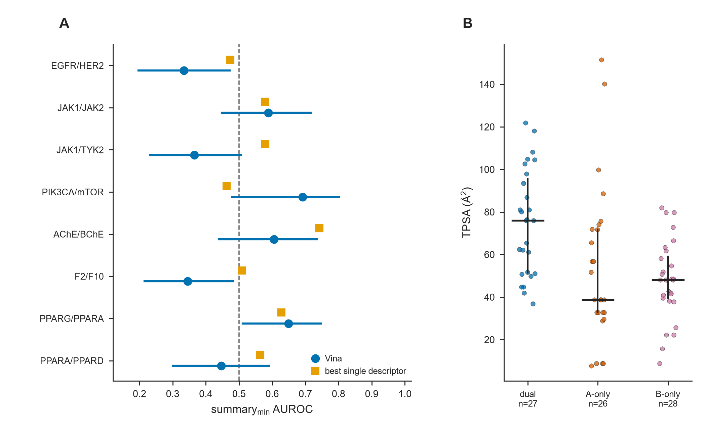
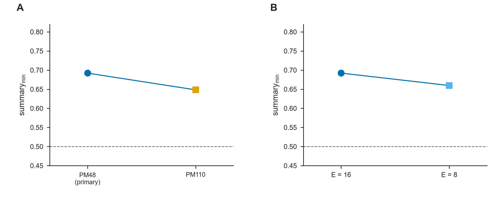
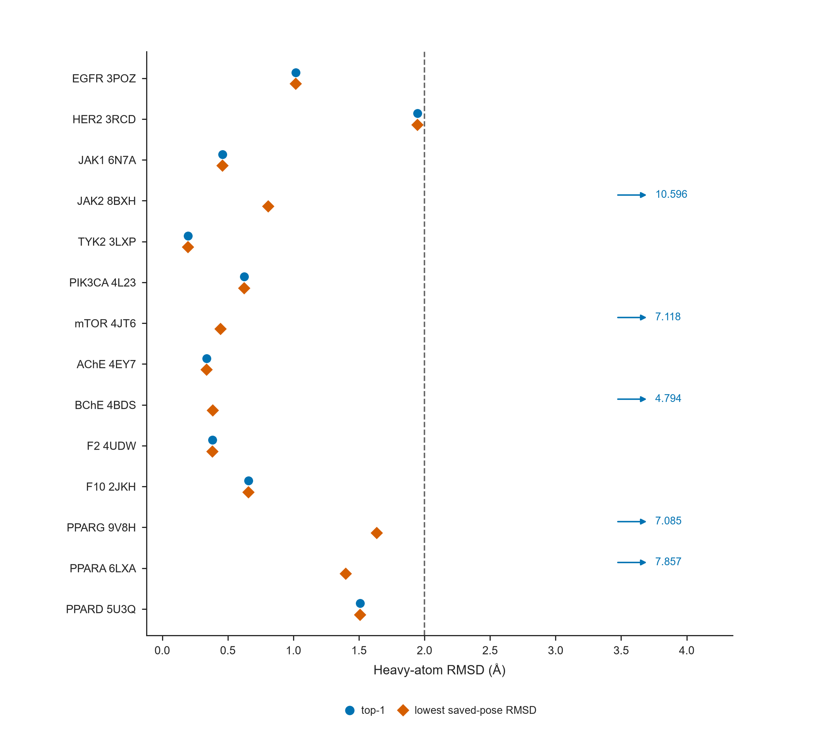
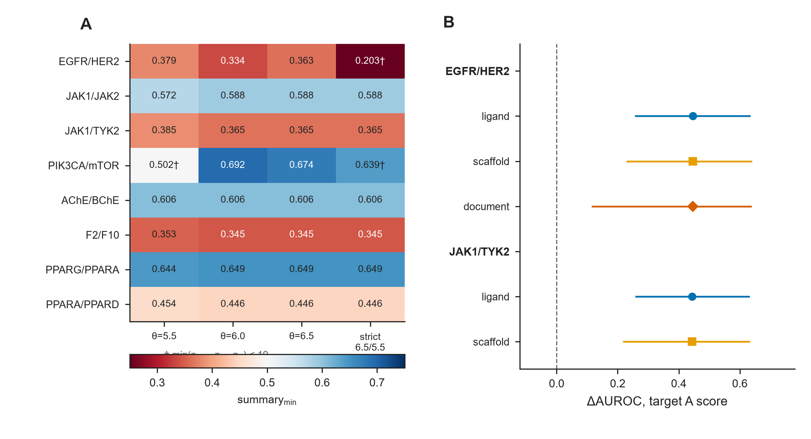
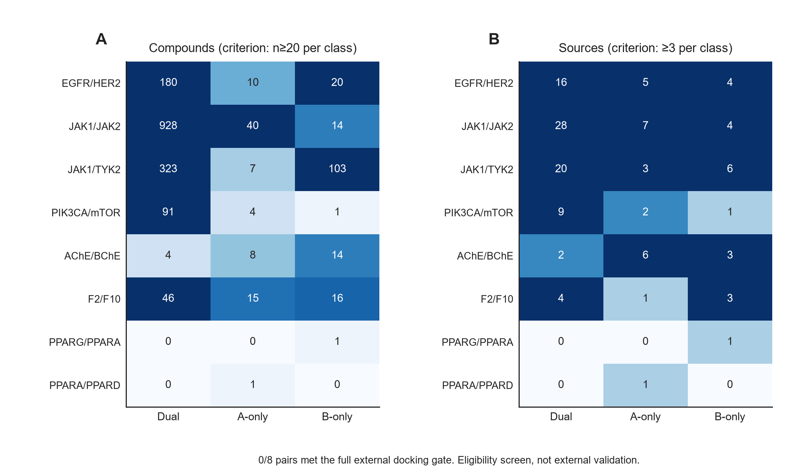

# Supporting Information (English, merged submission draft)

**Article companion:** `MANUSCRIPT_JCIM_EN.md`  
**Numeric rule:** cells below are read from frozen CSVs. Displayed values are three-decimal rounded from the CSV string (half-up or, where already typeset, half-even / banker's). A trailing digit of exactly 5 can therefore appear as either neighbor (for example 0.5045 as 0.504 or 0.505). The CSV is authoritative. EGFR/HER2 full-panel TPSA `summary_min` is 0.4389 → 0.439 (a descriptor AUROC, not a Table 2 docking AUROC).  
**Scope:** typeset Tables S1–S10 answer four questions: how data and docking were done; where the core fixed-channel results come from; whether ligand chemistry and pocket correspondence support attribution; and whether the main conclusions are obviously unstable to labels, sample, or computational realization. Table S10 reports the eight-pair candidate-ranking operating points that correspond to Figure 2D. Historical coordinate-assignment RMSD, five-seed long tables, fixed-membership intersections, non-stratified bootstrap sensitivity, the eight-pair detectable-effect simulation summarized after Table S4 (`results/canonical/detectable_effect_simulation.csv`), raw BindingDB/PubChem supply counts, literature-year splits, and per-ligand or exploratory slices remain in the public repository. Archive checksum manifests are integrity records, not scientific PASS/FAIL authority. They are not repeated as typeset tables.  
**Legacy maps:** former 54-table numbering is `data/manuscript_lock/SI_TABLE_MERGE_MAP_v1.csv`. The immediately previous typeset set was Tables S1–S14; the remap is listed after Table S10.

**Main-text tables (not repeated here):** Table 1 panel composition; Table 2 eight-pair directional AUROC; Table 3 candidate-ranking consequence (two-pocket mean D-versus-neither, Top 10%, \(\mathrm{EF}_{\mathrm{dual},10\%}\)).

---

## Table S1. Computational settings and statistical definitions

Analysis freeze and docking/preparation are separate environments. Analysis versions are the writing-freeze pin. Docking versions are written only when a yaml, ENV_PIN snapshot, or script records them. The analysis RDKit pin is not back-dated onto historical ligand PDBQT.

| Item | Value |
|------|------|
| Analysis freeze | Python 3.12.3; NumPy 2.5.2; pandas 3.0.5; SciPy 1.18.1; scikit-learn 1.9.0; RDKit 2026.03.5 (`requirements-analysis.txt`) |
| Docking / preparation (direct evidence only) | AutoDock Vina 1.2.7 (`track_b_local_run_v1.yaml`; vina binary). Meeko 0.7.1 (Track-B yaml). Local docking-machine snapshot 2026-07-29 in `data/jcim_strengthen_t0t1_v0/ENV_PIN.md`: RDKit 2026.3.1 from `pip show rdkit` on that machine; this is not proof that every deposited ligand PDBQT was generated under that pin |
| AutoDock Vina | 1.2.7; default `vina`; n_modes = 9; energy_range = 3 kcal mol⁻¹ |
| GNINA | 1.3.2; CPU `--no_gpu` (ENV_PIN + independent-dock yaml) |
| RTMScore | `rtmscore_model1` |
| Ligand prep (Track-B, PIK3CA, AChE recovered scripts) | Desalt (largest organic) → AddHs → ETKDGv3 (seed 20260727) → MMFF ≤200 → Meeko PDBQT. Exact production ligand PDBQT for those packs are not deposited. EGFR original ligand PDBQT are not recoverable; the uniform RDKit/Meeko rebuild is documented separately |
| Receptor prep | Frozen deposited PDBQT; 14-slot registry `data/provenance/receptor_input_registry.csv`. Not a uniform Meeko or Protein Preparation Wizard campaign |
| Panel / holdout seeds | 20260729 / 20260731 |
| Vina production seed | 20260727; five-seed archive adds 20260811–20260814 |
| Exhaustiveness | PRIMARY: PIK3CA/mTOR = 16; all other primary panels and holdouts = 8. SENSITIVITY: PIK3CA E=8, PM110, 4JPS/5DXT/4JSX |
| Bootstrap | B = 2000. Table 2 reports pointwise directional intervals and a replicate-wise `summary_min` interval from the class-stratified nonparametric percentile bootstrap (B = 2000, seed 20260729). Dual ligands are shared across the two directional AUROCs inside each replicate. Dual-versus-neither uses the same class-stratified protocol; matched-minus-mismatched uses paired ligand resampling. A non-stratified ligand bootstrap is archived as sensitivity (`non_stratified_bootstrap_sensitivity.csv`) and does not replace Table 2 |
| GroupKFold / logistic | splits = min(5, n_scaffolds, class counts); C = 1.0; max_iter = 4000; default non-shuffled GroupKFold |
| Box | Cognate AABB + 5 Å; minimum edge 20 Å |
| Cognate gate | lowest heavy-atom RMSD among all saved poses < 2.0 Å (search coverage, not top-1 ranking) |

Ligands need both-end scores for directional AUROC; n_scored may be below n_panel (Table 1). Source: `data/jcim_strengthen_t0t1_v0/ENV_PIN.md`; `docs/PROTOCOL_LEVELS.md`; `requirements-analysis.txt`. Archive checksum manifests are integrity records, not scientific PASS/FAIL authority.

---

## Table S2. Receptors, docking boxes, and unified cognate-redocking QC

The eight pairs use 14 primary receptor structures (JAK1 6N7A and PPARA 6LXA are shared). PIK3CA/mTOR used E = 16 because 4JT6 failed the gate at E = 8. EGFR 3POZ and HER2 3RCD were redocked under the canonical cognate heavy-atom box. 9V8H is a PPARγ LBD–BRL–PG08-NL ternary complex; the peptide was retained. Figure S3 and the near-native calls use the unified chemically mapped CalcRMS table (S2b) for all 14 slots. AChE 4EY7 and TYK2 3LXP deposited 8 poses, so their lowest RMSD is not a uniform best-of-nine. An earlier coordinate Hungarian assignment is archived in the repository and is not a second official RMSD table.

**S2a. Docking boxes (Å)** Coordinates for EGFR 3POZ / HER2 3RCD were read from `data/egfr_her2_panel120_v0/boxes/*_box_corrected.json` (cognate heavy-atom AABB+5 Å / min-edge 20 Å).

| Protein | PDB | Cognate | Resolution (Å) | center (x, y, z) | size (x, y, z) |
|------|-----|----------|-----------:|------------------|----------------|
| PIK3CA | 4L23 | X6K | 2.50 | 32.443, 45.431, 42.139 | 20.000, 20.000, 20.000 |
| mTOR | 4JT6 | X6K | 3.60 | 51.949, 0.065, −47.707 | 20.332, 20.000, 20.000 |
| AChE | 4EY7 | E20 | 2.35 | −13.988, −43.906, 27.108 | 23.341, 20.000, 20.355 |
| BChE | 4BDS | THA | 2.10 | 133.076, 116.113, 41.335 | 20.000, 20.000, 20.000 |
| EGFR | 3POZ | 03P | 1.50 | 18.816, 31.837, 11.725 | 20.931, 20.000, 21.342 |
| HER2 | 3RCD | 03P | 3.21 | 12.552, 2.982, 28.152 | 21.385, 22.378, 20.000 |
| F2 | 4UDW | N6L | 1.16 | 129.739, −14.402, 164.946 | 20.600, 20.000, 20.000 |
| F10 | 2JKH | BI7 | 1.25 | −3.643, 10.770, 22.771 | 20.000, 20.000, 21.118 |
| JAK1 | 6N7A | KEV | 1.33 | 5.911, −24.317, 21.495 | 20.000, 20.597, 20.000 |
| TYK2 | 3LXP | IZA | 1.65 | −4.498, 25.578, −31.064 | 20.000, 20.000, 20.000 |
| JAK2 | 8BXH | C87 | 1.30 | −12.589, 14.594, 21.263 | 24.069, 20.000, 20.000 |
| PPARG | 9V8H | BRL | 1.39 | −5.454, −5.373, −23.591 | 20.000, 20.140, 20.000 |
| PPARA | 6LXA | EPA | 1.23 | 11.998, 5.742, −7.443 | 20.000, 20.200, 23.432 |
| PPARD | 5U3Q | 7UJ | 1.50 | 40.599, 0.533, 135.353 | 20.223, 20.000, 21.346 |

**S2b. Chemically mapped RMSD for all 14 primary receptors (RDKit CalcRMS)**

RMSD uses RDKit symmetry-aware CalcRMS with no superposition. Atom mapping used one recipe: Meeko topology or SDF/CCD-graph CalcRMS when the prepared ligand maps onto the crystal; PIK3CA/mTOR used graph-automorphism CalcRMS because the prepared ligand is not in the crystal frame. `2JKH/BI7` used CCD SMILES because the OpenBabel SDF had invalid nitrogen valence. EGFR 3POZ and HER2 3RCD are the canonical heavy-atom-box redocks.

| Protein | PDB | E | top-1 (Å) | top-3 (Å) | lowest saved (Å) | Coverage | top-1 < 2 Å |
|------|-----|--:|----------:|----------:|-----------------:|:--------:|:-----------:|
| EGFR | 3POZ | 8 | 1.019 | 1.019 | 1.019 | pass | yes |
| HER2 | 3RCD | 8 | 1.947 | 1.947 | 1.947 | pass | yes |
| JAK1 | 6N7A | 8 | 0.459 | 0.459 | 0.459 | pass | yes |
| JAK2 | 8BXH | 8 | 10.596 | 0.807 | 0.807 | pass | no |
| TYK2 | 3LXP | 8 | 0.196 | 0.196 | 0.196 | pass | yes |
| PIK3CA | 4L23 | 16 | 0.624 | 0.624 | 0.624 | pass | yes |
| mTOR | 4JT6 | 16 | 7.118 | 0.445 | 0.445 | pass | no |
| AChE | 4EY7 | 8 | 0.339 | 0.339 | 0.339 | pass | yes |
| BChE | 4BDS | 8 | 4.794 | 0.386 | 0.386 | pass | no |
| F2 | 4UDW | 8 | 0.382 | 0.382 | 0.382 | pass | yes |
| F10 | 2JKH | 8 | 0.658 | 0.658 | 0.658 | pass | yes |
| PPARG | 9V8H | 8 | 7.085 | 1.636 | 1.636 | pass | no |
| PPARA | 6LXA | 8 | 7.857 | 7.848 | 1.401 | pass | no |
| PPARD | 5U3Q | 8 | 1.510 | 1.510 | 1.510 | pass | yes |

Source: `all14_cognate_rmsd_calcrrms_v1.csv`; per-pose `cognate_rank_rmsd_reaudit_v1.csv`. Search coverage passed for all 14 receptors. JAK2, PPARG, PPARA, BChE, and mTOR fail the 2 Å top-1 cutoff. EGFR 3POZ and HER2 3RCD both pass top-1 < 2 Å.

---

## Table S3. Activity-label and aggregation sensitivity

Relabeling on frozen Vina scores. Primary analysis is θ = 6.0 (Table 2). The table lists every threshold that changes class composition on EGFR/HER2 and PIK3CA/mTOR, and the locked θ = 6.0 row for the other six pairs. Those six pairs keep the same main class composition at θ = 6.5 and under the strict 6.5/5.5 rule; full threshold × pair expansions remain in the repository.

| Pair | Label rule | n (D / A / B) | summary_min | 95% CI |
|------|----------|--------------:|------------:|--------|
| EGFR/HER2 | θ = 5.5 | 68 / 21 / 10 | 0.379 | [0.185, 0.591] |
| EGFR/HER2 | θ = 6.0 | 28 / 37 / 31 | 0.334 | [0.197, 0.471] |
| EGFR/HER2 | θ = 6.5 | 26 / 28 / 28 | 0.363 | [0.213, 0.522] |
| EGFR/HER2 | strict 6.5/5.5 | 26 / 16 / 7 | 0.203 | [0.055, 0.363] |
| JAK1/JAK2 | θ = 6.0 | 32 / 32 / 32 | 0.588 | [0.448, 0.716] |
| JAK1/TYK2 | θ = 6.0 | 31 / 32 / 32 | 0.365 | [0.233, 0.505] |
| PIK3CA/mTOR | θ = 5.5 | 33 / 9 / 5 | 0.502 | [0.273, 0.620] |
| PIK3CA/mTOR | θ = 6.0 | 18 / 14 / 12 | 0.692 | [0.480, 0.802] |
| PIK3CA/mTOR | θ = 6.5 | 17 / 15 / 12 | 0.674 | [0.451, 0.794] |
| PIK3CA/mTOR | strict 6.5/5.5 | 17 / 7 / 4 | 0.639 | [0.338, 0.779] |
| AChE/BChE | θ = 6.0 | 27 / 26 / 28 | 0.606 | [0.439, 0.735] |
| F2/F10 | θ = 6.0 | 31 / 32 / 32 | 0.345 | [0.216, 0.482] |
| PPARG/PPARA | θ = 6.0 | 32 / 31 / 32 | 0.649 | [0.511, 0.746] |
| PPARA/PPARD | θ = 6.0 | 32 / 32 / 32 | 0.446 | [0.301, 0.590] |

**pChEMBL maximum versus median (ChEMBL 37; frozen Vina scores; does not replace Table 2):** Maximum and median used the same qualified records, the same ligand intersection, and current scores. Dump-missing ligands were not mixed into that denominator; a missing dump row is not automatic removal from the primary analysis. Max-to-median class flips on the qualified-record intersection: EGFR/HER2 5/109 (primary `summary_min` 0.324); AChE/BChE 1/94 (CHEMBL659; 0.606 → 0.629); PPARA/PPARD 1/110 (CHEMBL121; `summary_min` remained 0.446). PIK3CA/mTOR and the other four pairs kept class composition and `summary_min` point estimates. Source: `results/canonical/max_vs_median_sensitivity.csv`.

---

## Table S4. Fixed-score control-class comparisons and cluster resampling of the two largest effects

The pocket score is held fixed. Dual ligands are resampled once; selective and neither negatives are resampled independently. Δ = AUROC(dual vs neither) − AUROC(dual vs the matched selective class). Positive Δ means the neither negative looks easier. PIK3CA/mTOR neither n = 4 is underpowered. Dual versus all non-duals, using the two-pocket mean score, is a mixed-library descriptive reference only and is archived with the score tables; it does not support the main-text conclusions.

| Pair | Score channel | dual vs selective | dual vs neither | Δ | 95% CI | neither underpowered |
|------|----------|---------------:|----------------:|--:|--------|:----------------:|
| EGFR/HER2 | pocket A (vs B-only) | 0.334 | 0.780 | 0.446 | [0.259, 0.632] | no |
| EGFR/HER2 | pocket B (vs A-only) | 0.663 | 0.750 | 0.087 | [−0.112, 0.270] | no |
| AChE/BChE | pocket A | 0.606 | 0.606 | 0.000 | [−0.130, 0.138] | no |
| AChE/BChE | pocket B | 0.652 | 0.717 | 0.065 | [−0.091, 0.211] | no |
| PIK3CA/mTOR | pocket A | 0.692 | 0.472 | −0.220 | [−0.505, 0.032] | yes |
| PIK3CA/mTOR | pocket B | 0.714 | 0.583 | −0.131 | [−0.472, 0.175] | yes |
| F2/F10 | pocket A | 0.345 | 0.508 | 0.163 | [−0.002, 0.336] | no |
| F2/F10 | pocket B | 0.413 | 0.528 | 0.115 | [−0.021, 0.262] | no |
| JAK1/TYK2 | pocket A | 0.365 | 0.809 | 0.444 | [0.261, 0.630] | no |
| JAK1/TYK2 | pocket B | 0.575 | 0.705 | 0.130 | [−0.037, 0.295] | no |
| JAK1/JAK2 | pocket A | 0.728 | 0.723 | −0.004 | [−0.176, 0.167] | no |
| JAK1/JAK2 | pocket B | 0.588 | 0.730 | 0.142 | [−0.064, 0.336] | no |
| PPARG/PPARA | pocket A | 0.706 | 0.759 | 0.053 | [−0.135, 0.224] | no |
| PPARG/PPARA | pocket B | 0.649 | 0.644 | −0.005 | [−0.219, 0.196] | no |
| PPARA/PPARD | pocket A | 0.446 | 0.484 | 0.038 | [−0.139, 0.223] | no |
| PPARA/PPARD | pocket B | 0.647 | 0.665 | 0.019 | [−0.172, 0.203] | no |

**Cluster resampling of the two pocket-A differences (dual-versus-neither minus dual-versus-B-only).** Ligand-level intervals above do not treat ligands from the same paper or the same Bemis–Murcko scaffold as independent. Cluster intervals do not replace Table 2. EGFR/HER2 cluster bootstrap was recomputed with the corrected-box scores and the previously frozen scaffold and document groupings. Cluster intervals remain a sensitivity analysis and do not replace the ligand-level primary interval.

| Pair | Resampling unit | Δ point | 95% CI | CI excludes 0 |
|------|-----------------|--------:|--------|:-------------:|
| EGFR/HER2 | ligand-level (primary) | 0.446 | [0.259, 0.632] | yes |
| EGFR/HER2 | scaffold cluster | 0.446 | [0.232, 0.637] | yes |
| EGFR/HER2 | document cluster | 0.446 | [0.117, 0.636] | yes |
| JAK1/TYK2 | ligand-level (primary) | 0.444 | [0.261, 0.630] | yes |
| JAK1/TYK2 | scaffold cluster | 0.444 | [0.220, 0.631] | yes |
| JAK1/TYK2 | document cluster | 0.444 | not recomputed | — |

Source: `results/canonical/fixed_score_negative_class_delta.csv`; `results/canonical/cluster_bootstrap_sensitivity.csv`. Dual-versus-neither with two-pocket mean scores is main-text Table 3.

**Detectable-effect simulation (binormal; not observed power).** Class sizes are the current complete-case main-panel counts in `current_score_master.csv`. Inner 95% CIs use the same class-stratified shared-dual percentile bootstrap as Table 2 (B = 2000, seed 20260729). N_MC = 1000. Cells are the Monte Carlo probability that the `summary_min` CI excludes 0.5. This simulation does not replace Table 2.

| Pair | n (D / A / B) | 0.55 | 0.60 | 0.65 | 0.70 | 0.75 |
|------|--------------:|-----:|-----:|-----:|-----:|-----:|
| EGFR/HER2 | 28 / 37 / 31 | 0.026 | 0.071 | 0.259 | 0.624 | 0.877 |
| JAK1/JAK2 | 32 / 32 / 32 | 0.023 | 0.057 | 0.262 | 0.647 | 0.893 |
| JAK1/TYK2 | 31 / 32 / 32 | 0.029 | 0.059 | 0.282 | 0.620 | 0.886 |
| PIK3CA/mTOR | 18 / 14 / 12 | 0.032 | 0.022 | 0.075 | 0.204 | 0.466 |
| AChE/BChE | 27 / 26 / 28 | 0.019 | 0.060 | 0.203 | 0.521 | 0.813 |
| F2/F10 | 31 / 32 / 32 | 0.021 | 0.062 | 0.260 | 0.646 | 0.913 |
| PPARG/PPARA | 32 / 31 / 32 | 0.026 | 0.070 | 0.285 | 0.635 | 0.904 |
| PPARA/PPARD | 32 / 32 / 32 | 0.028 | 0.059 | 0.260 | 0.675 | 0.924 |

Source: `results/canonical/detectable_effect_simulation.csv`.

---

## Table S5. Ligand-chemistry baselines and incremental docking information

ECFP4 and ECFP4+docking AUROCs are out-of-fold predictions under the same scaffold-grouped cross-validation. The last column is the raw Vina ranking AUROC from Table 2, shown as a descriptive reference. Δ = (ECFP4+docking) − ECFP4. Across 16 arms the largest |Δ| is 0.023. These primary values use unscaled logistic regression.

| Pair | Arm | ECFP4 | ECFP4+docking | Δ | Vina ranking AUROC (Table 2) |
|------|------|------:|--------------:|--:|--------------------------:|
| EGFR/HER2 | D vs A | 0.822 | 0.807 | −0.015 | 0.663 |
| EGFR/HER2 | D vs B | 0.879 | 0.870 | −0.009 | 0.334 |
| JAK1/JAK2 | D vs A | 0.915 | 0.916 | +0.002 | 0.588 |
| JAK1/JAK2 | D vs B | 0.968 | 0.969 | +0.001 | 0.728 |
| JAK1/TYK2 | D vs A | 0.846 | 0.840 | −0.006 | 0.575 |
| JAK1/TYK2 | D vs B | 0.902 | 0.903 | +0.001 | 0.365 |
| PIK3CA/mTOR | D vs A | 0.762 | 0.742 | −0.020 | 0.714 |
| PIK3CA/mTOR | D vs B | 0.889 | 0.898 | +0.009 | 0.692 |
| AChE/BChE | D vs A | 0.895 | 0.890 | −0.004 | 0.652 |
| AChE/BChE | D vs B | 0.821 | 0.808 | −0.013 | 0.606 |
| F2/F10 | D vs A | 0.943 | 0.937 | −0.006 | 0.413 |
| F2/F10 | D vs B | 0.693 | 0.707 | +0.014 | 0.345 |
| PPARG/PPARA | D vs A | 0.833 | 0.813 | −0.020 | 0.649 |
| PPARG/PPARA | D vs B | 0.668 | 0.676 | +0.008 | 0.706 |
| PPARA/PPARD | D vs A | 0.932 | 0.928 | −0.004 | 0.647 |
| PPARA/PPARD | D vs B | 0.858 | 0.835 | −0.023 | 0.446 |

**Paired Δ of Vina `summary_min` minus the best single descriptor.** The four single-descriptor matrices (TPSA, cLogP, heavy-atom count, MW) are reported in `results/canonical/descriptor_baselines.csv`. The per-pair “best” descriptor is a **full-panel descriptive univariate screen**, not a selection-adjusted predictive estimate. The chemistry-control predictive number is nested scaffold-GroupKFold train-only descriptor selection OOF AUROC in the same CSV (`nested_scaffold_cv_oof_summary_min`; fold table `descriptor_nested_scaffold_cv.csv`). ECFP4 GroupKFold is unchanged. AChE/BChE TPSA directional AUROCs are 0.742 / 0.801 on the full panel. 5 of eight 95% CIs for Vina minus full-panel-best include 0; JAK1/TYK2, PIK3CA/mTOR, F2/F10 exclude 0. Figure S1 plots Vina CIs and descriptor points, not the difference CIs.

| Pair | Best descriptor | Descriptor summary_min | Δ | 95% CI | CI excludes 0 |
|------|-----------------|-----------------------:|--:|--------|:-------------:|
| EGFR/HER2 | cLogP | 0.474 | −0.139 | [−0.287, 0.029] | no |
| JAK1/JAK2 | heavy | 0.578 | 0.010 | [−0.081, 0.158] | no |
| JAK1/TYK2 | cLogP | 0.580 | −0.215 | [−0.376, −0.009] | yes |
| PIK3CA/mTOR | heavy | 0.463 | 0.229 | [0.009, 0.437] | yes |
| AChE/BChE | TPSA | 0.742 | −0.136 | [−0.313, 0.039] | no |
| F2/F10 | cLogP | 0.509 | −0.164 | [−0.318, −0.005] | yes |
| PPARG/PPARA | TPSA | 0.627 | 0.022 | [−0.167, 0.181] | no |
| PPARA/PPARD | cLogP | 0.564 | −0.117 | [−0.326, 0.099] | no |

Source: `results/canonical/descriptor_baselines.csv`; `results/canonical/descriptor_nested_scaffold_cv.csv`; `results/canonical/ecfp4_incremental_information.csv`.

**Feature-scaling sensitivity.** The same GroupKFold splits were repeated with `StandardScaler` fitted on each training fold only. Across the 16 arms the largest |Δ| was 0.008 (PIK3CA/mTOR D vs A). Scaling does not replace the unscaled 0.023 primary result. Source: `results/canonical/ecfp4_scaler_sensitivity.csv`.

---

## Table S6. Matched versus mismatched pocket and unused-pool holdout

Δ = matched `summary_min` − mismatched `summary_min`. Positive Δ means the weaker matched arm is higher. On the main panels, AChE/BChE (0.177 [0.053, 0.291]) and EGFR/HER2 (0.107 [0.006, 0.220]) have 95% intervals that exclude 0. The other six main-panel intervals include 0 and are not generalized as a matched-pocket advantage. All seven scored holdouts include 0. An interval that includes 0 does not prove that no advantage exists. EGFR/HER2 has no holdout. `weaker arm switched = yes` means the weaker directional arm differs between matched and mismatched scoring, so Δ`summary_min` cannot represent both directions.

| Pair | Set | Δ | 95% CI | CI excludes 0 | Weaker arm switched |
|------|------|--:|--------|:---------:|:-------------------:|
| EGFR/HER2 | main | 0.107 | [0.006, 0.220] | yes | no |
| JAK1/JAK2 | main | −0.019 | [−0.090, 0.053] | no | no |
| JAK1/TYK2 | main | −0.065 | [−0.156, 0.032] | no | no |
| PIK3CA/mTOR | main | 0.090 | [−0.115, 0.264] | no | no |
| AChE/BChE | main | 0.177 | [0.053, 0.291] | yes | yes |
| F2/F10 | main | −0.031 | [−0.114, 0.042] | no | no |
| PPARG/PPARA | main | 0.030 | [−0.080, 0.156] | no | yes |
| PPARA/PPARD | main | 0.012 | [−0.086, 0.142] | no | yes |
| JAK1/JAK2 | holdout | 0.008 | [−0.081, 0.112] | no | no |
| JAK1/TYK2 | holdout | 0.025 | [−0.085, 0.135] | no | no |
| PIK3CA/mTOR | holdout | −0.023 | [−0.118, 0.073] | no | yes |
| AChE/BChE | holdout | 0.025 | [−0.090, 0.108] | no | no |
| F2/F10 | holdout | −0.079 | [−0.247, 0.072] | no | yes |
| PPARG/PPARA | holdout | 0.006 | [−0.165, 0.175] | no | yes |
| PPARA/PPARD | holdout | 0.150 | [−0.048, 0.305] | no | no |

Holdout ligands come from the same ChEMBL 37 source after excluding main-panel members, then frozen quotas. JAK1/JAK2 drew 20 / 20 / 18. Holdout panels are directional (dual / A-only / B-only) and do not include a neither class. This is an internal membership sensitivity, not external validation.

| Pair | Main summary_min [95% CI] | holdout n (D / A / B) | holdout summary_min [95% CI] |
|------|----------------------------:|----------------------:|------------------------------|
| JAK1/JAK2 | 0.588 [0.448, 0.716] | 20 / 20 / 18 | 0.619 [0.417, 0.742] |
| JAK1/TYK2 | 0.365 [0.233, 0.505] | 20 / 20 / 20 | 0.475 [0.292, 0.658] |
| PIK3CA/mTOR | 0.692 [0.480, 0.802] | 20 / 20 / 20 | 0.765 [0.605, 0.890] |
| AChE/BChE | 0.606 [0.439, 0.735] | 20 / 20 / 20 | 0.615 [0.412, 0.755] |
| F2/F10 | 0.345 [0.216, 0.482] | 19 / 20 / 20 | 0.392 [0.226, 0.561] |
| PPARG/PPARA | 0.649 [0.511, 0.746] | 20 / 19 / 20 | 0.535 [0.360, 0.705] |
| PPARA/PPARD | 0.446 [0.301, 0.590] | 20 / 20 / 20 | 0.445 [0.245, 0.555] |

Source: `results/canonical/matched_mismatched_pocket.csv`; `results/canonical/holdout_metrics.csv`.

---

## Table S7. Computational realization: receptor substitution, independent GNINA, and PPARG rescoring

Independent GNINA searches new poses; it is not a Vina rescore. Scope is EGFR/HER2, PIK3CA/mTOR, and JAK1/TYK2. Independent GNINA did not return both-end scores for every ligand (EGFR/HER2 EH120_109; PIK3CA/mTOR PM48_19; JAK1/TYK2 one dual and three B-only). EGFR/HER2 dual-versus-neither therefore uses n_neither = 10 versus 12 in the primary Vina Table 3 (33 timeout_skipped; EH120_109 fail). Independent-GNINA `summary_min` intervals below use the same class-stratified shared-dual protocol as Table 2. Five-seed Vina used the same boxes as the primary analysis, including the corrected EGFR/HER2 cognate-heavy-atom boxes. Production seed 20260727 matches Table 2; the other four seeds were redocked. EGFR/HER2 activity-eligible complete-case counts are 28 / 37 / 31 / 12 on all five seeds (EH40_31 timeout_skipped). The EGFR/HER2 fixed-score task difference (dual-versus-neither minus dual-versus-B-only on pocket A) was positive on all five seeds.

**S7a. Independent GNINA pose generation**

| Pair | Engine | n_dual / n_A / n_B / n_neither | summary_min | Weaker-arm AUROC [95% CI] | Dual vs neither |
|------|------|------|------------:|---------------------------|----------------:|
| EGFR/HER2 | Vina primary | 28 / 37 / 31 / 12 | 0.334 [0.197, 0.471] | dual–B-only (pocket A) 0.334 [0.197, 0.471] | 0.759 [0.551, 0.926] |
| EGFR/HER2 | GNINA independent | 20 / 33 / 26 / 10 | 0.227 [0.104, 0.373] | dual–B-only (pocket A) 0.227 [0.104, 0.373] | 0.705 [0.465, 0.910] |
| PIK3CA/mTOR | Vina primary | 18 / 14 / 12 / 4 | 0.692 [0.480, 0.802] | dual–B-only (pocket A) 0.692 [0.491, 0.868] | 0.514 [0.222, 0.806] |
| PIK3CA/mTOR | GNINA independent | 18 / 13 / 12 / 4 | 0.633 [0.410, 0.769] | dual–A-only (pocket B) 0.633 [0.410, 0.769] | 0.569 [0.236, 0.889] |
| JAK1/TYK2 | Vina primary | 31 / 32 / 32 / 14 | 0.365 [0.233, 0.505] | dual–B-only (pocket A) 0.365 [0.233, 0.508] | 0.770 [0.613, 0.906] |
| JAK1/TYK2 | GNINA independent | 30 / 32 / 29 / 14 | 0.317 [0.187, 0.455] | dual–B-only (pocket A) 0.317 [0.187, 0.455] | 0.705 [0.524, 0.872] |

**S7b. PPARG/PPARA same-pose rescoring (primary advantage is unstable)**

| Channel | summary_min [95% CI] | Dual vs neither |
|------|----------------------|----------------:|
| Vina primary | 0.649 [0.511, 0.746] | 0.685 [0.498, 0.859] |
| RTMScore (all saved poses) | 0.369 [0.237, 0.478] | 0.817 |
| GNINA CNN affinity | 0.500 [0.347, 0.632] | 0.884 |
| unused-pool holdout | 0.535 [0.360, 0.705] | — |

**S7c. PIK3CA/mTOR crystal substitution**

One pocket at a time: the other pocket keeps frozen main-panel scores. Only this identity-verified pair received the prespecified alternate-crystal docking.

| Replacement | Pocket replaced | D vs A | D vs B | summary_min [95% CI] |
|------|------------|-------:|-------:|----------------------|
| Main 4L23 / 4JT6 | — | 0.714 | 0.692 | 0.692 [0.480, 0.802] |
| PIK3CA → 4JPS | A | 0.714 | 0.486 | 0.486 [0.264, 0.694] |
| PIK3CA → 5DXT | A | 0.714 | 0.505 | 0.505 [0.296, 0.713] |
| mTOR → 4JSX | B | 0.639 | 0.692 | 0.639 [0.435, 0.783] |

Source: `results/canonical/computational_robustness.csv`; `results/canonical/receptor_substitution.csv`. Historical filenames `independent_dock_formulation_v1.csv` and `table2_comparable_by_channel_v1.csv` are git-history only. Rigid Cα superposition was exploratory and is archived in the repository.

**S7d. Five-seed Vina `summary_min` (activity-eligible labels; same boxes as Table 2)**

| Pair | Production seed | Five-seed min | Five-seed max | Median |
|------|----------------:|-------------:|-------------:|-------:|
| EGFR/HER2 | 0.324 | 0.324 | 0.350 | 0.330 |
| JAK1/JAK2 | 0.588 | 0.574 | 0.592 | 0.588 |
| JAK1/TYK2 | 0.365 | 0.365 | 0.381 | 0.377 |
| PIK3CA/mTOR | 0.692 | 0.676 | 0.726 | 0.704 |
| AChE/BChE | 0.606 | 0.553 | 0.606 | 0.599 |
| F2/F10 | 0.345 | 0.345 | 0.385 | 0.366 |
| PPARG/PPARA | 0.649 | 0.649 | 0.691 | 0.651 |
| PPARA/PPARD | 0.446 | 0.446 | 0.469 | 0.454 |

Source: `results/canonical/five_seed_summary_min.csv`. EGFR/HER2 per-seed scores: `data/egfr_her2_uniform_rdkit_v1/tables/scores_vina_mode1_fiveseed.csv`.

---

## Table S8. External-data eligibility after independence filters

BindingDB and PubChem were searched for all eight pairs. The typeset table and Figure S5 are the BindingDB independence-filtered remainder labeled at \(\theta=6.0\), not a raw supply census. PubChem served as an additional paired-data availability check and is not merged into these counts. External docking further required dropping shared literature sources, duplicate structures, and ECFP4 Tanimoto ≥ 0.70 molecules, plus dual / A-only / B-only each n ≥ 20 with at least three sources per class. The development-molecule set includes main panels, the expanded PIK3CA/mTOR PM110 panel, and internal holdouts. No pair met the independent external-evaluation eligibility criteria, so no external docking was performed. Raw BindingDB/PubChem supply counts and a publication-year subset on the already-built panels remain in the repository; neither is treated as external validation.

| Pair | After filters dual / A-only / B-only | n_sources (D / A / B) | Gate |
|------|------------------------------:|-------------------:|------|
| EGFR/HER2 | 180 / 10 / 20 | 16 / 5 / 4 | fail (A-only n = 10 < 20) |
| AChE/BChE | 4 / 8 / 14 | 2 / 6 / 3 | fail |
| PIK3CA/mTOR | 91 / 4 / 1 | 9 / 2 / 1 | fail |
| F2/F10 | 46 / 15 / 16 | 4 / 1 / 3 | fail (A/B n = 15/16; A-only has 1 source) |
| JAK1/TYK2 | 323 / 7 / 103 | 20 / 3 / 6 | fail (A-only n = 7) |
| JAK1/JAK2 | 928 / 40 / 14 | 28 / 7 / 4 | fail (B-only n = 14) |
| PPARG/PPARA | 0 / 0 / 1 | 0 / 0 / 1 | fail |
| PPARA/PPARD | 0 / 1 / 0 | 0 / 1 / 0 | fail |

Source: `external_slice_summary_v1.csv`. This table is an eligibility screen, not external validation.

---

## Table S9. Final target-pair eligibility audit

Seven pairs reached the G5 protocol-compatibility gate and were included because each has conventional noncovalent pockets representable under the common rigid-receptor Vina protocol: PIK3CA/mTOR, AChE/BChE, F2/F10, JAK1/TYK2, JAK1/JAK2, PPARG/PPARA, and PPARA/PPARD. The table lists the supply-limited EGFR/HER2 exception and the pairs that failed the final structure- or protocol-compatibility gates. It is an audit of pair selection, not a docking-performance table. Source: `data/jcim_chembl_universe_v0/tables/pair_eligibility_audit_s14_v1.csv`; `data/jcim_chembl_universe_v0/tables/pair_ligand_identity_qc_v1.csv`; `docs/TARGET_SELECTION_NO_OUTCOME_LEAKAGE_CHECK.md`. Historical filenames `TIER1_DOCKING_ROSTER_V1.md` and `FEASIBLE_PAIR_LADDER_V1.md` are git-history only and are not current instructions.

| Pair | Last gate reached | Included/excluded | Reason | Evidence used |
|------|-------------------|-------------------|--------|---------------|
| EGFR/HER2 | supply-limited exception | included | Did not meet the strict 6.5/5.5 selective-supply criterion (minimum selective-class count = 7) but had suitable human holo structures, a cognate-defined docking site, and sufficient dual, A-only, and B-only ligands at \(\theta=6.0\) for directional evaluation. | `pair_eligibility_audit_s14_v1.csv`; Table 1 |
| CTSK/CTSS | G4 ligand identity | excluded | Both holos are reversible-covalent cysteine-protease complexes and therefore require treatment outside the common noncovalent rigid-receptor Vina protocol. | `pair_eligibility_audit_s14_v1.csv` (historical TIER1/FEASIBLE markdowns are git-history only) |
| CREBBP/BRD4 | G4 ligand identity | excluded | CREBBP has both a HAT catalytic site and a bromodomain; the intended docking domain is not uniquely defined under the common protocol. | `pair_eligibility_audit_s14_v1.csv` (historical TIER1/FEASIBLE markdowns are git-history only) |
| F2/PRSS1 | G4 ligand identity | excluded | Trypsin (PRSS1) is a pharmacological antitarget rather than a designed dual-target partner under the common protocol. | `pair_eligibility_audit_s14_v1.csv` (historical TIER1/FEASIBLE markdowns are git-history only) |
| CNR1/CNR2 | G4 ligand identity | excluded | Membrane GPCR pair requiring construct and conformational-state treatment outside the common soluble rigid-receptor Vina protocol. | `pair_eligibility_audit_s14_v1.csv` (historical TIER1/FEASIBLE markdowns are git-history only) |
| HCRTR1/HCRTR2 | G4 ligand identity | excluded | Membrane GPCR pair requiring construct and conformational-state treatment outside the common soluble rigid-receptor Vina protocol. | `pair_eligibility_audit_s14_v1.csv` (historical TIER1/FEASIBLE markdowns are git-history only) |
| OPRM1/OPRD1 | G4 ligand identity | excluded | Membrane GPCR pair requiring construct and conformational-state treatment outside the common soluble rigid-receptor Vina protocol. | `pair_eligibility_audit_s14_v1.csv` (historical TIER1/FEASIBLE markdowns are git-history only) |
| OPRD1/OPRK1 | G4 ligand identity | excluded | Membrane GPCR pair requiring construct and conformational-state treatment outside the common soluble rigid-receptor Vina protocol. | `pair_eligibility_audit_s14_v1.csv` (historical TIER1/FEASIBLE markdowns are git-history only) |
| S1PR3/S1PR1 | G4 ligand identity | excluded | Membrane GPCR pair requiring construct and conformational-state treatment outside the common soluble rigid-receptor Vina protocol. | `pair_eligibility_audit_s14_v1.csv` (historical TIER1/FEASIBLE markdowns are git-history only) |
| SLC6A4/SLC6A3 | G4 ligand identity | excluded | Membrane SLC6 transporter pair requiring treatment outside the common soluble rigid-receptor Vina protocol. | `pair_eligibility_audit_s14_v1.csv` (historical TIER1/FEASIBLE markdowns are git-history only) |
| SLC6A2/SLC6A4 | G4 ligand identity | excluded | Membrane SLC6 transporter pair requiring treatment outside the common soluble rigid-receptor Vina protocol. | `pair_eligibility_audit_s14_v1.csv` (historical TIER1/FEASIBLE markdowns are git-history only) |
| OPRM1/OPRK1 | G3 human holo supply | excluded | Drug-like small-molecule filter reduced the minimum strict selective-class count from 56 to 46; the pair therefore failed the G4 ligand-identity gate. | `pair_ligand_identity_qc_v1.csv` |
| JAK3/TYK2 | G3 human holo supply | excluded | Drug-like small-molecule filter reduced the minimum strict selective-class count from 51 to 48; the pair therefore failed the G4 ligand-identity gate. | `pair_ligand_identity_qc_v1.csv` |

---

## Table S10. Eight-pair candidate-ranking operating points

All eight primary panels were ranked by the two-pocket mean Vina score \(S_{\mathrm{mean}}=(S_{A}+S_{B})/2\), with ties broken by ascending ligand ID. The ranking readout is the top 10% of the full four-state panel, including neither, with \(k=\lceil 0.10\,n\rceil\). That fixed screening fraction, not a fixed count, is what makes the eight pairs comparable. The top-10% dual fraction is \(\mathrm{dual}/k\). Enrichment versus the panel dual base rate is \(\mathrm{EF}_{\mathrm{dual},10\%}=(\mathrm{dual}/k)/(n_{\mathrm{dual}}/n)\); values below 1 mean dual ligands were less common in the top 10% than in the full panel. The AND filter uses Dual+A-only+B-only, excludes neither, and retains ligands with \(S_{\mathrm{worst}}\geq\) the median dual \(S_{\mathrm{worst}}\). These rows are descriptive operating points; they are not an eight-pair ranking of docking quality. Eight-pair top 10% composition is Figure 2D; the AND filter is this table, not a typeset SI figure. Source: `results/canonical/top10_operating_points.csv`; `results/canonical/current_score_master.csv`.

| Pair | n_ranked (D / A / B / N) | k | Top 10% D / A / B / N | dual / k | n_dual / n | EF_dual,10% | AND input → pass (D / A / B) | AND dual precision |
|------|-------------------------:|--:|----------------------:|---------:|-----------:|------------:|------------------------------:|-------------------:|
| EGFR/HER2 | 108 (28 / 37 / 31 / 12) | 11 | 1 / 4 / 6 / 0 | 0.091 | 0.259 | 0.351 | 97 → 47 (14 / 9 / 24) | 0.298 |
| JAK1/JAK2 | 110 (32 / 32 / 32 / 14) | 11 | 6 / 5 / 0 / 0 | 0.545 | 0.291 | 1.875 | 96 → 35 (16 / 13 / 6) | 0.457 |
| JAK1/TYK2 | 109 (31 / 32 / 32 / 14) | 11 | 1 / 3 / 7 / 0 | 0.091 | 0.284 | 0.320 | 95 → 50 (16 / 12 / 22) | 0.320 |
| PIK3CA/mTOR | 48 (18 / 14 / 12 / 4) | 5 | 4 / 1 / 0 / 0 | 0.800 | 0.375 | 2.133 | 44 → 17 (9 / 4 / 4) | 0.529 |
| AChE/BChE | 95 (27 / 26 / 28 / 14) | 10 | 5 / 3 / 1 / 1 | 0.500 | 0.284 | 1.759 | 81 → 32 (14 / 7 / 11) | 0.438 |
| F2/F10 | 107 (31 / 32 / 32 / 12) | 11 | 4 / 1 / 6 / 0 | 0.364 | 0.290 | 1.255 | 95 → 59 (16 / 20 / 23) | 0.271 |
| PPARG/PPARA | 109 (32 / 31 / 32 / 14) | 11 | 7 / 3 / 0 / 1 | 0.636 | 0.294 | 2.168 | 95 → 31 (16 / 9 / 6) | 0.516 |
| PPARA/PPARD | 110 (32 / 32 / 32 / 14) | 11 | 5 / 2 / 3 / 1 | 0.455 | 0.291 | 1.563 | 96 → 58 (16 / 22 / 20) | 0.276 |

---

## Remap from the previous typeset S1–S14 set

| Previous | Typeset now | Repository only |
|----------|-------------|-----------------|
| S1 settings | S1 (compressed) | — |
| S2a boxes + S2c CalcRMS | S2 | former S2b Hungarian RMSD |
| S3 threshold / aggregation | S3 (changed pairs + locked θ = 6.0 rows) | full threshold × pair grid |
| S4 fixed-score channel | S4 + flagship cluster resampling | dual-versus-all-nonduals side table |
| S5 ligand chemistry | S5 (16 ECFP4 arms + best descriptor) | four single-descriptor matrices |
| S6a + S7 holdout | S6 | former S6b unidirectional split |
| S8 receptor + S9a/S9b | S7 | S9c–S9e five-seed / intersection tables |
| S10 cluster (flagship Δ only) | S4 | class-stratified bootstrap; sample-size scenario; Figure S5 simulation |
| S11b independence remainder | S8 | S11a raw supply counts |
| S12 literature-year split | — | year-split CSVs |
| S13 EGFR/HER2 operating points | Table S10 (eight pairs) | Figure 2D shows eight-pair top 10%; AND filter remains in Table S10; former three-pair mixed-library CSV remains archived |
| S14 pair audit | S9 (excluded pairs + EGFR/HER2 exception) | repeated included-pair rows |

Archived files that answer questions not typeset here include: per-ligand docking scores and multi-seed long tables; property-caliper matching; complete-case coverage; historical BindingDB supply counts; leave-cognate-out and occupancy snapshots; MCL1/Bcl-xL applicability stress test; SHA-256 manifest `REVISION_CHECKSUM_MANIFEST_v1.csv`; and evaluation contract `DUALFOURCLASS_EVALUATION_CONTRACT_v1.json`. A dated ChEMBL API snapshot and a three-pair high-confidence field screen remain in the repository and are not typeset.

---

## Supporting Figures

Typeset SI figures are Figure S1–S5. The JAK1/TYK2 AND-filter bar chart, duplicate holdout plots, duplicate BindingDB matrices, historical PIK3CA/PIK3CB figures, and J0 plots are not typeset; AND-filter counts remain in Table S10.

### Figure S1. Ligand-chemistry detail

**Figure S1.** Ligand-chemistry detail. (A) Best single-descriptor point estimates versus Vina \(\mathrm{summary}_{\min}\) forest for eight pairs; (B) AChE/BChE TPSA distributions. Difference intervals are in Table S5.

### Figure S2. PIK3CA/mTOR protocol sensitivity

**Figure S2.** (A) Vina \(\mathrm{summary}_{\min}\) on PM48 versus PM110. PM48 is the primary panel (quota 18/14/12/4; n_scored dual/A/B = 18/14/12; exhaustiveness = 16). PM110 is a larger protocol-sensitivity panel on the same pair. (B) Exhaustiveness 16 versus 8 on PM48. Both panels are descriptive point estimates. Same-pose rescoring is in Table S7.

### Figure S3. Cognate redocking RMSD for the 14 primary receptors

**Figure S3.** Heavy-atom RMSD of the cognate ligand after redocking into each primary receptor. Circles: top-1 pose. Diamonds: lowest heavy-atom RMSD among all saved poses. AChE 4EY7 and TYK2 3LXP deposited 8 poses; the other primary receptors deposited 9. The dashed line marks RMSD = 2 Å. EGFR 3POZ top-1 was 1.019 Å and HER2 3RCD top-1 was 1.947 Å, both below 2 Å. All 14 slots use the unified chemically mapped CalcRMS table (Table S2). The historical 9.505 Å value is not a current result.

### Figure S4. Label and source robustness

**Figure S4.** (A) Activity-threshold sensitivity. \(\dagger\) marks a cell where \(\min(n_{\mathrm{dual}}, n_{\mathrm{A}}, n_{\mathrm{B}}) < 10\). (B) cluster-resampling intervals for EGFR/HER2 and JAK1/TYK2. EGFR/HER2 cluster bootstrap was recomputed with corrected-box scores and the frozen scaffold/document groupings. JAK1/TYK2 document-cluster is omitted because the ligand–document map and ChEMBL 37 sqlite are unavailable. This figure does not repeat the Figure 4 holdout pocket-swap.

### Figure S5. External-data eligibility

**Figure S5.** BindingDB independence-filtered eligibility screen, not external validation. (A) Compound counts; (B) independent-source counts. 0/8 pairs passed the full external docking gate.

