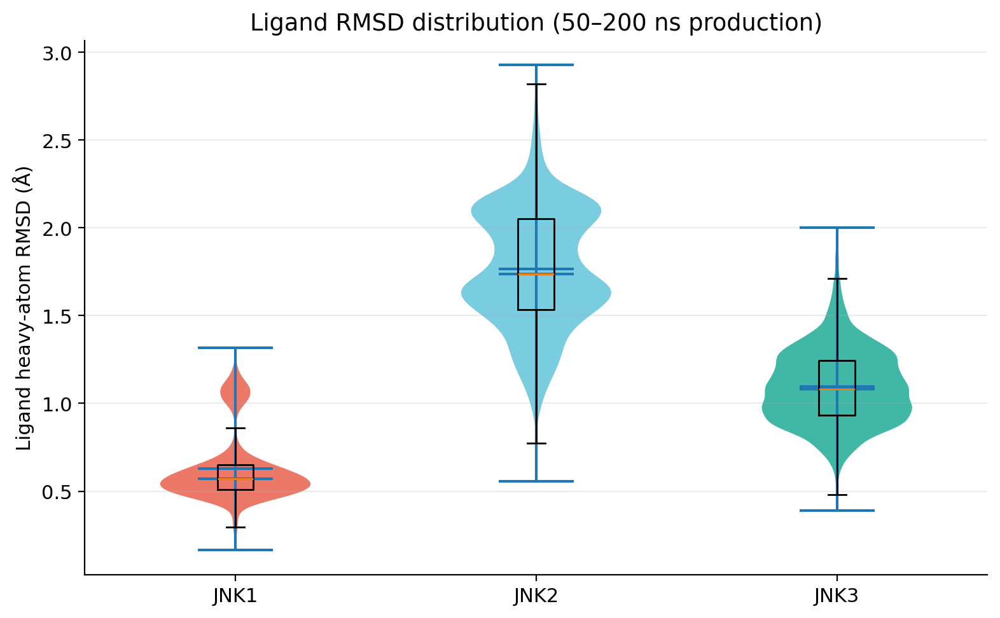
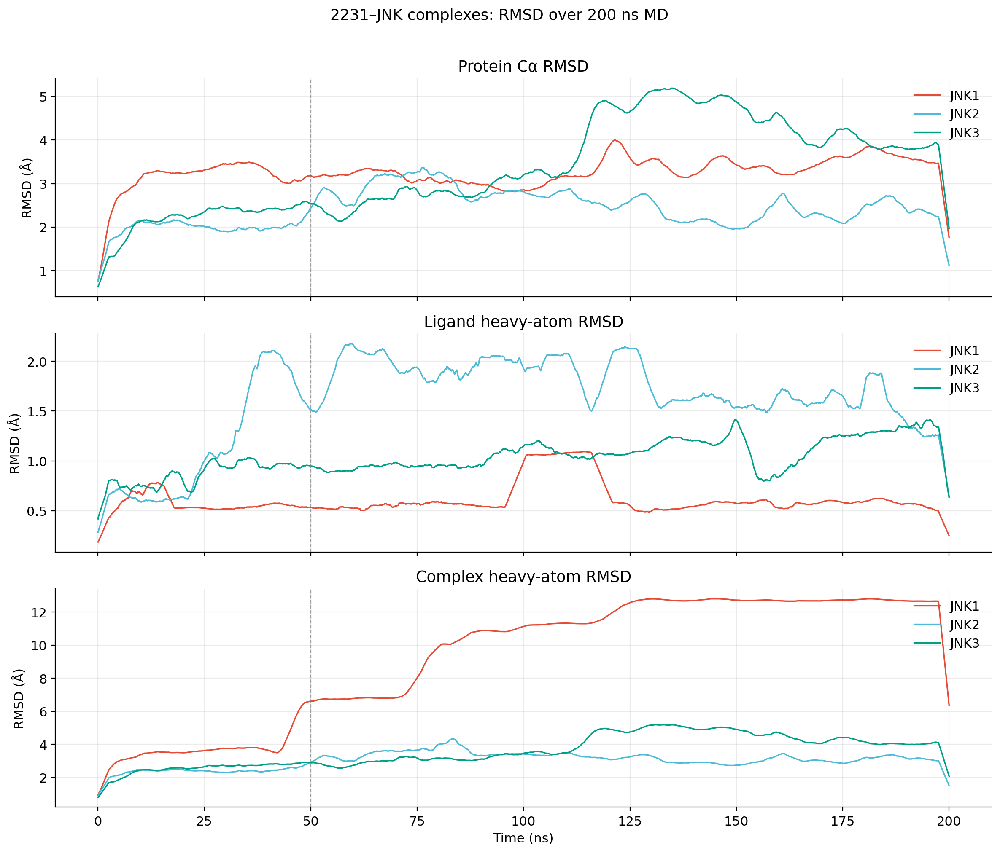
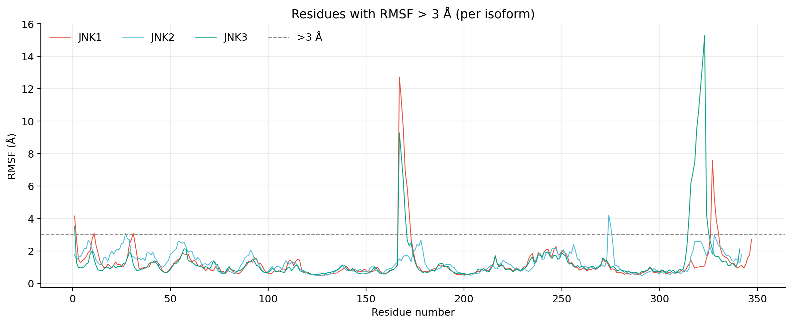
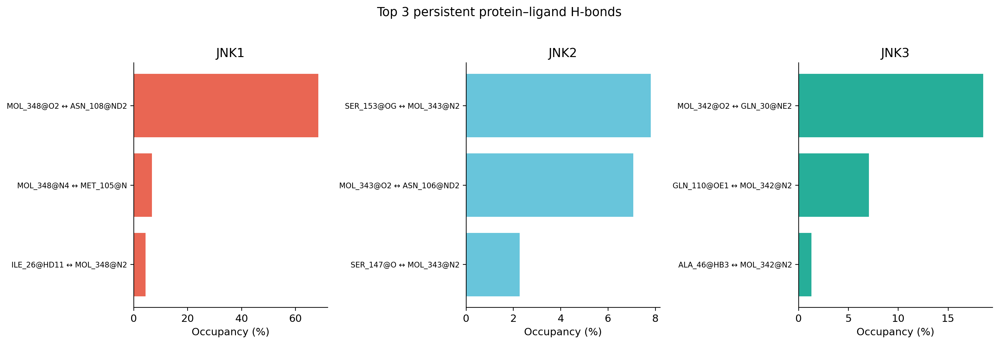
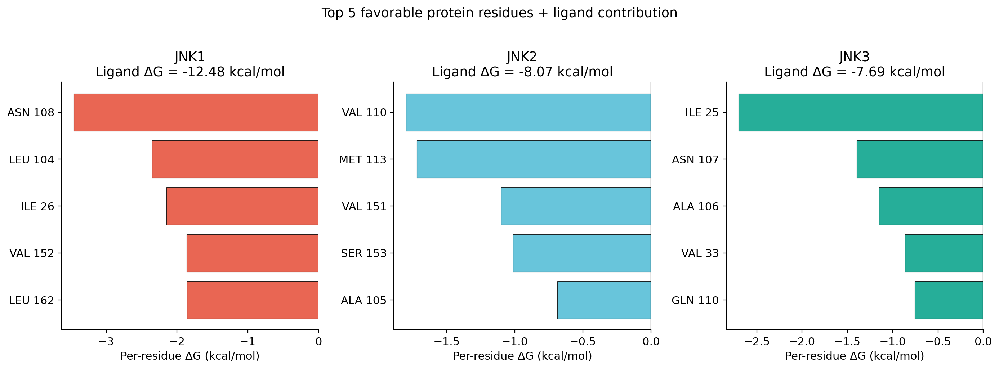
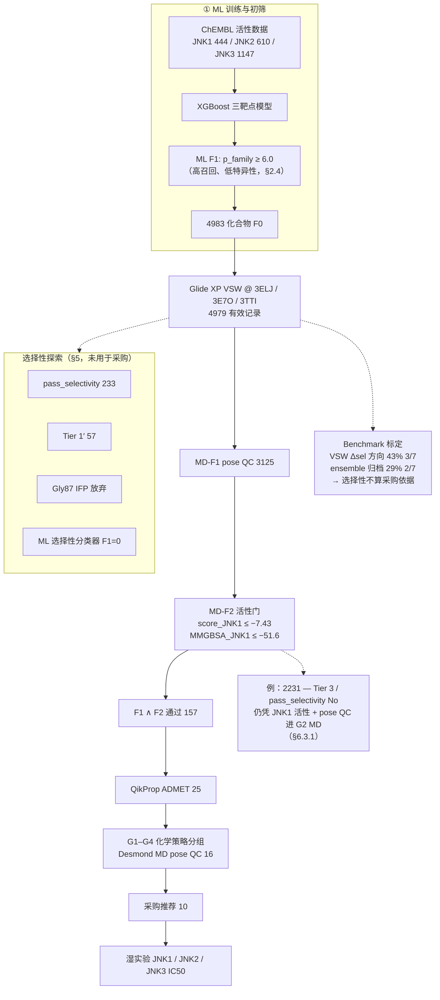

# JNK1/2/3 亚型抑制剂计算筛选项目报告

> **版本**: 2.9  
> **日期**: 2026-07-06  
> **原则**: 本报告所有数值均来自仓库内可复现文件、对接工作区归档 CSV 或 MD QC 结果；未在数据中出现的结论一律不作断言。  
> **v2.9 更新**: 新增 §1.3「JNK 亚型选择性抑制剂文献背景调研」；扩充 §11 参考文献（含 DOI / PDB 链接）。  
> **v2.8 更新**: 摘要与正文统一为**单一主线筛选漏斗**（ML → Glide → 157 → 25 → 16 → 10）；选择性探索（Δsel、pass_selectivity、Tier、Gly87 等）**保留于 §5**，与采购决策链分离；附录 A 重写为单线流程图。

---

## 摘要

本项目以 **JNK（c-Jun N-terminal kinase）三个亚型 JNK1、JNK2、JNK3** 为对象，构建 **ML 活性粗筛 → Glide XP 5000 化合物 VSW → MM-GBSA/ADMET 短名单 → Desmond MD pose QC** 四级计算漏斗，最终推荐 **10 个分子** 进入同批次 JNK1/2/3 酶学 IC50 湿实验。

**端到端漏斗（有数据支撑的各阶段）**：

| 阶段 | 数量 | 数据来源 |
|------|------|----------|
| ML 初筛后对接库（F0） | **4983** | `md_shortlist_report_23c8.md` |
| Glide XP VSW 有效记录 | **4979** | `JNK1_SELECTIVITY_FINAL_REPORT_41d9.md` |
| MD 短名单（F1∧F2，ADMET 前） | **157** | `md_shortlist_report_23c8.md`；pose QC + JNK1 活性门槛（§6.1） |
| MD shortlist（ADMET 后） | **25** | 同上 |
| MD pose QC 输入 | **16** | `MD_QC_report_cf26.md` |
| 最终采购推荐 | **10** | `data/purchase/purchase_after_md.csv` |

**核心结论**：

1. **受体准备可信**：5/5 共晶再对接 RMSD < 2 Å（`redocking_summary_7725.csv`）。
2. **Glide XP 对接选择性方向不可靠**：Spearman(Δsel_dock, −ΔpIC50_sel) = **0.750**（n=7）；Spearman(Δsel_MMGBSA, −ΔpIC50_sel) = **0.786**（n=7）——秩相关尚可，但 **VSW 单 PDB 方向准确率仅 43%**（3/7），归档 ensemble 口径 **29%**（2/7），均 << 55% 阈值（§3.3、§4）。
3. **ML 同样不能预测亚型方向**（E1、TCS JNK 6O 预测错误）；ChEMBL **JNK1-selective 标注仅 8 个**，选择性分类器测试 F1 = **0**。
4. **Gly87（KLIFS b.l.37）占据策略回顾性失败**：5/5 benchmark `occ_JNK1=True`，但配体距 Gly87 **0.59–1.18 Å**，无选择性判别力（`gly87_selfcheck_16be.csv`）。
5. MD QC：**G1 3/4、G2 0/6** 通过 `pass_md_overall`；**没有任何分子的 JNK1 选择性可被计算确认**。
6. 采购 10 个分子的理由：**G3 实验校准 + G1/G2 chemotype 假说检验 + MD pose 可信度分层**，而非“已算出选择性 hit”。
7. **2231 延伸 MD（v2.6）**：200 ns Amber 单轨迹（三 isoform）显示 **JNK1 配体 RMSD 中位数最低（0.57 Å）**，与 Desmond 短 MD 中 JNK1 最低档（0.48 Å）**方向一致**；仍**不能**据此改写 G2 overall MD fail 或确认选择性——见 §6.5。

---

## 1. 项目背景与目标

### 1.1 生物学与成药背景

| 亚型 | 基因 | ChEMBL Target ID |
|------|------|------------------|
| JNK1 | MAPK8 | CHEMBL2276 |
| JNK2 | MAPK9 | CHEMBL4179 |
| JNK3 | MAPK10 | CHEMBL2637 |

JNK1 在 IPF、NASH 等疾病中有明确证据；**CC-90001** 为 JNK1 功能偏向临床候选（Bennett et al., *J. Med. Chem.* 2021, PMID: 33404223）。**SP600125** 为经典 pan-JNK 工具药（Bennett et al., *PNAS* 2001, PMID: 11717429）。**E1** 为 Pan et al. 报道的 JNK1 强抑制剂（IC50 = 2.7 nM，*J. Med. Chem.* 2024, doi:10.1021/acs.jmedchem.4c01764）。

### 1.2 策略演进

| 阶段 | 目标 | 数据结论 |
|------|------|----------|
| 初期 | 计算筛选 JNK1 选择性 hit | ML + 对接 benchmark 均否定 |
| 中期 | Glide Δsel + MM-GBSA 选择性分级 | 233 个**遗留标签**（探索性双门槛）；benchmark 否定后**不作 MD/采购门** |
| 后期 | MD pose QC + 湿实验 | 以 **pan-JNK 家族结合剂** 为主假说，选择性靠酶学 |

### 1.3 JNK 亚型选择性抑制剂文献背景调研

本节汇总**同时具备**（1）三亚型酶学/生化选择性数据，与（2）小分子结合模式及蛋白残基层面结构解释（共晶、突变或经 SBDD/对接验证）的 JNK 抑制剂文献。目的在于为本项目 benchmark 选择、对接面板设计（§3）及 Gly87/Leu106 等策略讨论（§5）提供背景，**不**作为本项目已验证的计算结论。

#### 1.3.1 证据分级标准

| 等级 | 要求 | 代表 |
|------|------|------|
| **A** | 三亚型 IC50/Ki **+** 公开共晶 **+** 关键残基突变/SAR 验证 | 氨基吡唑 SR 系列、YL5084、CC-930、JNK-IN-8 |
| **B** | 三亚型 IC50 **+** SBDD/对接/MD，**无**该先导化合物公开共晶 | E1、CC-90001、TCS JNK 6O |
| **C** | 有共晶与结合解释，但 isoform 选择性弱或为 pan-JNK | SP600125 |

#### 1.3.2 共性机制：ATP 口袋内的 isoform 差异残基

JNK1/JNK2/JNK3 在 ATP 结合口袋序列同一性极高（~98%）。文献中可重复的 isoform 选择性来源，几乎都来自 **1–2 个非完全保守残基**的立体或诱导-fit 差异，而非铰链区本身：

| 位点（KLIFS/编号） | JNK1 | JNK2 | JNK3 | 典型作用 |
|-------------------|------|------|------|----------|
| 疏水口袋 I（HR-I） | **Ile106** | **Leu106** | **Leu144** | 芳环/疏水延伸：**Leu 容纳，Ile 位阻** → JNK2/3 偏好 |
| 铰链近邻 b.l.37 | **Gly87** | Ser87 | Met115 | 体积差异；本项目 Gly87 回顾测试显示**不能区分**已知 benchmark（§5.2） |
| Gatekeeper | Met108 | Met108 | Met146 | Met146 翻转开放疏水子袋（CC-930 等） |
| 后袋 / 共价 | — | Lys55 + **Cys116** | Cys154 | YL5084 后袋占据 + 共价锚定 |
| DFG 构象 | DFG-in（Type I 面板） | DFG-in / DFG-out（3NPC） | DFG-in | Type I 与 Type II **不可混用**（§3.1） |

#### 1.3.3 A 级：酶学选择性 + 共晶 + 残基解释

**（1）氨基吡唑系列 — JNK3 / JNK2 偏好于 JNK1**

| 项目 | 内容 |
|------|------|
| 代表化合物 | SR-12326、SR-11165、aminopyrazole 60 等 |
| 酶学选择性 | JNK3 对 JNK1 约 **20–30 倍**；JNK3 **L144I** 突变后 IC50 升 **>20 倍** |
| 共晶 PDB | [4W4V](https://www.rcsb.org/structure/4W4V) 等（JNK3:aminopyrazole 60） |
| 小分子特征 | 氨基吡唑铰链氢键 + **苯环伸入疏水口袋 I** |
| 蛋白解释 | **Leu144（JNK3）/ Leu106（JNK2）** vs **Ile106（JNK1）**：Ile 侧链更大，对位取代苯环产生立体冲突；Met146 诱导-fit 开放子口袋 |
| 参考文献 | Park et al., *Sci. Rep.* 2015 — [doi:10.1038/srep08047](https://doi.org/10.1038/srep08047)；Kamenecka et al., *J. Biol. Chem.* 2009 — [doi:10.1074/jbc.M809430200](https://doi.org/10.1074/jbc.M809430200) |

**（2）YL5084 / YL2056 — JNK2/JNK3 偏好于 JNK1（共价）**

| 项目 | 内容 |
|------|------|
| 代表化合物 | YL2056（前体）、**YL5084**（优化体，JNK-IN-8 系列衍生物） |
| 酶学/动力学 | 共价抑制剂；YL5084 对 JNK2 的 **kinact/KI** 显著高于 JNK1；细胞 pull-down 显示 JNK2 占据、JNK1 弱 |
| 共晶 PDB | [8ELC](https://www.rcsb.org/structure/8ELC)（JNK2:YL2056）；[7N8T](https://www.rcsb.org/structure/7N8T)（AMP 对照） |
| 小分子特征 | 铰链 **Met111** 氢键 + **后袋 Lys55** 氢键 + **Cys116 共价**；疏水臂占后袋 |
| 蛋白解释 | **Leu106 vs Ile106** 后袋立体匹配；Val54 主链在 JNK2 可平移 ~0.6 Å 容纳配体；Ile50/Arg50 影响 P-loop 柔性；Glide 对接 + Desmond MD 支持 JNK2/JNK3 优于 JNK1 |
| 构象归类 | **DFG-in + 后袋延伸**（非 3NPC/BIRB796 经典 DFG-out） |
| 参考文献 | Bennett et al., *J. Med. Chem.* 2022 — [doi:10.1021/acs.jmedchem.2c01834](https://doi.org/10.1021/acs.jmedchem.2c01834) |

**（3）CC-930（Tanzisertib）— JNK2/JNK3 偏好于 JNK1**

| 项目 | 内容 |
|------|------|
| 酶学（本项目 benchmark） | JNK1 **61** / JNK2 **7** / JNK3 **6** nM（`literature_benchmarks.csv`）→ JNK1/JNK2 ≈ **8.7×** |
| 共晶 PDB | [3TTI](https://www.rcsb.org/structure/3TTI)（JNK3:CC-930） |
| 小分子特征 | 氨基嘌呤/嘧啶铰链双齿氢键 + C8 芳胺/THF 环取代 |
| 蛋白解释 | **Gatekeeper Met146 诱导-fit** 开放疏水子口袋；THF 氧与 Asn152 有利静电（同系列 aminopyrimidine SAR） |
| 参考文献 | Plantevin-Krenitsky et al., *Bioorg. Med. Chem. Lett.* 2012 — [doi:10.1016/j.bmcl.2011.12.111](https://doi.org/10.1016/j.bmcl.2011.12.111) |

**（4）JNK-IN-8 — JNK3 最强（共价 pan-JNK 优化前体）**

| 项目 | 内容 |
|------|------|
| 酶学（本项目 benchmark） | JNK1 **4.7** / JNK2 **18.7** / JNK3 **1.0** nM |
| 共晶 PDB | [3V6R](https://www.rcsb.org/structure/3V6R)（JNK3，JNK-IN-8 类似物） |
| 小分子特征 | 苯胺基嘧啶铰链氢键 + **丙烯酰胺 warhead** |
| 蛋白解释 | **Cys154（JNK3）/ Cys116（JNK2）** 共价修饰；Type I 模式下 warhead 朝向 DFG 前保守 Cys |
| 参考文献 | Zhang et al., *Cell Chem. Biol.* 2012 — [doi:10.1016/j.chembiol.2012.04.013](https://doi.org/10.1016/j.chembiol.2012.04.013) |

**（5）其他 A 级文献（未纳入本项目 9-compound benchmark）**

| 系列 | 选择性方向 | 关键 PDB | 核心机制 | 参考文献 |
|------|-----------|----------|----------|----------|
| 三唑酮 compound 42 | JNK3 > JNK1/JNK2 ~10× | [3OY1](https://www.rcsb.org/structure/3OY1) | 萘环深入疏水区 + Met146 S–π | Elan 系列；见 Duong et al. 2020 综述 [5] |
| 6-苯胺基吲唑 compound 49 | JNK3 >> JNK1 | 共晶系列 | Met146 开放容纳苯胺 | 同上 [5] |
| 二氢异喹啉 | JNK3 选择性 | [2WAJ](https://www.rcsb.org/structure/2WAJ) | 3-Cl 苯基占选择性口袋；**Leu144** 接触 | Christopher et al., *Bioorg. Med. Chem. Lett.* 2009 — [doi:10.1016/j.bmcl.2009.02.098](https://doi.org/10.1016/j.bmcl.2009.02.098) |
| BIRB796 @ JNK2 | 对 p38 选择性；JNK isoform 间**非**工具性选择性 | [3NPC](https://www.rcsb.org/structure/3NPC) | **DFG-out Type II** | Kuglstatter et al., *Bioorg. Med. Chem. Lett.* 2010 — [doi:10.1016/j.bmcl.2010.06.157](https://doi.org/10.1016/j.bmcl.2010.06.157) |

#### 1.3.4 B 级：有酶学选择性，结构解释以 SBDD/MD 为主

**（6）E1 — JNK1 酶学偏好（Pan 2024）**

| 项目 | 内容 |
|------|------|
| 酶学（benchmark） | JNK1 **2.7** / JNK2 **19.0** / JNK3 **9.0** nM → JNK2/JNK1 **7.0×** |
| 结构解释 | 嘧啶-2,4-二胺骨架；**SBDD + SAR**（二甲胺侧链增强 c-Jun 磷酸化抑制）；MD 结合自由能 −50.46 kcal/mol |
| 局限 | **无公开 E1 共晶 PDB**；未给出 L144I 类突变验证 |
| 参考文献 | Pan et al., *J. Med. Chem.* 2024 — [doi:10.1021/acs.jmedchem.4c01764](https://doi.org/10.1021/acs.jmedchem.4c01764) |
| 同系列 | **Q63**（JNK1/JNK3 > JNK2；benchmark IC50 33.5/112.9/33.2 nM） |

**（7）CC-90001 — 酶学近 pan，细胞功能 JNK1 偏向**

| 项目 | 内容 |
|------|------|
| 酶学（benchmark） | JNK1 **11** / JNK2 **31** nM → JNK2/JNK1 **2.8×**（弱） |
| 功能选择性 | 细胞 c-Jun 磷酸化、IPF 模型中 JNK1 功能偏向强于 CC-930 |
| 结构解释 | 基于 CC-930/3TTI 结合模式的 2,4-二烷胺嘧啶 SAR；**无公开 CC-90001 共晶**（`REFERENCES.md`） |
| 参考文献 | Bennett et al., *J. Med. Chem.* 2021 — [doi:10.1021/acs.jmedchem.0c01843](https://doi.org/10.1021/acs.jmedchem.0c01843) |

**（8）TCS JNK 6O — JNK1 酶学偏好，isoform 结构解释较弱**

| 项目 | 内容 |
|------|------|
| 酶学（benchmark） | JNK1 **45** / JNK2 **160** nM → JNK2/JNK1 **3.6×** |
| 结构解释 | 氨基吡啶 ATP 竞争抑制剂；原始文献以全家族 JNK 活性与 cross-kinase 选择性为主，**缺乏** isoform 共晶或 HR-I 残基级解释 |
| 参考文献 | Szczepankiewicz et al., *J. Med. Chem.* 2006 — [doi:10.1021/jm060150w](https://doi.org/10.1021/jm060150w) |

#### 1.3.5 C 级与对照：有结构、弱 isoform 选择性

| 化合物 | 酶学 profile（benchmark） | 结构 PDB | 说明 |
|--------|--------------------------|----------|------|
| **SP600125** | pan（40/40/90 nM） | [1UKI](https://www.rcsb.org/structure/1UKI)（JNK1）、[1PMV](https://www.rcsb.org/structure/1PMV)（JNK3） | 疏水口袋范德华接触解释**泛 JNK 活性**；本项目 G3 阴性/校准对照 |
| **AS602801** | 近 pan（JNK3 略弱 ~2.9×） | — | 不构成强 isoform 案例 |
| **CC-401** | 仅 total JNK Ki | — | 无三亚型拆分 |

#### 1.3.6 与本项目的关系

| 化合物 | 选择性方向 | 证据等级 | 对本项目 Δsel / VSW 的启示 |
|--------|-----------|----------|---------------------------|
| CC-930 | JNK2/3 偏好 | A | 对接 Δsel 方向正确；MD hinge 与酶学同向 |
| E1 | JNK1 偏好 | B | 对接 Δsel 方向正确；MD hinge **反向**（§6.3） |
| JNK-IN-8 | JNK3 偏好 | A（共价） | 不符合简单可逆 Δsel 逻辑 |
| YL5084 | JNK2/3 偏好 | A | **未入 benchmark**；后袋+共价，与 DFG-in 可逆面板不匹配 |
| TCS JNK 6O | JNK1 偏好 | B− | ML 与 Δsel 均方向错误（§2.6、§4） |
| CC-90001 | 酶学近 pan | B | 细胞 JNK1 偏向 ≠ 酶学 isoform 差 |
| SP600125 | pan | C | 选择性阴性对照 |

**小结**：文献中证据最完整的 isoform 选择性机制是 **Leu144/Ile106 疏水口袋 I**（JNK3/2 偏好）与 **后袋 + Leu106 + 共价 Cys**（YL5084）。**JNK1 偏好**化合物（E1、CC-90001）有酶学或功能数据，但缺乏与氨基吡唑或 YL5084 同等级的「共晶 + 突变」证据链——这与本项目常规 Type I Glide 对接难以复现文献选择性机制相一致（§4、§12）。

---

## 2. 训练数据与 ML 模型

### 2.1 数据清洗与模型性能

| 亚型 | 化合物数 | Holdout R² | Holdout Spearman ρ | Holdout n |
|------|----------|------------|-------------------|-----------|
| JNK1 | 444 | **0.697** | **0.858** | **31** |
| JNK2 | 610 | **0.574** | **0.780** | 67 |
| JNK3 | 1147 | **0.774** | **0.869** | 98 |

数据来源：`results/model_comparison/comparison.json`（XGBoost，Murcko 骨架划分 train/val/test）。

**关于 JNK1 R² = 0.697 是否正确？——是的。**

- 精确值：**0.6969**（`comparison.json` → `holdout.JNK1.r2`），报告四舍五入为 0.697。
- 这是 **独立 holdout 测试集**（31 分子）上的 R²，**不是** 5-fold 交叉验证均值。
- 同文件 JNK1 **5-fold scaffold CV 均值 R² = 0.662**（σ = 0.086）；若以 CV 汇报应写 0.66，而非 0.70。
- 划分方式：Murcko 骨架 split，避免相似分子同时出现在训练/测试集（`data/processed/splits/jnk1/`）。

> **常见误解**：把 CV 均值（0.662）与 holdout R²（0.697）混用。本报告统一采用 **holdout** 指标，与 `MODEL_COMPARISON_REPORT.md` 一致。

### 2.2 选择性标签稀缺性

- 配对分子（≥2 亚型）：**322** 个
- JNK1-selective 标注：**8** 个（`sel_class_counts.csv`）
- 选择性分类器：训练正例 8，测试正例 0，**F1 = 0**（`training_report.json`）

### 2.3 ML 虚拟筛选（F1）

9 个文献 benchmark 在 **p_family ≥ 6.0** 时 **9/9 全部通过**（`threshold_recommendation.json`）。该步骤定位为 **「活性召回校准」**，而非特异性验证（见 §2.4）。

Demo 库（1835 分子）漏斗：`screening_v2/screening_report.json`

| 阶段 | 数量 |
|------|------|
| Lipinski 通过 | 1541 |
| F1 通过 | 1292 |
| SA/QED 通过 | 1211 |

**ML 用途**：去除无 JNK 家族活性潜力的分子；**不用于 isoform 方向判断**。

### 2.4 外部 decoy 验证（回应 §12 Q1）

为回应「F1 仅校准阳性、无阴性对照」的质疑，补充 **10,000 Taosu 外部 decoy** 验证（`results/ml_external_validation/`）。设计要点：

| 组分 | 来源 | n | 标签 |
|------|------|---|------|
| Decoys | Taosu 随机抽样 | 10,000 | 假定无活性 (0) |
| Benchmarks | `literature_benchmarks.csv` | 9 | 已知活性 (1) |
| ChEMBL actives | pActivity ≥ 6.0 | 1,210 | 已知活性 (1) |

**排除**：已对接 top-5000、ChEMBL demo/训练库 1835 条（避免与 demo 84% 循环验证混用）。**未使用** demo 库作特异性评估。

#### 阈值 `p_family ≥ 6.0` 的完整混淆矩阵

|  | 预测活性 | 预测无活性 |
|--|---------|-----------|
| **真活性** (n=1,219) | TP=**1,211** | FN=8 |
| **真 decoy** (n=10,000) | FP=**9,528** | TN=472 |

| 指标 | 数值 | 解读 |
|------|------|------|
| Sensitivity (recall) | **99.3%** | 与 9/9 benchmark 一致 |
| Specificity | **4.7%** | decoy 中仅 4.7% 被正确拒绝 |
| **Decoy FPR** | **95.3%** | 9,528/10,000 decoy 通过 F1 |
| Precision | **11.3%** | 通过 F1 者中约 1/9 为真活性 |
| ROC-AUC (`p_family`) | **0.876** | 排序区分力尚可 |
| EF1% | **9.20** | Top 1% 富集约 9 倍 |

数据来源：`ml_external_validation_metrics_9bd8.json`、`all_predictions_0350.csv`。

**结论**：F1@6.0 是 **高召回、极低特异性** 的粗筛门槛；去假阳性靠 **排序（EF1%）+ SA/QED + 对接**，不靠 F1 硬阈值。

### 2.5 `p_family` 分布：为何 FPR 95% 而 Top-5000 最低仅 6.28？

百万 Taosu 库筛选后，**Top-5000 分子中 `p_family` 最低约 6.28**（按 `final_score` 排序后观察）。这与 decoy FPR 95.3% **并不矛盾**，原因如下。

#### （1）多数分子不在 6.0–6.2，而在 6.2–6.6

对 10,000 Taosu decoy 的 `p_family` 分布（商业可合成库的良好代理）：

| 分位数 / 区间 | `p_family` | 占比 |
|---------------|------------|------|
| P5 | 6.01 | — |
| P25 | 6.26 | — |
| **中位数** | **6.39** | — |
| P75 | 6.55 | — |
| P95 | 6.99 | — |
| [6.0, 6.2) | — | **13.0%** |
| **[6.2, 6.6)** | — | **62.0%**（主峰） |
| [6.6, 7.0) | — | 15.4% |
| ≥ 7.0 | — | 4.9% |

→ 模型对类药分子的 `p_family` 预测 **压缩在约 5.5–7.5**，**主体在 6.2–6.6**，而非挤在 6.0–6.2。6.0 阈值落在分布 **左尾**，故约 95% decoy 能通过 F1。

#### （2）F1 是宽松门槛；Top-5000 靠综合分排序

百万库漏斗（`06_virtual_screening.py`）：

```
~1M → Lipinski → F1 (p_family≥6.0, ~95% 通过) → SA/QED → final_score 排序 → Top 5000
```

`final_score` 公式：

```
final_score = 0.55×(p_family/10) + 0.15×(pred_JNK1/10) + 0.20×QED + 0.10×(10−SA)/10
```

Top-5000 按 **综合分** 选取，**不是**按 `p_family` 单独排序。因此：

- `p_family` 仅 6.28（约 decoy 的 P25）的分子，若 **QED 高、SA 低、pred_JNK1 偏高**，仍可进入 Top-5000；
- 若只按 `p_family` 取 Top-5000（从约 95 万 F1 通过者中），decoy 分布估算阈值约 **≥ 7.3**——远高于 6.28。

#### （3）两阶段角色分工

| 阶段 | 作用 | 典型表现 |
|------|------|----------|
| **F1 (≥6.0)** | 保证文献对照与已知活性 **不被漏掉** | ~95% 随机 decoy 通过 |
| **final_score Top-N** | 在通过者中 **排序富集** | EF1%=9.2；Top-5000 min p_family≈6.28 |
| **Glide 对接** | 结构层面缩库 | 4979 → 157 → 25 → 16（选择性探索见 §5.4） |

Enamine ~5000 → ML F1 后 **4983**（99.4% 通过）亦符合此逻辑：输入已是 Top-N 子集，F1 几乎不再缩库。

### 2.6 ML vs 对接：benchmark 方向对比

| 化合物 | 实验 profile | ML 预测最高亚型 | 对接 Δsel 预测方向 | 实验方向（IC50） |
|--------|--------------|-----------------|-------------------|------------------|
| E1 | JNK1 偏好 | **JNK2**（7.56） | **JNK1**（Δsel +3.05） | JNK1 |
| TCS JNK 6O | JNK1 偏好 | **JNK3**（6.97） | **JNK23**（Δsel −1.18） | JNK1 |
| CC-930 | JNK2/3 偏好 | JNK2（7.47） | JNK23（Δsel −4.90） | JNK23 |
| SP600125 | pan-JNK | JNK1（6.13） | JNK23（Δsel −2.57） | pan |

→ ML 与对接在关键对照上**均不能一致预测 isoform 方向**；对接对 E1 方向正确、ML 错误；对 TCS JNK 6O 两者均错误。

---

## 3. Glide XP 结构对接与 5000 化合物 VSW

### 3.1 VSW 受体结构（单 PDB / isoform）

**实际执行的 5000 库 VSW 与 MD 均只对每个 isoform 使用一个受体**，不存在跨 PDB 取均值：

| Isoform | VSW / MD 用 PDB | 共晶配体 | 再对接 RMSD (Å) | 用途 |
|---------|-----------------|----------|-----------------|------|
| JNK1 | **3ELJ** | GS7 | 0.66 | VSW 打分、MD、MM-GBSA |
| JNK2 | **3E7O** | 35F | 0.26 | 同上 |
| JNK3 | **3TTI** | CC-930 (KBI) | 1.50 | 同上 |

**备用结构仅用于受体准备质量验证**（再对接），**未参与** 4979 化合物 VSW 打分：

| PDB | Isoform | 再对接 RMSD (Å) | 说明 |
|-----|---------|-----------------|------|
| 4L7F | JNK1 | 0.92 | KLIFS Q=9.8；benchmark MM-GBSA 补算用 |
| 4WHZ | JNK3 | 1.88 | 备用 JNK3 共晶 |

> `config/docking_ensemble.yaml` 中 `mean(3ELJ, 4L7F)` 等为**早期 ensemble 设计草案**；本批次 VSW **未实现**双 PDB 均值聚合。归档 CSV 里 `score_JNK1` 若出现 ensemble 均值，属于验证脚本口径，与 VSW 主结果（单 PDB）不同（见 §12 Q8）。

对接得分：**Glide XP `r_i_glide_gscore`**（XP 终分，非 SP 中间分）。

### 3.2 共晶再对接验证

**5/5 通过**（RMSD 阈值 2.0 Å，`results/docking_validation/redocking_summary_7725.csv`）：

| PDB | 靶标 | 配体 | Glide XP 得分 | RMSD (Å) |
|-----|------|------|---------------|----------|
| 3ELJ | JNK1 | GS7 | −12.79 | **0.66** |
| 4L7F | JNK1 | AX13587 | −12.21 | **0.92** |
| 3E7O | JNK2 | 35F | −11.27 | **0.26** |
| 3TTI | JNK3 | CC-930 | −12.86 | **1.50** |
| 4WHZ | JNK3 | 3NL | −10.09 | **1.88** |

**RMSD 如何得到？**

1. 用 Protein Preparation Wizard 处理共晶 PDB，以共晶配体定义 Glide 网格（`grid_reference_ligand: true`）。
2. 将**同一共晶配体**以 Glide **XP** 模式重新对接进该网格。
3. RMSD = 重对接 pose 与共晶配体 **重原子** 均方根偏差（Å），由 Schrödinger Pose Review / redocking validation 输出至 `rmsd_A`。
4. 通过标准：`rmsd_A < 2.0 Å`（`co_crystal_redock_rmsd_angstrom: 2.0`）。

**结论**：5/5 受体网格可复现共晶 pose，**支持从五个候选 PDB 中为每个 isoform 选定一个主结构做 VSW**；**不能**外推为选择性预测有效（§12 Q12）。

#### 为何从 5 个 PDB 中选 3 个做 VSW（单 PDB / isoform）

| 原则 | 说明 |
|------|------|
| **每 isoform 一个主结构即可** | 虚拟筛选只需对每个亚型得到一个 Glide 分，再算 Δsel；**不要求**同一亚型跑两套受体 |
| **5/5 再对接验证** | 3ELJ、4L7F、3E7O、3TTI、4WHZ 均 RMSD < 2 Å → 受体准备可信 |
| **主结构选取** | JNK1→3ELJ（primary，RMSD 0.66）；JNK2→3E7O（sole，RMSD 0.26）；JNK3→3TTI（primary，RMSD 1.50） |
| **备用结构角色** | 4L7F（JNK1，KLIFS Q=9.8）、4WHZ（JNK3）仅用于**质量验证**与 benchmark MM-GBSA 补算，**未对 4979 化合物重跑 VSW** |
| **与 ensemble 草案关系** | `docking_ensemble.yaml` 中 `mean(3ELJ,4L7F)` 等为早期双 PDB 设计；`pass_consistency`（两结构间 Δsel 方向是否一致）随 ensemble **一并放弃**，非单 PDB 筛选的必要条件（§12 Q3） |

### 3.3 选择性指标定义与合理性

#### 指标公式（VSW 主口径：单 PDB）

```
score_JNK1 = Glide_XP_gscore @ 3ELJ
score_JNK2 = Glide_XP_gscore @ 3E7O
score_JNK3 = Glide_XP_gscore @ 3TTI

Δsel_dock = min(score_JNK2, score_JNK3) − score_JNK1
Δsel_MMGBSA = min(MMGBSA_JNK2, MMGBSA_JNK3) − MMGBSA_JNK1
```

- Glide / MM-GBSA：**越负 = 结合越强**；**Δsel > 0** → 计算 JNK1 偏好。

#### 为何这样定义？

| 设计选择 | 理由 | 局限 |
|----------|------|------|
| 用 **min(JNK2, JNK3)** | 选择性 = 相对最弱 off-target 的优势 | 忽略 JNK2/JNK3 差异大的情况 |
| docking 与 MM-GBSA 同公式 | 便于 `pass_selectivity` 双门槛对齐 | 两方法系统误差不同 |
| 以 JNK1 为参照 | 项目目标为 JNK1 选择性 | JNK2/3 偏好需反向解读 |

#### 门槛与 benchmark 标定（含 MM-GBSA）

**重要区分**——MM-GBSA 在本项目中有 **两种用途**，不可混用：

| 用途 | 指标 | 门槛 | 用于 MD 短名单？ | 标定结论 |
|------|------|------|------------------|----------|
| **JNK1 活性**（单点） | MMGBSA_JNK1 @ 3ELJ | ≤ **−51.6** | **是**（§6.1 F2） | 家族结合剂粗筛，与选择性无关 |
| **isoform 选择性**（差值） | Δsel_MMGBSA | ≥ **2.0**（遗留） | **否** | **标定后废弃**（见下） |

| 遗留标签 `pass_selectivity` 分量 | 门槛 | 标定结论 |
|----------------------------------|------|----------|
| Δsel_dock | > 0 | VSW 方向准确率 **43%**（3/7）；ensemble 归档 **29%**（2/7）→ 不作硬筛 |
| Δsel_MMGBSA | ≥ **2.0** | \|Δsel\| 噪声中位数 **8.1**；方向准确率 **43%** → **门槛无判别力，已废弃** |

**9 个 benchmark 已完成 Prime MM-GBSA**（`results/docking_validation/benchmark_mmgbsa_calibration.csv`）：

| 标定量 | 数值 |
|--------|------|
| \|Δsel_mmgbsa\| 中位数（非共价, VSW PDB） | **8.13** kcal/mol |
| 建议保守 Δsel_MMGBSA 门槛 | **≥ 22.2** kcal/mol（相对现 2.0 过宽） |
| Spearman(Δsel_mmgbsa_vsw, −ΔpIC50_sel) | **0.786** (n=7) |
| MM-GBSA 方向准确率 | **43%** (3/7)，仍 << 55% |

完整标定报告：`results/docking_validation/benchmark_mmgbsa_calibration.md`。

### 3.4 5000 化合物 VSW 对接与主线筛选入口

#### 端到端主线（采购决策链）

```
Enamine ~5000 → ML F1 (p_family≥6.0) → 4983
  → Glide XP VSW @ 3ELJ/3E7O/3TTI → 4979
  → MD 短名单漏斗（§6.1：pose QC + JNK1 活性 + ADMET）→ 157 → 25 → 16 MD → 10 采购
```

数据来源：`JNK1_SELECTIVITY_FINAL_REPORT_41d9.md`，`md_shortlist_report_23c8.md`

| 阶段 | 数量 | 条件摘要 |
|------|------|----------|
| ML F1 后 | **4983** | p_family ≥ 6.0 |
| VSW 有效 | **4979** | 三 isoform 均有 XP 分 |
| pass_pose | 3234 | Glide pose 质量门（与 MD-F1 部分重叠） |
| pass_potency | 1681 | score_JNK1 @ 3ELJ ≤ **−7.43** |

**门槛设置原因**：ML F1 保活性召回；−7.43 对齐 3ELJ benchmark 中位数。4979 个对接结果进入 §6.1 的 pose QC + JNK1 活性双门槛，**不使用** Δsel、`pass_selectivity` 或 Tier 分级。

> **选择性探索**：项目曾尝试用 Δsel、pass_selectivity、Tier 等对接后标签判断 isoform 方向，benchmark 标定后**全部否定决策价值**（§4、§5）。这些统计**保留于 §5.4**，供回顾分析，**不参与** MD 短名单或采购排序。

---

## 4. 文献 Benchmark 对接选择性验证

### 4.1 定量结果（9 化合物，`benchmark_deltas_51c1.csv`）

| 指标 | 数值 | 阈值 | 达标 |
|------|------|------|------|
| Spearman(Δsel_dock_vsw, −ΔpIC50_sel) | **0.750** (n=7) | \|ρ\| ≥ 0.35 | ✓ |
| Spearman(Δsel_mmgbsa_vsw, −ΔpIC50_sel) | **0.786** (n=7) | \|ρ\| ≥ 0.35 | ✓ |
| 方向准确率（docking, VSW PDB） | **43%** (3/7) | ≥ 55% | ✗ |
| 方向准确率（MM-GBSA, VSW PDB） | **43%** (3/7) | ≥ 55% | ✗ |
| 方向准确率（docking, 归档 ensemble 口径） | **29%** (2/7) | ≥ 55% | ✗ |

**Spearman 与方向准确率的“分裂”**：连续秩相关尚可，但离散 isoform 方向预测失败 → **Δsel 不宜作 isoform 分型决策**；MM-GBSA 标定**未改善**方向准确率（仍为 43%）。

### 4.2 四个关键对照（`direction_confusion_27c3.csv`）

| 化合物 | 实验 profile | Δsel_dock | ΔpIC50_sel | 实验方向 | 预测方向 | 匹配 |
|--------|--------------|-----------|------------|----------|----------|------|
| **E1** | JNK1 偏好 | **+3.05** | −0.85 | JNK1 | JNK1 | **✓** |
| **CC-930** | JNK2/3 偏好 | **−4.90** | +0.94 | JNK23 | JNK23 | **✓** |
| TCS JNK 6O | JNK1 偏好 | −1.18 | −0.55 | JNK1 | JNK23 | ✗ |
| SP600125 | pan-JNK | −2.57 | −0.35 | pan | JNK23 | ✗ |

### 4.3 各 isoform 活性排序（对接分 vs pIC50）

| Isoform | Spearman ρ | n |
|---------|------------|---|
| JNK1 | **−0.429** | 8 |
| JNK2 | +0.190 | 8 |
| JNK3 | +0.371 | 6 |

JNK1 排序呈**负相关**，说明跨 PDB 绝对得分比较存在**系统偏差**（`isoform_rank_correlations_299a.csv`）。

### 4.4 验证结论

**对接选择性方向不能可靠用于 isoform 分型。** 建议将 VSW 命中视为 **JNK 家族活性/构象假设**，选择性须由 **同批次 JNK1/2/3 IC50** 确认。

---

## 5. 选择性策略尝试与失败记录

### 5.1 尝试一览

| # | 策略 | 结果 | 数据依据 |
|---|------|------|----------|
| 1 | ML 三模型 ΔpActivity 选择性过滤 | **失败** | E1/TCS JNK 6O 方向错误 |
| 2 | 选择性二分类模型 | **失败** | 正例 n=8，F1=0 |
| 3 | Glide Δsel_dock 排序 | **不可靠** | VSW 方向准确率 43%；ensemble 29% |
| 4 | Δsel_dock + MM-GBSA ≥ 2 kcal/mol | **门槛过宽** | Benchmark MM-GBSA 标定：\|Δsel\| 中位数 8.1，方向准确率 43%（§3.3） |
| 5 | KLIFS 非保守位点 / Gly87 IFP | **放弃** | 见 §5.2 |
| 6 | MD pose QC（RMSD + hinge HB） | **部分可用** | 验证 pose，非选择性 |
| 7 | Tier 1′ + FEP+ 推荐 | **待做** | 15 个 Tier 1′ 候选含 690 |

### 5.2 Gly87（b.l.37）占据策略 — 原理、测试与失败

#### 策略原理

JNK ATP 口袋铰链近邻存在**非完全保守**残基（KLIFS **b.l.37**）：

| Isoform | b.l.37 | 侧链 |
|---------|--------|------|
| JNK1 | **Gly87** | 最小（H） |
| JNK2 | **Ser87** | −OH |
| JNK3 | **Met115** | 疏水 |

**假说**：配体占据 JNK1 特有的小体积 Gly87 邻域，可对 JNK2/3 产生位阻差异 → JNK1 选择性（机制类比文献中 JNK2/3 选择性化合物的 Leu106/Ile106 差异，§1.3；Bennett et al., *J. Med. Chem.* 2022 [8]）。

**可计算代理**（`gly87_selfcheck_16be.csv`）：`d_Gly87`（配体中心–Gly87 Cα 距离）、`occ_JNK1`（近邻占据）、`predicts_JNK1_selectivity`（启发式组合）。

#### 为什么要测试？

在将 Gly87 作为 MD 硬筛前，用**已知选择性谱的 benchmark** 做回顾性 gate：JNK1 偏好应对应 True，JNK2/3/pan 应对应 False（背景见 §1.3）。

#### 测试结果

| 配体 | d_Gly87 (Å) | occ_JNK1 | 预测 JNK1 选择性 | 实验 profile | 匹配 |
|------|-------------|----------|------------------|--------------|------|
| E1 | 0.744 | True | False | JNK1 偏好（7.0×） | False |
| TCS JNK 6O | 0.899 | True | False | JNK1 偏好（3.6×） | False |
| CC-930 | 1.180 | True | False | JNK2/3 偏好 | True* |
| SP600125 | 1.009 | True | False | pan | True* |
| CC-90001 | 0.590 | True | False | 近 pan（2.8×） | True* |

\* 反向/近 pan 标签匹配，**非** JNK1 选择性验证。

**失败原因**：所有 benchmark 距 Gly87 仅 **0.59–1.18 Å**（Type I 抑制剂必然靠近铰链）；E1/TCS JNK 6O 与 CC-930 的 `occ_JNK1` 均为 True，**无判别力**。真正选择性更可能来自远 pocket 残基（如 JNK3 Leu144，Sci. Rep. 2015, srep08047）。→ MD shortlist **排除** Gly87 硬筛。

### 5.4 VSW 对接后选择性探索性分类（未用于采购决策）

项目在对接完成后曾尝试多种选择性标签，均经 benchmark 标定后**从决策链移除**。以下数字**保留作失败探索记录**，供回顾分析；**不参与** MD 短名单或采购排序（`md_shortlist_report_23c8.md`）。

数据来源：`JNK1_SELECTIVITY_FINAL_REPORT_41d9.md`，`candidates_ranked_befe.csv`

| 探索标签 | 数量 | 条件摘要 | 标定结论 |
|----------|------|----------|----------|
| **pass_selectivity** | **233** | Δsel_dock>0 **且** Δsel_MMGBSA≥2 | benchmark 否定方向判别力（§3.3、§4） |
| has_selectivity_contact | 63 | 铰链 H-bond 代理 + Δsel 启发式 | 非完整 IFP，未作硬筛 |
| pass_potency ∧ Δsel_dock > 0 | **679** | 泛 JNK + 计算 JNK1 偏好子集 | 「计算 JNK1 偏好」≠ 实验选择性 |
| 上述 + 三 isoform score 均 ≤ −6 | **431** | `panJNK_JNK1bias_ba7c.csv` | 同上 |

**Tier 分布**（文稿采用 **Tier 1′**，已去除未实现的 `pass_consistency`，§12 Q3）：

| Tier | 数量 | 条件（文稿口径） | 说明 |
|------|------|------------------|------|
| **Tier 1′** | **57** | pose + potency + pass_selectivity + contact | 探索分级；**非 MD 进门条件** |
| Tier 2 | 92 | pose + potency + pass_selectivity | 同上 |
| Tier 3 | 1191 | pose + potency | JNK1 Glide 活性过线；**含 2231 等未过 pass_selectivity 者** |
| Tier 0 | 3639 | 未达 Tier3 | — |

**遗留 Tier 1（流水线原始标签）**：在 Tier 1′ 基础上多一项 `pass_consistency`（占位，§12 Q3）；因占位恒为 True，计数仍为 57，但语义已去除 phantom gate。

**Top 选择性候选（pass_selectivity，Δsel 降序前 5）**：

| compound_id | Δsel_dock | score_JNK1 | Tier |
|-------------|-----------|------------|------|
| 4931 | 3.67 | −7.97 | 1′ |
| 2627 | 3.65 | −6.83 | 1′ |
| 1941 | 3.37 | −7.01 | 1′ |
| 2749 | 3.09 | −10.21 | 1′ |
| 2760 | 2.68 | −10.19 | 1′ |

`top_selective_f4a0.csv`：50 个 Butina 聚类代表（Tanimoto 0.5），其中 Tier 1′ = **15**。

---
### 5.5 方法局限（来自 `JNK1_SELECTIVITY_FINAL_REPORT_41d9.md`）

1. ATP 口袋高度保守，Glide 得分差 1–3 kcal/mol 常处噪声水平  
2. 跨 PDB 蛋白准备差异引入 spurious Δsel  
3. MM-GBSA 选择性门槛 ≥ 2 kcal/mol **经 benchmark 标定为过宽**（\|Δsel\| 中位数 8.1；方向准确率 43%）  
4. `has_selectivity_contact` 仅为铰链 H-bond + Δsel 启发式，非完整 IFP  
5. VSW 每 isoform 单 PDB（3ELJ/3E7O/3TTI），由 5/5 再对接验证支持；4L7F/4WHZ 仅验证用；遗留 `pass_consistency` 已自 Tier 1′ 定义中移除（§12 Q3）  
6. JNK-IN-8（共价）等不符合简单 Δsel 逻辑  

---

## 6. MD 短名单与 Pose QC

### 6.1 MD 短名单漏斗（`md_shortlist_report_23c8.md`）

**声明**：MD 短名单是主线筛选的下一环节（§3.4），**不读取** `pass_selectivity`、Tier 2/1′、Δsel 方向或 Gly87 IFP（选择性探索见 §5）。

MD 短名单目标：**JNK 家族结合剂** pose QC + 成药性，非「计算选择性 hit 过滤器」。

| 阶段 | 数量 | 门槛摘要 |
|------|------|----------|
| 输入（F0 后） | **4983** | ML F1 后全库 |
| F1 pose QC 通过 | 3125 | Glide pose 质量 |
| F2 活性 + 配体效率通过 | 182 | score_JNK1 ≤ −7.43 **且** MMGBSA_JNK1 ≤ −51.6（**单点活性**，非 Δsel） |
| **F1 ∧ F2 通过** | **157** | 进入 ADMET 候选池 |
| F7 QikProp ADMET 剔除 | 9 | hERG、吸收等 |
| ADMET backfill | 9 | G3 对照豁免 |
| **ADMET 后 shortlist** | **25** | 按 G1/G2/G3/G4 **化学策略**分组取样 |

**F2（基础成药性）**：MW、cLogP、HBD/HBA、QED、SA、PAINS  
**F7（QikProp @3ELJ）**：hERG、口服吸收、Caco-2、溶解度、#stars ≤ 0  
**G3 对照**：ADMET 豁免保留

**25 → 16 MD**：在 shortlist 内按组配额取样（G1 取 4/9，G2 取 6/10，G3/G4 全取），**与 pass_selectivity / Tier 无关**。

**分组（25 个 shortlist）**：

| 组 | 数量 | 进入 MD（16） |
|----|------|---------------|
| G1 文献 chemotype 邻近组 | 9 | **4**（690, 2232, 2157, 2389） |
| G2 新骨架 | 10 | **6** |
| G3 对照 | 4 | **4**（全部） |
| G4 阴性锚点 | 2 | **2**（全部） |

chemotype_sim（ECFP4 Tanimoto vs E1/Q63/TCS JNK 6O）：
- G1 mean = **0.217**（median 0.213）
- G2 mean = **0.120**（median 0.114）

### 6.2 MD QC 方法与结果（`MD_QC_report_cf26.md`）

- 48 个 Desmond 任务（16 × 3 PDB：3ELJ / 3E7O / 3TTI）
- pass_md_JNK1：RMSD ≤ 3 Å + hinge HB ≥ 30%
- pass_md_overall：JNK1 pass + (JNK2 **或** JNK3 pass)

| 阶段 | 数量 |
|------|------|
| MD 输入 | 16 |
| pass_md_JNK1 | 6 |
| pass_md_overall | 5 |
| 采购推荐 | 10 |

| 组 | n | pass_overall | pose grade |
|----|---|--------------|------------|
| G1 | 4 | **3/4** | A×3, F×1 |
| G2 | 6 | **0/6** | C×1, F×5 |
| G3 | 4 | 2/4 | — |
| G4 | 2 | **0/2** | F×2（阴性验证 ✓） |

### 6.3 采购分子对接背景（选择性探索标签 vs MD）

下表 **Tier / pass_selectivity 列来自 §5.4 选择性探索**，仅作 VSW 后验参考；**不能**反推 MD 进门理由（见 §6.3.1）。

| ID | 组 | Tier | Δsel_dock | score_JNK1 | pass_selectivity（遗留） | MD pass_overall |
|----|-----|------|-----------|------------|--------------------------|-----------------|
| **690** | G1 | **1′** | **+1.08** | −7.76 | **Yes** | **Yes**（三 isoform 全 pass） |
| 2232 | G1 | 1′ | +1.32 | −8.13 | Yes | Yes |
| 2157 | G1 | 3 | −1.05 | −8.46 | No | Yes |
| **2231** | G2 | 3 | **+3.37** | **−11.22** | **No**† | No（JNK1-only） |
| 4795 | G2 | 1′ | +1.57 | −8.38 | Yes | No |
| 1280 | G2 | 3 | +0.89 | −7.85 | No | No |

† **2231**：Δsel_dock 极强（+3.37），但探索性 `pass_selectivity` 要求 Δsel_MMGBSA≥2；该分量经 benchmark 标定**已废弃**（§3.3）。**No 不表示「不应做 MD」**——2231 凭 **score_JNK1 + MMGBSA_JNK1 活性 + pose QC**（§6.1）进入 shortlist。

690 同时出现在：**Tier 1′**、**top_selective 聚类代表**、**FEP+ 推荐 15 清单**、**panJNK_JNK1bias 子集**（`candidates_ranked_befe.csv`）。

> **2157** Δsel_dock 为负却 MD pass overall；**2231** Δsel_dock 为正却 pass_selectivity No——二者共同说明：**选择性探索标签与 MD pose QC 可完全脱钩**。

#### 6.3.1 个案：2231 如何进入 MD（未过 Tier 2 / pass_selectivity）

| 步骤 | 2231 是否通过 | 依据 |
|------|---------------|------|
| ML F1 | ✅ | 在 4983 对接库内 |
| Glide pose QC（MD-F1） | ✅ | 进入 3125 |
| score_JNK1 ≤ −7.43 | ✅ | **−11.22**（极强） |
| MMGBSA_JNK1 ≤ −51.6（**活性**，非 Δsel） | ✅ | 满足 MD-F2 活性门（与遗留 Δsel_MMGBSA≥2 **无关**；门槛见 `md_shortlist_report_23c8.md`） |
| F2 成药性 | ✅ | 进入 **157** |
| ADMET（F7） | ✅ | 进入 **25** shortlist，归 **G2 新骨架** |
| G2 → MD 配额 | ✅ | G2 共 10 个 shortlist，取 **6** 个做 MD；2231 为其中之一 |
| 遗留 pass_selectivity | ❌ | Δsel_MMGBSA 未过探索性双门槛；**不影响上述路径** |
| Tier 2 / Tier 1′ | ❌ | 依赖 pass_selectivity；**非 MD 条件**（§5.4） |

**文稿统一表述**：不应写「2231 因 MM-GBSA 不够好被否决」——应写「**探索性 pass_selectivity 标签为 No，但 MD 短名单不使用该标签；2231 凭 JNK1 活性 + pose QC 进入 G2 MD**」。其 MD 后 hinge 图支持 JNK1 不对称性，故仍作 G2 探索性采购。

### 6.4 MD 可视化辅助的 isoform 不对称性分析

对 16×3 体系的 MD 结果做了批量可视化（RMSD 热图、hinge occupancy 热图、组间箱线图、RMSD–hinge 散点、雷达图、MM-GBSA 柱状图、轨迹时间序列）。**结论：对「相对」选择性判断有帮助，但不能替代酶学 IC50。**

#### 6.4.1 各图能回答什么问题

| 图表类型 | 可读信息 | 对选择性判断的价值 |
|----------|----------|-------------------|
| **Hinge occupancy 热图** | 三 isoform 铰链氢键占有率差异 | **最高**——直接显示结合模式是否 isoform 不对称 |
| **RMSD 热图 / 柱状图** | 配体 pose 相对稳定性 | **中等**——JNK1 稳、JNK2/3 不稳可支持选择性假说 |
| **RMSD vs hinge 散点（pass zone）** | 单 isoform 是否过 QC 门槛 | **中等**——可看某分子在 JNK1 pass、JNK2/3 fail 的模式 |
| **组间箱线图（G1–G4）** | 化学系列整体 pose 质量 | **低（选择性）**——主要比较 G1 vs G2，非 isoform 方向 |
| **雷达图（采购 10 分子）** | 六维 pose 指标归一化轮廓 | **中等**——2231 呈 JNK1 尖峰，690/2232 更宽（pan 型） |
| **MM-GBSA 柱状图** | 各 isoform 结合自由能 | **不建议用于选择性**（图题已注明 group-relative only） |
| **RMSD 时间序列（48 格）** | 轨迹是否中途解绑/漂移 | **高（机制）**——2747、690 等可见 JNK2/3 中后期 RMSD 跳升 |

#### 6.4.2 采购分子 + 对照的 MD 不对称性矩阵

**Hinge H-bond occupancy（0–1，≥0.3 为 pass）**

| ID | 组 | JNK1 | JNK2 | JNK3 | 不对称性解读 |
|----|-----|------|------|------|--------------|
| **2231** | G2 | **0.91** | **0.00** | 0.10 | **最强 JNK1 偏好型**：JNK1 pass，JNK2/3 hinge fail |
| **2157** | G1 | **0.85** | 0.46 | **0.02** | JNK1/JNK2 有接触，JNK3 几乎无 hinge → **JNK1≫JNK3** |
| **2232** | G1 | 1.00 | **1.00** | 0.04 | **JNK1/JNK2 双高**，非 JNK1 选择性 → 更像 JNK1/2 pan |
| **690** | G1 | 1.00 | 0.51 | 0.77 | 三 isoform hinge 均不低 → **pan-JNK 结合模式** |
| 1280 | G2 | 0.00 | 0.58 | 0.43 | JNK1 hinge fail → 不利 JNK1 |
| 4795 | G2 | 0.04 | 0.04 | 0.49 | JNK3 hinge 最高 → 不利 JNK1 选择性 |
| E1 | G3 | 0.40 | **0.95** | 0.12 | 已知 JNK1 活性，但 MD hinge **JNK2>JNK1** → 指标与活性非单调 |
| CC-930 | G3 | 0.00 | 0.40 | **0.95** | 活性已知，hinge 模式与 JNK3 偏好一致 |
| SP600125 | G3 | 0.15 | 0.11 | 0.54 | pan-JNK 工具药，hinge 三 isoform 均低 → **hinge 非活性必要条件** |

**Ligand RMSD median（Å，越低越稳）**

| ID | JNK1 | JNK2 | JNK3 | 不对称性解读 |
|----|------|------|------|--------------|
| **2231** | **0.48** | 1.17 | 0.66 | JNK1 最稳，JNK2 相对差 → 支持 JNK1 偏好 |
| **2157** | **0.49** | 1.13 | 0.35 | JNK1/JNK3 稳、JNK2 最弱 → 弱 JNK1/3 偏好 |
| **690** | 0.72 | **1.98** | 0.61 | JNK2 pose 最不稳 → 弱 JNK1/JNK3 相对 JNK2 |
| **2232** | 0.57 | **0.29** | 1.31 | JNK2 极稳 → **不利 JNK1 选择性** |
| 2747† | **0.41** | 1.19 | **1.99** | MD 短名单内 **RMSD 不对称性最强**，但 hinge JNK1 仅 0.21（未进采购） |

†2747 在 16 分子 MD 面板中，未列入 10 分子采购单。

#### 6.4.3 G3 对照对「用 MD 判选择性」的校准意义

可视化把 G3 对照放进同一热图/散点图后，暴露出关键限制：

1. **SP600125**：三 isoform RMSD 极低（~0.12–0.17 Å），但 hinge occupancy 均 <30%——说明 **pan-JNK 活性可与低 hinge 共存**。
2. **E1**：文献 JNK1 强抑制剂，hinge JNK1=0.40、JNK2=0.95——**MD hinge 可指向错误 isoform**。
3. **CC-930**：hinge JNK3=0.95 与其 JNK2/3 酶学偏好方向一致，是少数「MD 与活性同向」的对照。

→ 因此：**MD 可视化适合在 16 分子面板内做相对排序、生成可检验假说，不能单独作为选择性阳性/阴性判定。**

#### 6.4.4 基于可视化的修订排序（仅 MD 维度，非最终结论）

在 **6 个新分子**（G1+G2 采购项）中，按「JNK1 pose 稳 + JNK2/3 相对弱」综合排序：

| 排名 | ID | 主要依据 | 风险 |
|------|-----|----------|------|
| 1 | **2231** | hinge JNK1=0.91，JNK2=0；RMSD JNK1 最低档 | overall MD fail（grade C）；活性未知 |
| 2 | **2157** | hinge JNK1=0.85、JNK3=0.02；RMSD 三 isoform 可接受 | Δsel_dock 为负；对接方向不可信 |
| 3 | **690** | Tier 1′ + 活性；JNK2 RMSD 1.98 相对最弱 | hinge 三 isoform 均高 → **pan 风险最大** |
| 4 | 2232 | 活性/MD grade 最好 | hinge JNK2=1.00 → **最不像 JNK1 选择性** |
| 5–6 | 1280, 4795 | — | JNK1 MD fail，方向与 JNK1 选择性相反 |

**经费只买 2 个、优先赌 JNK1 选择性时**：可视化支持将先前建议从「2231 + 690」**修订为「2231 + 2157」**——二者在 hinge/RMSD 热图上 isoform 不对称性最一致；690 更适合作为 **pan-JNK 活性验证** 而非选择性验证。

#### 6.4.5 MM-GBSA 图的处理原则

MM-GBSA 柱状图标注 **「group-relative only; NOT for isoform selectivity」**。9 benchmark 标定（§3.3）显示：方向准确率 43%，\|Δsel\| 噪声中位数 8.1 kcal/mol——**未标定前不宜跨 isoform 比较**；标定后结论仍是**不能单独用于选择性裁决**。

### 6.5 化合物 2231 延伸 MD 验证（200 ns Amber，三 isoform）

针对 §6.4.4 中 MD 相对排序 **#1** 的 G2 分子 **2231**，以及 §12 Q5 提出的「对优先 G2 分子做更长轨迹/更多 replica」建议，补做了 **200 ns × 3 isoform** 的 Amber 生产 MD 及后处理分析。原始轨迹与输入文件位于本地工作区 `2231_200nsMD/`；汇总图表与 CSV 已归档至 **`results/md_2231_200ns/`**。

#### 6.5.1 模拟与分析方法（与 §6.2 Desmond 短 MD 的区别）

| 项目 | Desmond MD（§6.2） | 本延伸 MD（§6.5） |
|------|-------------------|-------------------|
| 软件 | Desmond | **AMBER**（HMR，`dt=4 fs`） |
| 时长 | ~20–50 ns（48 任务面板） | **200 ns** × 3 体系 |
| 副本数 | 单轨迹 | **单轨迹**（replica 仍待补） |
| 配体约束 | Desmond 标准协议 | 生产期对 **`:MOL` 施加 2.0 kcal/mol/Ų 位置 restraint** |
| 分析 | RMSD + hinge HB（QC 门槛） | cpptraj：蛋白/配体/复合物 RMSD、RMSF、RoG、SASA、H-bond；MMPBSA.py（igb=8，frame 15001–20000） |

**重要限制（必须同时阅读）**：

1. **单副本**：仍不满足统计功效要求；结论仅限「本轨迹观察到的 pose 行为」，不能升级为显著性检验。
2. **配体 restraint**：配体 RMSD 反映的是**受约束姿态相对初帧的偏离**，不是无约束结合模式采样；跨 isoform 比较配体 RMSD 时，起始 pose 与蛋白骨架波动亦会引入差异。
3. **MM-GBSA**：沿用 §6.4.5 原则——**不宜用于 isoform 选择性裁决**；且 `gbsa.dat` 均含 internal potential inconsistency 警告，分量数值仅作辅助参考。
4. **与 Desmond 数值不可直接等同**：力场、积分器、约束与分析口径不同；仅比较**相对排序方向**是否一致。

#### 6.5.2 生产期结构稳定性（50–200 ns）

统计窗口：舍弃前 50 ns，取 50–200 ns（15,000 帧）。完整分位数见 `results/md_2231_200ns/tables/09_production_rmsd_percentiles.csv`。

**蛋白 Cα RMSD（Å，mean ± SD）**

| Isoform | PDB | Mean ± SD | Median | p5–p95 |
|---------|-----|-----------|--------|--------|
| JNK1 | 3ELJ | 3.32 ± 0.31 | 3.30 | 2.82–3.85 |
| JNK2 | 3E7O | **2.58 ± 0.42** | 2.56 | 1.98–3.31 |
| JNK3 | 3TTI | 3.75 ± 0.92 | 3.80 | 2.37–5.13 |

**配体 heavy-atom RMSD（Å，mean ± SD）**

| Isoform | Mean ± SD | Median | p5–p95 | Desmond 中位数（§6.4.2） |
|---------|-----------|--------|--------|------------------------|
| **JNK1** | **0.63 ± 0.20** | **0.57** | 0.44–1.09 | **0.48** |
| JNK2 | 1.77 ± 0.34 | 1.74 | 1.20–2.26 | 1.17 |
| JNK3 | 1.10 ± 0.22 | 1.08 | 0.77–1.46 | 0.66 |



**与 Desmond 短 MD 的对照**：两种独立协议下，**2231 在 JNK1 的配体 pose 均为三 isoform 中最稳定、JNK2 均为最不稳定**，方向一致。JNK3 在 Desmond 中略优于 JNK2（0.66 vs 1.17 Å），在本 Amber 轨迹中 JNK3（1.08 Å）亦介于 JNK1 与 JNK2 之间——**不支持**「JNK3 比 JNK2 更不稳定」的强断言，但 JNK1 最低档的结论在两次 MD 中可重复观察。

**复合物 heavy-atom RMSD**：JNK1 体系 median 达 **12.6 Å**（JNK2/JNK3 约 3.2–4.0 Å），提示 JNK1 轨迹中**蛋白整体相对初帧发生较大构象偏移**（配体仍受 restraint 锚定），该指标**不宜**与另两 isoform 做简单数值对比；解读时应以蛋白 Cα 与配体 RMSD 为主。



#### 6.5.3 蛋白柔性（RMSF）与动态相关性

- **JNK2** 仅 4 个残基 Cα RMSF > 3 Å（最高 Leu274，4.20 Å），骨架整体最刚性。
- **JNK3** 有 16 个残基 > 3 Å，C 端区域（残基 315–325）波动最大（最高 15.3 Å），与蛋白 Cα RMSD 偏高一致。
- **JNK1** 有 13 个残基 > 3 Å，C 端与 N 端均有高柔性区。

配体 vs 蛋白 Cα RMSD 的 Pearson 相关（生产期）：JNK1 **r = −0.23**；JNK2 **r = +0.38**；JNK3 **r = +0.33**。即 JNK2/3 中蛋白波动增大时配体偏离亦倾向增大，而 JNK1 呈弱负相关——可能与 JNK1 中配体–Asn108 等稳定接触有关，但**单次轨迹不足以作机制定论**。



#### 6.5.4 蛋白–配体氢键（2231 为 acceptor/donor）

cpptraj `hbond` 统计（全轨迹平均占有率，口径与 Desmond hinge occupancy **不同**，不可数值对比）：

| Isoform | 主要接触（占有率） | 备注 |
|---------|-------------------|------|
| JNK1 | MOL@O2 ↔ **Asn108@ND2**（**68.4%**）；MOL@N4 ↔ Met105@N（6.8%）；Ile26 → MOL@N2（4.5%） | Asn108/Ile26 位于 ATP 口袋/铰链邻近 |
| JNK2 | Ser153@OG → MOL@N2（7.8%）；MOL@O2 ↔ Asn106@ND2（7.1%） | 与 Desmond hinge JNK1=0.91/JNK2=0.00 **方向一致**（JNK1 接触更持久） |
| JNK3 | MOL@O2 ↔ Gln30@NE2（18.5%）；Gln110@OE1 → MOL@N2（7.1%） | 接触模式与 JNK1/2 不同 |



JNK1 中 **Asn108–配体 O2** 的高占有率（68%）为本轨迹中最突出的结构特征，可作为「2231 在 JNK1 口袋内形成较稳定极性接触」的**单轨迹证据**；仍需 replica 与无 restraint MD 验证。

#### 6.5.5 MM-GBSA 残基分解（辅助，非选择性裁决）

Per-residue decomposition（frame 15001–20000，**仅列 top 5 蛋白残基**）：

| Isoform | Top 5 蛋白残基（ΔG, kcal/mol） |
|---------|-------------------------------|
| JNK1 | Asn108 −3.46, Leu104 −2.35, **Ile26 −2.15**, Val152 −1.86, Leu162 −1.86 |
| JNK2 | Val110 −1.80, Met113 −1.72, Val151 −1.10, Ser153 −1.01, Ala105 −0.69 |
| JNK3 | Ile25 −2.70, Asn107 −1.40, Ala106 −1.15, Val33 −0.87, Gln110 −0.76 |



**结合自由能分量（Δ，kcal/mol）**——见 `14_mm_gbsa_components.csv`；**禁止用于 isoform 选择性排序**（§6.4.5），此处仅作记录：

| Isoform | ΔG_VDW | ΔG_EEL | ΔG_EGB | ΔG_ESURF | ΔG_total |
|---------|--------|--------|--------|----------|----------|
| JNK1 | −44.0 | −10.5 | +28.2 | −5.6 | **−31.9** |
| JNK2 | −28.1 | −6.9 | +22.0 | −3.8 | −16.8 |
| JNK3 | −29.3 | −8.2 | +25.2 | −3.9 | −16.2 |

上述 ΔG_total 跨 isoform 的数值差**远大于** benchmark 标定的 MM-GBSA 噪声（\|Δsel\| 中位数 8.1 kcal/mol），且存在 internal potential 警告——**不得**解读为「2231 对 JNK1 有 −15 kcal/mol 选择性优势」。

#### 6.5.6 小结：对项目决策的含义

| 问题 | 本延伸 MD 能回答什么 | 仍不能回答什么 |
|------|---------------------|----------------|
| 2231 在 JNK1 pose 是否相对更稳？ | **是（方向性）**：JNK1 配体 RMSD 中位数 0.57 Å，为三 isoform 最低；与 Desmond 一致 | 是否为统计显著、是否无 restraint 仍成立 |
| 能否改写 G2 overall MD fail？ | **否**：仍为单副本 + 不同协议；**不改变** §6.2 中 2231 grade C / pass_overall No 的 QC 记录 |
| 是否确认 JNK1 选择性？ | **否**：无任何酶学 IC50；计算选择性方法（§3.3）已整体失败 |
| 对采购/实验的启示 | 支持将 2231 作为 **JNK1 偏好假说的优先验证分子**（与 §6.4.4、§7 一致）；**2157** 仍为 hinge 不对称性第二候选 | 不能替代 690 等 Tier 1′ 的活性验证角色 |

**待补工作（§12 Q5）**：2231（及 690、E1）的 **≥2 独立 replica**、以及**无配体 restraint** 的确认 MD。

---

## 7. 采购清单与花钱理由

完整表格：`data/purchase/purchase_after_md.csv`（10 分子，SMILES 经 RDKit 验证）

### 7.1 采购结构

| 类别 | n | 化合物 | 理由 |
|------|---|--------|------|
| G3 对照 | 4 | SP600125, CC-90001, CC-930, E1 | **酶学校准尺**（无论 MD 是否通过） |
| G1 主力 | 3 | 690, 2232, 2157 | MD pass_overall + 对接 Tier 1′/活性 |
| G2 探索 | 3 | 2231, 1280, 4795 | G2 最优 + off-target pose 假说 |

### 7.2 花钱的逻辑链（可向合作者说明）

```
4979 化合物 VSW
  → 157（Glide 活性 + MMGBSA_JNK1 活性 + pose QC，不用 Δsel）
        → 25 ADMET shortlist（G1/G2/G3/G4 化学策略）
        → 16 MD QC
        → 10 采购（含 4 个已知活性对照）
```

（选择性探索：233 pass_selectivity / Tier 1′=57 等，见 §5.4，**不参与**上述决策链。）

**花钱买的不是“选择性 hit”**，而是：

1. **验证计算管线**：G3 对照建立 IC50 vs MD 的相关性  
2. **检验 chemotype 假说**：G1（Tc~0.22）是否比 G2（Tc~0.12）更易出 JNK 活性  
3. **捕捉最有信息量的候选**：690（Tier 1′ + MD 三 isoform pass + FEP+ 推荐）  
4. **探索性 backup**：2231（G2 中 JNK1 MD 最好）、1280/4795（JNK2/3 pose 稳、JNK1 不稳）

---

## 8. 当前选择性状况（诚实评估）

### 8.1 计算层面

| 问题 | 答案 |
|------|------|
| 能否计算确认 JNK1 选择性？ | **不能** |
| 最强计算证据是什么？ | 690：Tier 1′ + Δsel>0 + MD 三 isoform pass → 更支持 **pan-JNK 结合** |
| 对接“233 个选择性通过”有意义吗？ | 仅作 **家族内优先级**，不能作 isoform 标签 |

### 8.2 各分子选择性先验（待实验，非结论）

| 分子 | 先验假说 | 依据 |
|------|----------|------|
| **2231** | **最可能 JNK1 偏好**（MD 相对排序 #1） | hinge JNK1=0.91 / JNK2=0；RMSD JNK1 0.48 vs JNK2 1.17（§6.4）；**200 ns Amber 延伸 MD 中 JNK1 配体 RMSD 中位数 0.57 Å 仍为最低**（§6.5） |
| **2157** | **次可能 JNK1 偏好**（MD 相对排序 #2） | hinge JNK1=0.85、JNK3=0.02；Δsel_dock 为负故对接不支持 |
| 690 | pan-JNK 或弱 JNK1 偏好 | Tier 1′；hinge 三 isoform 均高；更适合活性验证 |
| 2232 | 可能 pan-JNK（JNK1/2 双高 hinge） | hinge JNK1=JNK2=1.00；**最不像 JNK1 选择性** |
| 1280/4795 | 可能 JNK2/3 ≥ JNK1 | JNK1 MD fail；hinge/RMSD 均不利 JNK1 |

---

## 9. 湿实验预测

### 9.1 必做

**同批次 JNK1 + JNK2 + JNK3 重组酶 IC50**（10 分子 + DMSO 空白）

### 9.2 保守预测

| 场景 | 可能性 | 若成立的意义 |
|------|--------|--------------|
| G3 有活性但 MD-fail（CC-930, SP600125） | **较可能** | hinge HB 门槛偏严；MD 不能代替活性 |
| G1 ≥1 个 IC50 < 1 µM | **中等** | 三级漏斗后合理命中率 |
| G1 活性 > G2 | **不确定** | G2 MD 0/6 overall pass |
| ≥10× JNK1 选择性 | **低** | 所有计算选择性方法均失败 |
| 690 为 pan-JNK | **需实验区分** | 与 MD/对接数据一致 |
| G4 无活性 | **预期** | 阴性锚点验证 |

### 9.3 后续（若有 hit）

kinome 面板 + 细胞 p-c-Jun；对 top 1–2 考虑 **FEP+**（690 已在推荐清单）。

---

## 10. 数据文件索引

### 10.1 仓库内（Git）

| 路径 | 内容 |
|------|------|
| `docs/JNK1_PROJECT_REPORT.md` | **本报告** |
| `data/benchmarks/literature_benchmarks.csv` | 9 个文献 benchmark |
| `results/calibration/` | ML F1 阈值校准 |
| `results/ml_external_validation/` | **外部 decoy 验证**（FPR、ROC-AUC、EF1%） |
| `results/screening_v2/` | ML 虚拟筛选 demo |
| `results/model_comparison/` | XGBoost 性能 |
| `results/docking_validation/` | 再对接、benchmark Δ、Gly87 自检、**MM-GBSA 标定** |
| `config/docking_ensemble.yaml` | Ensemble 与门槛配置 |
| `data/purchase/purchase_after_md.csv` | 10 分子采购表 |
| `results/md_2231_200ns/` | **2231 延伸 MD**（200 ns Amber × 3 isoform）：图表、CSV、README |

### 10.2 对接工作区归档（本地 + 已摘要入本报告）

| 文件 | 内容 |
|------|------|
| `JNK1_SELECTIVITY_FINAL_REPORT_41d9.md` | VSW 综合报告 |
| `candidates_ranked_befe.csv` | 4979 化合物全量排名 |
| `top_selective_f4a0.csv` | 50 聚类代表 |
| `panJNK_JNK1bias_ba7c.csv` | 679 pan-JNK + 计算 JNK1 偏好 |
| `md_shortlist_report_23c8.md` | MD 短名单漏斗 |
| `MD_QC_report_cf26.md` | MD pose QC |
| `md_pose_qc_summary_5ffb.csv` | 16 化合物 MD 汇总 |

---

## 11. 参考文献

### 数据库、方法与项目数据

1. Zdrazil B, et al. ChEMBL 2023. *Nucleic Acids Res.* 2024;52(D1):D1180-D1192. [doi:10.1093/nar/gkad1004](https://doi.org/10.1093/nar/gkad1004)  
2. Friesner RA, et al. Glide. *J. Med. Chem.* 2004;47(7):1739-1749. [doi:10.1021/jm0306430](https://doi.org/10.1021/jm0306430)  
3. Manning BD, Davis RJ. Targeting JNK. *Nat. Rev. Drug Discov.* 2003;2(7):554-565. [doi:10.1038/nrd1132](https://doi.org/10.1038/nrd1132)  
4. Chen T, Guestrin C. XGBoost. *Proc. 22nd ACM SIGKDD* 2016. [doi:10.1145/2939672.2939785](https://doi.org/10.1145/2939672.2939785)  

### JNK 抑制剂与结构（§1.3 背景调研）

5. Duong MTH, Lee JH, Ahn HC. C-Jun N-terminal kinase inhibitors: Structural insight into kinase-inhibitor complexes. *Comput. Struct. Biotechnol. J.* 2020;18:1440-1457. [doi:10.1016/j.csbj.2020.06.013](https://doi.org/10.1016/j.csbj.2020.06.013) · [PMC7327381](https://pmc.ncbi.nlm.nih.gov/articles/PMC7327381/)  
6. Park H, Iqbal S, Hernandez P, et al. Structural basis and biological consequences for JNK2/3 isoform selective aminopyrazoles. *Sci. Rep.* 2015;5:8047. [doi:10.1038/srep08047](https://doi.org/10.1038/srep08047) · PDB [4W4V](https://www.rcsb.org/structure/4W4V)  
7. Kamenecka T, Habel J, Duckett D, et al. Structure-activity relationships and X-ray structures describing the selectivity of aminopyrazole inhibitors for JNK3 over p38. *J. Biol. Chem.* 2009;284:12853-12861. [doi:10.1074/jbc.M809430200](https://doi.org/10.1074/jbc.M809430200)  
8. Bennett BL, et al. Development of a covalent inhibitor of JNK 2/3 with selectivity over JNK1 (YL5084/YL2056). *J. Med. Chem.* 2022. [doi:10.1021/acs.jmedchem.2c01834](https://doi.org/10.1021/acs.jmedchem.2c01834) · PDB [8ELC](https://www.rcsb.org/structure/8ELC), [7N8T](https://www.rcsb.org/structure/7N8T)  
9. Plantevin-Krenitsky V, et al. Discovery of CC-930 (tanzisertib). *Bioorg. Med. Chem. Lett.* 2012;22(3):1433-1438. [doi:10.1016/j.bmcl.2011.12.111](https://doi.org/10.1016/j.bmcl.2011.12.111) · PDB [3TTI](https://www.rcsb.org/structure/3TTI)  
10. Zhang C, et al. Definition of the substrate specificity of kinase JNK-IN-8. *Cell Chem. Biol.* 2012;19(5):682-693. [doi:10.1016/j.chembiol.2012.04.013](https://doi.org/10.1016/j.chembiol.2012.04.013) · PDB [3V6R](https://www.rcsb.org/structure/3V6R)  
11. Christopher JA, et al. 1-Aryl-3,4-dihydroisoquinoline inhibitors of JNK3. *Bioorg. Med. Chem. Lett.* 2009;19:2230-2234. [doi:10.1016/j.bmcl.2009.02.098](https://doi.org/10.1016/j.bmcl.2009.02.098) · PDB [2WAJ](https://www.rcsb.org/structure/2WAJ)  
12. Kuglstatter A, et al. X-ray crystal structure of JNK2 complexed with BIRB796 (DFG-out). *Bioorg. Med. Chem. Lett.* 2010;20:5217-5220. [doi:10.1016/j.bmcl.2010.06.157](https://doi.org/10.1016/j.bmcl.2010.06.157) · PDB [3NPC](https://www.rcsb.org/structure/3NPC)  

### 本项目 benchmark 化合物（§4、§6 G3）

13. Bennett BL, et al. Discovery of CC-90001. *J. Med. Chem.* 2021;64(3):1776-1795. [doi:10.1021/acs.jmedchem.0c01843](https://doi.org/10.1021/acs.jmedchem.0c01843) · PMID [33404223](https://pubmed.ncbi.nlm.nih.gov/33404223/)  
14. Bennett BL, et al. SP600125. *Proc. Natl. Acad. Sci. USA* 2001;98(24):13681-13686. [doi:10.1073/pnas.251194298](https://doi.org/10.1073/pnas.251194298) · PDB [1UKI](https://www.rcsb.org/structure/1UKI), [1PMV](https://www.rcsb.org/structure/1PMV)  
15. Pan X, et al. Structure optimization of JNK1 inhibitors for IPF (compound **E1**). *J. Med. Chem.* 2024. [doi:10.1021/acs.jmedchem.4c01764](https://doi.org/10.1021/acs.jmedchem.4c01764)  
16. Szczepankiewicz BG, et al. Aminopyridine-based JNK inhibitors (**TCS JNK 6o**). *J. Med. Chem.* 2006;49(12):3563-3580. [doi:10.1021/jm060150w](https://doi.org/10.1021/jm060150w)  

---

## 12. 方法学局限与审稿人预判

本章汇总外部 CADD 审阅中对本筛选流程的**主要质疑**，并给出**书面回复**与**可执行解决方案**。目的不是回避问题，而是预先在文稿/答辩中主动披露局限，并说明哪些已通过策略调整（pivot 至实验）规避，哪些仍需补算。

**严重程度图例**：🔴 严重（影响结论可信度）｜🟡 中等（逻辑张力，需讲清）｜🟢 可接受（措辞/补充说明即可）

**执行优先级**：P0 = 湿实验前/并行必做｜P1 = 论文投稿前建议完成｜P2 = hit 后或补充材料

---

### 12.1 严重质疑（🔴）

#### Q1. F1 阈值只校准阳性、无阴性对照 → 假阳性率未知

| 维度 | 内容 |
|------|------|
| **质疑** | 9/9 benchmark 在 p_family ≥ 6.0 时全部通过，但 9 个均为**已知活性**化合物，只证明**召回率**，未测**特异性**。Demo 库（1835 个 ChEMBL JNK 分子）F1 通过率 84%，属于**循环验证**，对 Enamine 商业库无参考意义。 |
| **数据依据** | `threshold_recommendation.json`（9/9 recall）；`screening_v2/screening_report.json`（demo 84% 通过）；**`results/ml_external_validation/ml_external_validation_metrics_9bd8.json`**（decoy FPR、ROC-AUC、EF1%） |
| **我们的回复** | **同意原质疑成立**，且已补算外部验证。10,000 Taosu decoy（排除对接 top-5000 与 ChEMBL 训练/demo 库）显示：F1@6.0 时 recall **99.3%**，decoy FPR **95.3%**，specificity **4.7%**，ROC-AUC **0.876**，EF1% **9.20**（§2.4）。这**证实** F1 是 **高召回、低特异性** 的粗筛，**不能**单独去假阳性；特异性由 **final_score 排序 + SA/QED + 对接** 承担。FPR 95% 与 Top-5000 最低 p_family≈6.28 **不矛盾**：类药分子预测值压缩在 6.2–6.6（§2.5），6.0 阈值落在左尾；Top-5000 按综合分排序，低 p_family 分子可凭 QED/SA 入围。文稿应将「9/9 benchmark 校准」改为 **「活性召回校准 + 外部 decoy 特异性评估」**。 |
| **解决方案** | **P1 已完成（decoy）**：Taosu 10k decoy + EF1%/ROC-AUC/FPR（`results/ml_external_validation/`）。**P2（可选）**：DUD-E / property-matched decoy 复核。**P0（措辞）**：摘要与 §2 明确 F1 不保证特异性。 |
| **状态** | ✅ 外部 decoy 验证已完成；⬜ DUD-E 复核（可选） |

---

#### Q2. 跨 PDB 比较 Glide 绝对分做 Δsel — 方法学根本局限

| 维度 | 内容 |
|------|------|
| **质疑** | Δsel_dock 使用三个 isoform **不同 PDB、不同网格、不同共晶配体**的 Glide XP 绝对分；跨受体比较引入系统偏差。JNK1 活性排序 Spearman ρ = **−0.43**；VSW 单 PDB 方向准确率 **43%**（ensemble 归档 **29%**）；Δsel 幅度 1–3 kcal/mol 处于噪声区。233 个 pass_selectivity 的「精确数字」可能**缺乏区分意义**。 |
| **数据依据** | `isoform_rank_correlations_299a.csv`；`direction_confusion_27c3.csv`；`validation_report.md` |
| **我们的回复** | **完全同意**，且本项目已用 benchmark 数据**否定**将 Δsel 用于 isoform 分型或采购排序。报告结论应为：「Δsel 在数值上**不能**作为选择性决策依据」，而非「不够可靠」。233/Tier 数字仅作**家族内富集探索**的遗留统计，**未用于** MD 短名单硬筛（`md_shortlist_report_23c8.md` 明确未用 Δsel 作主排序）及采购单。 |
| **解决方案** | **P0（措辞）**：全文将「233 严格选择性通过」改为「对接能量差超过任意阈值的候选（**未经 isoform 方向验证**）」。**P1**：对 top 15 Tier 1′ 做 **FEP+** 相对 ΔΔG（JNK1 vs JNK2/JNK3），替代 Δsel 叙事。**P2**：不再扩展基于 Δsel 的新筛选。 |
| **状态** | ✅ 策略已调整（MD/采购不用 Δsel）；⬜ FEP+ 待做 |

---

#### Q3. `pass_consistency` 为占位符却计入 Tier1 定义

| 维度 | 内容 |
|------|------|
| **质疑** | 遗留 Tier 1 要求 `pass_consistency`，但 5000 库**未**在 4L7F/4WHZ 重跑 VSW；`pass_selectivity` 通过时 consistency **默认为 True**。Tier1 = 57 部分基于**未真正计算的条件**。 |
| **数据依据** | `JNK1_SELECTIVITY_FINAL_REPORT_41d9.md` §5.4；`config/docking_ensemble.yaml`；本报告 §3.1、§3.4 |
| **我们的回复** | **同意标签问题，但不同意「必须双 PDB 才能筛选」**。`pass_consistency` 源自早期 **ensemble 设计**（JNK1: mean(3ELJ,4L7F)），意图检查同一配体在两个 JNK1 结构上 Δsel **方向是否一致**——这是 ensemble 的**稳健性检查**，**不是**单 PDB VSW 的前提。本项目最终采用 **每 isoform 单 PDB**（3ELJ/3E7O/3TTI），由 **5/5 再对接** 支持结构选取；4L7F/4WHZ 仅验证，**无需**对全库重跑第二套对接。遗留 consistency 占位不影响单 PDB 方法学有效性，但使「57 个 Tier1 高置信 hit」表述**过度**。**已修正**：文稿统一采用 **Tier 1′** = pose + potency + selectivity + contact（**不含 consistency**）；因占位恒为 True，计数仍为 **57**，但语义已去除 phantom gate。采购依据为 **MD QC + G3**，非 Tier 分级。 |
| **解决方案** | **P0（已完成）**：全文 Tier 1 → **Tier 1′**，明确 consistency 不适用并已移除。**P2（可选）**：仅对 MD shortlist 在 4L7F/4WHZ 补对接，作敏感性分析——**非单 PDB 筛选的必要条件**。 |
| **状态** | ✅ 文稿口径已修正（Tier 1′）；⬜ 短名单双 PDB 敏感性（可选） |

---

#### Q4. VSW/MD 仅用单 PDB，与 yaml ensemble 草案不一致

| 维度 | 内容 |
|------|------|
| **质疑** | `docking_ensemble.yaml` 写有 JNK1/JNK3 双 PDB 均值，但 VSW 与 MD 实际各用一条结构。 |
| **数据依据** | 本报告 §3.1；MD 用 3ELJ/3E7O/3TTI |
| **我们的回复** | **已更正表述**。实际执行：**每 isoform 单 PDB**（3ELJ/3E7O/3TTI）；4L7F/4WHZ 仅再对接验证 + benchmark MM-GBSA 补算。yaml 中 mean() 为未落地的设计草案。VSW 与 MD **口径一致**，不存在「对接 ensemble、MD 单结构」的前后矛盾。 |
| **解决方案** | **P0**：更新 yaml 注释或增 `vsw_primary_pdb` 字段标明实际用法。**P1**：对 top hit 在 4L7F/4WHZ 补 MD 作敏感性分析（可选）。 |
| **状态** | ✅ 报告 v2.3 已更正；⬜ 备用 PDB MD 可选 |

---

#### Q5. MD 单副本、单轨迹 → pose 稳定性统计功效不足

| 维度 | 内容 |
|------|------|
| **质疑** | 每体系一条轨迹（20–50 ns），RMSD/hinge occupancy 无重复；G2「0/6 pass」等结论可能受初速/种子偶然性影响，存在**误杀**真结合剂风险。 |
| **数据依据** | `MD_QC_report_cf26.md`（单轨迹分析协议） |
| **我们的回复** | 部分同意。MD QC 在本项目中的定位是 **pose 可信度粗筛**，不是热力学定量；单轨迹在工业界先导优化中常见，但**不应将 G2 0/6 写成统计显著结论**，应表述为「本批次 MD 条件下未观察到稳定 pose」。G3 对照（E1 pass、SP600125 fail）说明指标与活性**非单调相关**，支持「MD 为辅助而非裁决」的定位。 |
| **解决方案** | **P1**：对 **690 + E1（阳性）+ 1 个 G2（2231）** 各跑 **≥2 个独立 replica**（不同 seed），报告 RMSD/hinge 均值±SD。**P0**：文稿将「G2 0/6 fail」改为「G2 在本 MD 协议下 0/6 通过 overall QC」。 |
| **状态** | 🟡 **2231 已补 200 ns Amber 单轨迹（§6.5）**；replica 与无 restraint MD 仍 ⬜ 待补 |

---

### 12.2 中等质疑（🟡）

#### Q6. 过滤器净效应偏向 pan-JNK，与「选择性」初始目标矛盾

| 维度 | 内容 |
|------|------|
| **质疑** | pass_md_overall = JNK1 pass **且**（JNK2 **或** JNK3 pass）→ 结构上**奖励 pan 结合**。690 三 isoform 全 pass，但对接 Tier 标为「JNK1 偏好」（Δsel +1.08），同一分子两个相反标签。 |
| **我们的回复** | 同意标签冲突。这是项目 **中期 pivot** 的必然结果：计算证明无法可靠预测选择性后，有意将过滤器改为「**JNK 家族结合剂 + pose 可信**」，而非「JNK1 selective hit」。690 应描述为「**pan-JNK 结合模式在 MD 中稳定**」，而非选择性候选。 |
| **解决方案** | **P0**：摘要/结论统一用语：**「JNK 家族结合剂筛选」**；删除对采购分子的「计算 JNK1 选择性」暗示。**P0**：湿实验同批次 IC50 作为唯一选择性判定。 |
| **状态** | ✅ 报告 v2 已 pivot；定稿时统一术语 |

---

#### Q7. Hinge HB ≥ 30% 对非经典 hinge binder 有系统性偏见

| 维度 | 内容 |
|------|------|
| **质疑** | SP600125、CC-930 有已知活性但 MD hinge HB < 30%；G2 0/6 可能部分源于**新骨架结合模式**与 hinge 指标不匹配，而非完全不结合。 |
| **数据依据** | `MD_QC_report_cf26.md` G3 表；`md_pose_qc_summary_5ffb.csv` |
| **我们的回复** | 同意。铰链 HB 是**必要非充分**条件的尝试，已被 G3 数据**负向校准**（活性可存在而 hinge fail）。因此 G3 **强制纳入采购**，且不以 hinge 作为活性预测指标。 |
| **解决方案** | **P0**：Methods 将 hinge HB 定为 **「经典 Type I 结合模式参考指标」**，非普适硬门槛。**P1**：对 fail 分子做 Maestro 目视 + 非 hinge 接触（salt bridge、疏水）定性备注。**P2**：按 chemotype 分层设不同 QC 规则（工作量大，仅在有 hit 后考虑）。 |
| **状态** | ✅ G3 已强制采购；⬜ 目视备注可选 |

---

#### Q8. 活性门槛 −7.43 vs −6.65 — 已澄清

| 维度 | 内容 |
|------|------|
| **质疑** | MD shortlist 写 −7.43，VSW 旧稿写 −6.65，均称 benchmark 中位数。 |
| **数据依据** | `benchmark_deltas_51c1.csv`；`benchmark_mmgbsa_calibration.md` |
| **我们的回复** | **已解决**。**−7.43** = 8 个非共价 benchmark 在 **3ELJ** 单 PDB Glide 中位数（与 VSW 实际口径一致）。**−6.65** = 归档验证 CSV 中 `score_JNK1` 列中位数，该列为 **mean(3ELJ, 4L7F) ensemble 均值**（早期验证脚本口径），**不是** VSW 使用的分数。两数差异来自**聚合方式不同**，非随意取数。 |
| **解决方案** | **P0**：全文统一 VSW/MD shortlist 活性门槛为 **−7.43 @ 3ELJ**；废弃 −6.65 表述。 |
| **状态** | ✅ 报告 v2.3 已统一 |

---

#### Q9. MM-GBSA 选择性门槛（≥ 2 kcal/mol）— 已标定，结论为废弃

| 维度 | 内容 |
|------|------|
| **质疑** | pass_selectivity 一半判据为 Δsel_MMGBSA ≥ 2，未经 benchmark 标定。 |
| **数据依据** | `benchmark_mmgbsa_calibration.csv`；`benchmark_mmgbsa_calibration.md` |
| **我们的回复** | **已完成 9 benchmark Prime MM-GBSA 标定**：\|Δsel_mmgbsa\| 中位数 **8.13** kcal/mol，Δsel_MMGBSA≥2 **远低于噪声**；方向准确率 **43%**（3/7）。结论：**Δsel 选择性分量已废弃**，且 **MD 短名单从未使用该标签**（§6.1）。遗留 `pass_selectivity` 为 VSW 批处理历史快照；2231「No」= 未过探索性双门槛，**不表示 MD 资格被否决**（§6.3.1）。 |
| **解决方案** | **P0**：文稿标注 VSW `pass_selectivity` 为探索性、已否定。**P1**：若重跑 VSW 统计，用标定门槛或去掉 MM-GBSA 分量。 |
| **状态** | ✅ 标定完成（v2.3） |

---

#### Q10. Benchmark 统计功效弱（n ≤ 9）

| 维度 | 内容 |
|------|------|
| **质疑** | Spearman(Δsel_dock)=0.750、Spearman(Δsel_MMGBSA)=0.786（n=7）置信区间极宽；「秩相关尚可」证据薄弱，不宜过度强调；**VSW 方向准确率 43%**（ensemble 29%）才是更稳健的否定性结论。 |
| **数据依据** | `validation_report.md`；`benchmark_deltas_51c1.csv` |
| **我们的回复** | 同意。n=9 的 benchmark 面板**足以否定**「对接可预测 isoform 方向」（VSW 43%、ensemble 29%，均 << 55% 阈值），但**不足以肯定**任何正相关。文稿应强调**否定结论**（方向失败、JNK1 ρ 为负），弱化 Spearman 的「成功」叙事。 |
| **解决方案** | **P1**：对 Spearman 做 **bootstrap 95% CI**（n=8 重采样），报告区间是否跨 0。**P2**：扩充 benchmark 至 **15–20** 个有 isoform IC50 的 JNK 抑制剂（ChEMBL + 文献），提高功效（非必须，若有发表计划）。 |
| **状态** | ⬜ Bootstrap 待做 |

---

### 12.3 可接受质疑（🟢）

#### Q11. 「G1 骨架模仿」名不副实（Tc ≈ 0.22）

| 维度 | 内容 |
|------|------|
| **质疑** | G1 对 E1/Q63/TCS JNK 6O 的 Tanimoto 仅 **0.217**；通常 Tc < 0.35 不算 scaffold 相似。 |
| **我们的回复** | 同意命名过强。G1 vs G2（0.22 vs 0.12）差异**真实且显著**，支持分组假说，但应改称 **「G1：相对更接近文献 chemotype」**，非「骨架模仿」。 |
| **解决方案** | **P0**：全文 G1 改名为 **「G1_rel_chemotype」** 或「文献 chemotype 邻近组」。 |
| **状态** | ✅ 可在定稿时改术语 |

---

#### Q12. 再对接 5/5 不能外推至选择性筛选有效性

| 维度 | 内容 |
|------|------|
| **质疑** | RMSD < 2 Å 仅证明 **self-docking** 复现共晶 pose，不证明打分能区分活性/非活性或跨 isoform 可比。 |
| **我们的回复** | 同意。再对接仅支持「**受体网格可用于 pose 叠加与 MD 起点**」，不构成选择性方法验证。选择性否定证据来自 **benchmark 方向测试**（Q2），非再对接。 |
| **解决方案** | **P0**：Methods 将再对接定位为 **「结构准备质量门」**；Discussion 引用 benchmark **VSW 方向 43% / ensemble 29%** 作为选择性无效的主证据。 |
| **状态** | ✅ 报告已分节表述，定稿保持 |

---

#### Q13. JNK2 仅单 PDB — 与 yaml 双 PDB 草案不对称

| 维度 | 内容 |
|------|------|
| **质疑** | yaml 草案中 JNK1/JNK3 各两结构，JNK2 仅 3E7O。 |
| **我们的回复** | **实际 VSW 三 isoform 均各用单 PDB**，不存在 JNK1/JNK3 双结构均值；不对称仅存在于 yaml 设计草案与备用再对接结构之间。 |
| **解决方案** | **P0**：Limitations 写明单 PDB VSW。**P2**：补第二 JNK2 共晶作敏感性分析。 |
| **状态** | ✅ v2.3 已澄清 |

---

#### Q14. ATP 竞争性 JNK1 选择性在生物物理上先天困难

| 维度 | 内容 |
|------|------|
| **质疑** | 三 isoform 口袋高度保守；Gly87（JNK1 unique）距配体 ~0.6–1.2 Å（自检）但**无选择性判别力**（E1/TCS 均 occ 且无预测力）。选择性抑制剂设计本身极难。 |
| **数据依据** | `gly87_selfcheck_16be.csv`；`validation_report.md` §5 |
| **我们的回复** | **同意且已纳入项目逻辑**。这解释了为何计算选择性全面失败，以及为何 pivot 到 **pan-JNK 家族结合剂 + 实验测定** 是理性决策而非补救。CC-90001（临床）亦显示酶学 pan-JNK、细胞功能 JNK1 偏向——选择性可在**细胞/组织层面**而非纯 ATP 口袋几何实现。 |
| **解决方案** | **P0**：Introduction/Discussion 增加一段 **「JNK isoform 选择性 CADD 可行性」** 负向结果作为方法学贡献。**P0**：不承诺计算 deliver JNK1 selective hit。 |
| **状态** | ✅ 报告已体现；可加强 Discussion |

---

### 12.4 质疑—回复—行动总表

| ID | 严重程度 | 质疑摘要 | 是否影响 10 分子采购？ | 优先级 | 状态 |
|----|----------|----------|------------------------|--------|------|
| Q1 | 🔴 | F1 无 decoy，特异性未知 | 否（多层过滤） | P1 | ✅ decoy 已补；⬜ DUD-E 可选 |
| Q2 | 🔴 | Δsel 跨 PDB 不可比 | 否（已不用 Δsel 采购） | P0 改措辞 | ✅/⬜ FEP+ |
| Q3 | 🔴 | Tier1 consistency 占位 | 否（采购看 MD） | P0 | ✅ Tier 1′ 已修正 |
| Q4 | 🔴 | VSW/MD 单 PDB vs yaml ensemble 草案 | 否 | P0 | ✅ 已澄清 |
| Q5 | 🔴 | MD 无 replica | 弱影响 G2 结论 | P1 | 🟡 2231 延伸 MD 已做（§6.5）；replica ⬜ |
| Q6 | 🟡 | 过滤器偏 pan-JNK | 否（已 pivot） | P0 | ✅ |
| Q7 | 🟡 | Hinge HB 偏见 | 否（G3 校准） | P0 | ✅ |
| Q8 | 🟡 | 阈值 −7.43 vs −6.65 | 否 | P0 | ✅ |
| Q9 | 🟡 | MM-GBSA 门槛过宽 | 否 | P0 | ✅ 已标定 |
| Q10 | 🟡 | n=9 统计弱 | 否（否定结论仍成立） | P1 | ⬜ |
| Q11 | 🟢 | G1 命名过强 | 否 | P0 | ⬜ 改术语 |
| Q12 | 🟢 | 再对接外推过度 | 否 | P0 | ✅ |
| Q13 | 🟢 | yaml 草案 vs 实际单 PDB | 弱 | P0 | ✅ |
| Q14 | 🟢 | 选择性先天难 | 否（解释 pivot） | P0 | ✅ |

---

### 12.5 若只做三件事（审稿人预判后的最小补强包）

在**不推迟 P1 湿实验**的前提下，建议优先完成：

1. **P0 文稿**：统一术语（pan-JNK 结合剂、Δsel 不作选择性依据、**Tier 1′ 不含 consistency**）；G1 改名「chemotype 邻近组」。
2. **P1 计算**：ML **decoy EF1%**（Q1）**已完成**；bootstrap Spearman CI（Q10）。MM-GBSA 标定 **已完成**（Q9）。
3. **P1 实验**：**同批次 JNK1/2/3 IC50**（10 分子）——这是对所有计算质疑的**最终裁决**，也是本报告的核心落脚点。

---

### 12.6 给答辩委员会的一句话预判

> 「审稿人可能质疑 F1 无特异性、Δsel 跨 PDB 不可比、遗留 Tier1 含占位 consistency、MD 单轨迹。我们的回应是：**单 PDB VSW 由 5/5 再对接支持，consistency 随 ensemble 方案放弃，文稿已改用 Tier 1′**；F1@6.0 的外部 decoy 验证已量化 FPR（95.3%）；这些局限已在 benchmark 与 G3 对照中被主动检测并导致策略 pivot；计算管线用于富集 JNK 家族结合剂与 pose QC，**isoform 选择性仅由同批次酶学实验回答**。」

---

## 附录 A：端到端筛选流程图



### 读图要点

1. **单一主线漏斗**：ML → Glide VSW → pose QC + JNK1 活性（157）→ ADMET（25）→ MD（16）→ 采购（10）→ IC50；**不使用** Δsel、`pass_selectivity` 或 Tier（`md_shortlist_report_23c8.md`）。
2. **选择性探索独立记录**：§5 保留 Δsel、pass_selectivity、Tier、Gly87、ML 分类器等**失败尝试**的统计与标定结论，供回顾，**不参与**采购决策。
3. **Benchmark 否定选择性决策**：VSW 单 PDB Δsel 方向准确率 **43%**（3/7），归档 ensemble 口径 **29%**（2/7），均远低于 55% 阈值。
4. **2231 个案**：Δsel_dock 极强（+3.37）但探索性 `pass_selectivity`=No；仍凭 **score_JNK1 + MMGBSA_JNK1 活性 + pose QC** 进入 157→25→G2 MD（§6.3.1）；§6.5 延伸 MD 不改变 G2 overall fail 的 QC 记录。
5. **采购终点**：10 分子含 4 个 G3 酶学校准对照；花钱买的是 **pan-JNK 家族结合假说 + pose 可信度分层**，选择性**只能**由同批次 IC50 回答。

## 附录 B：一句话答辩版

> 我们从 ChEMBL 训练 JNK1/2/3 活性模型（holdout R² 0.70/0.57/0.77），经 ML 粗筛后对 **4979** 个化合物做 Glide XP 对接；benchmark 证明 **VSW 单 PDB isoform 方向准确率仅 43%**（ensemble 归档 29%），故将 hit 定位为 **pan-JNK 家族结合剂**。MD 短名单走主线漏斗（**157→25→16**），**不用** Δsel / pass_selectivity；选择性探索（233/Tier 等）保留于 §5 作失败记录；最终采购 10 个（含 4 个文献对照）做同批次三 isoform IC50——**选择性只能由实验回答，不能由计算采购**。
