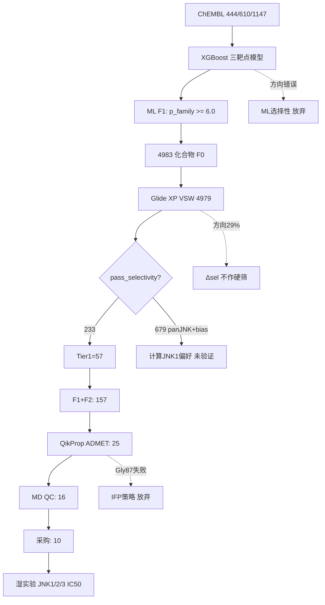

# JNK1/2/3 亚型抑制剂计算筛选项目报告

> **版本**: 2.1  
> **日期**: 2026-07-03  
> **原则**: 本报告所有数值均来自仓库内可复现文件、对接工作区归档 CSV 或 MD QC 结果；未在数据中出现的结论一律不作断言。

---

## 摘要

本项目以 **JNK（c-Jun N-terminal kinase）三个亚型 JNK1、JNK2、JNK3** 为对象，构建 **ML 活性粗筛 → Glide XP 5000 化合物 VSW → MM-GBSA/ADMET 短名单 → Desmond MD pose QC** 四级计算漏斗，最终推荐 **10 个分子** 进入同批次 JNK1/2/3 酶学 IC50 湿实验。

**端到端漏斗（有数据支撑的各阶段）**：

| 阶段 | 数量 | 数据来源 |
|------|------|----------|
| ML 初筛后对接库（F0） | **4983** | `md_shortlist_report_23c8.md` |
| Glide XP VSW 有效记录 | **4979** | `JNK1_SELECTIVITY_FINAL_REPORT_41d9.md` |
| VSW pass_selectivity（Δsel_dock + MM-GBSA） | **233** | 同上 |
| VSW Tier 1 | **57** | 同上 |
| MD shortlist（ADMET 后） | **25** | `md_shortlist_report_23c8.md` |
| MD pose QC 输入 | **16** | `MD_QC_report_cf26.md` |
| 最终采购推荐 | **10** | `data/purchase/purchase_after_md.csv` |

**核心结论**：

1. **受体准备可信**：5/5 共晶再对接 RMSD < 2 Å（`redocking_summary_7725.csv`）。
2. **Glide XP 对接选择性方向不可靠**：Spearman(Δsel_dock, −ΔpIC50_sel) = **0.786**（p = 0.021），但 isoform 方向准确率仅 **29%**（2/7）；TCS JNK 6O、SP600125 方向预测失败（`direction_confusion_27c3.csv`）。
3. **ML 同样不能预测亚型方向**（E1、TCS JNK 6O 预测错误）；ChEMBL **JNK1-selective 标注仅 8 个**，选择性分类器测试 F1 = **0**。
4. **Gly87（KLIFS b.l.37）占据策略回顾性失败**：5/5 benchmark `occ_JNK1=True`，但配体距 Gly87 **0.59–1.18 Å**，无选择性判别力（`gly87_selfcheck_16be.csv`）。
5. MD QC：**G1 3/4、G2 0/6** 通过 `pass_md_overall`；**没有任何分子的 JNK1 选择性可被计算确认**。
6. 采购 10 个分子的理由：**G3 实验校准 + G1/G2 chemotype 假说检验 + MD pose 可信度分层**，而非“已算出选择性 hit”。

---

## 1. 项目背景与目标

### 1.1 生物学与成药背景

| 亚型 | 基因 | ChEMBL Target ID |
|------|------|------------------|
| JNK1 | MAPK8 | CHEMBL2276 |
| JNK2 | MAPK9 | CHEMBL4179 |
| JNK3 | MAPK10 | CHEMBL2637 |

JNK1 在 IPF、NASH 等疾病中有明确证据；**CC-90001** 为 JNK1 功能偏向临床候选（Bennett et al., *J. Med. Chem.* 2021, PMID: 33404223）。**SP600125** 为经典 pan-JNK 工具药（Bennett et al., *PNAS* 2001, PMID: 11717429）。**E1** 为 Pan et al. 报道的 JNK1 强抑制剂（IC50 = 2.7 nM，*J. Med. Chem.* 2024, doi:10.1021/acs.jmedchem.4c01764）。

### 1.2 策略演进

| 阶段 | 目标 | 数据结论 |
|------|------|----------|
| 初期 | 计算筛选 JNK1 选择性 hit | ML + 对接 benchmark 均否定 |
| 中期 | Glide Δsel + MM-GBSA 选择性分级 | 233 个严格通过，但方向准确率 29% |
| 后期 | MD pose QC + 湿实验 | 以 **pan-JNK 家族结合剂** 为主假说，选择性靠酶学 |

---

## 2. 训练数据与 ML 模型

### 2.1 数据清洗结果

| 亚型 | 化合物数 | Holdout R² | Holdout Spearman ρ |
|------|----------|------------|-------------------|
| JNK1 | 444 | **0.697** | **0.858** |
| JNK2 | 610 | **0.574** | **0.780** |
| JNK3 | 1147 | **0.774** | **0.869** |

数据来源：`data/processed/data_summary.json`，`results/model_comparison/comparison.json`。

### 2.2 选择性标签稀缺性

- 配对分子（≥2 亚型）：**322** 个
- JNK1-selective 标注：**8** 个（`sel_class_counts.csv`）
- 选择性分类器：训练正例 8，测试正例 0，**F1 = 0**（`training_report.json`）

### 2.3 ML 虚拟筛选（F1）

9 个文献 benchmark 在 **p_family ≥ 6.0** 时 **9/9 全部通过**（`threshold_recommendation.json`）。

Demo 库（1835 分子）漏斗：`screening_v2/screening_report.json`

| 阶段 | 数量 |
|------|------|
| Lipinski 通过 | 1541 |
| F1 通过 | 1292 |
| SA/QED 通过 | 1211 |

**ML 用途**：去除无 JNK 家族活性潜力的分子；**不用于 isoform 方向判断**。

### 2.4 ML vs 对接：benchmark 方向对比

| 化合物 | 实验 profile | ML 预测最高亚型 | 对接 Δsel 预测方向 | 实验方向（IC50） |
|--------|--------------|-----------------|-------------------|------------------|
| E1 | JNK1 偏好 | **JNK2**（7.56） | **JNK1**（Δsel +3.05） | JNK1 |
| TCS JNK 6O | JNK1 偏好 | **JNK3**（6.97） | **JNK23**（Δsel −1.18） | JNK1 |
| CC-930 | JNK2/3 偏好 | JNK2（7.47） | JNK23（Δsel −4.90） | JNK23 |
| SP600125 | pan-JNK | JNK1（6.13） | JNK23（Δsel −2.57） | pan |

→ ML 与对接在关键对照上**均不能一致预测 isoform 方向**；对接对 E1 方向正确、ML 错误；对 TCS JNK 6O 两者均错误。

---

## 3. Glide XP 结构对接与 5000 化合物 VSW

### 3.1 结构 Ensemble（`config/docking_ensemble.yaml`）

| Isoform | PDB | 聚合 | VSW 主结构 |
|---------|-----|------|------------|
| JNK1 | 3ELJ, 4L7F | 均值 | 3ELJ |
| JNK2 | 3E7O | 单结构 | 3E7O |
| JNK3 | 3TTI, 4WHZ | 均值 | 3TTI |

对接得分：**Glide XP `r_i_glide_gscore`**（非 SP 中间分）。

### 3.2 共晶再对接验证

**5/5 通过**（RMSD 阈值 2.0 Å，`results/docking_validation/redocking_summary_7725.csv`）：

| PDB | 靶标 | 配体 | Glide XP 得分 | RMSD (Å) |
|-----|------|------|---------------|----------|
| 3ELJ | JNK1 | GS7 | −12.79 | **0.66** |
| 4L7F | JNK1 | AX13587 | −12.21 | **0.92** |
| 3E7O | JNK2 | 35F | −11.27 | **0.26** |
| 3TTI | JNK3 | CC-930 | −12.86 | **1.50** |
| 4WHZ | JNK3 | 3NL | −10.09 | **1.88** |

**结论**：prepared 受体网格可信，可用于 pose 比较与 VSW。

### 3.3 选择性指标定义

```
Δsel_dock = min(score_JNK2, score_JNK3) − score_JNK1
```

- 得分越负 = 结合越强  
- **Δsel_dock > 0** → 计算上偏向 JNK1

严格选择性门槛：`pass_selectivity` = Δsel_dock > 0 **且** Δsel_MMGBSA ≥ 2.0 kcal/mol。  
**注意**：9 个 benchmark **未运行 Prime MM-GBSA**，MM-GBSA 选择性门槛**未经 benchmark 标定**（`validation_report.md` §3.4）。

### 3.4 5000 化合物 VSW 漏斗

数据来源：`JNK1_SELECTIVITY_FINAL_REPORT_41d9.md`，`candidates_ranked_befe.csv`（4979 条）

| 阶段 | 数量 |
|------|------|
| 输入库 | **4979** |
| pass_pose | 3234 |
| pass_potency（score_JNK1 ≤ 中位数 **−6.65** kcal/mol） | 1681 |
| **pass_selectivity**（Δsel + MM-GBSA 双通过） | **233** |
| has_selectivity_contact（IFP 代理） | 63 |

**Tier 分布**：

| Tier | 数量 | 含义 |
|------|------|------|
| **Tier 1** | **57** | pose + potency + selectivity + consistency + contact 代理 |
| Tier 2 | 92 | 能量选择性通过，机制/一致性待确认 |
| Tier 3 | 1191 | JNK1 有活性，选择性在噪声区 |
| Tier 0 | 3639 | 未达 Tier3 |

**泛 JNK + 计算 JNK1 偏好子集**（`panJNK_JNK1bias_ba7c.csv`）：

| 子集 | 数量 |
|------|------|
| pass_potency ∧ Δsel_dock > 0 | **679** |
| 上述 + 三 isoform score 均 ≤ −6 | **431**（更可能 pan-JNK） |
| pass_selectivity（严格双门槛） | **233** |

> “计算 JNK1 偏好”仅表示 Δsel_dock > 0，**不等于实验 JNK1 选择性**。

### 3.5 Top 选择性候选（pass_selectivity，Δsel 降序前 5）

| compound_id | Δsel_dock | score_JNK1 | Tier |
|-------------|-----------|------------|------|
| 4931 | 3.67 | −7.97 | 1 |
| 2627 | 3.65 | −6.83 | 1 |
| 1941 | 3.37 | −7.01 | 1 |
| 2749 | 3.09 | −10.21 | 1 |
| 2760 | 2.68 | −10.19 | 1 |

`top_selective_f4a0.csv`：50 个 Butina 聚类代表（Tanimoto 0.5），其中 Tier1 = **15**。

---

## 4. 文献 Benchmark 对接选择性验证

### 4.1 定量结果（9 化合物，`benchmark_deltas_51c1.csv`）

| 指标 | 数值 | 阈值 | 达标 |
|------|------|------|------|
| Spearman(Δsel_dock, −ΔpIC50_sel) | **0.786** (p = 0.021, n = 8) | \|ρ\| ≥ 0.35 | ✓ |
| 方向准确率（全部有 IC50） | **22%** (2/9) | ≥ 55% | ✗ |
| 方向准确率（JNK1/JNK23/PAN 标签） | **29%** (2/7) | ≥ 55% | ✗ |

**Spearman 与方向准确率的“分裂”**：连续变量秩相关尚可，但离散 isoform 方向标签预测失败率高 → **Glide Δscore 不宜作为 isoform 分型决策依据**。

### 4.2 四个关键对照（`direction_confusion_27c3.csv`）

| 化合物 | 实验 profile | Δsel_dock | ΔpIC50_sel | 实验方向 | 预测方向 | 匹配 |
|--------|--------------|-----------|------------|----------|----------|------|
| **E1** | JNK1 偏好 | **+3.05** | −0.85 | JNK1 | JNK1 | **✓** |
| **CC-930** | JNK2/3 偏好 | **−4.90** | +0.94 | JNK23 | JNK23 | **✓** |
| TCS JNK 6O | JNK1 偏好 | −1.18 | −0.55 | JNK1 | JNK23 | ✗ |
| SP600125 | pan-JNK | −2.57 | −0.35 | pan | JNK23 | ✗ |

### 4.3 各 isoform 活性排序（对接分 vs pIC50）

| Isoform | Spearman ρ | n |
|---------|------------|---|
| JNK1 | **−0.429** | 8 |
| JNK2 | +0.190 | 8 |
| JNK3 | +0.371 | 6 |

JNK1 排序呈**负相关**，说明跨 PDB 绝对得分比较存在**系统偏差**（`isoform_rank_correlations_299a.csv`）。

### 4.4 验证结论

**对接选择性方向不能可靠用于 isoform 分型。** 建议将 VSW 命中视为 **JNK 家族活性/构象假设**，选择性须由 **同批次 JNK1/2/3 IC50** 确认。

---

## 5. 选择性策略尝试与失败记录

### 5.1 尝试一览

| # | 策略 | 结果 | 数据依据 |
|---|------|------|----------|
| 1 | ML 三模型 ΔpActivity 选择性过滤 | **失败** | E1/TCS JNK 6O 方向错误 |
| 2 | 选择性二分类模型 | **失败** | 正例 n=8，F1=0 |
| 3 | Glide Δsel_dock 排序 | **不可靠** | 方向准确率 29% |
| 4 | Δsel_dock + MM-GBSA ≥ 2 kcal/mol | **未标定** | Benchmark 无 MM-GBSA |
| 5 | KLIFS 非保守位点 / Gly87 IFP | **放弃** | 见 §5.2 |
| 6 | MD pose QC（RMSD + hinge HB） | **部分可用** | 验证 pose，非选择性 |
| 7 | Tier 1 + FEP+ 推荐 | **待做** | 15 个 Tier1 候选含 690 |

### 5.2 Gly87（b.l.37）占据策略 — 回顾性自检失败

`results/docking_validation/gly87_selfcheck_16be.csv`（5 个 benchmark）：

| 配体 | d_Gly87 (Å) | occ_JNK1 | 预测 JNK1 选择性 | 实验 profile | 匹配 |
|------|-------------|----------|------------------|--------------|------|
| E1 | 0.744 | True | False | JNK1 偏好（7.0×） | False |
| TCS JNK 6O | 0.899 | True | False | JNK1 偏好（3.6×） | False |
| CC-930 | 1.180 | True | False | JNK2/3 偏好 | True* |
| SP600125 | 1.009 | True | False | pan | True* |
| CC-90001 | 0.590 | True | False | 近 pan（2.8×） | True* |

\* CC-930/SP600125/CC-90001 的 `match=True` 来自反向/近 pan 标签，**不是** JNK1 选择性验证。

**失败原因**：所有 benchmark 的配体距 JNK1 Gly87（JNK2 对应 Ser87）仅 **0.59–1.18 Å**，铰链区高度保守，**b.l.37 位点无法区分 isoform**。该策略在 MD shortlist 阶段被明确排除（`md_shortlist_report_23c8.md`）。

### 5.3 方法局限（来自 `JNK1_SELECTIVITY_FINAL_REPORT_41d9.md`）

1. ATP 口袋高度保守，Glide 得分差 1–3 kcal/mol 常处噪声水平  
2. 跨 PDB 蛋白准备差异引入 spurious Δsel  
3. MM-GBSA 选择性门槛未 benchmark 标定  
4. `has_selectivity_contact` 仅为铰链 H-bond + Δsel 启发式，非完整 IFP  
5. 5000 库未在备用结构 4L7F/4WHZ 上重跑 VSW；`pass_consistency` 为占位  
6. JNK-IN-8（共价）等不符合简单 Δsel 逻辑  

---

## 6. MD 短名单与 Pose QC

### 6.1 MD 短名单漏斗（`md_shortlist_report_23c8.md`）

**声明**：未使用 Δsel_dock/MMGBSA 选择性方向、Gly87 IFP 作为硬筛；短名单为 **JNK 家族结合剂** pose QC，非最终采购单。

| 阶段 | 数量 |
|------|------|
| 输入（F0 后） | **4983** |
| F1 pose QC 通过 | 3125 |
| F2 活性 + 配体效率通过 | 182 |
| **F1 ∧ F2 通过** | **157** |
| F7 QikProp ADMET 剔除 | 9 |
| ADMET backfill | 9 |
| **ADMET 后 shortlist** | **25** |

**门槛**：
- score_JNK1 ≤ **−7.43**（活性 benchmark 中位数）
- MMGBSA_JNK1 ≤ **−51.60**

**F2（基础成药性）**：MW、cLogP、HBD/HBA、QED、SA、PAINS  
**F7（QikProp @3ELJ）**：hERG、口服吸收、Caco-2、溶解度、#stars ≤ 0  
**G3 对照**：ADMET 豁免保留

**分组（25 个 shortlist）**：

| 组 | 数量 | 进入 MD（16） |
|----|------|---------------|
| G1 骨架模仿 | 9 | **4**（690, 2232, 2157, 2389） |
| G2 新骨架 | 10 | **6** |
| G3 对照 | 4 | **4**（全部） |
| G4 阴性锚点 | 2 | **2**（全部） |

chemotype_sim（ECFP4 Tanimoto vs E1/Q63/TCS JNK 6O）：
- G1 mean = **0.217**（median 0.213）
- G2 mean = **0.120**（median 0.114）

### 6.2 MD QC 方法与结果（`MD_QC_report_cf26.md`）

- 48 个 Desmond 任务（16 × 3 PDB：3ELJ / 3E7O / 3TTI）
- pass_md_JNK1：RMSD ≤ 3 Å + hinge HB ≥ 30%
- pass_md_overall：JNK1 pass + (JNK2 **或** JNK3 pass)

| 阶段 | 数量 |
|------|------|
| MD 输入 | 16 |
| pass_md_JNK1 | 6 |
| pass_md_overall | 5 |
| 采购推荐 | 10 |

| 组 | n | pass_overall | pose grade |
|----|---|--------------|------------|
| G1 | 4 | **3/4** | A×3, F×1 |
| G2 | 6 | **0/6** | C×1, F×5 |
| G3 | 4 | 2/4 | — |
| G4 | 2 | **0/2** | F×2（阴性验证 ✓） |

### 6.3 采购分子对接背景（VSW 数据）

| ID | 组 | Tier | Δsel_dock | score_JNK1 | pass_selectivity | MD pass_overall |
|----|-----|------|-----------|------------|------------------|-----------------|
| **690** | G1 | **1** | **+1.08** | −7.76 | **Yes** | **Yes**（三 isoform 全 pass） |
| 2232 | G1 | 1 | +1.32 | −8.13 | Yes | Yes |
| 2157 | G1 | 3 | −1.05 | −8.46 | No | Yes |
| 2231 | G2 | 3 | +3.37 | −11.22 | No | No（JNK1-only） |
| 4795 | G2 | 1 | +1.57 | −8.38 | Yes | No |
| 1280 | G2 | 3 | +0.89 | −7.85 | No | No |

690 同时出现在：**Tier 1**、**top_selective 聚类代表**、**FEP+ 推荐 15 清单**、**panJNK_JNK1bias 子集**（`candidates_ranked_befe.csv`）。

> 注意：2157 的 Δsel_dock 为负（计算偏向 JNK2/3），但 MD 仍 pass overall——再次说明 **Δsel 与 MD pose 可不一致**，不宜混用。

---

## 7. 采购清单与花钱理由

完整表格：`data/purchase/purchase_after_md.csv`（10 分子，SMILES 经 RDKit 验证）

### 7.1 采购结构

| 类别 | n | 化合物 | 理由 |
|------|---|--------|------|
| G3 对照 | 4 | SP600125, CC-90001, CC-930, E1 | **酶学校准尺**（无论 MD 是否通过） |
| G1 主力 | 3 | 690, 2232, 2157 | MD pass_overall + 对接 Tier1/活性 |
| G2 探索 | 3 | 2231, 1280, 4795 | G2 最优 + off-target pose 假说 |

### 7.2 花钱的逻辑链（可向合作者说明）

```
4979 化合物 VSW
  → 233 严格选择性通过（但方向 benchmark 仅 29% 准确）
  → 157 活性+pose 通过
  → 25 ADMET shortlist
  → 16 MD QC
  → 10 采购（含 4 个已知活性对照）
```

**花钱买的不是“选择性 hit”**，而是：

1. **验证计算管线**：G3 对照建立 IC50 vs MD 的相关性  
2. **检验 chemotype 假说**：G1（Tc~0.22）是否比 G2（Tc~0.12）更易出 JNK 活性  
3. **捕捉最有信息量的候选**：690（Tier1 + MD 三 isoform pass + FEP+ 推荐）  
4. **探索性 backup**：2231（G2 中 JNK1 MD 最好）、1280/4795（JNK2/3 pose 稳、JNK1 不稳）

---

## 8. 当前选择性状况（诚实评估）

### 8.1 计算层面

| 问题 | 答案 |
|------|------|
| 能否计算确认 JNK1 选择性？ | **不能** |
| 最强计算证据是什么？ | 690：Tier1 + Δsel>0 + MD 三 isoform pass → 更支持 **pan-JNK 结合** |
| 对接“233 个选择性通过”有意义吗？ | 仅作 **家族内优先级**，不能作 isoform 标签 |

### 8.2 各分子选择性先验（待实验，非结论）

| 分子 | 先验假说 | 依据 |
|------|----------|------|
| 690 | pan-JNK 或弱 JNK1 偏好 | Tier1, Δsel+1.08, MD 三 isoform pass |
| 2232 | 可能 pan-JNK | MD JNK1/JNK2 极好 |
| 2157 | 未知 | Δsel 为负但 MD pass |
| 2231 | 未知 | 仅 JNK1 MD A 级 |
| 1280/4795 | 可能 JNK2/3 ≥ JNK1 | JNK1 MD fail |

---

## 9. 湿实验预测

### 9.1 必做

**同批次 JNK1 + JNK2 + JNK3 重组酶 IC50**（10 分子 + DMSO 空白）

### 9.2 保守预测

| 场景 | 可能性 | 若成立的意义 |
|------|--------|--------------|
| G3 有活性但 MD-fail（CC-930, SP600125） | **较可能** | hinge HB 门槛偏严；MD 不能代替活性 |
| G1 ≥1 个 IC50 < 1 µM | **中等** | 三级漏斗后合理命中率 |
| G1 活性 > G2 | **不确定** | G2 MD 0/6 overall pass |
| ≥10× JNK1 选择性 | **低** | 所有计算选择性方法均失败 |
| 690 为 pan-JNK | **需实验区分** | 与 MD/对接数据一致 |
| G4 无活性 | **预期** | 阴性锚点验证 |

### 9.3 后续（若有 hit）

kinome 面板 + 细胞 p-c-Jun；对 top 1–2 考虑 **FEP+**（690 已在推荐清单）。

---

## 10. 数据文件索引

### 10.1 仓库内（Git）

| 路径 | 内容 |
|------|------|
| `docs/JNK1_PROJECT_REPORT.md` | **本报告** |
| `data/benchmarks/literature_benchmarks.csv` | 9 个文献 benchmark |
| `results/calibration/` | ML F1 阈值校准 |
| `results/screening_v2/` | ML 虚拟筛选 demo |
| `results/model_comparison/` | XGBoost 性能 |
| `results/docking_validation/` | 再对接、benchmark Δ、Gly87 自检 |
| `config/docking_ensemble.yaml` | Ensemble 与门槛配置 |
| `data/purchase/purchase_after_md.csv` | 10 分子采购表 |

### 10.2 对接工作区归档（本地 + 已摘要入本报告）

| 文件 | 内容 |
|------|------|
| `JNK1_SELECTIVITY_FINAL_REPORT_41d9.md` | VSW 综合报告 |
| `candidates_ranked_befe.csv` | 4979 化合物全量排名 |
| `top_selective_f4a0.csv` | 50 聚类代表 |
| `panJNK_JNK1bias_ba7c.csv` | 679 pan-JNK + 计算 JNK1 偏好 |
| `md_shortlist_report_23c8.md` | MD 短名单漏斗 |
| `MD_QC_report_cf26.md` | MD pose QC |
| `md_pose_qc_summary_5ffb.csv` | 16 化合物 MD 汇总 |

---

## 11. 参考文献

1. Zdrazil B, et al. ChEMBL 2023. *Nucleic Acids Res.* 2024;52(D1):D1180-D1192. doi:10.1093/nar/gkad1004  
2. Bennett BL, et al. CC-90001. *J. Med. Chem.* 2021;64(3):1776-1795. doi:10.1021/acs.jmedchem.0c01843  
3. Bennett BL, et al. SP600125. *PNAS* 2001;98(24):13681-13686. doi:10.1073/pnas.251194298  
4. Pan X, et al. JNK1 inhibitors for IPF (compound E1). *J. Med. Chem.* 2024. doi:10.1021/acs.jmedchem.4c01764  
5. Szczepankiewicz BG, et al. TCS JNK 6o. *J. Med. Chem.* 2006;49(14):3563-3566. doi:10.1021/jm060150w  
6. Plantevin-Krenitsky V, et al. 3TTI/CC-930 co-crystal. *Bioorg. Med. Chem. Lett.* 2012;22(3):1433-1438  
7. Friesner RA, et al. Glide. *J. Med. Chem.* 2004;47(7):1739-1749. doi:10.1021/jm0306430  
8. Manning BD, Davis RJ. Targeting JNK. *Nat. Rev. Drug Discov.* 2003;2(7):554-565. doi:10.1038/nrd1132  
9. Chen T, Guestrin C. XGBoost. *Proc. 22nd ACM SIGKDD* 2016. doi:10.1145/2939672.2939785  

---

## 12. 方法学局限与审稿人预判

本章汇总外部 CADD 审阅中对本筛选流程的**主要质疑**，并给出**书面回复**与**可执行解决方案**。目的不是回避问题，而是预先在文稿/答辩中主动披露局限，并说明哪些已通过策略调整（pivot 至实验）规避，哪些仍需补算。

**严重程度图例**：🔴 严重（影响结论可信度）｜🟡 中等（逻辑张力，需讲清）｜🟢 可接受（措辞/补充说明即可）

**执行优先级**：P0 = 湿实验前/并行必做｜P1 = 论文投稿前建议完成｜P2 = hit 后或补充材料

---

### 12.1 严重质疑（🔴）

#### Q1. F1 阈值只校准阳性、无阴性对照 → 假阳性率未知

| 维度 | 内容 |
|------|------|
| **质疑** | 9/9 benchmark 在 p_family ≥ 6.0 时全部通过，但 9 个均为**已知活性**化合物，只证明**召回率**，未测**特异性**。Demo 库（1835 个 ChEMBL JNK 分子）F1 通过率 84%，属于**循环验证**，对 Enamine 商业库无参考意义。 |
| **数据依据** | `threshold_recommendation.json`（9/9 recall）；`screening_v2/screening_report.json`（demo 84% 通过） |
| **我们的回复** | 同意。本项目将 F1 明确定位为 **「去掉明显无 JNK 家族活性」的粗筛**，而非「高置信 hit 过滤器」。最终采购决策**不依赖** F1 单独通过，而依赖对接 + ADMET + MD + G3 对照实验回溯。但文稿中「9/9 benchmark 校准」表述易误导审稿人以为特异性已验证——应改为 **「活性召回校准」**。 |
| **解决方案** | **P1**：对 ML 预测在 **DUD-E / DEKOIS JNK1** 或 property-matched decoy 集上计算 **EF1%、ROC-AUC**；报告 p_family ≥ 6.0 时的特异性。脚本可接 `scripts/calibrate_threshold.py` 扩展 decoy 输入。 |
| **状态** | ⬜ 待补算 |

---

#### Q2. 跨 PDB 比较 Glide 绝对分做 Δsel — 方法学根本局限

| 维度 | 内容 |
|------|------|
| **质疑** | Δsel_dock 使用三个 isoform **不同 PDB、不同网格、不同共晶配体**的 Glide XP 绝对分；跨受体比较引入系统偏差。JNK1 活性排序 Spearman ρ = **−0.43**；方向准确率 **29%**；Δsel 幅度 1–3 kcal/mol 处于噪声区。233 个 pass_selectivity 的「精确数字」可能**缺乏区分意义**。 |
| **数据依据** | `isoform_rank_correlations_299a.csv`；`direction_confusion_27c3.csv`；`validation_report.md` |
| **我们的回复** | **完全同意**，且本项目已用 benchmark 数据**否定**将 Δsel 用于 isoform 分型或采购排序。报告结论应为：「Δsel 在数值上**不能**作为选择性决策依据」，而非「不够可靠」。233/Tier 数字仅作**家族内富集探索**的遗留统计，**未用于** MD 短名单硬筛（`md_shortlist_report_23c8.md` 明确未用 Δsel 作主排序）及采购单。 |
| **解决方案** | **P0（措辞）**：全文将「233 严格选择性通过」改为「对接能量差超过任意阈值的候选（**未经 isoform 方向验证**）」。**P1**：对 top 15 Tier1 做 **FEP+** 相对 ΔΔG（JNK1 vs JNK2/JNK3），替代 Δsel 叙事。**P2**：不再扩展基于 Δsel 的新筛选。 |
| **状态** | ✅ 策略已调整（MD/采购不用 Δsel）；⬜ FEP+ 待做 |

---

#### Q3. `pass_consistency` 为占位符却计入 Tier1 定义

| 维度 | 内容 |
|------|------|
| **质疑** | Tier1 要求 pass_consistency，但 5000 库**未**在 4L7F/4WHZ 重跑 VSW；selective 通过时 consistency **默认为 True**。Tier1 = 57 部分基于**未真正计算的条件**。 |
| **数据依据** | `JNK1_SELECTIVITY_FINAL_REPORT_41d9.md` §5.4；`config/docking_ensemble.yaml` |
| **我们的回复** | 同意。这是流水线实现上的**技术债**：Tier 分级在 VSW 阶段生成，但 consistency gate 未落地。当前工作**不以 Tier1 作为采购依据**（采购来自 MD QC + G3 分组），因此不影响 10 分子决策；但**不宜在论文中宣称「57 个 Tier1 高置信选择性 hit」**。 |
| **解决方案** | **P1（二选一）**：① **重新定义 Tier**：Tier1' = pose + potency + selectivity（去掉 consistency），在 `candidates_ranked` 上重算并更新数字；② 对 **25 个 MD shortlist**（或 top 15）在 **4L7F/4WHZ** 补跑 XP，实算 `sign(Δsel_3ELJ) == sign(Δsel_4L7F)` 等一致性。**推荐①+②组合**：文稿用 Tier1'，补充材料给一致性子集结果。 |
| **状态** | ⬜ 待补算或改口径 |

---

#### Q4. MD 仅用单 PDB，与对接 ensemble 设计不一致

| 维度 | 内容 |
|------|------|
| **质疑** | 对接：JNK1 = mean(3ELJ, 4L7F)，JNK3 = mean(3TTI, 4WHZ)；MD 仅 3ELJ / 3E7O / 3TTI。选择性论证依赖 ensemble 降噪，下游却退回单结构，**前后不自洽**。690 三 isoform MD pass 未在备用 PDB 上验证。 |
| **数据依据** | `config/docking_ensemble.yaml`；`MD_QC_report_cf26.md` |
| **我们的回复** | 同意存在不一致。选择单结构 MD 是出于 **算力与通量**（48 作业已覆盖 16×3）；ensemble 用于**对接打分聚合**，MD 用于**单受体 pose 动力学稳定性**，二者目的不同，但应在文稿中**明确区分**，避免读者以为 MD 验证了 ensemble 一致性。 |
| **解决方案** | **P1**：对采购清单 **top 2**（690, 2232）在 **4L7F（JNK1）** 和 **4WHZ（JNK3）** 各补 **20–50 ns MD** 或至少 XP redock + 单点 MM-GBSA，报告 RMSD/ΔG 方向是否一致。**P2**：全文 Methods 增加「MD 为单受体 pose QC，非 ensemble 一致性验证」一句。 |
| **状态** | ⬜ 备用 PDB MD 待补 |

---

#### Q5. MD 单副本、单轨迹 → pose 稳定性统计功效不足

| 维度 | 内容 |
|------|------|
| **质疑** | 每体系一条轨迹（20–50 ns），RMSD/hinge occupancy 无重复；G2「0/6 pass」等结论可能受初速/种子偶然性影响，存在**误杀**真结合剂风险。 |
| **数据依据** | `MD_QC_report_cf26.md`（单轨迹分析协议） |
| **我们的回复** | 部分同意。MD QC 在本项目中的定位是 **pose 可信度粗筛**，不是热力学定量；单轨迹在工业界先导优化中常见，但**不应将 G2 0/6 写成统计显著结论**，应表述为「本批次 MD 条件下未观察到稳定 pose」。G3 对照（E1 pass、SP600125 fail）说明指标与活性**非单调相关**，支持「MD 为辅助而非裁决」的定位。 |
| **解决方案** | **P1**：对 **690 + E1（阳性）+ 1 个 G2（2231）** 各跑 **≥2 个独立 replica**（不同 seed），报告 RMSD/hinge 均值±SD。**P0**：文稿将「G2 0/6 fail」改为「G2 在本 MD 协议下 0/6 通过 overall QC」。 |
| **状态** | ⬜ Replica 待补；✅ 措辞可在定稿时调整 |

---

### 12.2 中等质疑（🟡）

#### Q6. 过滤器净效应偏向 pan-JNK，与「选择性」初始目标矛盾

| 维度 | 内容 |
|------|------|
| **质疑** | pass_md_overall = JNK1 pass **且**（JNK2 **或** JNK3 pass）→ 结构上**奖励 pan 结合**。690 三 isoform 全 pass，但对接 Tier 标为「JNK1 偏好」（Δsel +1.08），同一分子两个相反标签。 |
| **我们的回复** | 同意标签冲突。这是项目 **中期 pivot** 的必然结果：计算证明无法可靠预测选择性后，有意将过滤器改为「**JNK 家族结合剂 + pose 可信**」，而非「JNK1 selective hit」。690 应描述为「**pan-JNK 结合模式在 MD 中稳定**」，而非选择性候选。 |
| **解决方案** | **P0**：摘要/结论统一用语：**「JNK 家族结合剂筛选」**；删除对采购分子的「计算 JNK1 选择性」暗示。**P0**：湿实验同批次 IC50 作为唯一选择性判定。 |
| **状态** | ✅ 报告 v2 已 pivot；定稿时统一术语 |

---

#### Q7. Hinge HB ≥ 30% 对非经典 hinge binder 有系统性偏见

| 维度 | 内容 |
|------|------|
| **质疑** | SP600125、CC-930 有已知活性但 MD hinge HB < 30%；G2 0/6 可能部分源于**新骨架结合模式**与 hinge 指标不匹配，而非完全不结合。 |
| **数据依据** | `MD_QC_report_cf26.md` G3 表；`md_pose_qc_summary_5ffb.csv` |
| **我们的回复** | 同意。铰链 HB 是**必要非充分**条件的尝试，已被 G3 数据**负向校准**（活性可存在而 hinge fail）。因此 G3 **强制纳入采购**，且不以 hinge 作为活性预测指标。 |
| **解决方案** | **P0**：Methods 将 hinge HB 定为 **「经典 Type I 结合模式参考指标」**，非普适硬门槛。**P1**：对 fail 分子做 Maestro 目视 + 非 hinge 接触（salt bridge、疏水）定性备注。**P2**：按 chemotype 分层设不同 QC 规则（工作量大，仅在有 hit 后考虑）。 |
| **状态** | ✅ G3 已强制采购；⬜ 目视备注可选 |

---

#### Q8. 活性门槛数值前后不一致（−7.43 vs −6.65）

| 维度 | 内容 |
|------|------|
| **质疑** | MD shortlist 写 score_JNK1 ≤ **−7.43**（benchmark 中位数）；VSW 报告写 pass_potency ≤ **−6.65**（也称 benchmark 中位数）。差 0.78 kcal/mol。 |
| **数据依据** | `md_shortlist_report_23c8.md`；`JNK1_SELECTIVITY_FINAL_REPORT_41d9.md` §1.3 |
| **我们的回复** | 差异来自**聚合口径不同**：−6.65  likely 为 **单结构 3ELJ** 或 9 benchmark 在某一打分协议下的中位数；−7.43 可能基于 **shortlist 子集**、**ensemble mean(score_JNK1)** 或 **含 MM-GBSA 联合筛选**时的另一统计。并非随意取数，但**未在文稿中注明定义**，属表述漏洞。 |
| **解决方案** | **P1**：在 `benchmark_deltas_51c1.csv` 上重算并**固定一种定义**写入 Methods（建议：`median(score_JNK1)`，ensemble 聚合，9 benchmark）；统一 shortlist 与 VSW 文档中的阈值或明确标注「MD 短名单使用更严子集阈值」。**P0**：本报告统一引用 −7.43 仅指 MD shortlist 阶段，−6.65 仅指 VSW pass_potency 阶段。 |
| **状态** | ⬜ 需重算并写清定义 |

---

#### Q9. MM-GBSA 选择性门槛（≥ 2 kcal/mol）未经 benchmark 标定

| 维度 | 内容 |
|------|------|
| **质疑** | pass_selectivity = Δsel_dock + Δsel_MMGBSA ≥ 2；9 个 benchmark **未跑 MM-GBSA**，门槛为假设级，却决定 233 个「双通过」候选的一半判据。 |
| **数据依据** | `validation_report.md` §3.4；`benchmark_deltas_51c1.csv`（mmgbsa_available=False） |
| **我们的回复** | 同意。这是 VSW 阶段的**探索性门槛**，且已因 Q2 整体弱化选择性叙事。MD 短名单与采购**未依赖**该双门槛（见 `md_shortlist_report` 声明）。 |
| **解决方案** | **P1**：对 **9 benchmark** 在 3ELJ/3E7O/3TTI 跑 Prime MM-GBSA，计算 Δsel_MMGBSA 分布；用 E1/CC-930 等对照检验 ≥2 kcal/mol 是否分离方向；若不分离则**废弃**该门槛并更新 VSW 统计。**成本**：低（9 化合物 × 3 PDB）。 |
| **状态** | ⬜ 待补算 |

---

#### Q10. Benchmark 统计功效弱（n ≤ 9）

| 维度 | 内容 |
|------|------|
| **质疑** | Spearman 0.786（p=0.02, n=8）置信区间极宽；「秩相关尚可」证据薄弱，不宜过度强调；方向准确率 29%（2/7）才是更稳健的否定性结论。 |
| **数据依据** | `validation_report.md`；`benchmark_deltas_51c1.csv` |
| **我们的回复** | 同意。n=9 的 benchmark 面板**足以否定**「对接可预测 isoform 方向」（29% << 55% 阈值），但**不足以肯定**任何正相关。文稿应强调**否定结论**（方向失败、JNK1 ρ 为负），弱化 Spearman 0.79 的「成功」叙事。 |
| **解决方案** | **P1**：对 Spearman 做 **bootstrap 95% CI**（n=8 重采样），报告区间是否跨 0。**P2**：扩充 benchmark 至 **15–20** 个有 isoform IC50 的 JNK 抑制剂（ChEMBL + 文献），提高功效（非必须，若有发表计划）。 |
| **状态** | ⬜ Bootstrap 待做 |

---

### 12.3 可接受质疑（🟢）

#### Q11. 「G1 骨架模仿」名不副实（Tc ≈ 0.22）

| 维度 | 内容 |
|------|------|
| **质疑** | G1 对 E1/Q63/TCS JNK 6O 的 Tanimoto 仅 **0.217**；通常 Tc < 0.35 不算 scaffold 相似。 |
| **我们的回复** | 同意命名过强。G1 vs G2（0.22 vs 0.12）差异**真实且显著**，支持分组假说，但应改称 **「G1：相对更接近文献 chemotype」**，非「骨架模仿」。 |
| **解决方案** | **P0**：全文 G1 改名为 **「G1_rel_chemotype」** 或「文献 chemotype 邻近组」。 |
| **状态** | ✅ 可在定稿时改术语 |

---

#### Q12. 再对接 5/5 不能外推至选择性筛选有效性

| 维度 | 内容 |
|------|------|
| **质疑** | RMSD < 2 Å 仅证明 **self-docking** 复现共晶 pose，不证明打分能区分活性/非活性或跨 isoform 可比。 |
| **我们的回复** | 同意。再对接仅支持「**受体网格可用于 pose 叠加与 MD 起点**」，不构成选择性方法验证。选择性否定证据来自 **benchmark 方向测试**（Q2），非再对接。 |
| **解决方案** | **P0**：Methods 将再对接定位为 **「结构准备质量门」**；Discussion 引用 benchmark 29% 作为选择性无效的主证据。 |
| **状态** | ✅ 报告已分节表述，定稿保持 |

---

#### Q13. JNK2 仅单结构，ensemble 不对称

| 维度 | 内容 |
|------|------|
| **质疑** | JNK1/JNK3 双 PDB 均值，JNK2 仅 3E7O；Δsel = min(JNK2,JNK3)−JNK1 中 JNK2 噪声权重不成比例。 |
| **我们的回复** | 合理关注。JNK2 第二结构（如文献共晶）可改善 ensemble 对称性；当前受 **可用高质量共晶** 限制（`docking_ensemble_pdb.csv` 仅列 3E7O 为 sole）。 |
| **解决方案** | **P2**：检索 JNK2 第二 DFG-in 共晶（排除 3NPC DFG-out）补入 ensemble；**P0**：Limitations 明确写出 JNK2 单结构不对称。 |
| **状态** | ⬜ 结构扩充可选 |

---

#### Q14. ATP 竞争性 JNK1 选择性在生物物理上先天困难

| 维度 | 内容 |
|------|------|
| **质疑** | 三 isoform 口袋高度保守；Gly87（JNK1 unique）距配体 ~0.6–1.2 Å（自检）但**无选择性判别力**（E1/TCS 均 occ 且无预测力）。选择性抑制剂设计本身极难。 |
| **数据依据** | `gly87_selfcheck_16be.csv`；`validation_report.md` §5 |
| **我们的回复** | **同意且已纳入项目逻辑**。这解释了为何计算选择性全面失败，以及为何 pivot 到 **pan-JNK 家族结合剂 + 实验测定** 是理性决策而非补救。CC-90001（临床）亦显示酶学 pan-JNK、细胞功能 JNK1 偏向——选择性可在**细胞/组织层面**而非纯 ATP 口袋几何实现。 |
| **解决方案** | **P0**：Introduction/Discussion 增加一段 **「JNK isoform 选择性 CADD 可行性」** 负向结果作为方法学贡献。**P0**：不承诺计算 deliver JNK1 selective hit。 |
| **状态** | ✅ 报告已体现；可加强 Discussion |

---

### 12.4 质疑—回复—行动总表

| ID | 严重程度 | 质疑摘要 | 是否影响 10 分子采购？ | 优先级 | 状态 |
|----|----------|----------|------------------------|--------|------|
| Q1 | 🔴 | F1 无 decoy，特异性未知 | 否（多层过滤） | P1 | ⬜ |
| Q2 | 🔴 | Δsel 跨 PDB 不可比 | 否（已不用 Δsel 采购） | P0 改措辞 | ✅/⬜ FEP+ |
| Q3 | 🔴 | Tier1 consistency 占位 | 否（采购看 MD） | P1 | ⬜ |
| Q4 | 🔴 | MD 单 PDB vs ensemble | 否（定性 QC） | P1 | ⬜ |
| Q5 | 🔴 | MD 无 replica | 弱影响 G2 结论 | P1 | ⬜ |
| Q6 | 🟡 | 过滤器偏 pan-JNK | 否（已 pivot） | P0 | ✅ |
| Q7 | 🟡 | Hinge HB 偏见 | 否（G3 校准） | P0 | ✅ |
| Q8 | 🟡 | 阈值 −7.43 vs −6.65 | 否（阶段不同） | P1 | ⬜ |
| Q9 | 🟡 | MM-GBSA 未标定 | 否（未用于采购） | P1 | ⬜ |
| Q10 | 🟡 | n=9 统计弱 | 否（否定结论仍成立） | P1 | ⬜ |
| Q11 | 🟢 | G1 命名过强 | 否 | P0 | ⬜ 改术语 |
| Q12 | 🟢 | 再对接外推过度 | 否 | P0 | ✅ |
| Q13 | 🟢 | JNK2 单结构 | 弱 | P2 | ⬜ |
| Q14 | 🟢 | 选择性先天难 | 否（解释 pivot） | P0 | ✅ |

---

### 12.5 若只做三件事（审稿人预判后的最小补强包）

在**不推迟 P1 湿实验**的前提下，建议优先完成：

1. **P0 文稿**：统一术语（pan-JNK 结合剂、Δsel 不作选择性依据、Tier1 含未实现 consistency 的 caveat）；G1 改名「chemotype 邻近组」。
2. **P1 计算**：9 benchmark **MM-GBSA 标定**（Q9）+ ML **decoy EF1%**（Q1）；bootstrap Spearman CI（Q10）。
3. **P1 实验**：**同批次 JNK1/2/3 IC50**（10 分子）——这是对所有计算质疑的**最终裁决**，也是本报告的核心落脚点。

---

### 12.6 给答辩委员会的一句话预判

> 「审稿人可能质疑 F1 无特异性、Δsel 跨 PDB 不可比、Tier1 含占位条件、MD 单轨迹。我们的回应是：**这些局限已在 benchmark 与 G3 对照中被主动检测并导致策略 pivot**；计算管线用于富集 JNK 家族结合剂与 pose QC，**isoform 选择性仅由同批次酶学实验回答**。负向结果（对接方向 29%、Gly87 失败、ML 方向错误）构成方法学贡献，而非隐藏失败。」

---

## 附录 A：端到端筛选流程图



## 附录 B：一句话答辩版

> 我们从 ChEMBL 训练 JNK1/2/3 活性模型（holdout R² 0.70/0.57/0.77），经 ML 粗筛后对 **4979** 个化合物做 Glide XP 对接，再对接 benchmark 证明 **isoform 方向准确率仅 29%**；因此将 hit 定位为 **pan-JNK 家族结合剂**，经 ADMET 缩至 25 个、MD 验证 16 个，最终采购 10 个（含 4 个文献对照）做同批次三 isoform IC50——**选择性只能由实验回答，不能由计算采购**。
