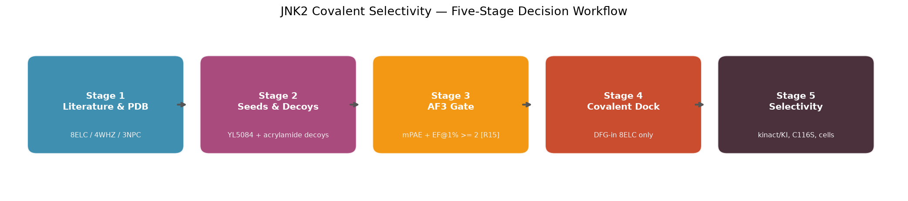
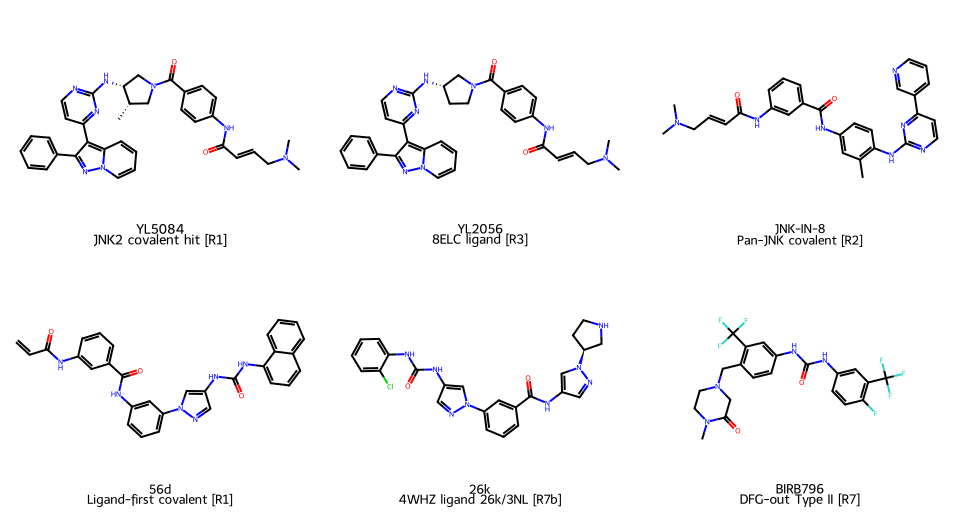
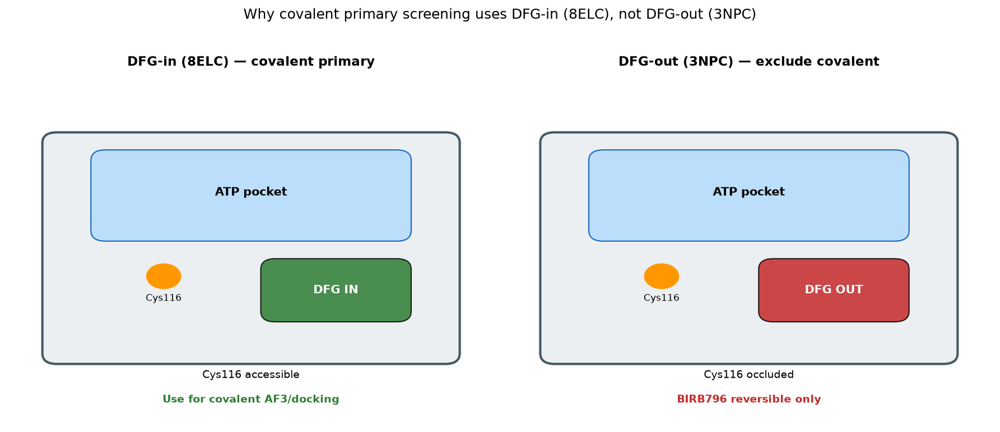
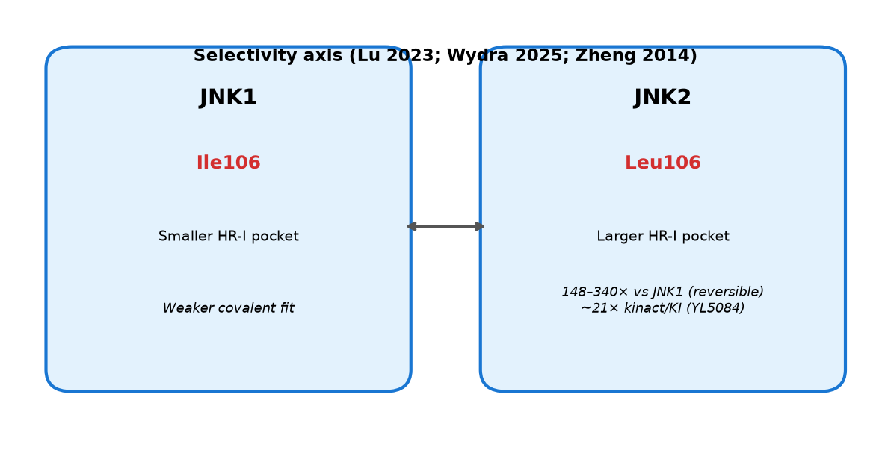
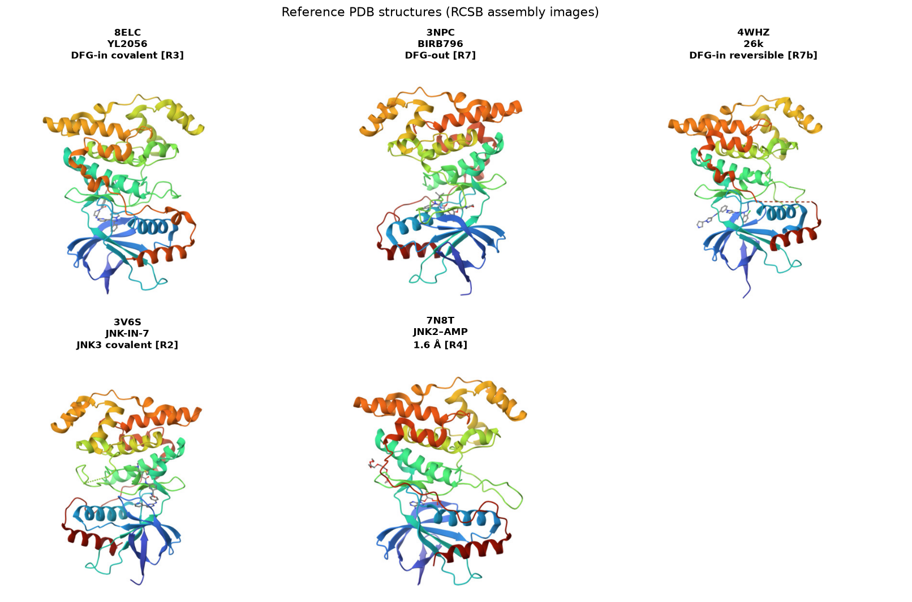

# JNK2 共价选择性抑制剂 — 图文报告

> 本报告从项目参考文献与公开结构库整理示意图，供 GitHub 浏览与汇报使用。  
> 文献编号对应根目录 [`REFERENCES.md`](../../REFERENCES.md)。  
> 化合物全量核对见 [`data/phase0_af3/COMPOUND_LITERATURE_AUDIT.md`](../../data/phase0_af3/COMPOUND_LITERATURE_AUDIT.md)。

---

## 1. 项目决策五阶段总览

**图 1.** 从靶点与结构选择 → 共价种子与诱饵 → AF3 置信度门控 → 共价对接与 MMGBSA → 选择性验证与候选推进。  
**依据：** 项目 [`JNK2项目决策五阶段.md`](../../JNK2项目决策五阶段.md)；AF3 门控参考 COValid **[R15]**。

---

## 2. 关键共价/对照化合物（2D 结构）

**图 2.** 种子与对照分子的 2D 结构（RDKit 自项目 SMILES 绘制）。

| 分子 | 角色 | Warhead | 主要文献 |
|------|------|---------|----------|
| YL5084 | JNK2 共价 hit（JNK2>JNK1 ~21×） | 丙烯酰胺 | Lu 2023 **[R1]** |
| YL2056 | 8ELC 共晶配体；YL5084 前体 | 丙烯酰胺 | Lu 2023 **[R1]** / PDB **[R3]** |
| JNK-IN-8 | Pan-JNK 共价阳性 | 丙烯酰胺 | Zhang 2012 **[R2]** |
| 56d | Ligand-first JNK2/3>>JNK1 共价 hit | 丙烯酰胺 | Wydra 2025 **[R20]** |
| JNK-IN-6 | 共价阴性对照 | 丙酰胺 | Zhang 2012 **[R2]** |
| 26k | 可逆 DFG-in 选择性参照 | 无（可逆） | 4WHZ **[R7b]** |
| BIRB796 | 可逆 DFG-out 参照 | 无（可逆） | 3NPC **[R7]** |

SMILES 来源：[`phase0_compounds_seed.csv`](../../data/phase0_af3/phase0_compounds_seed.csv)、[`COMPOUNDS.md`](../../data/phase0_af3/COMPOUNDS.md)。

---

## 3. 为何共价初筛不用 DFG-out（3NPC）

**图 3.** 共价初筛以 **DFG-in / 8ELC** 为主：Cys116 在 P-loop 内可及；**3NPC（DFG-out）** 中 Cys116 被遮挡，且共价 hit 共晶多来自 DFG-in 系列 **[R1][R2][R3]**。

| 结构 | 构象 | 共价初筛 | 说明 |
|------|------|----------|------|
| **8ELC** | DFG-in | ✅ 主模板 | JNK2–**YL2056** 共晶 **[R3]** |
| **4WHZ** | DFG-in | ⚪ 可逆选择性参照 | JNK3–26k（3NL）**[R7b]** |
| **3NPC** | DFG-out | ❌ 排除共价初筛 | BIRB796 Type II **[R7]** |

---

## 4. JNK2 vs JNK1 选择性（Leu106 / Ile106）

**图 4.** JNK2 **Leu106** 对应 JNK1 **Ile106**（同序位点）；Lu 2023 / Wydra 2025 系列在此轴上实现 21×–340× 亚型选择性 **[R1]**。项目优先 **JNK2 共价 + DFG-in** 路线。

---

## 5. 参考文献 PDB 结构面板

**图 5.** 自 RCSB 下载的组装图（assembly 1）。

| 面板 | PDB | 配体/说明 | 文献 |
|------|-----|-----------|------|
| A | [8ELC](https://www.rcsb.org/structure/8ELC) | YL2056，DFG-in 共价 | [R3] |
| B | [3NPC](https://www.rcsb.org/structure/3NPC) | BIRB796，DFG-out 可逆 | [R7] |
| C | [4WHZ](https://www.rcsb.org/structure/4WHZ) | 26k（3NL），DFG-in | [R7b] |
| D | [3V6S](https://www.rcsb.org/structure/3V6S) | JNK-IN-7（JNK3 共晶） | [R2] |
| E | [7N8T](https://www.rcsb.org/structure/7N8T) | JNK2–AMP，1.6 Å | [R4] |

---

## 6. Phase 0 AF3 数据包

| 内容 | 路径 |
|------|------|
| 种子/诱饵 SMILES | `data/phase0_af3/phase0_compounds_seed.csv` |
| 结构 + 文献审计 | `data/phase0_af3/COMPOUND_LITERATURE_AUDIT.md` |
| AF3 FASTA / 模板 | `data/phase0_af3/sequences/`、`templates/` |

---

## 7. 核心参考文献

| ID | 内容 |
|----|------|
| [R1] | Lu et al., *J Med Chem* 2023 — YL5084 / YL2056 |
| [R2] | Zhang et al., *Chem Biol* 2012 — JNK-IN 共价系列 |
| [R3] | PDB 8ELC — JNK2–YL2056 |
| [R4] | PDB 7N8T — JNK2–AMP |
| [R7] | BIRB796 / 3NPC — DFG-out |
| [R7b] | PDB 4WHZ — 26k DFG-in |
| [R15] | COValid — AF3 共价门控 |

完整列表：[`REFERENCES.md`](../../REFERENCES.md)。

*生成日期：2026-07-10 · 审计修订版*
