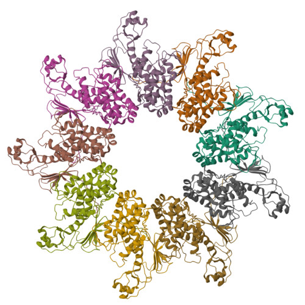

# NLRP3抑制剂开发领域最新进展综述

**课程作业**

---

## 摘要

NLRP3炎症小体在多种炎症性疾病中发挥重要作用，是近年来药物研发关注较多的靶点之一。本文结合2023年至2026年发表的相关文献，沿"激活机制—药物化学—临床验证—未解问题"的逻辑主线，对NLRP3抑制剂的分子机制研究、药物化学进展和临床开发现状进行梳理和讨论。目前尚无直接靶向NLRP3的药物获批上市，但dapansutrile、NT-0796、VTX2735、BGE-102、usnoflast和selnoflast等多个候选化合物已进入临床II期试验。总体来看，该领域在结构生物学和临床管线两方面均有实质性推进，但临床转化的直接证据仍然有限，正处于从实验室走向临床验证的过渡阶段。

**关键词**：NLRP3炎症小体，小分子抑制剂，dapansutrile，临床开发

---

## 1 引言

NLRP3（NOD样受体热蛋白结构域相关蛋白3）炎症小体是细胞内重要的免疫信号复合物，由传感器蛋白NLRP3、接头蛋白ASC（凋亡相关斑点样蛋白）和效应蛋白酶caspase-1组成。细胞受到病原体相关分子模式或损伤相关分子模式刺激后，NLRP3炎症小体被激活，促进IL-1β和IL-18等促炎细胞因子成熟并释放到细胞外，同时触发焦亡，进一步放大炎症反应。NLRP3过度激活或调节失衡与痛风、动脉粥样硬化、2型糖尿病、神经退行性疾病以及多种自身炎症性疾病密切相关，因此被认为是有潜力的治疗靶点。

在药物开发策略上，目前临床上已有canakinumab、anakinra等靶向IL-1通路的生物制剂，在类风湿关节炎、自身炎症性疾病等领域取得了一定疗效，但这些药物作用于NLRP3的下游，只能阻断IL-1β这一条通路，且多为注射给药，长期使用成本较高，患者依从性也面临一定挑战。与之相比，直接抑制NLRP3本身的小分子药物理论上可同时减少IL-1β和IL-18的成熟与释放，并阻断焦亡，口服给药也更为方便，在痛风、动脉粥样硬化、代谢综合征和神经炎症等以NLRP3过度激活为共同病理基础的疾病中，都具有潜在的应用空间。Vande Walle和Lamkanfi在2024年发表于*Nature Reviews Drug Discovery*的综述《Drugging the NLRP3 inflammasome: from signalling mechanisms to therapeutic targets》[1]系统总结了该领域的研究现状，指出多个小分子和生物制剂候选药物正在向临床推进，但截至该文发表时，尚无NLRP3直接抑制剂获得监管批准，这与TNF-α、IL-17等靶点已有多个上市药物形成鲜明对比，也说明该领域仍处在成药性验证的关键窗口期。NLRP3是连接基础免疫学和成药开发的重要节点，要理解这一领域近三年的进展，需要把"NLRP3如何被激活、药物应结合何处"与"哪些化合物正在走向临床、它们面临什么瓶颈"两条线索贯通起来。本文主要依据2023年至2026年发表的结构生物学、药物化学和临床相关文献进行归纳和评述，所引用的参考文献均为正式发表的论文或综述，可在PubMed或期刊官网检索核实，文末附有DOI链接；需要说明的是，很多候选药物的临床数据仍以综述论文和临床试验注册信息为主，正式发表的大样本临床论文还相对有限，因此本文在讨论临床进展时会对此有所交代。

## 2 NLRP3激活机制与结构生物学研究进展

要理解NLRP3抑制剂为什么有效、应该靶向哪个位点，首先需要了解NLRP3是如何被激活的。根据Vande Walle和Lamkanfi（2024，*Nat Rev Drug Discov*）[1]的综述，在经典（canonical）激活途径中，NLRP3的激活通常需要两个信号：priming信号由Toll样受体等通路触发，使细胞表达更多的NLRP3蛋白并做好激活准备；activation信号则由钾离子外流、溶酶体损伤、活性氧产生、线粒体功能障碍等多种刺激触发，最终导致NLRP3炎症小体组装。NLRP3被激活后会招募ASC并形成ASC斑点，进而激活caspase-1，最终促进IL-1β和IL-18成熟释放。NLRP3能够响应理化性质差异很大的激活剂，这一特点长期以来是理解其调控机制的主要难点，也是药物设计需要面对的复杂性所在。

近三年冷冻电镜结构的解析，使上述激活过程从"信号串联"走向了"构象变化"的分子层面，也为理解抑制剂的作用位点提供了直接的结构参照。Le等人在2023年发表于*Nature*的论文《Cryo-EM structures of the active NLRP3 inflammasome disc》[3]报道了活性NLRP3炎症小体"盘状"结构的冷冻电镜结果，显示NLRP3在激活后NACHT结构域发生约90°的旋转，从ADP结合的关闭状态转变为ATP结合的开放状态；NEK7（NIMA相关激酶7）结合LRR结构域后，可促进非活性"笼状"寡聚体向具有组装能力的构象转变，NLRP3特有的FISNA结构域则在稳定活性构象和介导盘状寡聚体相互作用方面发挥了关键作用，这是NLRP3区别于多数其他NLR家族成员的结构性特征（图1）。2024年，Yu等人在*Nature Communications*发表的《Structural basis for the oligomerization-facilitated NLRP3 activation》[2]进一步解析了NLRP3开放八聚体的结构，填补了从关闭笼状结构到活性盘状结构之间的中间态空白：NLRP3在转变过程中NACHT结构域同样发生约90°的铰链旋转，形成具有Head-Face和Tail-Tail相互作用界面的开放八聚体，而NEK7的结合有助于促进非活性寡聚体向具备组装能力的NEK7/NLRP3单体或二聚体转化，这是后续盘状炎症小体组装的前提；研究团队对开放八聚体界面进行突变后，IL-1β信号明显减弱，说明寡聚化协同激活是NLRP3炎症小体组装的核心机制（图2、图3）。值得注意的是，Yu等人的结构是在ATP存在、MCC950缺失的条件下获得的开放八聚体，而Le等人的盘状结构则代表了更接近完全激活的终态构象，两者合在一起，使"关闭—开放—盘状"的构象转变路径变得可视且可检验。这两类结构工作合在一起，描绘出一条从关闭笼状结构经开放八聚体到活性盘状结构的激活路径，也直接回答了"药物应在哪里阻断这一过程"：目前已有多个小分子抑制剂的结合模式被解析，它们大多结合于NACHT结构域的中央疏水口袋，通过稳定关闭构象阻断向活性盘状结构的转变，但NLRP3的激活并不是简单的"开"和"关"两种状态，药物研发者完全可以选择在不同构象状态或不同组装环节进行干预，而不必都集中在MCC950所结合的那个口袋上。

![图1 活性NLRP3炎症小体盘状结构（Le et al., 2023, Nature）[3]](./NLRP3_review_figures/fig1_nlrp3_disc_nature.png)

*图1 活性NLRP3炎症小体盘状冷冻电镜结构。NLRP3 NACHT结构域在激活过程中发生约85°–90°旋转，FISNA结构域在稳定活性构象中发挥关键作用。改绘自Le et al., *Nature* 2023[3]。*

![图2 NLRP3开放八聚体冷冻电镜结构（Yu et al., 2024, Nat Commun）[2]](./NLRP3_review_figures/fig2_open_octamer.png)

*图2 NLRP3开放八聚体（NLRP3ΔPYD/+ATP）的冷冻电镜结构，显示NACHT域铰链旋转及寡聚界面。改绘自Yu et al., *Nat Commun* 2024[2]。*

![图3 NLRP3激活机制模型（Yu et al., 2024, Nat Commun）[2]](./NLRP3_review_figures/fig5_activation_model.png)

*图3 NLRP3从关闭笼状结构经开放八聚体向活性盘状结构转变的激活模型。改绘自Yu et al., *Nat Commun* 2024[2]。*

在构象激活模型之外，近三年机制研究的另一重要进展是oxDNA通路的发现，它为药物靶点选择提供了NACHT域之外的另一条思路。除经典的离子流变化和溶酶体损伤等激活途径外，氧化DNA（oxDNA），特别是氧化线粒体DNA（ox-mtDNA），可直接参与NLRP3的激活。Cabral等人在2023年*Communications Biology*发表的《Differential binding of NLRP3 to non-oxidized and Ox-mtDNA mediates NLRP3 inflammasome activation》[4]表明，NLRP3对氧化与非氧化mtDNA的结合能力存在明显差异，分离的PYD结构域更倾向于结合ox-mtDNA（图4）；NLRP3的PYD结构域在蛋白质折叠方式上与DNA糖基化酶hOGG1存在结构同源性，在病理条件下，线粒体功能障碍和活性氧升高可导致ox-mtDNA释放到细胞质，进而触发NLRP3炎症小体组装，将代谢应激、氧化损伤和先天免疫激活串联起来。Lackner等人在2025年*Trends in Biochemical Sciences*发表的综述《How interactions between oxidized DNA and the NLRP3 inflammasome fuel inflammatory disease》[5]进一步指出，ox-mtDNA是重要的内源性危险信号，hOGG1抑制剂TH5487和SU0268可阻断NLRP3与ox-mtDNA的结合，从而抑制炎症小体激活和IL-1β释放。这一发现与第二节前半部分所讨论的构象激活模型形成互补：如果说冷冻电镜结构回答的是"NLRP3蛋白本身如何构象变化"，oxDNA通路则部分回答了"细胞在氧化应激条件下如何启动这一变化"。不过，目前基于oxDNA机制开发的临床候选药物还很少，大多数进入临床的化合物仍然结合于NACHT结构域的CRID3类似口袋；从药物设计角度看，构象调控与上游激活信号阻断有可能在未来并行发展，但短期内NACHT域小分子仍是临床管线的主体。

![图4 NLRP3与ox-mtDNA结合机制（Cabral et al., 2023, Commun Biol）[4]](./NLRP3_review_figures/fig3_oxmtdna.png)

*图4 NLRP3 PYD结构域对氧化与非氧化线粒体DNA（ox-mtDNA）的差异化结合。改绘自Cabral et al., *Commun Biol* 2023[4]。*

## 3 NLRP3抑制剂的药物化学与临床候选化合物

结构生物学所揭示的构象变化路径，直接塑造了当前药物化学的主线：以MCC950为代表的磺酰脲类化合物结合于NACHT中央疏水口袋、稳定关闭构象并抑制ATP酶活性，是领域内最重要的参照系，但其临床失败也迫使研发方向走向多元化。MCC950（又称CRID3或CP-456773）属于磺酰脲类化合物，结合于NACHT结构域中央疏水口袋，靠近Walker A motif（图5）。Coll等人在2019年发表于*Nature Chemical Biology*的论文《MCC950 directly targets the NLRP3 ATP-hydrolysis motif for inflammasome inhibition》[11]证实，MCC950直接与NLRP3 NACHT域Walker B motif相互作用，阻断ATP水解；Hochheiser等人在2022年*Nature*发表的《Structure of the NLRP3 decamer bound to the cytokine release inhibitor CRID3》[14]则以冷冻电镜解析了CRID3/MCC950结合于NACHT与LRR交界处的分子细节。MCC950在多种动物炎症模型中显示出较好的抗炎效果，是NLRP3临床前研究中最为常见的阳性对照化合物，但MCC950最初由Pfizer发现后，临床开发因肝毒性而中止，Genentech开发的GDC-2394（JT001）也因药物性肝损伤而停止临床开发；Kennedy等人在2021年*SLAS Discovery*的研究[15]揭示，MCC950对碳酸酐酶II（CA2）具有非竞争性抑制活性，这一脱靶效应可能与不良反应有关。上述案例说明，临床前模型中的高活性并不能保证临床安全性，简单在MCC950骨架上做微小修饰已不足以支撑后续开发。

*图5 MCC950结合于NLRP3 NACHT域中央疏水口袋的结构示意（PDB: 7ALW）。*

正是在MCC950肝毒性和脱靶问题凸显之后，新型化学骨架的探索才成为该领域的明确方向，其逻辑是从"保留同一结合口袋"逐步延伸到"寻找全新结合位点"。Vande Walle等人在2024年*Life Science Alliance*发表的《Novel chemotype NLRP3 inhibitors that target the CRID3-binding pocket with high potency》[6]通过PubChem高通量筛选发现吡咯并三嗪乙酰胺类分子（NIC系列）——需要强调的是，NIC系列并非从MCC950结构优化而来，而是通过独立筛选获得的全新骨架，但其经BRET实验证实的物理结合位点仍位于CRID3/MCC950的同一口袋，只是采取明显不同的结合构象（图6）；NIC-12缺乏MCC950对碳酸酐酶I和II的脱靶抑制活性，在LPS内毒素血症小鼠模型中可选择性降低循环IL-1β水平，在冷吡啉相关周期性综合征（cryopyrin-associated periodic syndromes，CAPS）患者来源的单核细胞中效力约为CRID3的10倍，这一结果说明，即便结合口袋相同，换用不同骨架仍有可能在效力和安全性上实现突破。Matico等人在2025年*EMBO Molecular Medicine*发表的《Navigating from cellular phenotypic screen to clinical candidate: selective targeting of the NLRP3 inflammasome》[7]则从表型高通量筛选出发，经构效关系优化得到化合物C，冷冻电镜、nanoDSF和氢氘交换质谱均证实其结合于人源NLRP3的NACHT结构域，且对NLRP1b和NLRC4炎症小体无明显交叉抑制，在CAPS相关动物模型中显示出较好的体内疗效，作者提出可优先在CAPS患者中开展概念验证。NIC系列和化合物C的共同价值在于，它们以结构生物学手段明确了结合模式，为"同一口袋、不同骨架、规避毒性"提供了可行路径，也回应了第二节所提出的"不必局限于单一构象干预点"这一药物设计启示。

![图6 NIC系列化合物筛选与活性（Vande Walle et al., 2024, Life Sci Alliance）[6]](./NLRP3_review_figures/fig4_nic_series.jpg)

*图6 NIC系列吡咯并三嗪乙酰胺类NLRP3抑制剂的筛选流程与代表性结构。改绘自Vande Walle et al., *Life Sci Alliance* 2024[6]。*

与"同一口袋换骨架"平行的，是结合位点和作用机制的根本性创新。Hartman等人在2024年*Bioorganic & Medicinal Chemistry Letters*发表的《The discovery of novel and potent indazole NLRP3 inhibitors enabled by DNA-encoded library screening》[12]通过DNA编码文库筛选发现了吲唑类先导化合物BAL-0028；Wilhelmsen等人在2024年bioRxiv预印本《Discovery of a Potent and Selective Inhibitor of Human NLRP3 with a Novel Binding Modality and Mechanism of Action》[13]进一步证实，BAL-0028结合于与MCC950不同的NACHT位点，不抑制ATP酶活性，且对部分CAPS致病突变（如D303H、L353P）的效力优于MCC950。BioAge Labs在此基础上开发的临床候选药BGE-102保留了这一新型结合模式，具有脑穿透性，目前已完成I期试验并进入II期开发。Cabral等人在2025年*Trends in Pharmacological Sciences*的综述《Targeting the NLRP3 inflammasome for inflammatory disease therapy》[9]据此判断，该领域的药物化学正在从"单一磺酰脲骨架"向多元化方向发展。

药物化学的多元化最终要接受临床验证。在口服候选药中，dapansutrile（OLT1177）是目前临床进展较快、公开资料也相对较多的品种之一：该药由Olatec Therapeutics开发，为β-磺酰基腈类小分子，分子量仅133 Da，化学结构上与MCC950有明显区别；磺酰基腈类化合物通常具有较小的分子体积和较高的亲脂性，有利于跨膜转运，dapansutrile的低分子量进一步降低了血脑屏障穿透的分子量门槛。Amo-Aparicio等人在2023年*Journal of Neuroinflammation*发表的《Pharmacologic inhibition of NLRP3 reduces the levels of α-synuclein and protects dopaminergic neurons in a model of Parkinson's disease》[8]表明，dapansutrile在MPTP帕金森病小鼠模型中能够穿过血脑屏障并在脑内达到有效分布，减少脑内α-突触核蛋白水平，改善运动功能，将"分子量小"与"能入脑"之间的因果关系在实验层面予以印证。根据Cabral等人2025年的综述[9]，dapansutrile已在痛风、骨关节炎、心力衰竭等多种适应症中开展临床试验，并启动了针对2型糖尿病（NCT06047262）和急性痛风发作（NCT05658575）的II/III期研究；痛风因尿酸盐结晶激活NLRP3炎症小体的机制链条清晰，其试验结果对于判断NLRP3抑制剂能否在人体中起效具有标杆意义。

除dapansutrile之外，NT-0796、VTX2735、VTX3232、BGE-102、usnoflast和selnoflast等候选药物也已进入临床II期阶段，它们在化学结构、脑穿透性和适应症布局上各有侧重，共同构成了当前管线的基本格局（图7）。NT-0796是NodThera公司开发的脑穿透性口服NLRP3抑制剂，其异丙酯前药在体内转化为活性代谢物NDT-19795；Cabral等人2025年的综述[9]引用了该药Ib/IIa期试验（NCT06129409）的结果，在肥胖合并心血管风险因素且基线hsCRP升高的受试者中，用药组28天后超过75%的患者hsCRP降至2 mg/L以下，而安慰剂组不足25%，但hsCRP属于替代终点而非心血管事件等临床硬终点，上述结果能否最终转化为临床获益仍有待验证，目前该药还在开展与司美格鲁肽联合用药的IIa期试验（NCT07220629）。VTX2735是Ventyx公司开发的外周限制性口服NLRP3抑制剂，已在CAPS患者中完成IIa期概念验证试验（NCT05812781），目前正在复发性心包炎患者中开展II期试验（NCT06836232），复发性心包炎被认为与NLRP3过度激活有关，部分难治患者目前需使用注射型IL-1抑制剂，若口服方案有效将具有较好的临床应用前景。VTX3232是该公司另一款脑穿透性NLRP3抑制剂，Bultinck等人在2026年*Molecular Metabolism*发表的《NLRP3 inhibition by VTX3232 tempers inflammation resulting in reduced body weight, hyperglycemia, and hepatic steatosis in obese male mice》[10]表明其在肥胖小鼠模型中可减轻炎症并改善代谢指标，该药目前也在肥胖合并心血管风险患者及帕金森病患者中开展临床试验。Selnoflast（RO7486967）是Roche从Inflazome收购后推进的外周限制性NLRP3抑制剂，在稳定冠心病、有心肌梗死史且hsCRP≥2 mg/L的患者中，28天口服给药后hsCRP和IL-6等炎症替代终点较安慰剂有明显下降，目前正在动脉粥样硬化患者中开展IIa期RIVULET试验（NCT07448038），主要观察指标包括血管炎症的PET成像结果。Usnoflast（ZYIL1）是Zydus公司自主研发的脑穿透性NLRP3抑制剂，2024年完成了ALS患者的IIa期概念验证试验，脑脊液中可达到治疗浓度，2025年已启动IIb期UNITE-ALS试验（NCT07023835），并获FDA快速通道资格，此外还在溃疡性结肠炎和CAPS等适应症中开展研究。BGE-102是BioAge Labs开发的脑穿透性口服NLRP3抑制剂，2026年完成I期试验并启动心血管风险II期试验QUELL-CV（NCT07656727），其结合位点与MCC950不同，代表了一类非ATP酶抑制型候选药物。

![图7 NLRP3抑制剂临床开发现状（Vande Walle & Lamkanfi, 2024, Nat Rev Drug Discov）[1]](./NLRP3_review_figures/fig7_clinical_landscape.png)

*图7 主要NLRP3抑制剂候选药物的临床开发阶段与适应症布局。改绘自Vande Walle & Lamkanfi, *Nat Rev Drug Discov* 2024[1]；BGE-102等2025–2026年新增管线据公司公开信息更新。*

纵观上述管线，临床开发策略呈现出与药物化学多元化相呼应的几个规律。在适应症选择上，企业普遍优先推进机制明确、炎症标志物可测量的疾病，如CAPS、复发性心包炎、急性痛风和肥胖伴高hsCRP等，而不是一开始就挑战阿尔茨海默病这类终点复杂、试验周期长的慢病；自身炎症性疾病因与NLRP3功能获得性突变直接相关，成为概念验证的理想切入点，Cosson等人（2024，*J Exp Med*）[16]对多种CAPS突变的分层分析也为这一策略提供了分子层面的支持。在化合物理化性质与适应症的匹配上，脑穿透性与外周限制性的区分越来越受重视：神经系统疾病优先选择NT-0796、VTX3232、usnoflast、BGE-102等脑穿透性化合物，心血管代谢疾病则更多布局VTX2735、selnoflast等外周限制性化合物，以避免不必要的中枢免疫抑制风险。在联合用药方面，NT-0796与司美格鲁肽的联合试验以及Bultinck等人（2026，*Mol Metab*）[10]在肥胖小鼠中VTX3232的代谢改善结果，都反映出同时针对代谢异常和慢性炎症两条通路的研发思路，但这一协同效应在人体中能否重复，仍有待试验数据验证。神经退行性疾病方向则面临更大不确定性：Amo-Aparicio等人2023年的动物实验[8]为dapansutrile提供了初步支持，usnoflast在ALS中虽能进入脑脊液但生物标志物改善尚未达统计学显著；阿尔茨海默病虽已有尸检和脑脊液层面的NLRP3激活证据，Vande Walle和Lamkanfi的综述[1]与Mangan等人（2018）[17]均将其列为重要潜在适应症，但截至目前尚无NLRP3抑制剂在该病中开展临床试验，神经疾病方向的验证很可能仍需等待痛风、CAPS或心血管代谢等适应症首先完成人体概念验证。

## 4 问题与展望

将机制研究、药物化学和临床管线三条线索合在一起审视，NLRP3抑制剂领域在近三年取得了实质性推进，但距离成为成熟的药物类别仍有若干根本性问题悬而未决，而未来2—3年的临床试验数据将在很大程度上决定这一领域能否完成从"有希望的靶点"到"可成药疗法"的跨越。

在安全性层面，NLRP3在宿主免疫防御中具有一定作用，Vande Walle和Lamkanfi（2024）[1]提醒，完全阻断其活性可能增加感染风险，而目前I期和IIa期试验的随访时间多为数周至数月，对于需要长期口服给药的慢性病，长期用药对感染易感性、肿瘤监视和免疫系统稳态的影响仍缺乏充分数据，"抗炎"与"免疫抑制"之间的界限如何把握尚无临床共识。更棘手的是，MCC950和GDC-2394在动物实验中表现良好却在人体中出现肝毒性，说明现有临床前安全性评价体系存在盲区；小鼠与人NLRP3在序列和药理学响应上的差异尤为突出——BAL-0028/BGE-102对灵长类NLRP3高效但对小鼠NLRP3几乎无效[13]，常规小鼠模型甚至无法用于评价这类化合物，基因敲除动物还可能存在发育代偿，使得表型与药理学抑制不完全等同，Matico等人（2025）[7]采用人源NLRP3冷冻电镜结构和患者来源细胞验证的做法，代表了提高转化相关性的方向，但这类研究目前仍不多见。如何建立更具预测力的人源化评价体系，仍是转化医学层面的核心挑战，也直接关系到第四节所关注的多个II期试验结果能否被正确解读和推广。

在疗效评价层面，多个II期试验以hsCRP、IL-6等炎症标志物为主要指标，但这些属于替代终点而非心血管事件、疾病复发率等硬终点；NT-0796的Ib/IIa期数据[9]虽显示hsCRP显著下降，但其能否降低心肌梗死或卒中风险，需要结局试验来回答。Mangan等人在2018年*Nature Reviews Drug Discovery*的综述《Targeting the NLRP3 inflammasome in inflammatory diseases》[17]曾指出，炎症生物标志物虽便于早期概念验证，却难以单独支撑长期慢病用药的获益—风险评价。与此同时，Cosson等人在2024年*Journal of Experimental Medicine*的研究[16]表明，多数CAPS相关NLRP3功能获得性突变仍对MCC950敏感，但部分位于抑制剂结合口袋附近的突变（如D303H、L353P）可导致显著耐药，这意味着"同一靶点、不同突变背景"的患者可能对药物反应迥异，未来精准分层治疗可能比广谱抗炎更为现实，也对BAL-0028/BGE-102[13]等新型非磺酰脲骨架抑制剂提出了更高期待。

在上述问题尚未解决的同时，未来2—3年最值得关注的，是多项II期试验的数据读出。dapansutrile在急性痛风（NCT05658575）和2型糖尿病（NCT06047262）的II/III期试验、VTX2735在复发性心包炎（NCT06836232）的II期试验、selnoflast的RIVULET动脉粥样硬化试验（NCT07448038）、NT-0796与司美格鲁肽联合用药试验（NCT07220629），以及BGE-102的QUELL-CV心血管风险II期试验（NCT07656727），均有望在2026—2027年陆续公布结果；其中痛风试验因机制链条清晰而被视为"能否在人体起效"的试金石，BGE-102的QUELL-CV试验则将首次为新型非磺酰脲、非ATP酶抑制型NLRP3抑制剂的人体药效提供关键证据。若CAPS或痛风等机制明确的适应症率先取得成功，有望为整个领域提供首个人体概念验证参照，并沿Mangan等人（2018）[17]所描绘的路径向更大患者群体的慢性病拓展。在药物化学方向上，oxDNA/PYD通路（Cabral et al., 2023[4]；Lackner et al., 2025[5]）虽尚无临床候选药物，但为NACHT域之外的干预提供了理论可能；BAL-0028/BGE-102所代表的新结合位点与非ATP酶抑制模式，以及NIC系列[6]和化合物C[7]所代表的"同口袋换骨架"策略，则从不同侧面推动该领域摆脱对MCC950的依赖。脑穿透性与外周限制性的分化也将进一步深化，中枢神经系统炎症与系统性代谢炎症在病理机制和可及靶点方面的差异，决定了同一NLRP3靶点在不同疾病中需要不同的化合物理化性质设计。

综合来看，NLRP3抑制剂领域的基础研究已经揭示了从关闭笼状结构到活性盘状结构的完整构象转变路径，oxDNA通路的发现和新型非磺酰脲骨架（如BGE-102）的涌现拓展了药物设计的边界，多个候选药物已进入II期临床，但尚无获批品种，临床转化的直接证据仍然偏少。未来2—3年II期数据读出和新型抑制模式的临床验证，将初步回答"直接抑制NLRP3能否在人体中发挥预期的抗炎效果"这一贯穿全文的核心问题，也将决定该领域能否真正迈入成药性验证的新阶段。

---

## 参考文献

[1] Vande Walle L, Lamkanfi M. Drugging the NLRP3 inflammasome: from signalling mechanisms to therapeutic targets. *Nat Rev Drug Discov*. 2024;23(1):43-66. doi:10.1038/s41573-023-00822-2  
链接：https://doi.org/10.1038/s41573-023-00822-2

[2] Yu X, Matico RE, Miller R, et al. Structural basis for the oligomerization-facilitated NLRP3 activation. *Nat Commun*. 2024;15:1164. doi:10.1038/s41467-024-45396-8  
链接：https://doi.org/10.1038/s41467-024-45396-8

[3] Le X, Magupalli VG, Wu H. Cryo-EM structures of the active NLRP3 inflammasome disc. *Nature*. 2023;613(7944):595-600. doi:10.1038/s41586-022-05570-8  
链接：https://doi.org/10.1038/s41586-022-05570-8

[4] Cabral A, Cabral JE, Wang A, et al. Differential binding of NLRP3 to non-oxidized and Ox-mtDNA mediates NLRP3 inflammasome activation. *Commun Biol*. 2023;6:578. doi:10.1038/s42003-023-04817-y  
链接：https://doi.org/10.1038/s42003-023-04817-y

[5] Lackner A, Leonidas L, Macapagal A, Lee H, McNulty R. How interactions between oxidized DNA and the NLRP3 inflammasome fuel inflammatory disease. *Trends Biochem Sci*. 2025;50(11):931-944. doi:10.1016/j.tibs.2025.07.007  
链接：https://doi.org/10.1016/j.tibs.2025.07.007

[6] Vande Walle L, Said MS, Paerewijck O, et al. Novel chemotype NLRP3 inhibitors that target the CRID3-binding pocket with high potency. *Life Sci Alliance*. 2024;7(6):e202402644. doi:10.26508/lsa.202402644  
链接：https://doi.org/10.26508/lsa.202402644

[7] Matico R, Grauwen K, Chauhan D, et al. Navigating from cellular phenotypic screen to clinical candidate: selective targeting of the NLRP3 inflammasome. *EMBO Mol Med*. 2025;17(1):54-84. doi:10.1038/s44321-024-00181-4  
链接：https://doi.org/10.1038/s44321-024-00181-4

[8] Amo-Aparicio J, Daly J, Højen JF, et al. Pharmacologic inhibition of NLRP3 reduces the levels of α-synuclein and protects dopaminergic neurons in a model of Parkinson's disease. *J Neuroinflammation*. 2023;20:147. doi:10.1186/s12974-023-02830-w  
链接：https://doi.org/10.1186/s12974-023-02830-w

[9] Cabral JE, Wu A, Zhou H, Pham MA, Lin S, McNulty R. Targeting the NLRP3 inflammasome for inflammatory disease therapy. *Trends Pharmacol Sci*. 2025;46(6):503-519. doi:10.1016/j.tips.2025.04.007  
链接：https://doi.org/10.1016/j.tips.2025.04.007

[10] Bultinck J, Yuan S, Cantuti-Castelvetri L, et al. NLRP3 inhibition by VTX3232 tempers inflammation resulting in reduced body weight, hyperglycemia, and hepatic steatosis in obese male mice. *Mol Metab*. 2026;103:102282. doi:10.1016/j.molmet.2025.102282  
链接：https://doi.org/10.1016/j.molmet.2025.102282

[11] Coll RC, Hill JR, Day CJ, et al. MCC950 directly targets the NLRP3 ATP-hydrolysis motif for inflammasome inhibition. *Nat Chem Biol*. 2019;15(6):556-559. doi:10.1038/s41589-019-0277-7  
链接：https://doi.org/10.1038/s41589-019-0277-7

[12] Hartman G, Humphries P, Hughes R, et al. The discovery of novel and potent indazole NLRP3 inhibitors enabled by DNA-encoded library screening. *Bioorg Med Chem Lett*. 2024;104:129454. doi:10.1016/j.bmcl.2024.129454  
链接：https://doi.org/10.1016/j.bmcl.2024.129454

[13] Wilhelmsen K, Deshpande A, Tronnes S, et al. Discovery of a potent and selective inhibitor of human NLRP3 with a novel binding modality and mechanism of action. *bioRxiv*. 2024. doi:10.1101/2024.12.21.629867  
链接：https://doi.org/10.1101/2024.12.21.629867

[14] Hochheiser IV, Pilsl M, Hagelueken G, et al. Structure of the NLRP3 decamer bound to the cytokine release inhibitor CRID3. *Nature*. 2022;604(7904):184-189. doi:10.1038/s41586-022-04467-w  
链接：https://doi.org/10.1038/s41586-022-04467-w

[15] Kennedy CR, Tan YS, Muller M, et al. Unraveling the specificity of MCC950 activity, inhibition of the NLRP3 inflammasome and carbonic anhydrase 2. *SLAS Discov*. 2021;26(10):1264-1272. doi:10.1177/24725552211044351  
链接：https://doi.org/10.1177/24725552211044351

[16] Cosson C, Belot A, Lambotte O, et al. Functional diversity of NLRP3 gain-of-function mutants associated with CAPS autoinflammation. *J Exp Med*. 2024;221(5):e20231200. doi:10.1084/jem.20231200  
链接：https://doi.org/10.1084/jem.20231200

[17] Mangan MSJ, Olhava EJ, Roush WR, et al. Targeting the NLRP3 inflammasome in inflammatory diseases. *Nat Rev Drug Discov*. 2018;17(8):588-606. doi:10.1038/nrd.2018.97  
链接：https://doi.org/10.1038/nrd.2018.97
