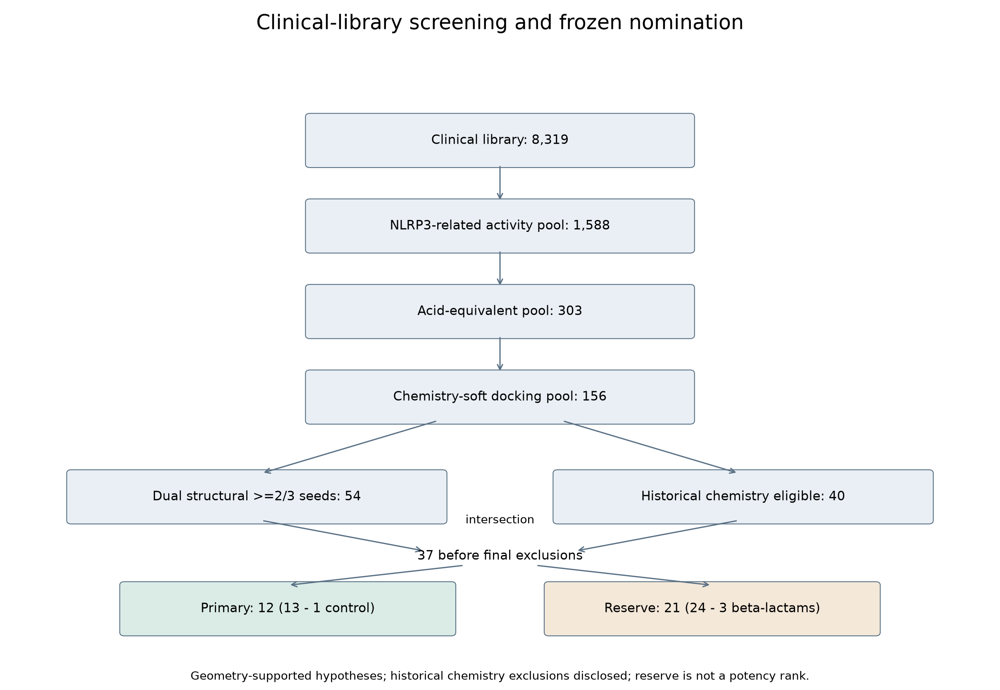
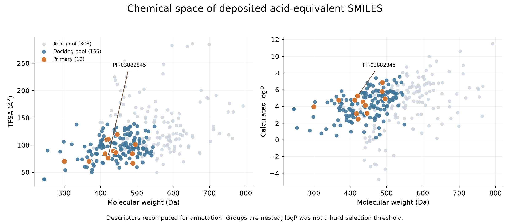

# Manuscript figures

Generated by scripts/manuscript_pipeline/make_figures.py from manuscript tables. PNG is for preview and SVG for editable publication export. Source and output hashes are in provenance.json.

Figure 1. The frozen clinical screening funnel. The 54-member structural set intersects the 40-member historical chemistry set to give 37, before control and beta-lactam exclusions. Primary and reserve are parallel branches. Reserve is not a potency rank.

Figure 2. Molecular weight versus TPSA and calculated logP for the acid pool, nested docking pool and frozen primary set. Descriptors are recomputed on deposited SMILES as annotations; no logP hard gate was applied. Overlaid colors represent nested sets, not independent cohorts.
