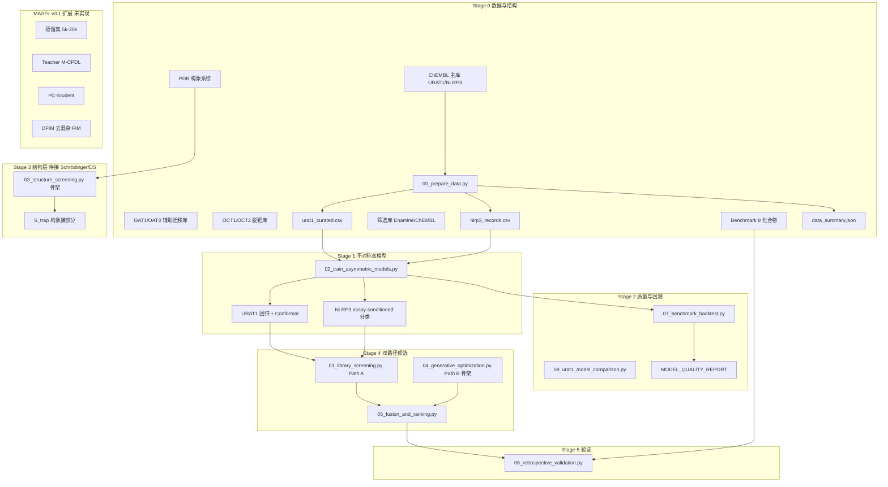

# 完整流程与文件清单（经核验版）

> **⚠️ 已归档（2026-07）**：本文档描述 **旧版 TAPE-GATE / MASFL / 8973 双靶 Pareto** 路线，**请勿再按此执行**。  
> **当前唯一工作流**：[`WORKFLOW_CURRENT.md`](WORKFLOW_CURRENT.md)  
> **旧路线说明**：[`LEGACY_ARCHIVE.md`](LEGACY_ARCHIVE.md)  
> **论文提纲**：[`MANUSCRIPT_OUTLINE_CURRENT.md`](MANUSCRIPT_OUTLINE_CURRENT.md)

---

> **版本**：TAPE-GATE v2.0（已实现） + MASFL v3.1（部分设计）  
> **更新**：2026-06 | 数字与 ID 以 `DATA_FACT_CHECK.md` 为准  
> **用途**：从零搭建项目、准备数据、跑通脚本、写论文 Methods 的 **单一索引**（历史参考）

---

## 一、科学前提（必读）

| 事实 | 数值/结论 | 依据 |
|------|-----------|------|
| URAT1 亚家族 | **OAT** 有机阴离子/尿酸交换体（非 OCT） | NCBI/OMIM SLC22A12 |
| 训练集重叠 | **0** shared SMILES | `data_summary.json` |
| URAT1 规模 | **822** SMILES，218 scaffolds | `urat1_curated.csv` |
| NLRP3 规模 | **513** SMILES，**609** records，**39** assays | `nlrp3_records.csv` |
| NLRP3 异质性 | **7.2%** 化合物跨 assay >1 log | 脚本实测 |
| URAT1 ML 主筛 | **NO_GO**（结构主导） | `MODEL_QUALITY_REPORT.md` |
| 双靶模式 | **Mode A**：分靶优化 + Pareto，非单分子双活性 | 0 重叠 |

---

## 二、端到端流程总图



**推荐执行顺序（已实现部分）**：

```bash
cd URAT1_NLRP3_DualTarget_AIDD_Project
pip install -r requirements.txt

# 单步或一键
python3 scripts/00_prepare_data.py
python3 scripts/02_train_asymmetric_models.py
python3 scripts/07_benchmark_backtest.py
python3 scripts/run_model_build_and_validate.py   # 训练+回测组合

# 完整 TAPE-GATE（库筛需自备 --library）
python3 scripts/run_tape_gate_pipeline.py --skip-generative
```

---

## 三、分阶段流程说明

### Stage 0：数据与结构准备

| 步骤 | 操作 | 输出 |
|------|------|------|
| 0.1 | 从 ChEMBL 按 `CHEMBL6120` 导出 URAT1 bioactivity（cf12 格式） | `data/raw/URAT1_CHEMBL_cf12.csv` |
| 0.2 | 从 ChEMBL 按 `CHEMBL1741208` 导出 NLRP3 IL-1β assay | `data/raw/NLRP3_CHEMBL_4807.csv` |
| 0.3 | 运行 `00_prepare_data.py` | `data/processed/*.csv`, `data_summary.json` |
| 0.4 | **可选** 导出 OAT1/OAT3（迁移）、OCT1/OCT2（脱靶） | `data/auxiliary/oat*.csv`, `oct*.csv` |
| 0.5 | 下载 URAT1/NLRP3 PDB，整理构象系综 | `data/structures/`, `docking_ensemble_pdb.csv` |
| 0.6 | 核对 benchmark 8 化合物 | `data/benchmarks/literature_benchmarks.csv` |

**清洗规则**（`config/targets.yaml` → `data_curation`）：

- URAT1：median 聚合；冲突 std>0.5 或 range>1.0 log → 丢弃；pActivity ∈ [4,10]
- NLRP3：IL-1β 终点 + Assay Type B + 每 assay ≥5 化合物；保留 assay 元数据

### Stage 1：不对称双证据建模

| 臂 | 任务 | 实现 | 关键配置 |
|----|------|------|----------|
| URAT1 | pActivity 回归 + Split conformal | `02_train_asymmetric_models.py` | `model_hierarchy.yaml` urat1_arm |
| NLRP3 | Assay-conditioned 二分类 | 同上 | `nlrp3_arm`, top-25 assays |
| 迁移 | **OAT1/OAT3 预训练 → URAT1 微调** | 配置已写，**训练脚本待接** | `auxiliary_targets.slc22_oat_transfer` |
| 消融 | 无 OAT 迁移 / 无 OCT 脱靶 | `06_retrospective_validation.py` | Abl-7 |

**NLRP3 禁止**：全局回归、锚点 ECFP max-pooling（仅作 PLK1-style 阴性对照）。

### Stage 2：模型质量与 Benchmark 回溯

| 检验 | 脚本 | 通过标准（示例） |
|------|------|----------------|
| CV 指标 | `02_train_asymmetric_models.py` | NLRP3 AUROC ~0.89；URAT1 R² 中等 |
| Benchmark 回收 | `07_benchmark_backtest.py` | Tier1a URAT1 外推化合物；Tier1b sanity |
| URAT1 模型对比 | `08_urat1_model_comparison.py` | 确认 ML 不足以单独筛 URAT1 |
| 报告 | 自动生成 | `docs/MODEL_QUALITY_REPORT.md` |

**Benchmark 分层**（`BENCHMARK_SELECTION_CRITERIA.md`）：

- **Tier1a**：scaffold-novel（lesinurad, benzbromarone, dotinurad）— 硬考试
- **Tier1b**：in-train sanity（verinurad, MCC950, GDC-2394）
- **Tier_neg**：allopurinol（非 URAT1）、colchicine（非直接 NLRP3）

### Stage 3：结构约束层（URAT1 核心）

| 组件 | 内容 | 工具 |
|------|------|------|
| URAT1 三态系综 | **9DKB** inward + **9B1K** occluded + **9B1L** outward | Glide SP/XP；见 `URAT1_THREE_STATE_DOCKING.md` |
| $S_{\text{trap}}$ | inward 稳定 + outward 不稳定 + Arg477/Phe 笼 | 自研评分 + MD 可选 |
| NLRP3 系综 | 7ALV（类比物模板）, 8ETR（GDC-2394） | NACHT 变构口袋 |
| OCT 脱靶 | OCT1/OCT2 对接比值 $R_{\text{sel}}$ | **Tier 3 假说**，非实验选择性 |

配置：`config/docking_ensemble.yaml`, `data/structures/docking_ensemble_pdb.csv`

### Stage 4：双路径候选发现

| 路径 | 脚本 | 状态 | 说明 |
|------|------|------|------|
| **Path A** 库筛 | `03_library_screening.py` | 骨架 | Enamine ~10⁶ → ML/UQ → 对接 |
| **Path B** 生成 | `04_generative_optimization.py` | 骨架 | CLM + RL 双靶奖励 |
| 融合 | `05_fusion_and_ranking.py` | 骨架 | 可靠性加权 Pareto |

配置：`config/dual_path.yaml`

### Stage 5：回顾验证与消融

`06_retrospective_validation.py`：7 组消融（含 PLK1-style、无 OAT 迁移、无结构等）。

### Stage 6+：MASFL v3.1（设计稿，未完全实现）

见 `docs/MASFL_V3_WORKFLOW.md`：蒸馏集、Teacher M-CPDL、PC-Student、DFIM、模块门槛 Gate。

---

## 四、需要准备的数据库/文件（按优先级）

### P0 — 必须（无则无法训练）

| # | 名称 | ChEMBL / 来源 | 规模 | 落盘路径 |
|---|------|---------------|------|----------|
| 1 | URAT1 主训练库 | CHEMBL6120 | 822 SMILES（已清洗） | `data/raw/URAT1_CHEMBL_cf12.csv` |
| 2 | NLRP3 主训练库 | CHEMBL1741208，IL-1β + Assay B | 513/609 | `data/raw/NLRP3_CHEMBL_4807.csv` |
| 3 | Benchmark 集 | 文献核验 | 8 化合物多行 | `data/benchmarks/literature_benchmarks.csv` |
| 4 | URAT1 结构系综 | RCSB | **9DKB, 9B1K, 9B1L**（三态主）; 9B1H, 9DKA, 9JDZ, 9JDY, 9JE1（备） | `data/structures/` |
| 5 | NLRP3 结构 | RCSB | 7ALV, 8ETR | 同上 |

### P1 — 强烈建议（论文完整性）

| # | 名称 | ChEMBL | 规模 | 落盘路径 |
|---|------|--------|------|----------|
| 6 | **OAT1 辅助迁移** | **CHEMBL1641347** | 500–2000 | `data/auxiliary/oat1_chembl_curated.csv` |
| 7 | **OAT3 辅助迁移** | **CHEMBL1641348** | 500–2000 | `data/auxiliary/oat3_chembl_curated.csv` |
| 8 | OCT1 脱靶 | CHEMBL2073664 | 500–2000 | `data/auxiliary/oct1_chembl_curated.csv` |
| 9 | OCT2 脱靶 | CHEMBL1770032 | 500–2000 | `data/auxiliary/oct2_chembl_curated.csv` |
| 10 | 百万筛选库 | Enamine REAL / ChEMBL | ~10⁶ | 外部路径，脚本 `--library` |

### P2 — MASFL v3.1 / 冲高期刊

| # | 名称 | 规模 | 说明 |
|---|------|------|------|
| 11 | 蒸馏集（URAT1 构象标签） | 5k–20k | 含无活性负样本；`00b_build_distill_set.py` ✅ |
| 12 | DUD-E / 自定义 decoys | 按靶点 | URAT1/NLRP3 对接特异性 |
| 13 | 主动学习池 | 1k–5k | ChEMBL SLC22 邻域 FPS 采样 |

**勿用错误 ChEMBL ID**：见 `DATA_FACT_CHECK.md` 黑名单（CHEMBL242, CHEMBL3968, CHEMBL1906, CHEMBL210, CHEMBL1777665 等）。

---

## 五、项目文件树与内容说明

### 5.1 配置 `config/`

| 文件 | 内容要点 |
|------|----------|
| **`targets.yaml`** | 主靶点 URAT1/NLRP3 ChEMBL；**OAT 迁移 + OCT 脱靶** 分层；清洗阈值；benchmark 化合物 PDB |
| **`model_hierarchy.yaml`** | TAPE-GATE 框架；URAT1 回归+conformal；NLRP3 assay-conditioned；融合 Pareto |
| **`docking_ensemble.yaml`** | URAT1/NLRP3 PDB 列表、结合位点、评分权重（$S_{\text{trap}}$ 组分） |
| **`dual_path.yaml`** | Path A 库筛漏斗；Path B 生成式 RL 奖励权重 |

### 5.2 数据 `data/`

| 路径 | 状态 | 内容 |
|------|------|------|
| `raw/URAT1_CHEMBL_cf12.csv` | ✅ 有 | ChEMBL 原始导出 |
| `raw/NLRP3_CHEMBL_4807.csv` | ✅ 有 | ChEMBL 原始导出 |
| `processed/urat1_curated.csv` | ✅ 生成 | 822 行，含 pActivity, scaffold |
| `processed/nlrp3_records.csv` | ✅ 生成 | 609 行，含 assay_id, active |
| `processed/data_summary.json` | ✅ 生成 | 规模与冲突统计 |
| `benchmarks/literature_benchmarks.csv` | ✅ 有 | 长表，多文献/多 PDB 行 |
| `benchmarks/literature_benchmarks_summary.csv` | ✅ 有 | 每化合物一行摘要 |
| `benchmarks/README.md` | ✅ 有 | 使用规则与主文献 |
| `auxiliary/README.md` | ✅ 有 | OAT/OCT 导出指引 |
| `auxiliary/oat*.csv` | ☐ 待导出 | OAT1/OAT3 清洗后 |
| `auxiliary/oct*.csv` | ☐ 待导出 | OCT1/OCT2 清洗后 |
| `structures/docking_ensemble_pdb.csv` | ✅ 有 | PDB–配体–DOI 对照 |
| `structures/README.md` | ✅ 有 | 膜蛋白准备说明 |

### 5.3 脚本 `scripts/`

| 脚本 | 状态 | 功能 |
|------|------|------|
| `utils_ml.py` | ✅ | 清洗、特征、指标、Murcko 划分 |
| `00_prepare_data.py` | ✅ | Stage 0 清洗 |
| `00b_build_distill_set.py` | ✅ | MASFL 蒸馏集 A/B/C/E + 合并 D |
| `00b_prepare_auxiliary_data.py` | ✅ | OAT/OCT 辅助库清洗 |
| `sample_distill_subset_d.py` | ✅ | 蒸馏子集 D 百万库抽样 |
| `01_dataset_analysis.py` | ✅ | UMAP、assay 热图 |
| `02_train_asymmetric_models.py` | ✅ | URAT1+NLRP3 训练 |
| `02_train_mtl_models.py` | 消融 | MTL 对照 |
| `03_library_screening.py` | 骨架 | Path A |
| `03_structure_screening.py` | 骨架 | 对接系综 |
| `04_generative_optimization.py` | 骨架 | Path B |
| `05_fusion_and_ranking.py` | 骨架 | Pareto 融合 |
| `05_retrospective_validation.py` | 旧版 | 可被 06 替代 |
| `06_retrospective_validation.py` | 骨架 | 消融验证 |
| `07_benchmark_backtest.py` | ✅ | Benchmark 回溯 |
| `08_urat1_model_comparison.py` | ✅ | URAT1 多模型对比 |
| `run_model_build_and_validate.py` | ✅ | 训练+回测一键 |
| `run_tape_gate_pipeline.py` | ✅ | 全流程编排 |

### 5.4 结果 `results/`（运行后生成）

| 路径 | 内容 |
|------|------|
| `training/training_report.json` | CV 指标 |
| `training/*_oof_predictions.csv` | OOF 预测 |
| `benchmark_backtest/*.csv/json` | Benchmark 排名与报告 |
| `urat1_model_comparison/` | 模型对比 |

### 5.5 文档 `docs/`（导航）

| 文档 | 用途 |
|------|------|
| **`COMPLETE_WORKFLOW_AND_FILES.md`** | 本文档 |
| `DATA_FACT_CHECK.md` | 可核验 ID 与数字 |
| `SLC22_AUXILIARY_RATIONALE.md` | OAT 主迁移 / OCT 脱靶逻辑 |
| `TAPE_GATE_FRAMEWORK.md` | v2.0 框架总览 |
| `MASFL_V3_WORKFLOW.md` | v3.1 扩展流程与 Gate |
| `ALGORITHM_FRAMEWORK.md` | Methods 公式与伪代码 |
| `BENCHMARK_SELECTION_CRITERIA.md` | Benchmark 分层标准 |
| `URAT1_TRANSPORTER_VALIDATION.md` | 转运体验证要求 |
| **`URAT1_THREE_STATE_DOCKING.md`** | **三态 PDB 映射与 Glide 流程（9DKB/9B1K/9B1L）** |
| `URAT1_ML_MODEL_ASSESSMENT.md` | URAT1_NO_GO 证据 |
| `MODEL_QUALITY_REPORT.md` | 训练+回测结论 |
| `PREPARATION_CHECKLIST.md` | 准备打勾清单 |
| `REFERENCES.md` | 文献表 |
| `MANUSCRIPT_OUTLINE.md` | 论文大纲 |

---

## 六、关键配置摘录（便于核对）

### 6.1 靶点 ID（`config/targets.yaml`）

```yaml
urat1:  { gene: SLC22A12, chembl_id: CHEMBL6120,  transporter_subfamily: oat }
nlrp3:  { gene: NLRP3,    chembl_id: CHEMBL1741208 }
# Tier A 迁移
OAT1:   CHEMBL1641347  (SLC22A6, O95742)
OAT3:   CHEMBL1641348  (SLC22A8, O95816)
# Tier B 脱靶
OCT1:   CHEMBL2073664  (SLC22A1, O15245)
OCT2:   CHEMBL1770032  (SLC22A2, O15244)
```

### 6.2 Benchmark 主推荐（`literature_benchmarks_summary.csv`）

| 化合物 | 靶点 | Tier | 主 IC50 | PDB |
|--------|------|------|---------|-----|
| lesinurad | URAT1 | 1a | 3.53 µM (Burns HEK) | 9B1H |
| benzbromarone | URAT1 | 1a | 0.29 µM | 9DKA |
| dotinurad | URAT1 | 1a | 37.2 nM | 9JE1 |
| verinurad | URAT1 | 1b | 25 nM | 9JDY |
| MCC950 | NLRP3 | 1b | 7.5 nM IL-1β | 7ALV* |
| GDC-2394 | NLRP3 | 1b | 16 nM | 8ETR |
| allopurinol | XDH neg | neg | — | — |
| colchicine | indirect neg | neg | — | — |

\*7ALV 为 MCC950 **类类似物**共晶，非 MCC950 本身。

### 6.3 融合与筛选阈值（`dual_path.yaml` / `docking_ensemble.yaml`）

- URAT1 ML 库筛：`pActivity ≥ 6` 且 conformal **下界** ≥ 阈值
- NLRP3：`P(active) ≥ 0.5`，assay 集成（THP-1 等）
- 结构：URAT1/NLRP3 系综百分位 ≥ 80%
- Pareto 目标：$S_{\text{dual}}$, QED, SA, Novelty

---

## 七、软件与环境

```bash
# Python 依赖
pip install -r requirements.txt

# 结构（二选一或组合）
# Schrödinger: Glide SP/XP, IFD, Desmond
# Discovery Studio 2025: 对齐、药效团
# 开源: AutoDock Vina, PDBFixer, RDKit
```

详见 `docs/COMPUTE_REQUIREMENTS.md`、`docs/PREPARATION_CHECKLIST.md`。

---

## 八、论文叙事与可信边界

### 可写进 Methods 的（有证据）

- 822/513 规模、0 重叠、assay-conditioned NLRP3
- $S_{\text{trap}}$ 构象系综（Dai/Fedor URAT1 结构）
- OAT1/OAT3 辅助迁移 + OCT 脱靶分层
- Benchmark Tier1a/1b 分层回溯
- PLK1-style 阴性对照

### 不可夸大（除非实现并过 Gate）

- 单分子 URAT1+NLRP3 双活性优化
- OCT 对接 = 实验选择性
- URAT1 纯 ML 高通量筛选
- MASFL v3.1 全模块（蒸馏、PC-Student、DFIM）— 标明 *planned* 或跑通后再写

---

## 九、文档阅读顺序（新人）

1. `README.md`  
2. `COMPLETE_WORKFLOW_AND_FILES.md`（本文）  
3. `DATA_FACT_CHECK.md` + `SLC22_AUXILIARY_RATIONALE.md`  
4. `TAPE_GATE_FRAMEWORK.md` → `ALGORITHM_FRAMEWORK.md`  
5. `PREPARATION_CHECKLIST.md` → 跑 `00_prepare_data.py`  
6. `MODEL_QUALITY_REPORT.md` → 决定 URAT1 结构优先策略  
7. `MASFL_V3_WORKFLOW.md`（扩展路线）

---

## 十、维护

- 改清洗规则 → 重跑 `00_prepare_data.py` → 更新 `DATA_FACT_CHECK.md` §1  
- 新增 ChEMBL 靶点 → 先查 ChEMBL 页面 UniProt → 再写入 `targets.yaml`  
- 新增 benchmark → 必须真实 PMID，禁止 ChEMBL compound ID 填 `ref_pmid`
