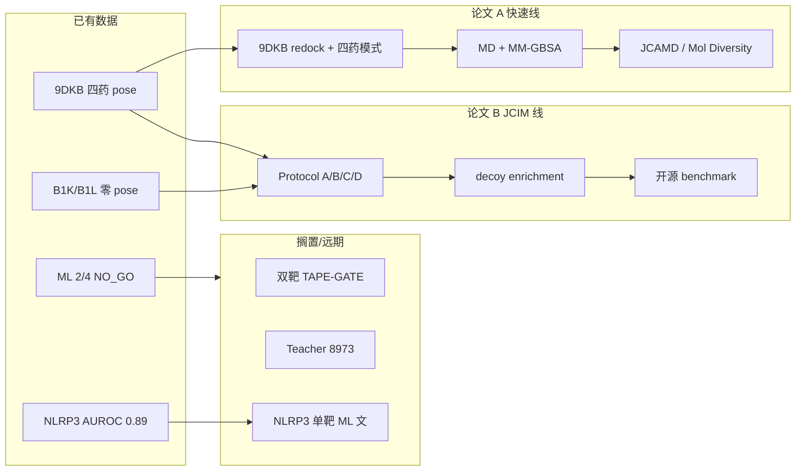

# 双轨论文策略：快速发表 vs JCIM 长准备

> **原则**：两条线 **数据不重复吹嘘、叙事不交叉打架**；凡未跑完的计算一律写「待完成」，不写进投稿 claim。  
> **依据**：2025-12 至 2026-06 前后 *Molecular Diversity*、*J. Comput.-Aided Mol. Des.*、*JCIM* 近期发文模式 + 本项目已有实证（`MODEL_QUALITY_REPORT.md`、`BENCHMARK_BACKTEST_SUMMARY.json`、对接实操记录）。

---

## 总览：你手里到底有什么（诚实清单）

| 资产 | 状态 | 可用于哪条线 |
|------|------|--------------|
| URAT1 ChEMBL 822 条 + 骨架 CV | ✅ 已训练 | **均不作主创新**；快速线可一句带过 |
| URAT1 ML benchmark 4 药回收 | ⚠️ **2/4**（lesinurad、dotinurad 失败） | **不可**写「ML 指导发现」 |
| NLRP3 assay-conditioned 分类 | ✅ AUROC≈0.89；benchmark 2/2 | 快速线 **不写主文**；可作远期第三篇 |
| 9DKB 四药 Glide SP→XP | ✅ 有 pose | **快速线核心** |
| 9B1K/9B1L 四药刚性 Glide | ❌ **零 pose** | **JCIM 线核心**（失败本身有价值） |
| urate 在 B1K/B1L 有 pose | ✅ | JCIM 线对照 |
| 三态 PDB 映射校正 | ✅ 文档+配置 | 两线 Introduction 均可引用 |
| OAT 迁移 Spearman +0.004 | ✅ 无意义 | **两线均不写** |
| Teacher / 8973 蒸馏 | ❌ 未跑通 | **两线均不写** |
| 湿实验 | ❌ 无 | 快速线不能写「发现新 hit」；JCIM 不写 discovery |

---

## 近半年目标期刊发文画像（2025-12 — 2026-06）

### A. Molecular Diversity（Springer）

**近期典型文章**（计算为主）：

| 文章 | 模式 | 实验 |
|------|------|------|
| CERS2 千万级 VS + Glide + MD + MM-GBSA（*Mol Divers* 2026） | 大库筛选 → 2 hit → MD | ✅ 酶学验证 |
| EZH2 天然产物库 VS + ML rescoring + MD（*Mol Divers* 2025） | 多级漏斗 | 计算为主 |
| MmpL3 转运体 VS + MD（*Mol Divers* 2026） | 药理筛选 + 动力学 | ✅ 抗菌实验 |
| 海洋细菌 AChE 抑制剂（*Mol Divers* 2026） | 药效团 + 对接 + MD | ✅ 实验 |

**审稿人默认期待**：
- 清晰 **SBVS 或对接工作流**（Glide HTVS/SP/XP、Protein Prep、Grid）
- **Redock** 验证（共晶配体 RMSD < 2 Å）
- **MD + MM-GBSA/MMPBSA** 支撑「复合物稳定」叙事
- 1–3 个 **lead 故事**（可以是已知药物，不必是新骨架）
- ADMET / 理化性质表（门槛不高）
- 有实验 **加分但非每篇必需**；无实验时 claim 必须收敛为「结合模式表征 / 计算评估已知抑制剂」

**不适合投 MD 的叙事**：
- 「新 AI 算法」「双靶发现漏斗」
- 未经验证的三态 π 打分
- 把 2/4 ML benchmark 说成成功

---

### B. Journal of Computer-Aided Molecular Design（Springer）

**近期典型文章**：

| 文章 | 模式 |
|------|------|
| PDE9A hit-to-lead 约束对接 + NES（*JCAMD* 2025） | **协议/案例**：redock、core-constrained docking |
| fisetin 抗结核多靶点对接 + MD（*JCAMD* 2026） | 已知小分子 × 多蛋白，相互作用分析 |
| **对接可重复性与失败模式综述**（*JCAMD* 2026, doi:10.1007/s10822-026-00849-8） | 强调 redock、decoy、部署场景验证 |
| CoBdock-2 / nCNN-DA（*JCAMD* 2025–26） | 新算法 + 公开基准数据集 |

**审稿人默认期待**：
- **方法可复现**：软件版本、grid、质子化、redock RMSD 写全
- 案例研究可以是 **已知配体**（不要求 ultra-large VS）
- 若称「新流程」，需与 default Glide 有 **对照**
- 新算法类需外部基准——**不是你的快速线路线**

**JCAMD vs Molecular Diversity（对你）**：
- **JCAMD** 更接受「协议 + 验证 + 局限」语气，与 redock/MD 案例更贴
- **Molecular Diversity** 更接受「药物发现流程」包装，但无实验时编辑常催 MD/ADMET 凑完整故事

**快速线首选**：**JCAMD**（若 MD 仿真完整）或 **Molecular Diversity**（若强调抑制剂药理表征 + 更丰满 ADMET/网络药理学装饰）。

---

### C. JCIM（ACS，长准备线）

**近期相关趋势**（2025–2026）：

| 主题 | 代表 | 对你的启示 |
|------|------|------------|
| Rescoring 局限 | Sindt *JCIM* 2025 (**jcim.5c00730**)：10 个 ULVS hit list、8 种 rescoring **均不能稳健区分真/假阳性** | Protocol C 若写 rescoring，必须 **小规模 decoy + 诚实负结果** |
| 方法比较统计 rigor | **jcim.5c01609** Practically Significant Method Comparison | 效应量、CI、scaffold split，不只 AUROC |
| 大规模对接数据库 | **jcim.5c00394** lsd.docking.org | JCIM 欢迎 **可复现基准资源** |
| 膜蛋白对接基准 | **jcim.5c00336** 膜界面结合位点预测工具对比 | 膜蛋白/转运体 **工具普遍差于可溶性蛋白**——你的失败可嵌入此框架 |
| SLC 计算综述 | **jcim.3c01736**（2024，仍常引） | 多构象、cryptic site——支撑三态讨论 |
| P-gp 构象系综对接 | *Sci Rep* 2026（60 化合物 × 22 构象） | JCIM 级 benchmark 需要 **更大化学多样性 + 定量指标** |

**JCIM 审稿硬门槛**（application/benchmark 类）：
- **不能**只报 4 个已知药物对接图
- 需要：**多协议对比**、**decoy/enrichment**、**开源子集**、**统计**、**失败模式分析**
- 新算法类还需多靶外部验证——你目前 **不具备**
- 湿实验非绝对必需（benchmark/computational perspective 可无），但 **discovery 类几乎必需**

---

## 论文 A：快速发表线（3–5 个月量级，计算可完成）

### 定位（一句话）

> **基于 inward-open cryo-EM 结构 9DKB，对四种临床/临床阶段 URAT1 抑制剂进行 Glide 对接与分子动力学表征，并结合结构映射讨论转运体对接与激酶范式的差异。**

这是 **已知抑制剂的结合模式研究（binding mode characterization）**，不是「发现新 hit」，也不是「新算法」。

### 推荐期刊排序

| 优先级 | 期刊 | 理由 |
|--------|------|------|
| 1 | **J. Comput.-Aided Mol. Des.** | 案例+协议+redock 文化匹配；2026 年刊文强调验证 |
| 2 | **Molecular Diversity** | 若加强 MD/ADMET/相互作用图解，也可投 |
| 3 | **J. Mol. Modeling** / **Mol. Diversity 姊妹刊** | 备选，门槛略低 |

### 你能诚实写进的贡献（3 条，不超）

1. 在 **9DKB**（Suo 2025 inward-open）上建立可复现 Glide SP→XP 流程，**lesinurad redock** 验证（目标 RMSD ≤ 2 Å）。
2. 四种 URAT1 抑制剂（lesinurad、benzbromarone、verinurad、dotinurad）的 **结合姿态、关键残基相互作用**（如底物口袋保守残基）比较。
3. **MD（建议 100 ns）+ MM-GBSA** 比较四药在 9DKB 复合物的相对稳定性；可选与 **9B1H** 旧结构敏感性对比（SI 即可）。

### 主文结构（≈4500–6000 words）

| 章节 | 内容 |
|------|------|
| Introduction | URAT1 与痛风；alternating access；**9DKB vs 9JDZ/9B1H 结构选择理由**（用你已校正的映射，但 **不展开三态 benchmark**） |
| Methods | Protein Prep、Grid、SP→XP、redock 标准；MD 力场、MM-GBSA |
| Results | Redock 图；四药 docking pose；相互作用表；MD RMSD/Rg、MM-GBSA 排序 |
| Discussion | 四药结合模式差异；与共晶 PDB（9DKA/9JDY/9JE1）的 **异源结构比较**（cross-structure，不是 redock）；转运体柔性局限 |
| Conclusion | 计算表征支持 9DKB 用于 inward 抑制剂研究；**不声称** outward/occluded 对接已解决 |

### 图表（6–7 个足够）

1. 9DKB 口袋 + 四药 overlay  
2. lesinurad redock（晶体 vs docked）  
3. 四药 2D 相互作用 diagram（LigPlot/Maestro）  
4. MD RMSD 时间曲线（四复合物）  
5. MM-GBSA 分解（或结合能条形图）  
6. （可选）9DKB vs 9B1H 叠合 + 同一配体 pose 差异  

### 明确不写 / 弱写

| 内容 | 处理 |
|------|------|
| 9B1K/9B1L 刚性失败 | Discussion **1 段局限**即可，不作主结果 |
| URAT1 ML 2/4 | **不写** |
| NLRP3 / 双靶 | **不写** |
| 三态 $S_\pi$、Boltzmann | **留给论文 B** |
| 「首次提出」「novel AI」 | 禁止 |

### 还需补的计算（快速线最小集）

- [ ] Gate 1：lesinurad @ 9DKB redock RMSD 正式记录  
- [ ] 四药 @ 9DKB：**最佳 pose 截图 + 相互作用表**（你已有 pose，差整理）  
- [ ] **MD 100 ns × 4 复合物**（GROMACS/Desmond 二选一，与 Methods 一致）  
- [ ] **MM-GBSA**（MD 末帧或轨迹平均）  
- [ ] （可选）SwissADME / QikProp 四药表格——MD 类期刊常期待  
- [ ] 写作 + SI（对接参数 yaml 导出）

### 快速线风险（投稿前自检）

| 风险 | 缓解 |
|------|------|
| 四药全是已知药物，新颖性弱 | 强调 **新 cryo-EM 9DKB** 上的系统比较，而非新 hit |
| 无湿实验 | 标题/摘要用 *characterization* / *computational study*，不用 *discovery* |
| verinurad 在训练集 | 不涉及 ML，无此问题 |
| 与论文 B 重叠 | A 只写 **9DKB 单态**；B 写 **三态协议对比**——Introduction 可互引，Results 不重复图表 |

---

## 论文 B：JCIM 长准备线（6–12 个月量级）

### 定位（一句话）

> **Benchmarking URAT1 inhibitor docking across inward, occluded, and outward cryo-EM states: documenting rigid Glide failure and evaluating a pose-transfer rescoring workaround.**

详见 `PAPER_PIVOT_BENCHMARK.md`、`MANUSCRIPT_OUTLINE_BENCHMARK.md`、`URAT1_THREE_STATE_BENCHMARK_PLAN.md`。

### 与论文 A 的分工

| 维度 | 论文 A（快速） | 论文 B（JCIM） |
|------|----------------|----------------|
| 结构 | 主要 **9DKB** | **9DKB + 9B1K + 9B1L** |
| 核心结果 | 四药结合模式 + MD | **刚性三态失败率** + Protocol A/C decoy enrichment |
| 化合物规模 | 4（+可选共晶对照） | 4 + 8–12 benchmark + **50–200 decoys** |
| 创新类型 | 案例表征 | **基准 + 批判性评估** |
| 开源 | 对接参数 + pose | **分数表 + 脚本 + 子集 SMILES** |
| 引用 Sindt 2025 | 可选一句 | **必须讨论** rescoring 局限 |

### JCIM 达标清单（不可偷工）

| 要求 | 你现状 | 差距 |
|------|--------|------|
| 多协议对比 A/B/C/D | B 部分完成；C 未系统化 | **要补** Protocol C 全流程 + decoy |
| Pose viability 定量 | B 已知 0% @ B1K/B1L | 需 **成表 + urate 对照** |
| Redock @ 9DKB | 待正式 RMSD | Gate 1 |
| Decoy enrichment / AUC | 未做 | **子集 D 50–200 + 统计** |
| 效应量 + CI | 未做 | bootstrap / jcim.5c01609 规范 |
| 开源仓库 | 部分脚本 | `utils_three_state_scoring.py` + 结果 CSV |
| 三态 PDB 映射校正 | ✅ | 可写贡献 |
| 湿实验 | 无 | benchmark 类 **可接受** |

### JCIM 叙事下你能写的贡献（不夸大）

1. 首次 **系统记录** 临床 URAT1 抑制剂在 Dai 2024 occluded/outward 刚性 Glide 下的 **零 pose 失败**（urate 阳性对照）。
2. 提出并检验 **Protocol C**（inward dock → 叠合转移 → Prime/MM-GBSA → $S_\pi$）在 **小规模已知活性药 + decoy** 上的 rank/enrichment。
3. 发布 **URAT1-3State-Docking-Benchmark** 可复现子集（非 8973 全量）。
4. 在 Sindt 2025 框架下讨论：**rescoring 不能拯救所有转运体对接失败场景**。

### 不能写的（JCIM 也会拒）

- Teacher M-CPDL、PC-Student、8973 蒸馏主叙事  
- 双靶 NLRP3 融合发现  
- 「优于所有现有方法」  
- Protocol C 未通过 Gate 2 时声称 **validated scoring function**

### 阶段里程碑

```
Phase 0  叙事冻结 + 与论文 A 图表去重
Phase 1  Protocol C 四药 + Gate 2（4/4 S_π>0?）
Phase 2  decoy 50–200 + Gate 3 + A vs C enrichment
Phase 3  GitHub release + 统计表
Phase 4  初稿 → 内审 → 投稿 JCIM（或先投 J. Cheminformatics 若 decoy 规模不足）
```

**备选**：若 Gate 3 失败，JCIM 仍可投 **negative results / lessons learned**，但录用不确定性上升；可降级 **J. Cheminformatics**（benchmark 资源型）。

---

## 两线关系图



---

## 第三篇（可选，两线都做完后再考虑）

**NLRP3 assay-conditioned classification under heterogeneous ChEMBL assays**  
- 数据：513 化合物、AUROC 0.89、benchmark 2/2（但均在训练集）  
- 问题：无湿实验、无结构、MCC950 类同系列在训练中 → 新颖性弱  
- 期刊：*Molecular Informatics*、*BMC Bioinformatics*、*Digital Discovery*  
- **现在不做**，避免分散精力

---

## 投稿措辞对照（防止吹嘘）

| 你想说的 | 快速线可写 | JCIM 线可写 | 不可写 |
|----------|------------|-------------|--------|
| 四药在 9DKB 有 pose | ✅ | ✅ | — |
| 建立 URAT1 虚拟筛选平台 | ⚠️ 太满 | ⚠️ 需 decoy 证明 | ❌ |
| 三态对接系综 | ❌ 主文 | ✅ 核心 | — |
| ML 模型优秀 | ❌ | ❌ | URAT1 2/4 |
| 发现新抑制剂 | ❌ | ❌ | 无实验 |
| 纠正 9JDZ 误用 | Introduction | ✅ 贡献之一 | — |
| pose-transfer rescoring | 局限一句 | ✅ 待 Gate 验证 | 「validated novel method」 |

---

## 执行优先级（建议顺序）

1. **本周**：整理四药 9DKB pose + lesinurad redock 数值 → 启动论文 A 图表  
2. **并行**：论文 B 的 Protocol C 四药 MM-GBSA（与 A 的 MD 可共用轨迹末帧，但 **打分逻辑不同**，注意 Methods 分开写）  
3. **论文 A 先投稿**（计算量小、故事闭合）  
4. **论文 B 等 Gate 2/3 有结果再写 Abstract**——避免先写后改 claim  
5. **全程不做**：8973 全量对接、双靶 funnel 写作

---

## 相关文档索引

| 文件 | 用途 |
|------|------|
| `TWO_PAPER_STRATEGY.md` | 本文件 — 双轨总策略 |
| `MANUSCRIPT_OUTLINE_BENCHMARK.md` | 论文 B 大纲 |
| `URAT1_THREE_STATE_BENCHMARK_PLAN.md` | 论文 B 计算计划 |
| `PAPER_PIVOT_BENCHMARK.md` | 为何不做算法文 |
| `URAT1_THREE_STATE_DOCKING.md` | PDB 映射权威 |
| `TEACHER_GATE_QC_DATASETS.md` | Gate 面板 |
| `MODEL_QUALITY_REPORT.md` | ML 客观评估（写作时防吹嘘） |
