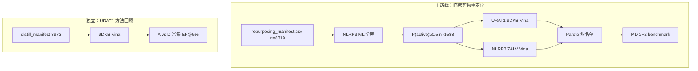

# 当前项目工作流（唯一执行标准）

> **生效日期**：2026-07  
> **替代**：`COMPLETE_WORKFLOW_AND_FILES.md` 中的 TAPE-GATE 双路径、MASFL Teacher、8973 双靶 Pareto  
> **论文提纲**：[`MANUSCRIPT_OUTLINE_CURRENT.md`](MANUSCRIPT_OUTLINE_CURRENT.md)

---

## 1. 流程总图



---

## 2. 阶段与命令

### Phase 0 — 环境与模型

```bash
pip install -r requirements.txt
python3 scripts/00_prepare_data.py
python3 scripts/02_train_asymmetric_models.py --no-oat-transfer
python3 scripts/07_benchmark_backtest.py
```

| 输出 | 说明 |
|------|------|
| `results/training/nlrp3_model.joblib` | NLRP3 筛选用 |
| `results/training/urat1_model.joblib` | 仅 benchmark / SI，**不作 URAT1 主筛** |

---

### Phase 1 — NLRP3 ML 筛临床库（主筛选 Step 1）

```bash
python3 scripts/screen_repurposing_library.py \
  --input data/repurposing/repurposing_manifest.csv \
  --panel clinical_all \
  --export-p05-pool \
  --skip-tanimoto
```

| 输出 | 说明 |
|------|------|
| `results/repurposing/nlrp3_ml_scores_clinical_all.csv` | 8319 全部分数 |
| `results/repurposing/docking_pool_p05.csv` | **P≥0.5，约 1588 条 → 对接输入**（Git 副本：`data/repurposing/screening/docking_pool_p05.csv`） |
| `results/repurposing/nlrp3_screening_summary_clinical_all.json` | 统计 + 对照药排名 |

**敏感性（SI）**：

```bash
# 仅 III 期+上市库内重筛
python3 scripts/screen_repurposing_library.py --panel phase_ge3 --export-p05-pool --skip-tanimoto
```

---

### Phase 2 — 双靶对接（AutoDock Vina，开源）

**无需 Schrödinger 许可。** 完整说明：[`OPEN_SOURCE_DOCKING.md`](OPEN_SOURCE_DOCKING.md)

**输入**：`data/repurposing/screening/docking_pool_p05.csv`

| 靶点 | 结构 | 引擎 |
|------|------|------|
| URAT1 | 9DKB | Vina 1.2.5, exhaustiveness=32 |
| NLRP3 | 7ALV | 同上 |

```bash
# 受体 PDBQT
python3 scripts/prepare_receptor_vina.py --target urat1_9dkb
python3 scripts/prepare_receptor_vina.py --target nlrp3_7alv

# 配体 PDBQT（1588）
python3 scripts/prepare_ligands_vina.py \
  --input data/repurposing/screening/docking_pool_p05.csv \
  --output-dir results/repurposing/ligands_p05

# 批量对接
python3 scripts/run_vina_batch.py --target urat1_9dkb \
  --manifest results/repurposing/ligands_p05/ligand_manifest.csv \
  --output-dir results/repurposing/docking_vina/9dkb --jobs 8
python3 scripts/run_vina_batch.py --target nlrp3_7alv \
  --manifest results/repurposing/ligands_p05/ligand_manifest.csv \
  --output-dir results/repurposing/docking_vina/7alv --jobs 8

# 规范化
python3 scripts/normalize_docking_export.py \
  --input results/repurposing/docking_vina/9dkb/docking_9dkb_vina.csv \
  --pdb 9DKB --engine vina \
  --output results/repurposing/docking_raw/urat1_9dkb_p05.csv
python3 scripts/normalize_docking_export.py \
  --input results/repurposing/docking_vina/7alv/docking_7alv_vina.csv \
  --pdb 7ALV --engine vina \
  --output results/repurposing/docking_raw/nlrp3_7alv_p05.csv
```

**迁移状态**：`data/repurposing/pareto/` 中现有 Pareto 数字来自 **Glide 开发跑**；投稿前须用 Vina 重跑并替换。

---

### Phase 3 — Pareto 整合

```bash
python3 scripts/merge_docking_pareto.py \
  --ml-scores data/repurposing/screening/nlrp3_ml_scores_clinical_all.csv \
  --urat1-dock results/repurposing/docking_raw/urat1_9dkb_p05.csv \
  --nlrp3-dock results/repurposing/docking_raw/nlrp3_7alv_p05.csv \
  --pool data/repurposing/screening/docking_pool_p05.csv \
  --sn-mode both

python3 scripts/analyze_pareto_benchmarks.py
python3 scripts/plot_available_figures.py
```

输出：`results/repurposing/pareto_shortlist.csv`（**n=6** 前沿）、`pareto_merged_scores.csv`、`fig04_pareto_*`

**主图**：横轴 URAT1 9DKB 百分位 $S_U$，纵轴 $\max(S_N^{ML}, S_N^{7ALV})$；标注 lesinurad、colchicine 等。

---

### Phase 4 — 8973 URAT1 回顾（独立 Results 一节）

对 `distill_manifest.csv` 用 **同一 Vina 协议** 重对接后：

```bash
python3 scripts/merge_8973_docking_results.py \
  --glide-csv results/docking/vina_8973/docking_9dkb_vina.csv

python3 scripts/analyze_urat1_docking_vs_ml.py \
  --merged data/docking/8973_9DKB_with_manifest.csv
```

**禁止**：8973 上跑 NLRP3 ML 或双靶 Pareto。

---

### Phase 5 — MD（主文 2+2，GROMACS）

| 靶点 | 化合物 | 结构 |
|------|--------|------|
| URAT1 | benzbromarone, dotinurad, EGCG | 9DKB |
| NLRP3（SI） | MCC950 | 7ALV |

50–100 ns；报告 RMSD、关键残基距离、MM-PBSA（定性）。

---

## 3. 数据文件索引

| 路径 | n | 用途 |
|------|---|------|
| `data/repurposing/repurposing_manifest.csv` | 8319 | ChEMBL 临床+ATC 合并库 |
| `data/distill/distill_manifest.csv` | 8973 | URAT1 蒸馏回顾 |
| `data/docking/8973_9DKB_with_manifest.csv` | 8928 docked | 8973 分+标签 |
| `data/processed/urat1_curated.csv` | 822 | URAT1 训练 |
| `data/processed/nlrp3_records.csv` | 513 | NLRP3 训练 |

---

## 4. 明确不执行（见 LEGACY_ARCHIVE.md）

- OAT 迁移训练 / 消融  
- Teacher M-CPDL / 8973×三态 B1K/B1L 全库  
- 8973 上 NLRP3 ML 或双靶 Pareto  
- Path B 生成式 / Enamine 百万库  
- 宣称「发现双靶抑制剂」
