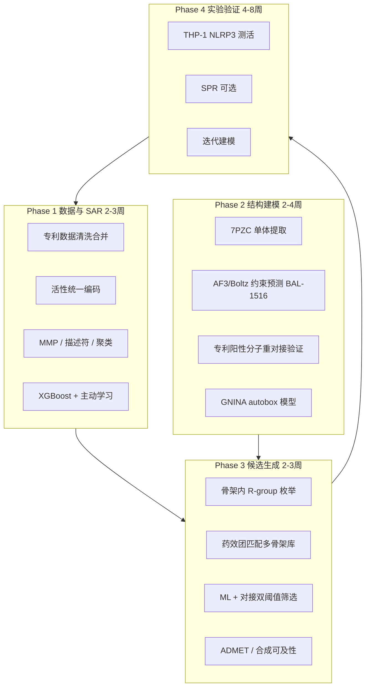

# NLRP3 BAL 位点抑制剂发现课题：可行性分析与实施方案

> 课题目标：基于 NLRP3 **BAL Glu-switch 变构位点**（非 MCC950 口袋），从专利 indazole 系列出发，发现**原骨架类似物**与**多骨架拓展**候选分子。  
> 文档版本：2026-07-10

---

## 1. 课题背景与科学假设

### 1.1 结合位点定义

| 项目 | 内容 |
|------|------|
| 位点名称 | BAL Glu-switch 沟槽（`Allosteric_FISNA_Glu_switch`） |
| 代表化合物 | BAL-0028 → BAL-1516（CNS 优化） |
| 与 MCC950 关系 | **不同位点、可加合**（SPR binning + cryo-EM 证实 MCC950 口袋为空） |
| 机制 | 不抑制 ATP 酶；稳定 inactive decamer |
| 关键残基 | Y258, H260, F257, I259, L272, F299, L331（人源） |
| 结构 | PDB **9IHN/9Q8V**（**HPUB，尚未公开下载**）；精修起点 **7PZC** |

### 1.2 核心假设

1. 五篇 WO 专利化合物为 **BAL 类 indazole-酰胺骨架**，靶向同一 Glu-switch 位点。
2. ~900 条标注活性数据足以支撑 **配体驱动 SAR + 机器学习**。
3. 在 **7PZC + 文献约束** 的结构模型经专利阳性分子验证后，可指导 **骨架内优化 + 骨架跃迁**。
4. 变构位点虽对 AI 共折叠有挑战，但 **加位点约束（Y258/H260）** 可显著提高可靠性。

---

## 2. 可行性评估

### 2.1 总体结论

| 维度 | 评级 | 说明 |
|------|------|------|
| **科学可行性** | ★★★★☆ | 靶点与骨架均有充分文献与专利支撑 |
| **数据可行性** | ★★★★☆ | 1039 unique SMILES，893 有活性标签；需统一编码 |
| **计算可行性** | ★★★★☆ | 配体驱动路线立即可做；结构路线需约束验证 |
| **实验可行性** | ★★★☆☆ | THP-1 NLRP3 测活可验证；鼠源活性可能偏弱（种属差异） |
| **新颖性/IP** | ★★★☆☆ | 专利密集区；需关注 FTO 与新颖取代基 |

**综合判断：课题可行，建议「配体驱动为主、结构驱动为辅、实验闭环」的三轨并行策略。**

### 2.2 优势

1. **数据规模大且同系列**：1087 条记录、1039 独特 SMILES、166 个 Murcko 骨架，89%+ 含 indazole 核心。
2. **活性标签覆盖率高**：893/1039（86%）有活性分类或 IC50。
3. **位点有 mechanistic validation**：DEL 筛选 → SPR → nanoDSF → cryo-EM 完整证据链。
4. **双目标清晰**：骨架内枚举（低风险）+ 骨架跃迁（高回报）可分阶段推进。
5. **无需等待 9IHN 公开即可启动 Phase 1**（配体 ML）。

### 2.3 风险与对策

| 风险 | 影响 | 对策 |
|------|------|------|
| 9IHN/9Q8V 仍为 HPUB | 结构对接精度受限 | 7PZC + AF3/SiteAF3 约束；9IHN 发布后替换 |
| 变构位点 AI 预测差 | 盲共折叠可能结合 MCC950 口袋 | 指定 Y258/H260 为 pocket residue；多方法交叉验证 |
| 活性标签不统一（+ / A/B / nM） | ML 噪声 | 分专利建模 + 有序分类 `activity_score` |
| WO2023147468 SMILES 损坏 | 曾丢失 75/75 活性分子 | `N(O)→[N+]([O-])` 修复后 105/106 可解析 |
| 人鼠种属差异 | 鼠实验可能无效 | 优先 THP-1 / 人 PBMC；参考 BAL-1516 鼠源 KD=200 nM |
| 手性中心敏感 | BAL-1516 (R)/(S) 差 300 倍 | 枚举时保留立体化学；分别预测 |
| 骨架跃迁假阳性 | 非 BAL 位点结合 | 结构过滤 + 专利阳性对照 pose 一致性 |

### 2.4 两子目标可行性分项

#### A. 原骨架类似物（Scaffold Walk）

| 指标 | 评估 |
|------|------|
| 技术成熟度 | 高——经典 SAR/QSAR |
| 数据支持 | 主 Murcko 骨架占 248+170 条 |
| 预期产出 | 10–50 个高预测活性类似物 |
| 成功率 | 中–高（需实验确认） |

#### B. 多骨架拓展（Scaffold Hopping）

| 指标 | 评估 |
|------|------|
| 技术成熟度 | 中——需药效团 + 对接双重过滤 |
| 数据支持 | 166 个 Murcko 骨架可聚类为 5–15 个系列 |
| 预期产出 | 3–5 个新骨架系列，每系列 5–20 候选 |
| 成功率 | 中（变构位点化学空间探索性较强） |

---

## 3. 数据资产（更新于 2026-07-10）

### 3.1 五篇专利统计

| 专利 | 化合物数（可解析） | Indazole 核心 | 有活性标签 | 备注 |
|------|-------------------|---------------|------------|------|
| WO2025207644 | 346 | 89% | 282 | 含 A/B 分类 + 体内数据 |
| WO2022204227 | 382 | 99% | 382 | +/++/+++ 分类 |
| WO2024064655 | 222 | 87% | 169 | 部分无标签 |
| WO2023147468 | 105（修复后） | 85% | 74 | **N-氧化物 SMILES 已修复** |
| WO2026054623 | 32 | 69% | 9 | 9 条有 nM IC50（10–26 nM） |
| **合计** | **1087 行** | — | **916 行** | — |

### 3.2 合并后独特分子

| 指标 | 数值 |
|------|------|
| 独特 SMILES | **1039** |
| 有活性标签的独特分子 | **893** |
| Murcko 骨架数 | **166** |
| 跨专利重复 SMILES | 13 |
| 活性评分分布（独特分子） | 高(3): 479；中(2): 177；低(1): 194；无标签: 146 |

### 3.3 活性评分规则（`activity_score`）

| 原始标签 | score |
|----------|-------|
| +++ 或 A | 3 |
| ++ 或 B | 2 |
| + 或 C | 1 |
| IC50 ≤ 30 nM | 3 |
| IC50 31–100 nM | 2 |
| IC50 > 100 nM | 1 |

> 完整数据见 [`patent_bal_compounds_merged.csv`](./patent_bal_compounds_merged.csv)

### 3.4 主骨架（Murcko Top 3）

```
1. O=C(NCc1cncc2cn[nH]c12)c1ccc(-c2ccccc2)cc1          (248 条)
2. O=C(NCc1cccc2cn[nH]c12)c1ccc(-c2ccccc2)cc1          (170 条)
3. O=C(NCc1cncc2cn[nH]c12)c1ccc(-c2ccccc2)c(OC2CC2)c1 (87 条)
```

共同药效团：**indazole/azaindazole – 酰胺 linker – 芳基（乙氧基苯/取代苯）**

---

## 4. 实施方案（四阶段）



### Phase 1：配体驱动（不依赖共晶，**立即启动**）

| 步骤 | 工具 | 产出 |
|------|------|------|
| 1.1 数据清洗 | RDKit, pandas | `patent_bal_compounds_merged.csv` |
| 1.2 按专利/骨架分层 | Murcko 聚类 | 5–15 个系列子集 |
| 1.3 描述符 + MMP 分析 | RDKit MMP, chemprop 可选 | SAR 规则（哪些取代基提升活性） |
| 1.4 活性预测模型 | XGBoost / RF / 主动学习 | 骨架内枚举分子的 `p_active` |
| 1.5 立体化学处理 | RDKit 手性标签 | (R)/(S) 分别建模 |

**输出**：Top 50 骨架内候选（纯配体路线）

### Phase 2：结构驱动（约束建模）

| 步骤 | 工具 | 产出 |
|------|------|------|
| 2.1 受体准备 | 7PZC chain A, PDBFixer, ADP+Mg²⁺ | `nlrp3_nacht_7pzc_monomer.pdb` |
| 2.2 共折叠（加约束） | AF3 Server（指定 Y258,H260,F257）或 Boltz-2 | BAL-1516 初始 pose |
| 2.3 交叉验证 | AF3 + Boltz + Chai 三方法 | 一致 pose 才采纳 |
| 2.4 阳性重对接 | GNINA `--autobox_ligand` | 验证模型（≥70% +++ 化合物合理 pose） |
| 2.5 Enrichment | 活性 vs 阴性专利分子 | EF1% > 10 |
| 2.6 可选精修 | OpenMM/GROMACS 50–100 ns | 柔性口袋构象 |

**验证标准**（参见 FoldBench / SiteAF3 文献）：
- BAL-1516 self-docking：indazole N 距 Y258/H260 主链 < 3.5 Å
- MCC950 口袋无占位（阴性对照）
- LRMSD < 2 Å（若有参考构象）

**输出**：经校验的对接模型 + 结合能阈值

### Phase 3：候选分子生成（双轨）

#### 轨道 A：原骨架类似物

```
BAL-1516 / 专利高活性分子
    → R-group 枚举（酰胺N-取代、芳环取代、linker 修饰）
    → 保留 indazole 核心 + 酰胺药效团
    → ML 预测 + 对接打分联合排序
```

- 枚举规模：每系列 500–2000 个
- 过滤：Lipinski, TPSA < 100, MW 350–550, 合成可及性 SAscore < 4

#### 轨道 B：多骨架拓展

```
从活性分子提取 3D 药效团（indazole HBD/HBA + 疏水芳环）
    → 搜索 Enamine REAL / ZINC / 内部库
    → 骨架类型：吡唑、咪唑、哒嗪、苯并杂环（保留 H 键模式）
    → 对接过滤 + ML 活性预测
```

- 参考 BAL 结合特征：**3 个 H 键到 β2 链 + 疏水腔**
- 允许替换：western 芳环（thiazole 等）、linker（酰胺/磺酰胺/脲）

**输出**：
- 骨架内候选 30–50 个
- 新骨架候选 20–40 个（3–5 个系列）

### Phase 4：实验验证与迭代

| 实验 | 体系 | 指标 |
|------|------|------|
| 初筛 | THP-1, LPS + nigericin | IL-1β ELISA |
| 对照 | MCC950, BAL-0028（若可获得） | IC50 平行 |
| 种属 | 人 PBMC 或单核细胞 | 确认人 NLRP3 活性 |
| 可选 | nanoDSF on NLRP3 NACHT | 热稳定化 |
| 可选 | SPR | KD 确认 |

---

## 5. 需要准备的资源

### 5.1 数据（已有 / 待整理）

| 资源 | 状态 | 路径/说明 |
|------|------|-----------|
| 五篇专利 CSV | ✅ 已有 | 用户 uploads 目录 |
| 合并清洗表 | ✅ 已生成 | `patent_bal_compounds_merged.csv` |
| 抑制剂参考表 | ✅ 已有 | `non_mcc950_site_inhibitors.csv` 等 |
| BAL-1516 SMILES | ⚠️ 需绘制 | 从 bioRxiv Fig.1 结构式或 PubChem 获取 |
| 阴性对照集 | 待建 | 专利内低活性 + 随机 decoy（DUD-E 式） |

### 5.2 蛋白结构

| 结构 | PDB | 用途 |
|------|-----|------|
| NLRP3 decamer + MCC950 | [7PZC](https://www.rcsb.org/structure/7PZC) | 提取单体 NACHT |
| NLRP3 + BAL-1516 | [9IHN](https://www.rcsb.org/structure/9IHN)（HPUB） | 待发布后替换 |
| NLRP3 NACHT + NP3-146 | [7ALV](https://www.rcsb.org/structure/7ALV) | 构象参考 |

### 5.3 软件环境

```bash
# 核心化学信息学
conda create -n bal-nlrp3 -c conda-forge python=3.11 rdkit pandas scikit-learn xgboost

# 对接
# GNINA (CUDA), AutoDock Vina, OpenBabel

# 共折叠（任选）
# AlphaFold3 Server (web), Boltz-2 (pip), Chai-1 (pip)

# 可选 MD
# GROMACS / OpenMM, AmberTools
```

### 5.4 参考化合物（验证用）

| 化合物 | 用途 |
|--------|------|
| BAL-1516 / BAL-0028 | 结构建模锚定、活性对照 |
| 专利 +++ 化合物 10–20 个 | 重对接阳性对照 |
| 专利 + 或 inactive 化合物 | Enrichment 阴性 |
| MCC950 | 位点选择性阴性对照（不应落在 BAL 沟槽） |

### 5.5 人力资源与技能

| 技能 | 用途 |
|------|------|
| Python + RDKit | 数据处理、枚举、ML |
| 分子对接 | GNINA/Vina 筛选 |
| 结构生物学基础 | 检查 pose 合理性 |
| 细胞实验 | THP-1 NLRP3 功能验证 |

---

## 6. AI 共折叠方法选择建议（基于 FoldBench 2025）

| 方法 | 蛋白-配体成功率 | 建议 |
|------|---------------|------|
| AlphaFold 3 | 64.9% | 首选；**必须加 Y258/H260 约束** |
| Boltz-1/2 | 55% | 开源备份；与 AF3 交叉验证 |
| Chai-1 | 51% | 第三意见 |
| SiteAF3 | ~72% | 有 pocket 约束时最佳 |

> 变构位点：FoldBench 与 Allosteric Paradox 研究均指出 **allosteric 预测是共折叠短板**；不可盲信单一预测。

---

## 7. 预期成果与里程碑

| 阶段 | 里程碑 | 可交付物 |
|------|--------|----------|
| M1 | 数据就绪 + SAR 报告 | 合并 CSV、系列聚类、MMP 规则 |
| M2 | ML 模型 AUC > 0.75 | 骨架内 Top 50 候选 |
| M3 | 结构模型通过验证 | 对接流程 + 验证报告 |
| M4 | 多骨架候选库 | 20–40 个新骨架分子 |
| M5 | 实验验证 ≥3 个 hit | IC50 < 100 nM（THP-1） |

---

## 8. 与前期工作的关系

| 前期结论 | 本课题修正/延续 |
|----------|----------------|
| 五篇专利「5 条不同系列」 | 确认均为 **BAL indazole 类**，166 Murcko 骨架 |
| 「不宜五篇合并回归」 | 仍建议 **分专利或分骨架** 建模，但可共享特征 |
| 「双口袋对接」 | 本课题 **仅 BAL 位点**；MCC950 作阴性对照 |
| WO1468 SMILES 问题 | **N(O) 修复后 105/106 可解析**，可纳入训练 |
| 9IHN HPUB | Phase 1 不依赖；Phase 2 用 7PZC+约束 |

---

## 9. 文件索引

| 文件 | 说明 |
|------|------|
| [BAL_SITE_INHIBITOR_DISCOVERY_PROJECT.md](./BAL_SITE_INHIBITOR_DISCOVERY_PROJECT.md) | 本文档 |
| [REFERENCES.md](./REFERENCES.md) | 完整参考文献链接 |
| [patent_bal_compounds_merged.csv](./patent_bal_compounds_merged.csv) | 专利合并数据 |
| [patent_data_summary.json](./patent_data_summary.json) | 数据统计 JSON |
| [non_mcc950_site_inhibitors.csv](./non_mcc950_site_inhibitors.csv) | 抑制剂参考 |
| [CORRECTIONS.md](./CORRECTIONS.md) | 勘误记录 |

---

*最后更新：2026-07-10*
